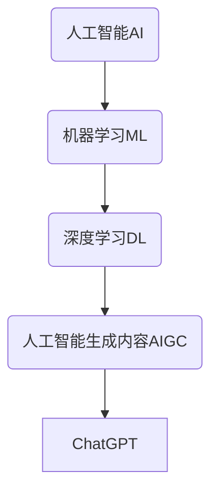
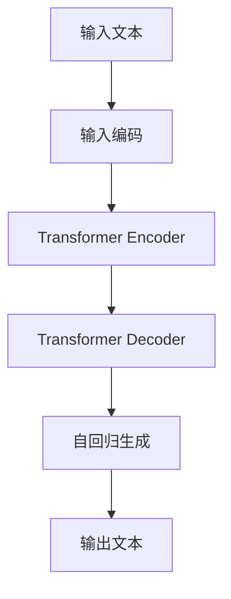

# AIGC从入门到实战：横看成岭侧成峰：ChatGPT 的外貌及内涵是什么样？

## 1.背景介绍

### 1.1 人工智能的崛起

人工智能(Artificial Intelligence, AI)作为一门新兴的交叉学科,已经在各行各业广泛应用,并取得了令人瞩目的成就。近年来,AI技术的飞速发展,尤其是深度学习算法的突破性进展,使得AI系统在计算机视觉、自然语言处理、决策控制等领域表现出超乎想象的能力。

### 1.2 AIGC的兴起

随着AI技术的不断成熟,人工智能生成内容(Artificial Intelligence Generated Content, AIGC)应运而生。AIGC通过训练有素的AI模型,能够生成高质量的文本、图像、音频、视频等多种形式的内容,极大地提高了内容生产的效率和质量。ChatGPT就是AIGC领域的一个杰出代表。

### 1.3 ChatGPT的崛起

ChatGPT是由OpenAI公司开发的一款基于GPT-3.5架构的对话式人工智能模型,于2022年11月推出后迅速引起了全球关注。它能够通过自然语言交互,回答各种问题,撰写文章,甚至编写代码。ChatGPT的出现,被认为是人工智能发展的一个重要里程碑,标志着AIGC进入了一个新的时代。

## 2.核心概念与联系

### 2.1 人工智能(AI)

人工智能是一门致力于研究和开发能够模仿人类智能行为的理论、方法、技术与应用系统的学科。它涉及多个领域,包括计算机科学、数学、心理学、语言学等。

### 2.2 机器学习(ML)

机器学习是人工智能的一个重要分支,它赋予计算机系统具有学习和改进的能力,使之能够从数据中自动分析获得规律,并利用规律对新数据做出决策或预测。

### 2.3 深度学习(DL)

深度学习是机器学习中的一个新的研究领域,它模仿人脑的神经网络结构和工作机制,通过对大量数据的训练,自动学习数据特征表示,并用于分析和处理数据。



### 2.4 人工智能生成内容(AIGC)

AIGC是指利用人工智能技术,特别是深度学习模型,生成各种形式的内容,如文本、图像、音频、视频等。AIGC的核心是训练出高质量的生成模型,使其能够理解和模仿人类的创作过程。

### 2.5 ChatGPT

ChatGPT是一种基于GPT-3.5架构的对话式人工智能模型,由OpenAI公司开发。它能够通过自然语言交互,回答各种问题,撰写文章,编写代码等,展现出惊人的语言理解和生成能力。ChatGPT的出现,被视为AIGC领域的一个重大突破。

## 3.核心算法原理具体操作步骤

### 3.1 自然语言处理(NLP)

自然语言处理是人工智能的一个重要分支,致力于研究计算机系统如何理解和生成人类语言。它涉及多个子领域,如机器翻译、文本挖掘、问答系统等。ChatGPT的核心技术就是基于NLP。

#### 3.1.1 语言模型

语言模型是NLP的基础,它通过对大量文本数据进行统计分析,学习语言的概率分布规律,从而能够生成看似人类写作的自然语言文本。

#### 3.1.2 预训练语言模型

预训练语言模型(Pre-trained Language Model, PLM)是近年来NLP领域的一个重大突破。它通过在大规模语料库上进行无监督预训练,获得通用的语言表示能力,然后再通过有监督的微调(fine-tuning),应用于特定的下游任务,取得了卓越的效果。

ChatGPT所基于的GPT(Generative Pre-trained Transformer)模型,就是一种典型的预训练语言模型。

#### 3.1.3 注意力机制(Attention Mechanism)

注意力机制是深度学习中的一种重要技术,它允许模型在处理序列数据时,专注于与当前任务最相关的部分信息,从而提高模型的性能和效率。Transformer模型中广泛应用了注意力机制,这也是ChatGPT取得出色表现的关键所在。

#### 3.1.4 生成式对抗网络(GAN)

生成式对抗网络(Generative Adversarial Network, GAN)是一种用于生成式建模的深度学习架构,由一个生成器网络和一个判别器网络组成,两者相互对抗,最终使生成器能够生成逼真的数据样本。GAN在图像、视频等领域有广泛应用,也被用于改进文本生成模型的效果。

### 3.2 ChatGPT的核心架构

ChatGPT的核心架构是基于GPT-3.5的,它采用了Transformer的序列到序列(Seq2Seq)模型结构,通过自回归(Autoregressive)方式生成文本。具体来说,包括以下几个关键步骤:

1. **输入编码(Input Encoding)**: 将输入的文本序列(如问题)转换为一系列的向量表示,送入Transformer Encoder。

2. **Transformer Encoder**: 对输入的向量序列进行编码,捕获上下文信息,得到输入的隐藏状态表示。

3. **Transformer Decoder**: 初始时将一个特殊的开始符号(start token)送入Decoder,然后基于输入的隐藏状态和当前的隐藏状态,通过注意力机制预测下一个token的概率分布。

4. **自回归生成(Autoregressive Generation)**: 重复第3步,每次将最有可能的token添加到输出序列,直到预测到结束符号(end token)或达到最大长度。

5. **输出解码(Output Decoding)**: 将生成的token序列解码为自然语言的文本输出。



通过上述步骤,ChatGPT能够根据输入的问题或指令,生成相应的自然语言回复或内容。值得注意的是,ChatGPT采用了一些特殊的训练技巧和策略,如反向传播(Backpropagation)、注意力掩码(Attention Masking)、模型并行(Model Parallelism)等,以提高生成质量和效率。

## 4.数学模型和公式详细讲解举例说明

ChatGPT作为一种基于Transformer的语言模型,其核心数学原理主要包括自注意力机制(Self-Attention Mechanism)和掩码多头自注意力(Masked Multi-Head Self-Attention)。

### 4.1 自注意力机制

自注意力机制是Transformer模型的核心,它能够捕捉输入序列中任意两个位置之间的依赖关系,从而更好地建模长距离依赖。

给定一个长度为 $n$ 的输入序列 $\boldsymbol{x} = (x_1, x_2, \dots, x_n)$,其中每个 $x_i$ 是一个 $d$ 维向量,自注意力机制首先计算出一个三维张量 $\boldsymbol{Q}$、$\boldsymbol{K}$、$\boldsymbol{V}$:

$$\boldsymbol{Q} = \boldsymbol{x} \boldsymbol{W}^Q$$
$$\boldsymbol{K} = \boldsymbol{x} \boldsymbol{W}^K$$
$$\boldsymbol{V} = \boldsymbol{x} \boldsymbol{W}^V$$

其中 $\boldsymbol{W}^Q \in \mathbb{R}^{d \times d_k}$、$\boldsymbol{W}^K \in \mathbb{R}^{d \times d_k}$、$\boldsymbol{W}^V \in \mathbb{R}^{d \times d_v}$ 是可训练的权重矩阵。

然后,计算注意力权重矩阵 $\boldsymbol{A}$:

$$\boldsymbol{A} = \mathrm{softmax}\left(\frac{\boldsymbol{Q}\boldsymbol{K}^\top}{\sqrt{d_k}}\right)$$

其中,$\mathrm{softmax}$ 函数对每一行进行归一化,使得每一行的元素之和为 1。$\sqrt{d_k}$ 是为了防止内积过大导致梯度消失。

最后,通过注意力权重矩阵 $\boldsymbol{A}$ 和值矩阵 $\boldsymbol{V}$ 的加权求和,得到自注意力的输出:

$$\mathrm{Attention}(\boldsymbol{Q}, \boldsymbol{K}, \boldsymbol{V}) = \boldsymbol{A}\boldsymbol{V}$$

自注意力机制能够自动捕捉输入序列中任意两个位置之间的依赖关系,从而更好地建模长距离依赖,这是Transformer模型取得巨大成功的关键所在。

### 4.2 掩码多头自注意力

为了进一步提高模型的表示能力,Transformer引入了多头注意力(Multi-Head Attention)机制。具体来说,将输入 $\boldsymbol{x}$ 线性投影到 $h$ 个子空间,对每个子空间分别计算自注意力,然后将所有子空间的注意力输出拼接起来:

$$\mathrm{MultiHead}(\boldsymbol{Q}, \boldsymbol{K}, \boldsymbol{V}) = \mathrm{Concat}(\mathrm{head}_1, \dots, \mathrm{head}_h)\boldsymbol{W}^O$$
$$\mathrm{where}\ \mathrm{head}_i = \mathrm{Attention}(\boldsymbol{Q}\boldsymbol{W}_i^Q, \boldsymbol{K}\boldsymbol{W}_i^K, \boldsymbol{V}\boldsymbol{W}_i^V)$$

其中 $\boldsymbol{W}_i^Q \in \mathbb{R}^{d_\mathrm{model} \times d_k}$、$\boldsymbol{W}_i^K \in \mathbb{R}^{d_\mathrm{model} \times d_k}$、$\boldsymbol{W}_i^V \in \mathbb{R}^{d_\mathrm{model} \times d_v}$ 和 $\boldsymbol{W}^O \in \mathbb{R}^{hd_v \times d_\mathrm{model}}$ 是可训练的权重矩阵。

在语言模型任务中,我们还需要引入掩码机制,即在生成每个单词时,只允许注意力模块关注之前的单词,而不能关注之后的单词。这种掩码多头自注意力(Masked Multi-Head Self-Attention)机制能够确保模型生成的单词不会"窥视"到未来的信息,从而保证了自回归生成的合理性。

通过自注意力机制和掩码多头注意力机制,Transformer模型能够有效地捕捉输入序列中的长距离依赖关系,从而更好地建模自然语言数据,这也是ChatGPT取得卓越表现的关键所在。

## 5.项目实践:代码实例和详细解释说明

为了更好地理解ChatGPT的工作原理,我们可以通过一个简化版本的Transformer模型实现来加深理解。这里,我们使用Python和PyTorch深度学习框架,实现一个基础的Transformer Decoder模块。

### 5.1 导入所需库

```python
import math
import torch
import torch.nn as nn
```

### 5.2 定义缩放点积注意力

```python
class ScaledDotProductAttention(nn.Module):
    def __init__(self, d_k):
        super().__init__()
        self.d_k = d_k

    def forward(self, q, k, v, attn_mask=None):
        # 计算注意力权重
        attn_scores = torch.matmul(q, k.transpose(-2, -1)) / math.sqrt(self.d_k)
        if attn_mask is not None:
            attn_scores = attn_scores.masked_fill(attn_mask == 0, -1e9)
        attn_weights = torch.softmax(attn_scores, dim=-1)

        # 计算加权和作为注意力输出
        attn_output = torch.matmul(attn_weights, v)
        return attn_output, attn_weights
```

这个模块实现了缩放点积注