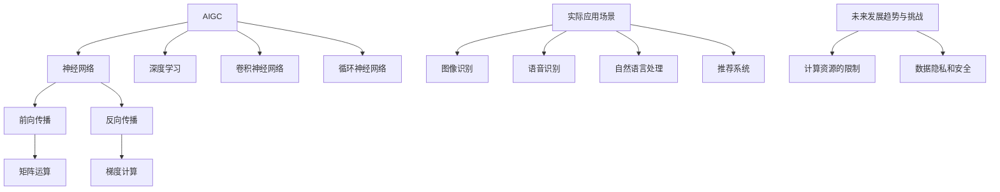

## 1. 背景介绍

人工智能技术的快速发展，使得越来越多的企业和个人开始关注和使用人工智能技术。而在人工智能技术的应用中，硬件部署和运行工程源码是非常重要的一环。本文将介绍如何进行AIGC的硬件部署和运行工程源码。

## 2. 核心概念与联系

AIGC是一种基于深度学习的人工智能技术，其核心概念包括神经网络、深度学习、卷积神经网络、循环神经网络等。在进行硬件部署和运行工程源码时，需要了解这些核心概念的基本原理和联系。

## 3. 核心算法原理具体操作步骤

AIGC的核心算法包括神经网络的训练和推理，其中训练过程需要大量的计算资源和时间。在进行硬件部署时，需要选择合适的硬件设备和软件框架，并进行相应的配置和优化。具体操作步骤包括：

1. 选择合适的硬件设备，如GPU、TPU等。
2. 选择合适的软件框架，如TensorFlow、PyTorch等。
3. 进行硬件和软件的配置和优化，如调整batch size、学习率等参数。
4. 进行模型的训练和推理。

## 4. 数学模型和公式详细讲解举例说明

AIGC的数学模型和公式包括神经网络的前向传播和反向传播算法，其中涉及到大量的矩阵运算和梯度计算。在进行硬件部署和运行工程源码时，需要了解这些数学模型和公式的详细讲解和举例说明。

## 5. 项目实践：代码实例和详细解释说明

在进行硬件部署和运行工程源码时，需要进行项目实践，包括代码实例和详细解释说明。具体实践步骤包括：

1. 下载和安装相应的软件框架和依赖库。
2. 下载和准备相应的数据集。
3. 编写和调试相应的代码，包括模型的定义、训练和推理等。
4. 进行模型的训练和推理，并进行相应的评估和优化。

## 6. 实际应用场景

AIGC的实际应用场景非常广泛，包括图像识别、语音识别、自然语言处理、推荐系统等。在进行硬件部署和运行工程源码时，需要了解这些实际应用场景的特点和需求。

## 7. 工具和资源推荐

在进行硬件部署和运行工程源码时，需要使用一些工具和资源，如GPU、TPU、软件框架、数据集等。本文将推荐一些常用的工具和资源，并进行相应的介绍和评估。

## 8. 总结：未来发展趋势与挑战

AIGC技术的发展趋势非常明显，未来将会有更多的企业和个人开始关注和使用AIGC技术。同时，AIGC技术也面临着一些挑战，如计算资源的限制、数据隐私和安全等问题。在进行硬件部署和运行工程源码时，需要了解这些未来发展趋势和挑战，并进行相应的应对和规划。

## 9. 附录：常见问题与解答

在进行硬件部署和运行工程源码时，可能会遇到一些常见问题，如软件框架的安装和配置、数据集的准备和处理、模型的训练和推理等。本文将提供一些常见问题的解答和相应的解决方案。

## 结论

本文介绍了如何进行AIGC的硬件部署和运行工程源码，包括核心概念和联系、核心算法原理具体操作步骤、数学模型和公式详细讲解举例说明、项目实践、实际应用场景、工具和资源推荐、未来发展趋势与挑战、常见问题与解答等方面。希望本文能够对读者在进行AIGC的硬件部署和运行工程源码时提供一些帮助和指导。

## 附录

Mermaid 流程图：

作者：禅与计算机程序设计艺术 / Zen and the Art of Computer Programming