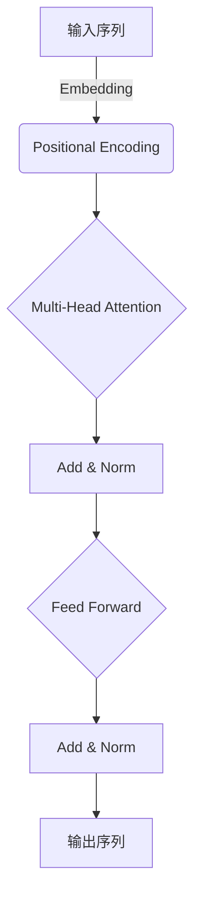
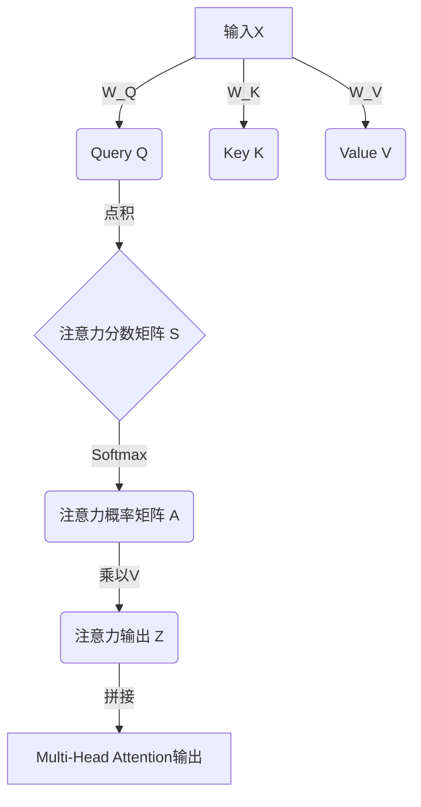
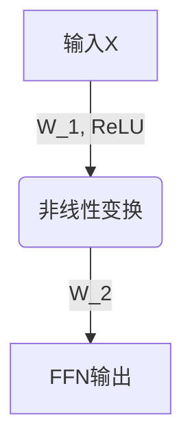
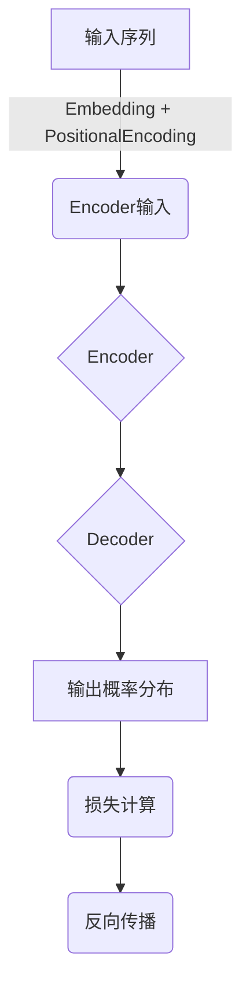

# AIGC从入门到实战：远近高低各不同：Transformer 和预训练模型是什么？

## 1. 背景介绍

### 1.1 人工智能的发展历程

人工智能(Artificial Intelligence, AI)是当代科技领域最炙手可热的话题之一。自20世纪50年代AI概念被正式提出以来,这一领域经历了几个重要的发展阶段。

- 1950年代至1970年代,AI主要集中在专家系统、机器学习等基础理论研究。
- 1980年代至1990年代,AI开始应用于语音识别、机器视觉等实际问题。
- 2000年代至今,AI进入了深度学习的黄金时代。

### 1.2 深度学习的兴起

深度学习(Deep Learning)是机器学习的一个新的研究热点,它模仿人脑的机制来解释数据,能够被用于处理复杂的问题。2012年,深度学习在图像识别领域取得了突破性进展,从此开启了AI的新纪元。

### 1.3 AIGC的崛起

人工智能生成内容(AI-Generated Content, AIGC)是近年来深度学习在自然语言处理领域的一个重要应用。AIGC技术可以自动生成文本、图像、音频、视频等多种形式的内容,极大地提高了内容生产效率。

AIGC的核心是预训练语言模型,而Transformer则是预训练模型的核心技术。本文将重点介绍Transformer和预训练模型的原理及应用。

## 2. 核心概念与联系

### 2.1 Transformer

Transformer是一种全新的深度学习模型架构,最早由Google的Vaswani等人在2017年提出,用于解决序列到序列(Sequence-to-Sequence)的转换问题,如机器翻译、文本摘要等。

Transformer的核心思想是基于自注意力(Self-Attention)机制,能够有效捕捉序列中任意两个位置的关系,从而更好地建模长期依赖关系。与传统的循环神经网络(RNN)相比,Transformer具有并行计算能力更强、捕捉长期依赖关系能力更好等优势。

### 2.2 预训练模型

预训练模型(Pre-trained Model)是一种基于大规模无标注语料进行预训练,然后在下游任务上进行微调的技术范式。预训练模型的核心思想是:通过在大规模无标注语料上进行自监督学习,使模型掌握语言的一般规律,然后将这种语言理解能力迁移到下游任务上。

预训练模型通常包含两个阶段:

1. **预训练(Pre-training)阶段**:使用大规模无标注语料(如网页、书籍等)对模型进行通用语言表示学习,获得语言理解和生成的基础能力。
2. **微调(Fine-tuning)阶段**:将预训练模型在特定下游任务上进行进一步训练,使其适应该任务的特点。

预训练模型的优势在于:

- 可以利用海量无标注数据,降低对人工标注数据的依赖。
- 具有通用的语言理解和生成能力,可以迁移到多种下游任务。
- 训练成本低,避免了从头开始训练的巨大计算开销。

### 2.3 Transformer与预训练模型的关系

Transformer是预训练模型的核心技术支撑。大多数最新的预训练模型,如BERT、GPT、T5等,都是基于Transformer架构构建的。Transformer具有并行计算和捕捉长期依赖关系的优势,使其能够高效地对大规模语料进行预训练,从而获得强大的语言理解和生成能力。

预训练模型的出现极大地推动了NLP技术的发展,使得AI可以生成高质量的文本内容。同时,预训练模型也为计算机视觉、语音识别等其他领域提供了新的技术范式。

## 3. 核心算法原理具体操作步骤

### 3.1 Transformer的核心机制

Transformer的核心机制包括三个部分:

1. **Multi-Head Attention**
2. **Position-wise Feed-Forward Networks**
3. **Positional Encoding**

#### 3.1.1 Multi-Head Attention

注意力机制(Attention Mechanism)是Transformer的核心,它能够捕捉输入序列中任意两个位置的关系。Multi-Head Attention是将多个注意力机制并行运行,然后将它们的结果拼接起来,以提高模型的表达能力。

Multi-Head Attention的计算过程如下:

1. 将输入向量$X$分别与三个不同的权重矩阵$W_Q$、$W_K$、$W_V$相乘,得到Query($Q$)、Key($K$)和Value($V$)矩阵:

$$Q = XW_Q,\ K = XW_K,\ V = XW_V$$

2. 计算Query和Key的点积,得到注意力分数矩阵$S$:

$$S = \frac{QK^T}{\sqrt{d_k}}$$

其中$d_k$是Query和Key的维度,用于缩放注意力分数。

3. 对注意力分数矩阵$S$进行行软最大值操作(Row-wise Softmax),得到注意力概率矩阵$A$:

$$A = \text{Softmax}(S)$$

4. 将注意力概率矩阵$A$与Value矩阵$V$相乘,得到注意力输出$Z$:

$$Z = AV$$

5. 对多个注意力头(Head)的输出进行拼接,得到Multi-Head Attention的最终输出。

#### 3.1.2 Position-wise Feed-Forward Networks

Position-wise Feed-Forward Networks是Transformer的另一个核心组件,它对每个位置的输入向量进行独立的非线性变换,以捕捉输入序列中每个位置的特征。

Position-wise Feed-Forward Networks的计算过程如下:

1. 将输入向量$X$与权重矩阵$W_1$相乘,然后经过ReLU激活函数:

$$F(X) = \text{ReLU}(XW_1 + b_1)$$

2. 将上一步的输出与权重矩阵$W_2$相乘,得到最终输出:

$$\text{FFN}(X) = F(X)W_2 + b_2$$

其中$W_1$、$W_2$、$b_1$、$b_2$是可学习的参数。

#### 3.1.3 Positional Encoding

由于Transformer没有循环或卷积结构,因此无法直接捕捉序列的位置信息。为了解决这个问题,Transformer引入了Positional Encoding,将序列的位置信息编码到输入向量中。

Positional Encoding的计算公式如下:

$$\begin{aligned}
PE_{(pos, 2i)} &= \sin\left(pos / 10000^{2i / d_{\text{model}}}\right) \\
PE_{(pos, 2i+1)} &= \cos\left(pos / 10000^{2i / d_{\text{model}}}\right)
\end{aligned}$$

其中$pos$是位置索引,从0开始;$i$是维度索引,从0开始;$d_{\text{model}}$是输入向量的维度。

Positional Encoding将位置信息编码为一个向量,并与输入向量相加,从而将位置信息融入到输入中。

### 3.2 Transformer的训练过程

Transformer的训练过程包括以下步骤:

1. **输入处理**:将输入序列转换为向量表示,并添加Positional Encoding。
2. **Encoder**:输入序列经过多层Multi-Head Attention和Feed-Forward Networks,得到编码器(Encoder)的输出。
3. **Decoder**:在Decoder中,除了Multi-Head Attention和Feed-Forward Networks外,还引入了Masked Multi-Head Attention,用于防止注意力机制获取未来位置的信息。
4. **输出生成**:Decoder的输出经过线性层和Softmax操作,得到每个位置的输出概率分布。
5. **损失计算**:将输出概率分布与真实标签计算交叉熵损失。
6. **反向传播**:根据损失对模型参数进行更新。

### 3.3 预训练模型的训练过程

预训练模型的训练过程分为两个阶段:预训练(Pre-training)和微调(Fine-tuning)。

#### 3.3.1 预训练阶段

预训练阶段的目标是使模型掌握语言的一般规律,获得语言理解和生成的基础能力。常见的预训练任务包括:

- **蒙版语言模型(Masked Language Modeling, MLM)**:随机掩码输入序列中的一部分词,模型需要根据上下文预测被掩码的词。
- **下一句预测(Next Sentence Prediction, NSP)**:判断两个句子是否连贯。
- **因果语言模型(Causal Language Modeling, CLM)**:根据前文预测下一个词。

在预训练阶段,模型会在大规模无标注语料上反复训练上述任务,以捕捉语言的统计规律。

#### 3.3.2 微调阶段

微调阶段的目标是将预训练模型在特定下游任务上进行进一步训练,使其适应该任务的特点。常见的微调方式包括:

1. **添加任务特定的输出层**:在预训练模型的输出层之后添加一个新的输出层,用于预测下游任务的标签。
2. **端到端微调**:对预训练模型的所有参数进行微调,使其完全适应下游任务。
3. **层级微调**:先对预训练模型的高层参数进行微调,再逐层微调低层参数。

微调阶段通常只需要少量的标注数据和较短的训练时间,就可以获得良好的性能表现。

## 4. 数学模型和公式详细讲解举例说明

### 4.1 Transformer的注意力机制

注意力机制(Attention Mechanism)是Transformer的核心,它能够捕捉输入序列中任意两个位置的关系。在注意力机制中,每个位置的输出向量是所有位置的输入向量的加权和,权重由注意力分数决定。

具体来说,对于长度为$n$的输入序列$X = (x_1, x_2, \dots, x_n)$,注意力机制的计算过程如下:

1. 将输入序列$X$分别与三个不同的权重矩阵$W_Q$、$W_K$、$W_V$相乘,得到Query($Q$)、Key($K$)和Value($V$)矩阵:

$$\begin{aligned}
Q &= XW_Q \\
K &= XW_K \\
V &= XW_V
\end{aligned}$$

其中$W_Q \in \mathbb{R}^{d_x \times d_q}$、$W_K \in \mathbb{R}^{d_x \times d_k}$、$W_V \in \mathbb{R}^{d_x \times d_v}$是可学习的权重矩阵,$d_x$是输入向量的维度,$d_q$、$d_k$、$d_v$分别是Query、Key和Value的维度。

2. 计算Query和Key的点积,得到注意力分数矩阵$S$:

$$S = \frac{QK^T}{\sqrt{d_k}}$$

其中$\sqrt{d_k}$是用于缩放注意力分数的因子,以防止过大或过小的值导致梯度消失或爆炸。

3. 对注意力分数矩阵$S$进行行软最大值操作(Row-wise Softmax),得到注意力概率矩阵$A$:

$$A = \text{Softmax}(S) = \begin{pmatrix}
\alpha_{1, 1} & \alpha_{1, 2} & \dots & \alpha_{1, n} \\
\alpha_{2, 1} & \alpha_{2, 2} & \dots & \alpha_{2, n} \\
\v