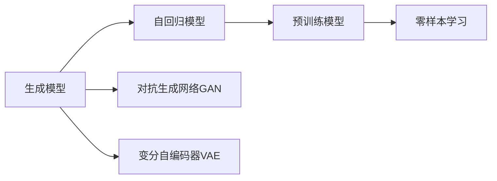

# AIGC原理与代码实例讲解

## 1.背景介绍

### 1.1 AIGC的定义与发展历程
AIGC（AI-Generated Content，人工智能生成内容）是指利用人工智能技术自动生成各种类型内容的技术，如文本、图像、音频、视频等。AIGC技术的发展可以追溯到上世纪50年代图灵提出的"图灵测试"概念，之后经历了专家系统、机器学习、深度学习等多个阶段的发展和突破。近年来，随着人工智能技术的快速发展，尤其是深度学习和自然语言处理领域的重大进展，AIGC技术迎来了新的发展机遇，在文本生成、语音合成、图像生成等领域取得了令人瞩目的成果。

### 1.2 AIGC技术的应用现状
目前，AIGC技术已经在多个领域得到广泛应用，主要包括：

1. 文本生成：如新闻写作、小说创作、广告文案、客服对话等。代表性的模型有GPT-3、BERT等。
2. 图像生成：如图像修复、图像翻译、人脸生成等。代表性的模型有GAN、VAE、Stable Diffusion等。  
3. 语音合成：如智能客服、有声读物、虚拟主播等。代表性的模型有WaveNet、Tacotron等。
4. 视频生成：如虚拟主播、影视特效、游戏场景生成等。代表性的模型有Vid2Vid、Wav2Lip等。

AIGC技术正在深刻影响和改变人们的工作和生活方式，为内容创作和传播带来了新的可能性。

### 1.3 AIGC技术面临的机遇与挑战
AIGC技术虽然取得了长足的进步，但仍然面临诸多机遇和挑战：

1. 机遇：AIGC可以大幅提高内容创作的效率，降低成本，同时为创意产业注入新的活力。AIGC与人类创作者的协作将催生出更多新颖、高质量的内容。 
2. 挑战：AIGC生成的内容质量和可控性仍有待提高，存在生成内容违法违规、侵犯隐私、版权等风险。此外，AIGC可能对某些领域的从业者带来冲击，如何实现人机协同、互补发展是亟需探索的课题。

## 2.核心概念与联系

### 2.1 AIGC的核心概念
- 生成模型：能够根据输入信息生成新内容的模型，是实现AIGC的基础。主要包括基于规则的生成模型和基于数据驱动的生成模型两大类。
- 自回归模型：根据前文预测下一个词的生成模型，广泛应用于文本生成任务。代表模型有LSTM、Transformer等。
- 对抗生成网络（GAN）：由生成器和判别器组成，通过两个网络的博弈生成逼真的图像。 
- 变分自编码器（VAE）：通过编码器将输入映射到隐空间，再通过解码器从隐空间采样生成新样本。
- 预训练模型：在大规模无标注数据上预训练得到的通用语言模型，可以通过微调应用于下游任务，如GPT、BERT等。
- 零样本学习：无需训练样本，直接根据任务描述生成结果的学习范式，如GPT-3。

### 2.2 AIGC核心概念之间的联系
AIGC的核心概念之间存在紧密的联系：



如上图所示，生成模型是AIGC的核心，其中自回归模型、GAN和VAE是三类主要的生成模型。自回归模型发展出预训练模型，进而催生了零样本学习范式。GAN和VAE则主要应用于图像生成领域。这些概念和方法相互影响、相互促进，共同推动了AIGC技术的发展。

## 3.核心算法原理具体操作步骤

### 3.1 自回归模型原理与步骤

自回归模型通过前文预测下一个词，实现文本生成。以Transformer为例，其具体步骤如下：

1. 输入编码：将输入文本转换为向量表示，并加入位置编码。
2. 自注意力计算：通过计算 query、key、value 向量，得到每个位置与其他位置的注意力权重，实现全局建模。
3. 前馈神经网络：通过两层全连接网络对自注意力的输出进行非线性变换。
4. 残差连接和层归一化：将前一层的输出与当前层的输出相加，并进行层归一化，有助于模型训练。
5. 解码：根据编码器的输出，通过相似的计算步骤生成目标文本。
6. 损失计算和优化：通过交叉熵损失函数计算生成文本与真实文本的差异，并使用优化器如Adam进行参数更新。

### 3.2 对抗生成网络原理与步骤

GAN通过生成器和判别器的博弈生成逼真图像，其核心步骤如下：

1. 随机噪声输入：向生成器输入随机噪声向量z。
2. 生成器生成图像：生成器G将噪声z映射为生成图像G(z)。
3. 判别器判断真伪：判别器D对真实图像x和生成图像G(z)进行二分类，输出概率值。
4. 损失计算：计算生成器和判别器的损失函数，生成器希望生成的图像被判别器认为是真实的，判别器希望能够准确区分真实图像和生成图像。
5. 参数更新：通过梯度下降等优化算法更新生成器和判别器的参数，使二者不断博弈，最终达到纳什均衡，生成高质量的图像。

### 3.3 变分自编码器原理与步骤

VAE通过编码器和解码器实现图像生成，其主要步骤如下：

1. 编码器将输入图像x映射到隐空间：编码器将x映射为均值向量μ和方差向量σ，表示隐变量z的先验分布。
2. 重参数化采样：从先验分布N(μ,σ)中采样得到隐变量z。
3. 解码器从隐空间恢复出图像：解码器将隐变量z映射为生成图像x'。
4. 损失计算：计算重构损失（生成图像与原始图像的差异）和KL散度（隐变量分布与标准正态分布的差异），作为VAE的优化目标。
5. 参数更新：通过梯度下降等优化算法更新VAE的编码器和解码器参数。

## 4.数学模型和公式详细讲解举例说明

### 4.1 自回归模型的数学表示

给定文本序列 $x=(x_1,x_2,...,x_T)$，自回归模型的目标是最大化如下条件概率：

$$P(x)=\prod_{t=1}^T P(x_t|x_1,...,x_{t-1})$$

其中，$P(x_t|x_1,...,x_{t-1})$ 表示在给定前 $t-1$ 个词的条件下，当前词 $x_t$ 的条件概率。模型通过最大化这个条件概率来学习文本的生成规律。

以Transformer为例，其自注意力机制可以表示为：

$$Attention(Q,K,V)=softmax(\frac{QK^T}{\sqrt{d_k}})V$$

其中，$Q$、$K$、$V$ 分别表示 query、key、value 向量，$d_k$ 为 key 向量的维度。通过计算 query 和 key 的相似度，得到注意力权重，再与 value 向量加权求和，实现全局信息的聚合。

### 4.2 GAN的损失函数

GAN的生成器G和判别器D的目标函数可以表示为：

$$\min_G \max_D V(D,G)=\mathbb{E}_{x \sim p_{data}(x)}[logD(x)]+\mathbb{E}_{z \sim p_z(z)}[log(1-D(G(z)))]$$

其中，$p_{data}(x)$ 表示真实数据的分布，$p_z(z)$ 表示随机噪声的分布。生成器G希望生成的样本能够欺骗判别器D，使 $D(G(z))$ 尽可能接近1；判别器D希望能够准确区分真实样本和生成样本，最大化 $D(x)$ 和 $1-D(G(z))$。

### 4.3 VAE的损失函数

VAE的损失函数由重构损失和KL散度两部分组成：

$$L(\theta,\phi;x)=\mathbb{E}_{z \sim q_{\phi}(z|x)}[logp_{\theta}(x|z)]-D_{KL}(q_{\phi}(z|x)||p(z))$$

其中，$\theta$ 和 $\phi$ 分别表示解码器和编码器的参数，$q_{\phi}(z|x)$ 表示编码器将输入 $x$ 映射到隐空间的分布，$p_{\theta}(x|z)$ 表示解码器从隐变量 $z$ 恢复出 $x$ 的分布，$p(z)$ 表示隐变量的先验分布，通常假设为标准正态分布。

VAE通过最小化重构误差和KL散度，使得编码器学习到输入数据的压缩表示，解码器能够从隐空间恢复出真实样本。

## 5.项目实践：代码实例和详细解释说明

下面以PyTorch为例，给出AIGC的代码实践。

### 5.1 Transformer文本生成

```python
import torch
import torch.nn as nn

class TransformerModel(nn.Module):
    def __init__(self, vocab_size, embed_dim, num_heads, num_layers):
        super().__init__()
        self.embedding = nn.Embedding(vocab_size, embed_dim)
        self.positional_encoding = PositionalEncoding(embed_dim)
        self.transformer = nn.Transformer(d_model=embed_dim, nhead=num_heads, num_encoder_layers=num_layers, num_decoder_layers=num_layers)
        self.fc = nn.Linear(embed_dim, vocab_size)
        
    def forward(self, src, tgt, src_mask, tgt_mask):
        src_embed = self.embedding(src) * math.sqrt(self.embed_dim)
        src_embed = self.positional_encoding(src_embed)
        tgt_embed = self.embedding(tgt) * math.sqrt(self.embed_dim)
        tgt_embed = self.positional_encoding(tgt_embed)
        output = self.transformer(src_embed, tgt_embed, src_mask, tgt_mask)
        output = self.fc(output)
        return output
```

以上代码定义了一个基于Transformer的文本生成模型，主要组成部分包括：

- Embedding层：将输入的token id映射为稠密向量。
- PositionalEncoding层：加入位置编码，使模型能够捕捉序列的顺序信息。
- Transformer层：包括编码器和解码器，实现自注意力机制和前馈神经网络的计算。
- 全连接输出层：将Transformer的输出映射为每个token的概率分布。

模型的输入包括源序列src、目标序列tgt、以及对应的attention mask，输出为目标序列的概率分布。

### 5.2 GAN图像生成

```python
import torch
import torch.nn as nn

class Generator(nn.Module):
    def __init__(self, latent_dim, image_shape):
        super().__init__()
        self.image_shape = image_shape
        self.fc = nn.Linear(latent_dim, 128 * image_shape[1] // 4 * image_shape[2] // 4)
        self.conv_blocks = nn.Sequential(
            nn.BatchNorm2d(128),
            nn.Upsample(scale_factor=2),
            nn.Conv2d(128, 128, 3, stride=1, padding=1),
            nn.BatchNorm2d(128, 0.8),
            nn.LeakyReLU(0.2, inplace=True),
            nn.Upsample(scale_factor=2),
            nn.Conv2d(128, 64, 3, stride=1, padding=1),
            nn.BatchNorm2d(64, 0.8),
            nn.LeakyReLU(0.2, inplace=True),
            nn.Conv2d(64, image_shape[0], 3, stride=1, padding=1),
            nn.Tanh()
        )
        
    def forward(self, z):
        out = self.fc(z)
        out = out.view(out.shape[0], 128, self.image_shape[1] // 4, self.image_shape[2] // 4)
        out = self.conv_blocks(out)
        return out

class Discriminator(nn.Module):
    def __init__(self, image_shape):
        super().__init__()