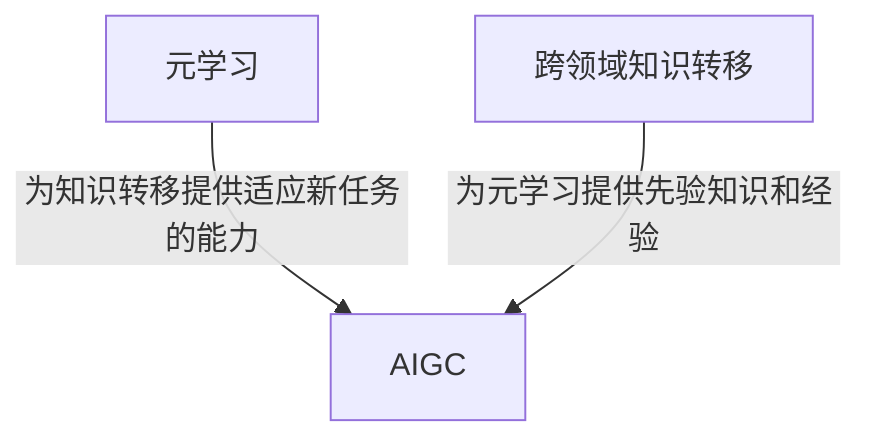

# AIGC的实现方法之四:元学习与跨领域知识transfer的原理与实例

## 1.背景介绍

### 1.1 人工智能发展的新阶段

人工智能领域经历了几个重要的发展阶段,从早期的专家系统,到机器学习算法的兴起,再到深度学习的突破性进展。如今,人工智能已经进入了一个新的阶段——通用人工智能(Artificial General Intelligence,AGI)的探索时代。AGI旨在创建能够像人类一样学习、推理和解决各种复杂问题的智能系统。

### 1.2 AIGC的重要性

人工智能生成内容(Artificial Intelligence Generated Content,AIGC)是AGI发展的重要组成部分。AIGC技术可以自动生成文本、图像、音频和视频等多种形式的内容,在内容创作、虚拟现实、娱乐等领域具有广阔的应用前景。元学习和跨领域知识转移是实现高质量AIGC的关键技术。

### 1.3 挑战与机遇

虽然AIGC技术取得了长足进步,但仍面临诸多挑战,例如:

- 如何在不同领域之间高效转移知识
- 如何快速适应新的任务和环境 
- 如何生成高质量、多样化且符合人类偏好的内容

元学习和跨领域知识转移为解决这些挑战提供了新的思路和方法,是AIGC发展的重要驱动力。

## 2.核心概念与联系  

### 2.1 元学习(Meta-Learning)

元学习是机器学习中的一个重要概念,指的是"学习如何更好地学习"。传统机器学习算法在遇到新的任务时需要从头开始训练,而元学习算法则能够利用以前学到的经验,快速适应新的任务。

元学习可以分为三个主要类别:

1. **基于数据的元学习**: 利用大量相似但不同的任务数据集进行训练,学习提取任务之间的共性知识。
2. **基于模型的元学习**: 直接学习生成适用于新任务的模型参数或优化策略。
3. **基于优化的元学习**: 学习一个可以快速适应新任务的优化过程,例如通过学习良好的初始化参数或优化更新策略。

### 2.2 跨领域知识转移(Transfer Learning)

跨领域知识转移是指将在一个领域或任务中学习到的知识应用到另一个不同但相关的领域或任务。这种方法可以减少重复学习的工作,提高学习效率。

根据转移的方向,可以将知识转移分为三种类型:

1. **预训练微调(Pre-training and Fine-tuning)**: 先在源领域进行预训练获取通用知识,再将这些知识转移并微调以适应目标领域的任务。
2. **多任务学习(Multi-task Learning)**: 同时学习多个相关任务,并在不同任务之间共享知识。
3. **零次学习(Zero-shot Learning)**: 在没有任何目标领域数据的情况下,直接将源领域知识转移到目标领域。

### 2.3 元学习与知识转移的关系

元学习和跨领域知识转移是密切相关的概念。元学习算法通过学习快速适应新任务的能力,为知识转移奠定了基础。同时,知识转移也可以为元学习提供有益的先验知识和经验。二者的有机结合是实现AIGC的重要途径。

## 3.核心算法原理具体操作步骤

### 3.1 基于数据的元学习算法

#### 3.1.1 MAML (Model-Agnostic Meta-Learning)

MAML是一种基于梯度下降的元学习算法,其核心思想是:在元训练阶段,通过多个不同的任务数据集进行训练,学习一个可以快速适应新任务的初始化参数。在元测试阶段,利用这个初始参数在新任务上进行少量梯度更新,即可获得针对该任务的优化模型。

MAML算法的具体步骤如下:

1. 随机初始化模型参数 $\theta$
2. 对每个任务 $\mathcal{T}_i$ 进行以下操作:
    - 从 $\mathcal{T}_i$ 中采样一批支持集(support set) $\mathcal{D}_i^{tr}$ 和查询集(query set) $\mathcal{D}_i^{val}$
    - 利用支持集数据和模型参数 $\theta$ 计算出任务特定参数:
      $$\theta_i' = \theta - \alpha \nabla_\theta \mathcal{L}_{\mathcal{T}_i}(\theta; \mathcal{D}_i^{tr})$$
      其中 $\alpha$ 为元学习率
    - 利用查询集数据和任务特定参数 $\theta_i'$ 计算查询损失:
      $$\mathcal{L}_i^{val} = \mathcal{L}_{\mathcal{T}_i}(\theta_i'; \mathcal{D}_i^{val})$$
3. 计算所有任务的查询损失的总和,并对原始参数 $\theta$ 进行梯度更新:
    $$\theta \leftarrow \theta - \beta \nabla_\theta \sum_{\mathcal{T}_i} \mathcal{L}_i^{val}$$
    其中 $\beta$ 为元批量大小

通过上述过程,MAML算法学习到一个好的初始参数 $\theta$,使得在新任务上经过少量梯度更新后,模型可以快速收敛并取得良好的性能表现。

#### 3.1.2 其他算法

除了MAML,还有一些其他常用的基于数据的元学习算法,例如:

- **Reptile**: 直接在每个任务上进行梯度更新,并将所有任务的参数平均作为下一轮的初始参数。
- **BMAML**: 利用贝叶斯方法对MAML进行概率建模,以获得更加鲁棒的初始参数估计。
- **MetaGAN**: 将生成对抗网络(GAN)的思想引入元学习,用于生成新任务的训练数据。

### 3.2 基于模型的元学习算法

#### 3.2.1 神经网络超网络(HyperNetworks)

神经网络超网络是一种基于模型的元学习方法,其核心思想是:使用一个大型的超网络(HyperNetwork)生成针对新任务的子网络参数。

具体步骤如下:

1. 训练一个超网络 $f_{\phi}$,其输入为任务描述符 $\tau$,输出为子网络参数 $\theta$:
   $$\theta = f_{\phi}(\tau)$$
2. 对每个新任务 $\mathcal{T}_i$:
    - 从 $\mathcal{T}_i$ 中采样训练数据 $\mathcal{D}_i^{tr}$
    - 将任务描述符 $\tau_i$ 输入到超网络中,生成子网络参数 $\theta_i$
    - 利用子网络参数 $\theta_i$ 和训练数据 $\mathcal{D}_i^{tr}$ 进行训练,获得针对该任务的优化模型

通过这种方式,超网络可以根据任务描述符生成适当的子网络参数,从而实现快速适应新任务的能力。

#### 3.2.2 网络权重生成(NetWG)

网络权重生成是另一种基于模型的元学习方法,其核心思想是:使用一个小型的主网络(主干网络)生成大型目标网络的权重。

具体步骤如下:

1. 训练一个主干网络 $f_{\theta}$,其输入为任务描述符 $\tau$,输出为目标网络权重 $W$:
   $$W = f_{\theta}(\tau)$$
2. 对每个新任务 $\mathcal{T}_i$:
    - 从 $\mathcal{T}_i$ 中采样训练数据 $\mathcal{D}_i^{tr}$
    - 将任务描述符 $\tau_i$ 输入到主干网络中,生成目标网络权重 $W_i$
    - 利用目标网络权重 $W_i$ 和训练数据 $\mathcal{D}_i^{tr}$ 进行训练,获得针对该任务的优化模型

相比于超网络方法,网络权重生成的优点是计算更高效,缺点是生成的网络规模受到主干网络容量的限制。

### 3.3 基于优化的元学习算法

#### 3.3.1 LSTM元学习器(Learner)

LSTM元学习器是一种基于优化的元学习方法,其核心思想是:使用一个LSTM网络作为元学习器,直接学习一个可以快速适应新任务的优化过程。

具体步骤如下:

1. 训练一个LSTM元学习器 $f_{\phi}$,其输入为当前任务损失 $\mathcal{L}_t$ 和模型参数 $\theta_t$,输出为下一步的参数更新 $\Delta \theta_{t+1}$:
   $$\Delta \theta_{t+1} = f_{\phi}(\mathcal{L}_t, \theta_t)$$
2. 对每个新任务 $\mathcal{T}_i$:
    - 从 $\mathcal{T}_i$ 中采样训练数据 $\mathcal{D}_i^{tr}$
    - 随机初始化模型参数 $\theta_0$
    - 对训练数据进行多次迭代:
        - 计算当前损失 $\mathcal{L}_t = \mathcal{L}_{\mathcal{T}_i}(\theta_t; \mathcal{D}_i^{tr})$
        - 将 $\mathcal{L}_t$ 和 $\theta_t$ 输入到LSTM元学习器中,获得参数更新 $\Delta \theta_{t+1}$
        - 更新模型参数 $\theta_{t+1} = \theta_t + \Delta \theta_{t+1}$
    - 最终获得针对该任务的优化模型参数 $\theta_T$

通过上述方式,LSTM元学习器直接学习了一个良好的优化更新策略,可以在新任务上快速收敛。

#### 3.3.2 优化器LSTM(Optimizer LSTM)

优化器LSTM是另一种基于优化的元学习方法,其核心思想是:使用LSTM网络直接生成用于优化新任务的优化器参数。

具体步骤如下:

1. 训练一个优化器LSTM网络 $f_{\phi}$,其输入为任务描述符 $\tau$,输出为优化器参数 $\lambda$:
   $$\lambda = f_{\phi}(\tau)$$
2. 对每个新任务 $\mathcal{T}_i$:
    - 从 $\mathcal{T}_i$ 中采样训练数据 $\mathcal{D}_i^{tr}$
    - 将任务描述符 $\tau_i$ 输入到优化器LSTM中,生成优化器参数 $\lambda_i$
    - 利用优化器参数 $\lambda_i$ 和训练数据 $\mathcal{D}_i^{tr}$ 进行优化,获得针对该任务的优化模型

优化器LSTM的优点是可以直接生成常用优化器(如SGD、Adam等)的参数,使用更加灵活。缺点是需要设计合适的任务描述符,以充分描述任务的特征。

## 4.数学模型和公式详细讲解举例说明

在上述元学习和知识转移算法中,涉及了一些重要的数学模型和公式,下面将对其进行详细讲解和举例说明。

### 4.1 梯度下降和反向传播

梯度下降是机器学习中最常用的优化算法之一,其基本思想是沿着目标函数的负梯度方向更新模型参数,使目标函数值不断减小。

对于参数 $\theta$ 和目标函数 $J(\theta)$,梯度下降的更新规则为:

$$\theta \leftarrow \theta - \alpha \nabla_\theta J(\theta)$$

其中 $\alpha$ 为学习率,决定了每次更新的步长。

在神经网络中,通常使用反向传播算法来高效计算目标函数对参数的梯度。以二分类问题为例,给定输入 $x$、标签 $y$ 和模型参数 $\theta$,目标函数可以定义为交叉熵损失:

$$J(\theta) = -\frac{1}{N}\sum_{i=1}^N \left[y_i \log p(y_i|x_i; \theta) + (1-y_i) \log (1-p(y_i|x_i; \theta))\right]$$

其中 $p(y|