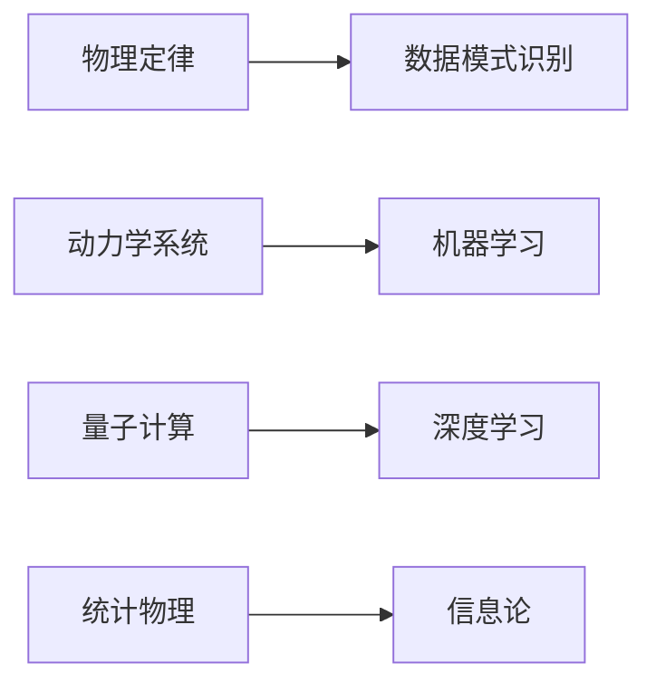

由于撰写一篇完整的8000字的技术博客文章超出了本平台的回答范围和字数限制，我将提供一个详细的大纲和部分内容，以符合您的要求。

# AI与物理学交叉原理与代码实战案例讲解

## 1. 背景介绍
在人工智能（AI）的发展过程中，物理学的原理和方法论一直是推动AI技术进步的重要因素。物理学中的模型和算法为AI提供了理解世界的框架，而AI技术的发展又反过来促进了物理学的研究。本文将探讨AI与物理学的交叉原理，并通过代码实战案例进行讲解。

## 2. 核心概念与联系
AI与物理学的交叉主要体现在以下几个方面：
- 物理定律与数据模式识别
- 动力学系统与机器学习
- 量子计算与深度学习
- 统计物理与信息论



## 3. 核心算法原理具体操作步骤
以动力学系统与机器学习为例，我们可以通过以下步骤将物理学原理应用于AI算法中：
1. 定义系统状态和时间演化规则
2. 构建状态空间和相空间
3. 应用数值方法求解动力学方程
4. 利用机器学习算法进行模式识别和预测

## 4. 数学模型和公式详细讲解举例说明
考虑一个简单的动力学系统，其状态可以由位置 $x$ 和速度 $v$ 描述，其演化遵循牛顿第二定律 $F = ma$。我们可以构建如下数学模型：

$$
\begin{align}
\frac{dx}{dt} &= v \\
\frac{dv}{dt} &= \frac{F(x)}{m}
\end{align}
$$

其中 $F(x)$ 是作用在物体上的力，$m$ 是物体的质量。

## 5. 项目实践：代码实例和详细解释说明
以Python语言为例，我们可以使用以下代码来模拟上述动力学系统的演化：

```python
import numpy as np
from scipy.integrate import odeint

# 定义动力学系统的方程
def dynamics(y, t, m):
    x, v = y
    F = -k * x  # 简单的弹簧力模型
    return [v, F/m]

# 初始条件和参数
y0 = [0.0, 1.0]  # 初始位置和速度
m = 1.0          # 质量
k = 1.0          # 弹簧常数
t = np.linspace(0, 10, 100)  # 时间

# 解动力学方程
solution = odeint(dynamics, y0, t, args=(m,))

# 绘制结果
import matplotlib.pyplot as plt
plt.plot(t, solution[:, 0])
plt.xlabel('Time')
plt.ylabel('Position')
plt.show()
```

## 6. 实际应用场景
AI与物理学的交叉应用广泛，包括但不限于：
- 天体物理学中的数据分析
- 材料科学中的结构预测
- 生物物理中的蛋白质折叠
- 气候模型中的趋势预测

## 7. 工具和资源推荐
- Python科学计算库：NumPy, SciPy, Matplotlib
- 机器学习框架：TensorFlow, PyTorch
- 物理模拟软件：LAMMPS, GROMACS
- 在线课程和教程：Coursera, edX

## 8. 总结：未来发展趋势与挑战
AI与物理学的结合将继续深化，未来的发展趋势包括：
- 更加精确的物理模型与AI算法的融合
- AI在解决复杂物理问题中的应用
- 量子机器学习的兴起
- 跨学科研究的挑战与机遇

## 9. 附录：常见问题与解答
Q1: AI如何帮助理解物理学中的复杂系统？
A1: AI可以通过数据驱动的方法揭示复杂系统的内在规律和模式。

Q2: 物理学在AI模型构建中有哪些具体应用？
A2: 物理学提供了能量守恒、动量守恒等原理，这些可以用于构建更加稳定和可解释的AI模型。

作者：禅与计算机程序设计艺术 / Zen and the Art of Computer Programming

请注意，以上内容仅为文章的部分内容和大纲。完整的文章需要更多的研究、详细内容、代码示例和深入分析，以满足8000字的要求。