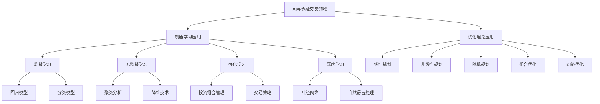

# AI与金融学交叉原理与代码实战案例讲解

## 1.背景介绍

### 1.1 人工智能与金融的交叉领域概述

人工智能(AI)和金融学的交叉领域近年来发展迅猛,成为了学术界和产业界的研究热点。这一交叉领域的核心目标是利用人工智能的各种技术和模型,来解决金融领域中的各种问题和挑战,提高金融服务的效率、降低风险、优化资源配置等。

人工智能为金融行业带来了诸多创新应用,例如智能投资组合管理、金融风险管理、反洗钱监测、信用评分模型等。同时,金融数据的特性也为人工智能算法的发展提供了新的挑战,促进了相关理论和模型的创新。

### 1.2 交叉领域的重要性和影响

AI与金融的交叉具有重要的理论意义和实际应用价值:

- 理论层面:推动了人工智能、机器学习、优化理论等学科在金融领域的应用创新,拓展了相关理论的外延。
- 应用层面:AI技术在金融行业的应用,有望显著提高金融服务的质量和效率,优化资源配置,降低运营成本和风险。
- 社会影响:有助于构建更加公平、高效、可持续的金融体系,促进金融普惠,维护金融稳定。

### 1.3 交叉领域的主要挑战

尽管AI与金融的交叉取得了长足进展,但仍面临诸多挑战:

- 数据质量:金融数据的高维、噪音、缺失值等问题给算法训练带来挑战。
- 模型可解释性:很多AI模型是黑箱,缺乏可解释性,难以被金融从业者信任。
- 算法偏差:算法可能存在潜在的偏差,导致不公平结果。
- 隐私与安全:金融数据涉及隐私,AI系统也面临黑客攻击等安全威胁。
- 法律法规:AI在金融领域的应用面临监管合规等法律挑战。

## 2.核心概念与联系  

### 2.1 机器学习在金融中的应用

机器学习是AI与金融交叉领域的核心技术之一。常见的应用包括:

1. **监督学习**
   - 回归模型:用于预测股票、利率等连续值。
   - 分类模型:用于信用评分、欺诈检测等分类任务。

2. **无监督学习**
   - 聚类分析:发现客户群体、交易模式等。
   - 降维技术:压缩高维金融数据,提取主要特征。

3. **强化学习**
   - 投资组合管理:根据市场状况自动调整投资策略。
   - 交易策略:开发自动交易算法以获取最大利润。

4. **深度学习**
   - 神经网络:处理复杂的非线性数据,如影像分析。
   - 自然语言处理:分析金融新闻、报告等非结构化数据。

### 2.2 优化理论在金融中的应用

优化理论在资产配置、风险管理等金融问题中有着广泛应用:

1. **线性规划**:投资组合优化、资源分配等。
2. **非线性规划**:考虑风险等非线性约束的优化问题。
3. **随机规划**:处理含有随机因素的优化问题。
4. **组合优化**:寻找最优投资组合的经典问题。
5. **网络优化**:金融网络拓扑结构和流量优化等。

### 2.3 AI与金融的关键技术路线图

上图展示了AI与金融交叉领域的关键技术路线图,包括机器学习和优化理论两大主线。机器学习方面,监督学习、无监督学习、强化学习和深度学习都有广泛应用;优化理论方面,线性规划、非线性规划、随机规划、组合优化和网络优化等都为金融问题提供了有力的解决方案。

## 3.核心算法原理具体操作步骤

### 3.1 支持向量机在信用评分中的应用

支持向量机(SVM)是一种常用的监督学习算法,在金融领域有着广泛的应用,例如信用评分建模。以下是SVM在信用评分任务中的具体操作步骤:

1. **数据预处理**
   - 处理缺失值:填充或删除带有缺失值的样本
   - 特征工程:构造合适的特征,如年龄、收入、贷款金额等
   - 特征标准化:将特征缩放到相似的数量级

2. **构建SVM分类模型**
   - 选择合适的核函数(如线性核、高斯核等)
   - 设置正则化参数C,用于控制模型复杂度
   - 通过训练数据训练SVM分类器

3. **模型评估**
   - 使用测试数据评估模型性能
   - 计算评估指标,如准确率、精确率、召回率等
   - 可视化ROC曲线和计算AUC

4. **模型调优**
   - 通过交叉验证等方法,调整SVM参数
   - 特征选择,去除冗余特征
   - 集成多个SVM模型,提高泛化能力

5. **模型部署**
   - 将训练好的SVM模型集成到信用评分系统中
   - 对新的申请者进行信用评分
   - 持续监控模型性能,定期重新训练模型

### 3.2 K-Means聚类在客户分层中的应用

K-Means是一种常用的无监督聚类算法,在金融领域可用于客户分层和营销策略制定。以下是K-Means在客户分层任务中的具体操作步骤:

1. **数据预处理**
   - 处理缺失值和异常值
   - 对于类别特征,进行One-Hot编码
   - 对于连续特征,进行标准化或归一化处理

2. **选择聚类数K**
   - 可使用肘部法则或轮廓系数等启发式方法选择K值
   - 也可多次运行K-Means,选择具有最佳聚类评估指标的K值

3. **初始化K个聚类中心**
   - 常用的初始化方法有随机初始化和K-Means++

4. **执行K-Means迭代**
   - 计算每个样本到各个聚类中心的距离
   - 将样本分配到距离最近的那一个聚类
   - 重新计算每个聚类的质心作为新的聚类中心
   - 重复上述步骤,直到聚类不再发生变化

5. **分析聚类结果**
   - 可视化聚类结果,分析每个聚类的特征分布
   - 根据聚类结果,制定差异化的营销和服务策略
   - 持续监控聚类质量,定期重新执行聚类

### 3.3 LSTM在股票趋势预测中的应用

长短期记忆网络(LSTM)是一种常用的深度学习模型,能够有效捕捉序列数据中的长期依赖关系,在金融领域可用于股票趋势预测等任务。以下是LSTM在股票趋势预测中的具体操作步骤:

1. **数据预处理**
   - 收集历史股票数据,如开盘价、收盘价、最高价、最低价等
   - 对缺失数据进行填充或删除处理
   - 构造技术指标作为额外特征,如移动平均线、RSI等
   - 将数据划分为训练集、验证集和测试集

2. **构建LSTM模型**
   - 确定LSTM网络的层数和神经元数量
   - 选择合适的优化器,如Adam优化器
   - 设置超参数,如学习率、批量大小等
   - 构建LSTM模型,包括LSTM层和全连接层

3. **模型训练**
   - 将训练数据输入LSTM模型进行训练
   - 在验证集上监控模型性能,防止过拟合
   - 可使用早停法等技术提高泛化能力

4. **模型评估**
   - 在测试集上评估模型性能
   - 计算评估指标,如均方根误差(RMSE)等
   - 可视化预测结果与真实值的对比

5. **模型部署和更新**
   - 将训练好的LSTM模型部署到实际系统中
   - 定期使用新的数据重新训练模型
   - 持续监控模型性能,进行必要的模型调整

## 4.数学模型和公式详细讲解举例说明

### 4.1 支持向量机(SVM)

支持向量机(SVM)是一种有监督的机器学习算法,常用于分类和回归任务。它的基本思想是在高维空间中构造一个超平面,将不同类别的数据样本分开,同时使得距离超平面最近的数据样本与超平面之间的距离最大化。

对于线性可分的二分类问题,我们希望找到一个超平面 $\boldsymbol{w}^T\boldsymbol{x} + b = 0$,使得:

$$
\begin{cases}
\boldsymbol{w}^T\boldsymbol{x}_i + b \geq 1, & y_i = 1\\
\boldsymbol{w}^T\boldsymbol{x}_i + b \leq -1, & y_i = -1
\end{cases}
$$

其中 $\boldsymbol{x}_i$ 是输入样本, $y_i \in \{-1, 1\}$ 是样本的标签。我们希望最大化间隔 $\frac{2}{||\boldsymbol{w}||}$,这等价于最小化 $\frac{1}{2}||\boldsymbol{w}||^2$,从而得到以下优化问题:

$$
\begin{aligned}
\min_{\boldsymbol{w},b} & \frac{1}{2}||\boldsymbol{w}||^2\\
\text{s.t. } & y_i(\boldsymbol{w}^T\boldsymbol{x}_i + b) \geq 1, \quad i=1,2,...,n
\end{aligned}
$$

对于线性不可分的情况,我们引入松弛变量 $\xi_i \geq 0$,允许某些样本违反约束条件,从而得到软间隔的优化问题:

$$
\begin{aligned}
\min_{\boldsymbol{w},b,\boldsymbol{\xi}} & \frac{1}{2}||\boldsymbol{w}||^2 + C\sum_{i=1}^n\xi_i\\
\text{s.t. } & y_i(\boldsymbol{w}^T\boldsymbol{x}_i + b) \geq 1 - \xi_i, \quad i=1,2,...,n\\
& \xi_i \geq 0, \quad i=1,2,...,n
\end{aligned}
$$

其中 $C > 0$ 是一个权衡参数,用于平衡最大间隔和误分类的代价。

对于非线性问题,我们可以使用核技巧,将数据映射到高维特征空间,在该空间中构造线性分类器。常用的核函数包括线性核、多项式核和高斯核等。

SVM在金融领域有广泛应用,如信用评分、欺诈检测等,它具有全局最优解、泛化能力强等优点,是一种非常有效的监督学习算法。

### 4.2 K-Means聚类

K-Means是一种常用的无监督聚类算法,其目标是将 $n$ 个样本 $\{\boldsymbol{x}_1, \boldsymbol{x}_2, ..., \boldsymbol{x}_n\}$ 划分为 $K$ 个互不相交的簇 $\{C_1, C_2, ..., C_K\}$,使得簇内样本相似度较高,簇间样本相似度较低。

具体来说,K