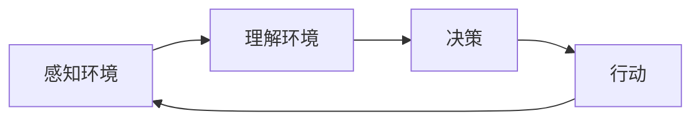

## 1.背景介绍

随着科技的进步，人工智能(AI)已经渗透到我们生活的方方面面。在农业领域，AI的应用也日益广泛，其中，AI Agent作为AI的一种重要表现形式，已经在农业中发挥了重要作用。本文将深入探讨AI Agent在农业中的应用，以及相关的技术原理和实践操作。

## 2.核心概念与联系

AI Agent，或者称为智能体，是一种能够感知环境并采取行动以实现其目标的实体。在农业中，AI Agent可以通过感知农田环境，例如土壤湿度、气候条件等，然后根据这些信息采取相应的行动，例如调整灌溉系统、施肥等，以实现提高农作物产量的目标。

AI Agent的工作原理通常包括以下几个步骤：感知环境、理解环境、决策、行动。这四个步骤构成了AI Agent的基本工作流程。



## 3.核心算法原理具体操作步骤

AI Agent的核心算法通常包括感知算法、理解算法、决策算法和行动算法。

感知算法主要负责收集环境信息，这通常通过各种传感器实现，例如温湿度传感器、光照传感器等。这些传感器可以将环境信息转化为计算机可以理解的数据。

理解算法主要负责解析和理解感知算法收集到的数据。这通常通过各种机器学习算法实现，例如决策树、支持向量机等。这些算法可以将数据转化为有用的信息，例如预测农作物的生长情况。

决策算法主要负责根据理解算法得到的信息做出决策。这通常通过各种优化算法实现，例如遗传算法、蚁群算法等。这些算法可以找到最优的决策，例如最佳的灌溉方案。

行动算法主要负责执行决策算法做出的决策。这通常通过各种控制系统实现，例如灌溉系统、施肥系统等。这些系统可以将决策转化为实际的行动，例如灌溉农田、施肥。

## 4.数学模型和公式详细讲解举例说明

AI Agent的核心算法通常涉及到各种数学模型和公式。例如，在理解算法中，决策树是一种常用的机器学习算法，其基本原理可以用信息增益公式来表示：

$$
信息增益 = 熵(父节点) - \sum_{i=1}^{n} \frac{|子节点_i|}{|父节点|} 熵(子节点_i)
$$

其中，$熵(节点)$表示节点的不确定性，可以用以下公式计算：

$$
熵(节点) = - \sum_{i=1}^{n} p_i \log_2 p_i
$$

其中，$p_i$表示第$i$类样本在节点中的比例。

通过这些公式，我们可以计算出每个特征的信息增益，然后选择信息增益最大的特征作为节点的划分特征，以此构建决策树。

## 5.项目实践：代码实例和详细解释说明

下面是一个简单的AI Agent的实现例子，这个AI Agent可以根据土壤湿度决定是否灌溉农田。

```python
class AIAgent:
    def __init__(self, sensor, irrigator):
        self.sensor = sensor
        self.irrigator = irrigator

    def perceive(self):
        return self.sensor.read()

    def decide(self, humidity):
        if humidity < 50:
            return True
        else:
            return False

    def act(self, irrigate):
        if irrigate:
            self.irrigator.irrigate()

agent = AIAgent(SoilHumiditySensor(), Irrigator())
humidity = agent.perceive()
irrigate = agent.decide(humidity)
agent.act(irrigate)
```

在这个例子中，`AIAgent`类包含了感知环境、决策和行动的方法，这三个方法分别对应了AI Agent的基本工作流程。`SoilHumiditySensor`和`Irrigator`类分别对应了感知环境和行动的具体实现。

## 6.实际应用场景

AI Agent在农业中的应用场景非常广泛，例如智能灌溉、病虫害预警、农作物种植优化等。通过AI Agent，我们可以实现精准农业，提高农作物的产量和质量，同时节省资源，保护环境。

## 7.工具和资源推荐

在开发AI Agent时，有许多优秀的工具和资源可以使用，例如Python的`scikit-learn`库提供了丰富的机器学习算法，`numpy`和`pandas`库提供了强大的数据处理能力，`matplotlib`和`seaborn`库提供了可视化的功能。

## 8.总结：未来发展趋势与挑战

随着科技的进步，AI Agent在农业中的应用将越来越广泛，未来的发展趋势将是智能化、精准化和自动化。然而，这也带来了一些挑战，例如如何处理大量的数据，如何提高决策的准确性，如何保证系统的稳定性等。这些都需要我们进一步研究和探索。

## 9.附录：常见问题与解答

1. 问：AI Agent如何理解环境？
   答：AI Agent通过理解算法解析和理解感知算法收集到的数据，这通常通过各种机器学习算法实现。

2. 问：AI Agent如何做出决策？
   答：AI Agent通过决策算法根据理解算法得到的信息做出决策，这通常通过各种优化算法实现。

作者：禅与计算机程序设计艺术 / Zen and the Art of Computer Programming