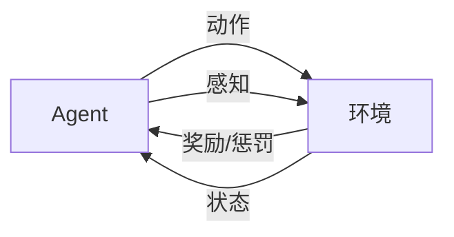

# AI人工智能 Agent：在环保领域中的应用

## 1. 背景介绍

### 1.1 人工智能的发展历程

人工智能(Artificial Intelligence, AI)自1956年达特茅斯会议正式提出以来，经历了从早期的知识表示、专家系统，到机器学习、深度学习等多个发展阶段。近年来，随着大数据、云计算、GPU等技术的进步，人工智能取得了突飞猛进的发展，在许多领域展现出广阔的应用前景。

### 1.2 环境保护面临的挑战

当前，全球环境问题日益严峻，气候变化、环境污染、生物多样性锐减等问题对人类生存和可持续发展构成严重威胁。传统的环保方式效率低下，难以应对复杂多变的环境挑战。亟需创新的环保理念和技术手段，而人工智能无疑为环保事业带来了新的希望。

### 1.3 人工智能在环保领域的应用前景

将人工智能技术应用于环保领域，可以极大提升环境监测、预警、治理等环节的智能化水平，助力实现环境保护的精准化、自动化、高效化。智能环保已成为人工智能技术落地的重要方向之一。本文将重点探讨人工智能中的Agent技术在环保领域的应用。

## 2. 核心概念与联系

### 2.1 智能Agent的定义与特征

Agent是人工智能领域的一个重要概念，指具有自主性、社会性、反应性、主动性等特征的智能实体，能够感知环境，根据设定目标自主地做出决策和行动。智能Agent通常由感知、决策、执行等模块构成。

### 2.2 多Agent系统

在实际应用中，往往需要多个Agent协同工作，构成多Agent系统(Multi-Agent System, MAS)。MAS通过Agent间的交互、协商与合作，能够解决单个Agent难以完成的复杂任务。MAS具有分布式控制、容错性强、灵活性高等优点。

### 2.3 Agent与环境建模

Agent感知和作用的对象是所处的环境。为使Agent能够在环境中正确行动，需要对环境进行建模，用数学语言描述环境的状态空间、转移规则等。马尔可夫决策过程(MDP)是常用的环境建模方法。

### 2.4 强化学习

强化学习是Agent的一种重要学习范式，通过Agent与环境的交互，根据环境反馈的奖励或惩罚，不断优化行为策略，以获得长期累积奖励最大化。Q-learning、策略梯度等是代表性的强化学习算法。

以下是Agent与环境交互的示意图：



## 3. 核心算法原理具体操作步骤

### 3.1 Q-learning算法

Q-learning是一种无模型的离线策略强化学习算法，通过值迭代的方式更新动作价值函数Q(s,a)，以逼近最优策略。其主要步骤如下：

1. 初始化Q(s,a)，对所有s∈S, a∈A, 令Q(s,a)=0
2. 重复(对每一个episode)：
    1. 初始化状态s
    2. 重复(对episode的每一步)：
        1. 根据ε-greedy策略，用概率ε随机选择动作a，否则选择a使得Q(s,a)最大 
        2. 执行动作a，观察奖励r和新状态s'
        3. 更新Q(s,a)：
            Q(s,a) ← Q(s,a) + α[r + γ max_a' Q(s',a') - Q(s,a)]
        4. s ← s'
    3. 直到s为终止状态

其中，α为学习率，γ为折扣因子，max_a' Q(s',a')表示在状态s'下采取使Q最大的动作a'。

### 3.2 DQN算法

Q-learning在状态和动作空间较大时，难以存储和更新Q表，而深度Q网络(DQN)使用深度神经网络拟合Q函数，可以处理高维的状态输入。DQN的主要步骤如下：

1. 初始化经验回放缓冲区D，容量为N
2. 初始化动作价值函数Q，参数为θ，Q'为Q的目标网络，参数为θ'=θ
3. 重复(对每一个episode)：
    1. 初始化状态s
    2. 重复(对episode的每一步)：
        1. 根据ε-greedy策略，用概率ε随机选择动作a，否则选择a使得Q(s,a;θ)最大
        2. 执行动作a，观察奖励r和新状态s'
        3. 将转移(s,a,r,s')存入D
        4. 从D中随机采样一个批次的转移(s_j,a_j,r_j,s'_j)
        5. 计算目标值y_j：
            - 若s'_j为终止状态，y_j = r_j
            - 否则，y_j = r_j + γ max_a' Q'(s'_j,a';θ')
        6. 最小化损失：
            L(θ) = E[(y_j - Q(s_j,a_j;θ))^2]
        7. 每C步将Q'的参数θ'更新为Q的参数θ        
        8. s ← s'
    3. 直到s为终止状态

DQN引入了经验回放和目标网络两个机制，以解决数据样本相关性和目标不稳定的问题，提高了训练的稳定性。

## 4. 数学模型和公式详细讲解举例说明

### 4.1 马尔可夫决策过程

马尔可夫决策过程(Markov Decision Process, MDP)常用于对强化学习问题进行数学建模。一个MDP由一个六元组(S,A,P,R,γ,H)构成：

- S是有限的状态集合
- A是有限的动作集合
- P是状态转移概率矩阵，$P_{ss'}^a$表示在状态s下执行动作a后转移到状态s'的概率
- R是奖励函数，$R_s^a$表示在状态s下执行动作a后获得的即时奖励
- γ∈[0,1]是折扣因子，表示未来奖励的折算率
- H是问题的时域范围，可以是有限的或无限的

MDP的目标是寻找一个最优策略π:S→A，使得从任意初始状态出发，采取该策略后获得的期望累积奖励最大化：

$$V^*(s) = max_π E[∑_{t=0}^{H-1} γ^t R_{s_t}^{π(s_t)}|s_0=s]$$

其中，$V^*(s)$称为状态s的最优状态值函数。

### 4.2 Bellman最优方程

最优状态值函数$V^*(s)$满足Bellman最优方程：

$$V^*(s) = max_a [R_s^a + γ∑_{s'∈S} P_{ss'}^a V^*(s')]$$

该方程表明，状态s的最优值等于在s下采取最优动作后的即时奖励与折扣后的下一状态最优值的和。求解Bellman最优方程即可得到最优策略。

类似地，最优动作值函数$Q^*(s,a)$满足：

$$Q^*(s,a) = R_s^a + γ∑_{s'∈S} P_{ss'}^a max_{a'} Q^*(s',a')$$

### 4.3 Q-learning的收敛性证明

Q-learning算法可以通过异步动态规划的方式逼近最优动作值函数$Q^*$。假设Q的初始值为任意值，令

$$Q(s_t,a_t) ← Q(s_t,a_t) + α_t[r_t + γ max_a Q(s_{t+1},a) - Q(s_t,a_t)]$$

其中，$α_t$为时间步t的学习率，若$∑_t α_t = ∞$且$∑_t α_t^2 < ∞$，且每个状态-动作对能被无限次访问到，则Q收敛到$Q^*$。

直观而言，Q-learning通过不断利用新的经验对Q值进行修正，使其逐步逼近真实值。学习率需要满足一定条件以平衡探索和利用，保证算法的收敛性。

## 5. 项目实践：代码实例和详细解释说明

下面以一个简单的智能Agent在网格世界中寻找目标的例子，演示Q-learning算法的实现。

```python
import numpy as np

# 定义网格世界环境
class GridWorld:
    def __init__(self, width, height, start, goal, obstacles):
        self.width = width
        self.height = height
        self.start = start
        self.goal = goal
        self.obstacles = obstacles
        
    def reset(self):
        self.agent_pos = self.start
        return self.agent_pos
    
    def step(self, action):
        # 0:上, 1:右, 2:下, 3:左
        x, y = self.agent_pos
        if action == 0:
            x = max(0, x - 1)
        elif action == 1: 
            y = min(self.width - 1, y + 1)
        elif action == 2:
            x = min(self.height - 1, x + 1)
        elif action == 3:
            y = max(0, y - 1)
        
        if (x, y) in self.obstacles:
            x, y = self.agent_pos
            
        self.agent_pos = (x, y)
        
        if self.agent_pos == self.goal:
            reward = 1
            done = True
        else:
            reward = 0
            done = False
        
        return self.agent_pos, reward, done

# 定义Q-learning Agent
class QLearningAgent:
    def __init__(self, env, alpha, gamma, epsilon):
        self.env = env
        self.alpha = alpha
        self.gamma = gamma
        self.epsilon = epsilon
        self.Q = np.zeros((env.height, env.width, 4))
        
    def choose_action(self, state):
        if np.random.uniform() < self.epsilon:
            action = np.random.randint(4)
        else:
            action = np.argmax(self.Q[state])
        return action
    
    def learn(self, state, action, reward, next_state, done):
        td_target = reward + self.gamma * np.max(self.Q[next_state]) * (1 - done)
        td_error = td_target - self.Q[state][action]
        self.Q[state][action] += self.alpha * td_error
        
    def train(self, episodes):
        for _ in range(episodes):
            state = self.env.reset()
            done = False
            while not done:
                action = self.choose_action(state)
                next_state, reward, done = self.env.step(action)
                self.learn(state, action, reward, next_state, done)
                state = next_state

# 创建网格世界环境和Q-learning Agent并进行训练                
env = GridWorld(5, 5, (0, 0), (4, 4), [(1, 1), (1, 3), (3, 1), (3, 3)])
agent = QLearningAgent(env, alpha=0.5, gamma=0.9, epsilon=0.1)
agent.train(episodes=1000)

# 输出最优策略
print(np.argmax(agent.Q, axis=2))
```

代码说明：

1. 首先定义了一个GridWorld类，表示网格世界环境，包含网格的长宽、起点、终点、障碍物等信息，并实现了reset和step方法，用于重置环境状态和执行动作。

2. 然后定义了一个QLearningAgent类，表示Q-learning智能体，包含Q表、学习率、折扣因子、探索率等参数，并实现了choose_action、learn和train方法，分别用于选择动作、更新Q值和训练智能体。

3. 在choose_action中，以epsilon的概率随机选择动作，否则选择Q值最大的动作，实现了epsilon-greedy探索策略。

4. 在learn中，根据TD误差更新当前状态-动作对的Q值，其中目标值由即时奖励和下一状态的最大Q值计算得到。

5. 在train中，采用了每次episode都从头开始的方式，智能体与环境交互直到达到终止状态，并在每个时间步更新Q表。

6. 最后创建了一个5x5的网格世界环境，设置了起点、终点和障碍物，并创建一个Q-learning智能体进行训练，输出学到的最优策略。

通过以上简单例子，我们可以直观地理解Q-learning算法的执行流程，为在实际环保场景中应用智能Agent奠定基础。

## 6. 实际应用场景

智能Agent技术在环保领域有广泛的应用前景，下面列举几个具体场景：

### 6.1 智能环境监测

利用无人机、传感器等设备采集环境数据，结合智能Agent技术对数据进行分