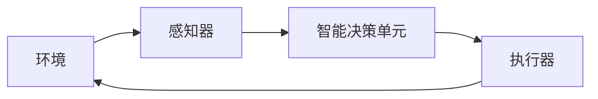
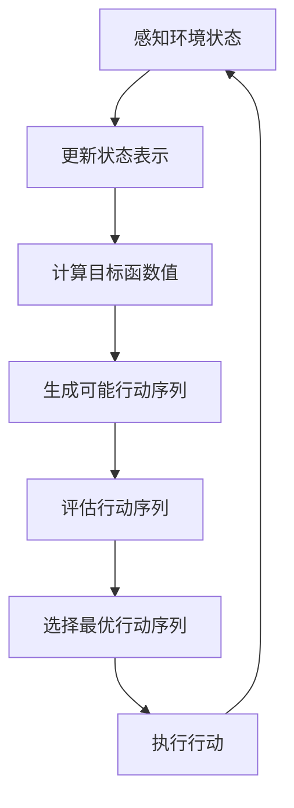

# AI人工智能 Agent：在环保领域中的应用

## 1.背景介绍

### 1.1 环境问题的严峻性

当前,地球正面临着前所未有的环境挑战。气候变化、资源枯竭、生物多样性丧失等问题已经成为全球性的威胁。据联合国环境规划署报告,全球每年有约1200万人死于环境污染相关疾病。与此同时,人类活动造成的温室气体排放持续增加,导致全球平均气温不断上升,加剧了极端天气事件的发生频率和强度。

### 1.2 人工智能在环保中的作用

面对这些严峻的环境挑战,人工智能(AI)技术被视为一种有望为环保事业带来突破性进展的解决方案。AI系统具有处理大量复杂数据、发现隐藏模式、优化决策的能力,可以为环境监测、资源管理、政策制定等多个领域提供支持。

AI代理(Agent)作为人工智能系统的核心组成部分,在环保领域中发挥着越来越重要的作用。AI代理是一种能够感知环境、做出决策并采取行动的自主实体,可以被部署到各种环境中执行特定任务。

## 2.核心概念与联系  

### 2.1 AI代理的定义

AI代理是指能够感知环境、处理输入信息、根据目标函数做出决策并在环境中采取行动的自主系统。它由感知器(Sensor)、执行器(Actuator)和智能决策单元组成。



### 2.2 AI代理与环保的联系

AI代理可以被视为一种虚拟的"环保卫士",通过感知环境数据、分析决策并采取相应行动,来帮助人类更好地管理和保护环境资源。

例如,AI代理可以监测空气质量、分析污染源、优化交通路线等,从而减少温室气体排放。它还可以模拟气候变化情景、评估政策影响,为决策者提供依据。

### 2.3 AI代理在环保中的应用场景

AI代理在环保领域中的应用场景包括但不限于:

- 环境监测与预警
- 资源优化与管理  
- 生态系统保护
- 政策分析与决策支持
- 公众教育与参与

## 3.核心算法原理具体操作步骤

AI代理的核心算法原理可以概括为感知-规划-行动循环。具体操作步骤如下:



1. **感知环境状态**:通过各种传感器获取环境数据,如空气质量监测站、卫星遥感等。

2. **更新状态表示**:将获取的环境数据转化为代理系统可以理解和处理的状态表示形式。

3. **计算目标函数值**:根据预设目标(如最小化污染、最大化资源利用率等),计算当前状态下的目标函数值。

4. **生成可能行动序列**:基于当前状态和目标函数,生成一系列可能的行动序列。

5. **评估行动序列**:对每个可能的行动序列进行评估,估计其对环境的影响。

6. **选择最优行动序列**:根据评估结果,选择对环境影响最小(或效用最大)的行动序列。

7. **执行行动**:通过执行器实施选定的行动序列,如控制设备、发布警报等。

8. **循环迭代**:行动执行后,环境状态发生变化,代理重新感知新状态,并重复上述过程。

通过不断循环迭代,AI代理可以持续优化其决策,适应环境的动态变化。

## 4.数学模型和公式详细讲解举例说明

### 4.1 马尔可夫决策过程(MDP)

许多AI代理系统建模都基于马尔可夫决策过程(MDP)框架。MDP由一个五元组(S, A, P, R, γ)定义:

- S是状态集合
- A是行动集合  
- P是状态转移概率,表示在状态s下执行行动a将转移到状态s'的概率P(s'|s,a)
- R是回报函数,表示在状态s下执行行动a获得的即时回报R(s,a)
- γ是折现因子,表示对未来回报的衰减率

在MDP中,代理的目标是找到一个策略π,使得期望的累积折现回报最大化:

$$\max_\pi \mathbb{E}\left[\sum_{t=0}^\infty \gamma^t R(s_t, a_t)\right]$$

其中$s_t$和$a_t$分别表示时间t时的状态和行动。

### 4.2 Q-Learning算法

Q-Learning是一种常用的强化学习算法,可以用于求解MDP中的最优策略。它的核心思想是学习一个Q函数Q(s,a),表示在状态s下执行行动a的长期期望回报。

Q函数通过下面的迭代方式不断更新:

$$Q(s_t, a_t) \leftarrow Q(s_t, a_t) + \alpha \left[r_t + \gamma \max_{a'} Q(s_{t+1}, a') - Q(s_t, a_t)\right]$$

其中:
- $\alpha$是学习率
- $r_t$是立即回报
- $\gamma$是折现因子
- $\max_{a'} Q(s_{t+1}, a')$是下一状态下的最大Q值

通过不断更新Q函数,算法最终会收敛到最优策略。

### 4.3 举例:控制工厂排放

考虑一个控制工厂排放的例子。状态s表示当前的污染水平,行动a表示调整生产水平的决策。我们定义:

- 状态集合S = {低污染,中等污染,高污染}
- 行动集合A = {增加产量,维持产量,减少产量}
- 转移概率P(s'|s,a)表示在状态s下执行行动a将转移到状态s'的概率
- 回报函数R(s,a)可以设置为产量收益减去排放成本和罚款

我们的目标是找到一个策略π,使得工厂的长期净收益最大化,同时将污染控制在可接受的水平。

通过Q-Learning算法,代理可以学习到一个近似最优的Q函数,指导它在不同状态下选择适当的行动,在产量和环境影响之间取得平衡。

## 5.项目实践:代码实例和详细解释说明  

以下是一个使用Python和OpenAI Gym库实现的简单Q-Learning代理的示例代码,用于控制一个简化的工厂排放问题。

```python
import gym
import numpy as np

# 创建环境
env = gym.make('Pollution-v0')

# 初始化Q表
Q = np.zeros((env.observation_space.n, env.action_space.n))

# 超参数
alpha = 0.1  # 学习率
gamma = 0.99  # 折现因子
episodes = 10000  # 训练回合数

# Q-Learning算法
for episode in range(episodes):
    state = env.reset()
    done = False
    
    while not done:
        # 选择行动(epsilon-greedy)
        if np.random.uniform() < 0.1:
            action = env.action_space.sample()
        else:
            action = np.argmax(Q[state])
        
        # 执行行动
        next_state, reward, done, _ = env.step(action)
        
        # 更新Q值
        Q[state, action] += alpha * (reward + gamma * np.max(Q[next_state]) - Q[state, action])
        
        state = next_state

# 测试策略
state = env.reset()
done = False
total_reward = 0

while not done:
    action = np.argmax(Q[state])
    state, reward, done, _ = env.step(action)
    total_reward += reward

print(f"Total reward: {total_reward}")
```

解释:

1. 首先,我们创建一个名为`Pollution-v0`的Gym环境,它模拟了一个简化的工厂排放问题。

2. 初始化一个二维数组`Q`,用于存储状态-行动对的Q值。

3. 设置超参数,包括学习率`alpha`、折现因子`gamma`和训练回合数`episodes`。

4. 进入Q-Learning算法的主循环,每个回合:
   - 重置环境状态
   - 根据当前状态和Q值,选择一个行动(epsilon-greedy策略)
   - 执行选定的行动,获得下一状态、即时回报等信息
   - 根据Q-Learning更新规则,更新Q值

5. 训练完成后,我们测试学习到的策略在环境中的表现,打印出总回报。

需要注意的是,这只是一个简单的示例,实际应用中的代理系统会更加复杂。但是,它阐释了Q-Learning算法的基本原理和在环保领域中的潜在应用。

## 6.实际应用场景

AI代理在环保领域中的应用前景广阔,可以为解决各种环境问题提供有力支持。以下是一些典型的应用场景:

### 6.1 空气质量监测与控制

利用传感器网络和卫星遥感数据,AI代理可以实时监测空气质量,预测污染扩散趋势,并提出减排措施建议。例如,它可以根据工厂排放、交通流量等因素,优化生产计划和交通路线,从而减少污染物排放。

### 6.2 水资源管理

AI代理可以整合气象数据、用水量等信息,预测未来的供水和需水情况,并提出最佳的供水调度方案。同时,它还可以监测水质,发现污染源头,指导污水处理和回收利用。

### 6.3 能源系统优化

AI代理可以分析能源供需数据,优化可再生能源的利用,提高能源利用效率。例如,它可以根据天气预报和用电负荷,调度风电、太阳能等清洁能源的输出,减少化石燃料的使用。

### 6.4 生态系统保护

通过分析卫星影像、物种分布等数据,AI代理可以评估生态系统的健康状况,预测外来物种入侵、森林火灾等风险,并提出应对措施。它还可以模拟不同保护政策的效果,为决策者提供依据。

### 6.5 环境教育与公众参与

AI代理可以作为虚拟助手,向公众传播环保知识,解答相关问题。它还可以分析公众对环境问题的关注度和参与度,帮助制定有针对性的宣传策略,提高公众的环保意识和行动力。

## 7.工具和资源推荐

在开发和应用AI代理系统时,可以利用以下工具和资源:

### 7.1 AI框架和库

- **TensorFlow**:谷歌开源的端到端机器学习平台,支持构建和部署AI模型。
- **PyTorch**:Meta开源的机器学习库,具有Python接口和良好的GPU加速支持。
- **OpenAI Gym**:一个开发和比较强化学习算法的工具包,提供了多种环境。
- **Stable Baselines**:基于OpenAI Baselines实现的强化学习算法集合。

### 7.2 环境数据集

- **EPA数据**:美国环保署提供的各种环境数据集,包括空气质量、水质、土壤污染等。
- **SEDAC数据**:哥伦比亚大学社会经济数据与应用中心提供的人口、土地利用等数据集。
- **NOAA数据**:美国国家海洋和大气管理局提供的气象、气候和海洋数据。

### 7.3 开源项目

- **AI for Earth**:微软发起的开源项目,旨在利用AI技术解决环境挑战。
- **TensorFlow Earth Engine**:谷歌基于TensorFlow和Earth Engine构建的环境数据处理工具。
- **DeepMind AI for Climate**:DeepMind发起的AI应用于气候变化的研究项目。

## 8.总结:未来发展趋势与挑战

AI代理在环保领域的应用正处于起步阶段,未来的发展趋势包括:

### 8.1 多智能体协作

单个AI代理的能力是有限的,未来将会出现多个代理协同工作的情况,以解决更加复杂的环境问题。这需要设计高效的多智能体协作算法和通信机制。

### 8.2 人机协作决