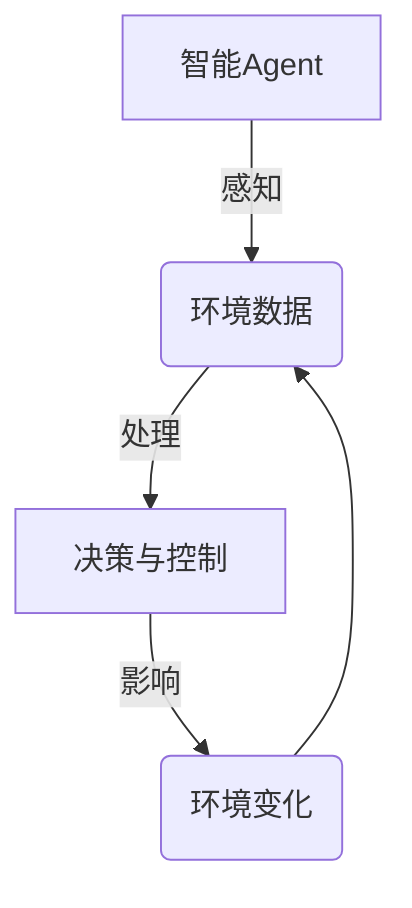
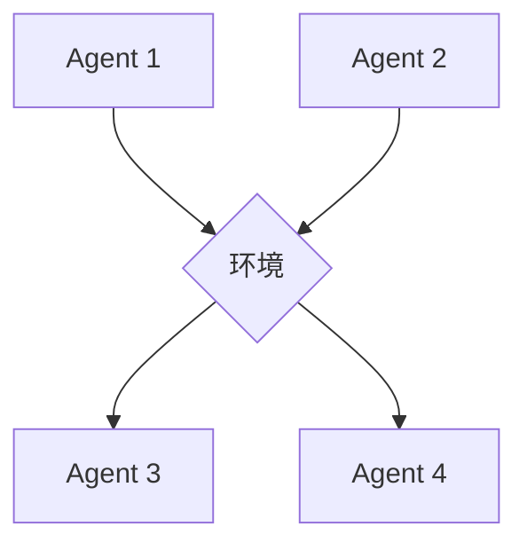
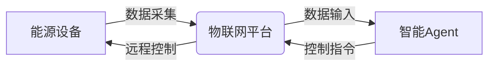

# AI人工智能 Agent：在节能减排中的应用

## 1.背景介绍

### 1.1 能源与环境的挑战

随着全球经济的快速发展和人口的不断增长,能源需求与日俱增,导致化石燃料的过度开采和使用,进而加剧了环境污染和气候变化的问题。据统计,全球约三分之二的温室气体排放来自于化石燃料的燃烧。因此,实现能源的可持续利用和减少温室气体排放已成为当前人类社会面临的重大挑战。

节能减排(Energy Conservation and Emission Reduction)是指通过采取一系列措施,降低能源消耗和减少温室气体等污染物的排放,从而实现能源的高效利用和环境的可持续发展。这不仅关乎经济的可持续增长,也关系到地球环境的长治久安。

### 1.2 人工智能在节能减排中的作用

人工智能(Artificial Intelligence,AI)技术在节能减排领域具有广阔的应用前景。AI系统可以通过数据分析、建模和优化等手段,为能源系统的规划、运行和管理提供智能化支持,从而提高能源利用效率,降低排放水平。

AI技术在节能减排中的应用主要体现在以下几个方面:

1. **能源需求预测**:利用机器学习算法对能源需求进行准确预测,为能源系统的供给做好充分准备。
2. **能源系统优化**:通过建模和优化技术,优化能源生产、输配和消费的各个环节,提高整体系统效率。
3. **智能控制**:应用智能控制算法,实现对建筑、工业设备等终端用能设备的精细化管理和控制。
4. **排放监测**:借助计算机视觉、遥感等技术,实时监测和评估温室气体及其他污染物的排放情况。
5. **政策支持**:通过数据分析和模拟,为制定节能减排政策提供决策支持。

本文将重点探讨AI技术在节能减排领域的应用,介绍相关的核心概念、算法原理、实践案例,并对未来发展趋势进行展望。

## 2.核心概念与联系

在探讨AI在节能减排中的应用之前,有必要先了解一些核心概念及其内在联系。

### 2.1 智能Agent

智能Agent是人工智能系统的核心组成部分,它是一种能够感知环境、作出决策并采取行动的自主实体。在节能减排领域,智能Agent可以被赋予特定的目标和约束条件,例如最大限度地减少能耗或排放,并根据所获取的环境数据(如能源供需状况、设备运行参数等)作出相应的决策和控制。

### 2.2 机器学习与优化

机器学习和优化算法是实现智能Agent的关键技术。

机器学习算法可以从历史数据中发现潜在规律,用于构建能源需求预测模型、建筑能耗模型等。常用的机器学习算法包括回归分析、决策树、神经网络等。

优化算法则旨在寻找满足约束条件的最优解,如最小化总能耗、最大化可再生能源利用率等。常见的优化算法有线性规划、动态规划、遗传算法等。

### 2.3 多智能体系统

在复杂的能源系统中,通常需要多个智能Agent协同工作,形成多智能体系统(Multi-Agent System,MAS)。不同Agent可以负责不同子系统的优化,也可以通过协作和竞争实现整体最优。

例如,在智能建筑中,可以部署多个Agent分别控制供暖、制冷、照明等子系统,并通过协调以实现整体能耗最小化。在智能电网中,各个发电厂、变电站可以作为独立的Agent,通过游戏论等方法实现整个电网的经济调度。

### 2.4 能源物联网

物联网(Internet of Things,IoT)技术为智能Agent提供了环境感知和控制执行的基础。在节能减排领域,能源物联网(Energy IoT)将各类能源设备连接到互联网上,实现数据的实时采集和远程控制。

通过部署各种传感器,能源物联网可以实时监测能源生产、输配和消费过程中的各种参数,如温度、压力、流量等,为智能Agent的决策提供数据支持。同时,智能Agent也可以通过物联网对终端设备进行精细化控制,如调节空调温度、控制电机启停等。

## 3.核心算法原理具体操作步骤

在节能减排领域,智能Agent需要解决一系列优化问题,涉及多种算法和模型。本节将介绍其中几种核心算法的基本原理和具体操作步骤。

### 3.1 能源需求预测

#### 3.1.1 算法原理

能源需求预测是智能能源管理的基础,其目的是根据历史数据和影响因素(如天气、工作日等)对未来一段时间内的能源需求进行准确预测。常用的预测算法包括回归分析、时间序列分析和机器学习算法等。

以广泛应用的长短期记忆网络(Long Short-Term Memory,LSTM)为例,它是一种反馈循环神经网络,能够有效捕捉时间序列数据中的长期依赖关系,适合处理具有时间周期性的能源需求数据。

LSTM的核心思想是通过门控机制来控制信息的流动,包括遗忘门、输入门和输出门。遗忘门决定了丢弃多少过去的信息,输入门决定了保留多少新的信息,输出门则决定了输出什么信息。这种机制使得LSTM能够很好地解决梯度消失和梯度爆炸的问题,从而更好地捕捉长期依赖关系。

#### 3.1.2 算法步骤

1. **数据预处理**:收集影响能源需求的历史数据,如过去的用电量、天气情况、工作日/节假日等,并进行必要的清洗和标准化处理。
2. **划分数据集**:将预处理后的数据集划分为训练集、验证集和测试集。
3. **构建LSTM模型**:确定LSTM模型的层数、神经元数量、激活函数等参数,并定义损失函数和优化器。
4. **模型训练**:使用训练集对LSTM模型进行训练,并使用验证集监控模型的性能,防止过拟合。
5. **模型评估**:在测试集上评估模型的预测性能,计算指标如均方根误差(RMSE)、平均绝对百分比误差(MAPE)等。
6. **模型调优**:根据评估结果,调整LSTM模型的参数或使用其他技术(如特征工程、集成学习等),以提高预测精度。
7. **模型部署**:将训练好的LSTM模型部署到实际的能源管理系统中,用于实时预测未来一段时间内的能源需求。

### 3.2 建筑能耗优化

#### 3.2.1 算法原理

建筑物是能源消费的主要领域之一,因此优化建筑的能耗对于节能减排至关重要。建筑能耗优化通常被建模为约束优化问题,其目标是在满足舒适度、安全性等约束条件下,最小化建筑的总能耗。

一种常用的优化方法是模型预测控制(Model Predictive Control,MPC)。MPC将建筑能耗优化问题分解为一系列有限horizon的优化子问题,在每个时间步通过求解优化子问题获得控制策略,并根据实际状态反馈进行滚动优化。

MPC的优点在于能够处理多变量、多约束的复杂问题,并具有反馈机制,可以应对建筑运行过程中的不确定性。其核心是建立精确的建筑能耗模型,并设计高效的优化算法求解器。

#### 3.2.2 算法步骤

1. **建立建筑能耗模型**:根据建筑物的结构、材料、设备等信息,建立描述建筑能耗的数学模型,包括状态方程和约束条件。
2. **确定优化目标和约束**:设定优化目标(如最小化总能耗)和约束条件(如室内温度范围、设备运行约束等)。
3. **离散化模型**:将连续时间的建筑能耗模型离散化,转化为有限horizon的优化问题。
4. **求解优化问题**:使用适当的优化算法(如内点法、序列二次规划等)求解每个时间步的优化子问题,获得控制策略。
5. **实施控制策略**:将求解得到的控制策略(如供暖、制冷设备的运行参数)应用到实际建筑系统中。
6. **状态反馈与滚动优化**:获取建筑系统的实际状态反馈,并在下一个时间步重复步骤3-5,实现滚动优化。

### 3.3 智能电网优化调度

#### 3.3.1 算法原理

智能电网是一种以信息通信技术为支撑的现代电力网络,能够实现电力系统各环节的自动化、互动化和优化控制。智能电网优化调度的目标是在满足电网约束(如发电平衡、线路输电能力等)的前提下,实现经济的电力调度,最小化发电成本或最大化社会福利。

智能电网优化调度问题通常被建模为大规模的混合整数规划问题,包含大量的连续变量(如发电机出力)和离散变量(如发电机的启停状态)。由于其高度复杂性,通常采用分解-协调的方法进行求解。

常见的分解算法包括拉格朗日松弛法、Benders分解法等,它们通过构造主问题和子问题,在主从问题之间进行迭代求解,逐步收敛到全局最优解。此外,基于游戏论的多智能体优化算法也是智能电网优化调度的有力工具。

#### 3.3.2 算法步骤

以Benders分解法为例,其求解步骤如下:

1. **建立电网优化调度模型**:构建描述电网运行的数学模型,包括目标函数(如最小化发电成本)和约束条件(如发电平衡、线路输电能力等)。
2. **分解为主问题和子问题**:将原问题分解为主问题(只包含整数变量)和子问题(只包含连续变量)。
3. **求解主问题**:求解包含整数变量的主问题,获得整数变量的候选解。
4. **求解子问题**:将主问题的候选解代入子问题,求解子问题以检验是否满足所有约束。
5. **生成Benders切割平面**:如果子问题无法得到可行解,则根据子问题的对偶理论生成一个切割平面,添加到主问题中。
6. **迭代求解**:重复步骤3-5,直至主问题和子问题的解之间的间隙足够小,得到全局最优解。

## 4.数学模型和公式详细讲解举例说明

在节能减排领域,数学模型和公式是描述系统行为、构建优化目标和约束条件的基础。本节将详细讲解几种常见的数学模型,并给出具体的公式和案例说明。

### 4.1 建筑能耗模型

建筑能耗模型描述了建筑物在给定环境条件和控制策略下的能耗情况,是进行建筑能耗优化的基础。一种常用的建筑能耗模型是基于热平衡原理的RC网络模型。

RC网络模型将建筑物视为由若干节点组成的热电网络,每个节点代表一个独立的热区域(如房间)。节点之间通过热阻和热容来模拟热量的传递和存储。该模型的数学表达式如下:

$$
C_i\frac{dT_i}{dt}=\sum_{j\in N_i}\frac{T_j-T_i}{R_{ij}}+Q_i^{int}+Q_