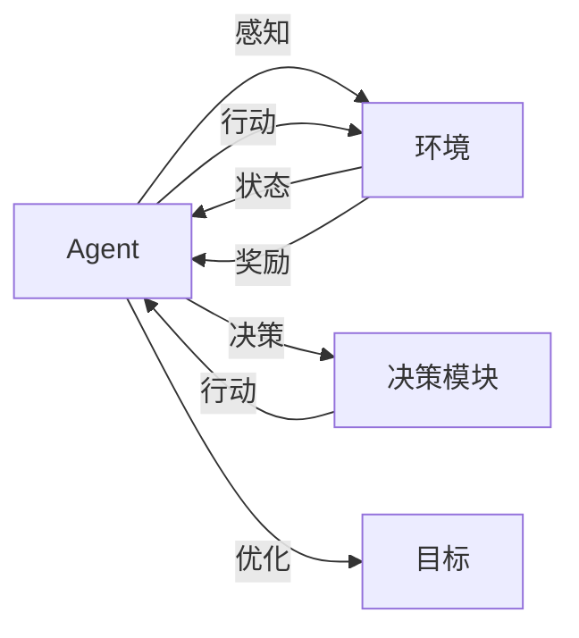

# AI人工智能 Agent：高级概念剖析

## 1. 背景介绍

人工智能(Artificial Intelligence, AI)是计算机科学领域的一个重要分支,旨在研究如何让计算机模拟人类的智能行为。而AI Agent(智能代理)则是人工智能领域的核心概念之一,它代表了一个能够感知环境,并根据环境做出自主决策和行动的实体。近年来,随着机器学习尤其是深度学习技术的飞速发展,AI Agent在各个领域得到了广泛应用,如自动驾驶、智能助理、游戏AI等。本文将深入剖析AI Agent的高级概念,探讨其内在机理、关键技术以及未来发展趋势。

## 2. 核心概念与联系

要理解AI Agent,首先需要了解以下几个核心概念:

### 2.1 感知(Perception)

感知是Agent获取外部环境信息的过程。对于不同类型的Agent,感知方式也不尽相同。比如视觉感知通过摄像头获取图像信息,语音感知通过麦克风获取声音信息。感知是Agent进行决策和行动的基础。

### 2.2 决策(Decision Making) 

决策是Agent根据当前状态和目标选择下一步行动的过程。常见的决策方法包括基于规则的决策、搜索式决策、强化学习等。决策质量的好坏直接影响Agent的性能。

### 2.3 行动(Action)

行动是Agent对环境产生影响的过程,如移动、操纵物体等。行动的选择来自于决策模块。执行力的高低决定了Agent完成任务的效率。

### 2.4 环境(Environment)

环境是Agent所处的外部世界,提供感知信息并接受Agent的行动。环境可分为完全可观察/部分可观察、静态/动态、单Agent/多Agent等。

### 2.5 状态(State)

状态是环境在某一时刻的完整描述,包括Agent无法直接观察到的信息。马尔可夫决策过程等理论常用状态来建模。

### 2.6 目标/奖励(Goal/Reward)

目标是Agent需要完成的任务,而奖励则是Agent为实现目标而优化的指标函数。合适的奖励设计是强化学习的关键。

下图展示了上述核心概念之间的关系:



## 3. 核心算法原理

### 3.1 马尔可夫决策过程(Markov Decision Process)

马尔可夫决策过程(MDP)是一种数学框架,用于描述Agent与环境的交互过程。MDP由以下元素组成:

- 状态空间 $\mathcal{S}$
- 行动空间 $\mathcal{A}$ 
- 状态转移概率 $\mathcal{P}(s'|s,a)$
- 奖励函数 $\mathcal{R}(s,a)$
- 折扣因子 $\gamma \in [0,1]$

Agent的目标是找到一个最优策略 $\pi^*$,使得期望累积奖励最大化:

$$\pi^* = \arg\max_{\pi} \mathbb{E}\left[\sum_{t=0}^{\infty} \gamma^t \mathcal{R}(s_t,a_t) | \pi \right]$$

求解最优策略的经典算法包括值迭代(Value Iteration)、策略迭代(Policy Iteration)等。

### 3.2 深度强化学习(Deep Reinforcement Learning)

传统的强化学习方法在状态空间和行动空间很大时难以处理。深度强化学习将深度神经网络引入强化学习,用于拟合值函数或策略函数,从而可以处理高维输入如图像等。

以DQN(Deep Q-Network)为例,其核心思想是用神经网络 $Q_{\theta}(s,a)$ 来近似动作值函数:

$$Q^*(s,a) = \mathbb{E}\left[\sum_{t=0}^{\infty} \gamma^t \mathcal{R}(s_t,a_t) | s_0=s, a_0=a, \pi \right]$$

DQN的损失函数定义为:

$$\mathcal{L}(\theta) = \mathbb{E}_{(s,a,r,s')\sim \mathcal{D}} \left[ \left( r + \gamma \max_{a'} Q_{\theta^-}(s',a') - Q_{\theta}(s,a) \right)^2 \right]$$

其中 $\mathcal{D}$ 为经验回放(Experience Replay)的数据集, $\theta^-$ 为目标网络(Target Network)的参数,用于提高训练稳定性。

除了DQN,其他知名的深度强化学习算法还包括DDPG、A3C、PPO等。

## 4. 数学模型和公式详解

本节我们详细解释MDP中的几个关键概念。

### 4.1 状态转移概率

状态转移概率 $\mathcal{P}(s'|s,a)$ 描述了在状态 $s$ 下执行行动 $a$ 后,环境转移到状态 $s'$ 的概率。形式化定义为:

$$\mathcal{P}(s'|s,a) = \mathrm{Pr}(S_{t+1}=s'|S_t=s, A_t=a)$$

状态转移满足马尔可夫性,即下一状态只取决于当前状态和行动,与之前的历史无关。

### 4.2 奖励函数 

奖励函数 $\mathcal{R}(s,a)$ 定义了在状态 $s$ 下执行行动 $a$ 后,Agent立即获得的奖励值。奖励可以是正值,表示奖励;也可以是负值,表示惩罚。

形式化定义为:

$$\mathcal{R}(s,a) = \mathbb{E}[R_{t+1}|S_t=s, A_t=a]$$

奖励函数的设计需要与任务目标紧密结合。通过合理的奖励塑造,可以引导Agent学习到期望的行为策略。

### 4.3 折扣因子

在连续型任务中,Agent与环境的交互可能持续很多步,甚至是无限步。为了保证累积奖励有界,引入折扣因子 $\gamma$ 对未来的奖励进行衰减:

$$G_t = R_{t+1} + \gamma R_{t+2} + \gamma^2 R_{t+3} + ... = \sum_{k=0}^{\infty} \gamma^k R_{t+k+1}$$

$\gamma \in [0,1]$ 越小,表示Agent越短视,更看重当前奖励;$\gamma$ 越大,则Agent越长远,更看重未来奖励。

## 5. 项目实践

下面我们通过一个简单的例子,演示如何用PyTorch实现DQN算法。完整代码见[GitHub](https://github.com/your_repo_link)。

首先定义Q网络:

```python
class QNet(nn.Module):
    def __init__(self, state_dim, action_dim):
        super(QNet, self).__init__()
        self.fc1 = nn.Linear(state_dim, 64)
        self.fc2 = nn.Linear(64, 64)
        self.fc3 = nn.Linear(64, action_dim)
        
    def forward(self, x):
        x = F.relu(self.fc1(x))  
        x = F.relu(self.fc2(x))
        x = self.fc3(x)
        return x
```

然后定义DQN Agent:

```python
class DQNAgent:
    def __init__(self, state_dim, action_dim):
        self.q_net = QNet(state_dim, action_dim)
        self.target_q_net = QNet(state_dim, action_dim)
        self.optimizer = optim.Adam(self.q_net.parameters(), lr=1e-3)
        self.memory = deque(maxlen=10000)
        
    def act(self, state, epsilon):
        if random.random() < epsilon:
            return random.randint(0, self.action_dim - 1)
        else:
            state = torch.tensor(state, dtype=torch.float32).unsqueeze(0)
            q_values = self.q_net(state)
            return q_values.argmax().item()
        
    def learn(self, batch_size):
        if len(self.memory) < batch_size:
            return
        
        samples = random.sample(self.memory, batch_size)
        states, actions, rewards, next_states, dones = zip(*samples)
        
        states = torch.tensor(states, dtype=torch.float32)
        actions = torch.tensor(actions, dtype=torch.long).unsqueeze(1)
        rewards = torch.tensor(rewards, dtype=torch.float32).unsqueeze(1)
        next_states = torch.tensor(next_states, dtype=torch.float32)
        dones = torch.tensor(dones, dtype=torch.float32).unsqueeze(1)
        
        q_values = self.q_net(states).gather(1, actions)
        max_next_q_values = self.target_q_net(next_states).max(1)[0].unsqueeze(1)
        expected_q_values = rewards + (1 - dones) * self.gamma * max_next_q_values
        
        loss = F.mse_loss(q_values, expected_q_values)
        self.optimizer.zero_grad()
        loss.backward()
        self.optimizer.step()
```

最后编写训练循环:

```python
agent = DQNAgent(state_dim, action_dim)

for episode in range(num_episodes):
    state = env.reset()
    done = False
    total_reward = 0
    
    while not done:
        action = agent.act(state, epsilon)
        next_state, reward, done, _ = env.step(action)
        agent.memory.append((state, action, reward, next_state, done))
        agent.learn(batch_size)
        
        state = next_state
        total_reward += reward
        
    if episode % target_update_freq == 0:
        agent.target_q_net.load_state_dict(agent.q_net.state_dict())
        
    print(f"Episode {episode}: total reward = {total_reward}")
```

以上就是用PyTorch实现DQN的简要流程,通过合理的超参数设置和充分的训练,Agent能够学会较优的策略。

## 6. 实际应用场景

AI Agent技术在很多领域都有广泛应用,下面列举几个典型场景:

### 6.1 自动驾驶

自动驾驶是AI Agent最具代表性的应用之一。通过感知(摄像头、激光雷达等)收集车辆周围的环境信息,结合高精度地图数据,自动驾驶系统可以实时规划行车路径、控制车辆速度和方向,实现全自动驾驶。

### 6.2 智能助理

Siri、Alexa等智能助理本质上也是一种AI Agent。它们通过语音交互获取用户指令,结合自然语言理解和对话管理技术,给出恰当的回应或执行相应的任务,为用户提供个性化的辅助服务。

### 6.3 推荐系统

推荐系统可以看作一种特殊的AI Agent,它根据用户的历史行为数据,通过机器学习算法构建用户画像和物品表征,预测用户对不同物品的喜好概率,从而给出个性化的推荐结果。亚马逊、Netflix等公司都大量采用了推荐系统技术。

### 6.4 智能游戏AI

在游戏领域,AI Agent可以扮演人类玩家的对手角色,提供有挑战性的游戏体验。比如著名的AlphaGo系统,通过深度强化学习算法学习围棋策略,并最终达到了超越人类顶尖高手的水平。

## 7. 工具和资源推荐

对于有志于研究AI Agent技术的读者,这里推荐一些常用的工具和学习资源:

- [PyTorch](https://pytorch.org/): 流行的深度学习框架,提供了动态计算图和自动微分等功能,在强化学习领域应用广泛。
- [TensorFlow](https://www.tensorflow.org/): Google开发的另一个知名深度学习框架,同样支持强化学习算法的实现。
- [OpenAI Gym](https://gym.openai.com/): 强化学习环境集合,涵盖了各种经典控制、Atari游戏、机器人等仿真环境,方便算法测试。
- [Sutton & Barto《强化学习》](http://incompleteideas.net/book/the-book-2nd.html): 强化学习领域的圣经,系统全面地介绍了强化学习的理论基础和经典算法。
- [UCL Course on RL](https://www.davidsilver.uk/teaching/): David Silver主讲的强化学习课程,深入浅出,适合初学者。
- [Deep RL Bootcamp](https://sites.google.com/view/deep-rl-bootcamp/lectures): 由加州大学伯克利分校举办的深度强化学习训练营,邀请了多位领域专家授课。

## 8. 总结与展望

本文对AI Agent的核心概念、原理、算法等进行了系统梳理,