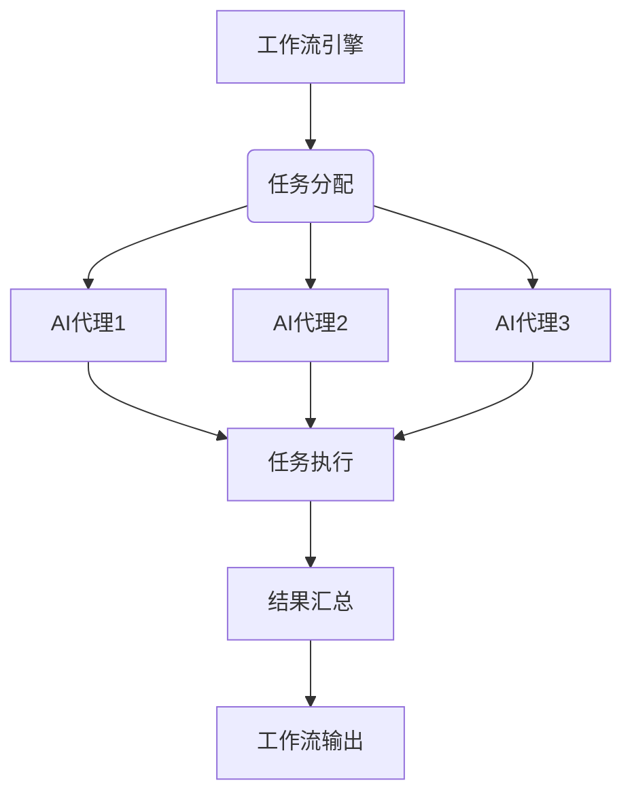
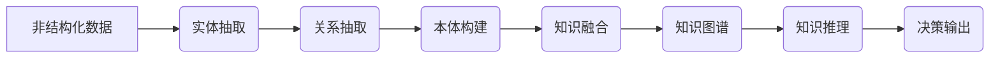

# AI人工智能代理工作流 AI Agent WorkFlow：在法律服务中的应用

## 1.背景介绍

### 1.1 法律服务行业的挑战

法律服务行业一直面临着高强度的工作负荷、庞大的文书工作量以及复杂的案件管理等挑战。传统的工作模式已经无法满足日益增长的效率和质量要求。随着人工智能(AI)技术的不断发展,AI代理工作流(AI Agent Workflow)应运而生,为法律服务行业带来了革命性的变革。

### 1.2 AI代理工作流的兴起

AI代理工作流是一种基于人工智能技术的自动化流程,旨在优化和简化复杂的任务流程。它通过集成自然语言处理(NLP)、机器学习(ML)、知识图谱等技术,实现智能化的文档处理、案件管理、法律研究等功能,大幅提高了工作效率和准确性。

## 2.核心概念与联系

### 2.1 AI代理

AI代理是AI代理工作流的核心组成部分,它是一个基于人工智能技术的智能系统,能够自主地执行特定任务。AI代理具有以下关键特征:

- **自主性**: AI代理能够根据预定义的规则和算法,自主地做出决策和执行行动。
- **交互性**: AI代理可以与人类或其他系统进行交互,接收指令和反馈。
- **学习能力**: AI代理可以通过机器学习算法,从历史数据和经验中学习和优化自身的行为。

### 2.2 工作流

工作流是一系列有序的任务或活动,它们按照特定的逻辑顺序执行,以实现预定的目标。在法律服务中,工作流包括案件管理、文档处理、法律研究等各个环节。

### 2.3 AI代理工作流

AI代理工作流是将AI代理与工作流相结合的概念。它利用AI代理的智能化能力,自动化和优化工作流中的各个环节,从而提高整体效率和质量。AI代理工作流的核心思想是:

1. 将复杂的工作流程分解为一系列可由AI代理执行的任务。
2. 为每个任务分配合适的AI代理,利用其特定的能力来完成该任务。
3. 通过工作流引擎协调和管理各个AI代理之间的交互和数据流转。

## 3.核心算法原理具体操作步骤

### 3.1 自然语言处理(NLP)

自然语言处理是AI代理工作流中的关键技术,它使AI代理能够理解和处理人类语言。NLP算法的核心步骤包括:

1. **标记化(Tokenization)**: 将文本分解成单词、句子等基本单元。
2. **词性标注(Part-of-Speech Tagging)**: 为每个单词分配相应的词性标记。
3. **命名实体识别(Named Entity Recognition)**: 识别文本中的人名、地名、组织机构名等实体。
4. **依存关系分析(Dependency Parsing)**: 分析句子中单词之间的依存关系。
5. **语义角色标注(Semantic Role Labeling)**: 识别句子中的语义角色,如主语、谓语、宾语等。
6. **情感分析(Sentiment Analysis)**: 分析文本中表达的情感倾向,如正面、负面或中性。

这些步骤为AI代理提供了对文本的深入理解,为后续的任务执行奠定基础。

### 3.2 机器学习(ML)

机器学习算法在AI代理工作流中扮演着重要角色,它们使AI代理能够从数据中学习并做出智能决策。常用的机器学习算法包括:

1. **监督学习**:
   - **分类算法**: 逻辑回归、支持向量机(SVM)、决策树等,用于将输入数据划分为预定义的类别。
   - **回归算法**: 线性回归、决策树回归等,用于预测连续值的输出。

2. **无监督学习**:
   - **聚类算法**: K-Means、层次聚类等,用于将相似的数据点分组。
   - **降维算法**: 主成分分析(PCA)、t-SNE等,用于降低数据维度,提高可解释性。

3. **强化学习**: Q-Learning、策略梯度等,用于训练智能体在特定环境中做出最优决策。

4. **深度学习**:
   - **卷积神经网络(CNN)**: 用于图像和文本处理任务。
   - **循环神经网络(RNN)**: 用于序列数据处理,如自然语言处理。
   - **transformer**: 基于注意力机制的模型,广泛应用于NLP任务。

这些算法为AI代理提供了学习和优化的能力,使其能够根据历史数据和经验不断改进自身的表现。

### 3.3 知识图谱

知识图谱是一种结构化的知识表示形式,它将实体、概念及其关系以图形的方式组织起来。在AI代理工作流中,知识图谱扮演着重要角色:

1. **知识存储**: 知识图谱为AI代理提供了一种高效的知识存储方式,方便查询和推理。
2. **关系推理**: 通过分析实体之间的关系,AI代理可以进行复杂的推理和决策。
3. **知识融合**: 将来自不同来源的知识整合到统一的知识图谱中,实现知识共享和复用。

构建知识图谱的核心步骤包括:

1. **实体抽取**: 从非结构化数据(如文本)中识别出实体。
2. **关系抽取**: 识别实体之间的语义关系。
3. **本体构建**: 定义实体类型、关系类型及其层次结构。
4. **知识融合**: 将来自不同来源的知识整合到统一的知识图谱中。
5. **知识推理**: 基于知识图谱进行复杂的推理和决策。

## 4.数学模型和公式详细讲解举例说明

### 4.1 自然语言处理中的数学模型

#### 4.1.1 词向量模型

词向量模型是自然语言处理中一种常用的技术,它将单词表示为一个固定长度的实值向量,从而使单词在向量空间中具有语义相似性。常用的词向量模型包括:

- **One-Hot编码**: 将每个单词表示为一个长度为词汇表大小的向量,其中只有一个位置为1,其余位置为0。
- **Word2Vec**: 利用浅层神经网络模型,通过上下文预测目标单词或反之,学习出词向量表示。
- **GloVe**: 基于全局词共现矩阵,利用矩阵分解技术学习词向量表示。

假设一个句子 $S$ 由 $n$ 个单词 $w_1, w_2, \dots, w_n$ 组成,每个单词 $w_i$ 对应一个 $d$ 维词向量 $\vec{v_i} \in \mathbb{R}^d$,那么句子 $S$ 的向量表示 $\vec{S}$ 可以通过对单词向量进行加权求和得到:

$$\vec{S} = \sum_{i=1}^{n} \alpha_i \vec{v_i}$$

其中 $\alpha_i$ 是单词 $w_i$ 的权重,可以是预定义的常数或通过注意力机制学习得到。

#### 4.1.2 序列标注模型

序列标注模型是自然语言处理中另一类重要的模型,它们用于对序列数据(如文本)进行标注,如词性标注、命名实体识别等。常用的序列标注模型包括:

- **隐马尔可夫模型(HMM)**: 基于马尔可夫假设,利用观测序列和隐状态序列之间的条件概率进行预测。
- **条件随机场(CRF)**: 直接对条件概率进行建模,避免了标记偏置问题。
- **循环神经网络(RNN)**: 利用循环神经网络捕捉序列数据的长期依赖关系。
- **transformer**: 基于注意力机制的序列模型,在许多NLP任务上表现出色。

假设一个观测序列 $X = (x_1, x_2, \dots, x_n)$,对应的标记序列为 $Y = (y_1, y_2, \dots, y_n)$,我们希望找到最优的标记序列 $Y^*$,使得条件概率 $P(Y|X)$ 最大化:

$$Y^* = \arg\max_{Y} P(Y|X)$$

对于CRF模型,该条件概率可以表示为:

$$P(Y|X) = \frac{1}{Z(X)} \exp\left(\sum_{i=1}^{n} \sum_{j} \lambda_j t_j(y_{i-1}, y_i, X, i)\right)$$

其中 $Z(X)$ 是归一化因子,$ \lambda_j$ 是特征函数 $t_j$ 的权重,通过训练数据学习得到。

### 4.2 机器学习中的数学模型

#### 4.2.1 线性模型

线性模型是机器学习中最基础的模型之一,它假设输入特征与输出目标之间存在线性关系。常见的线性模型包括线性回归和逻辑回归。

对于线性回归模型,给定一个输入特征向量 $\vec{x} = (x_1, x_2, \dots, x_n)$,我们希望找到一个权重向量 $\vec{w} = (w_1, w_2, \dots, w_n)$ 和一个偏置项 $b$,使得预测值 $\hat{y}$ 与真实值 $y$ 之间的均方误差最小:

$$\hat{y} = \vec{w}^T \vec{x} + b$$
$$\min_{\vec{w}, b} \sum_{i=1}^{m} (y_i - \hat{y}_i)^2$$

其中 $m$ 是训练样本的数量。

对于逻辑回归模型,我们希望找到一个权重向量 $\vec{w}$ 和偏置项 $b$,使得输入特征 $\vec{x}$ 对应的类别概率 $P(y=1|\vec{x})$ 最大:

$$P(y=1|\vec{x}) = \sigma(\vec{w}^T \vec{x} + b)$$
$$\sigma(z) = \frac{1}{1 + e^{-z}}$$

其中 $\sigma(\cdot)$ 是 Sigmoid 函数,用于将线性函数的输出映射到 $(0, 1)$ 区间,表示概率值。

#### 4.2.2 支持向量机(SVM)

支持向量机是一种常用的监督学习模型,它通过寻找最大间隔超平面将不同类别的数据点分开。对于线性可分的情况,给定一组训练样本 $\{(\vec{x}_i, y_i)\}_{i=1}^{m}$,其中 $\vec{x}_i \in \mathbb{R}^n$ 是输入特征向量, $y_i \in \{-1, 1\}$ 是类别标记,我们希望找到一个超平面 $\vec{w}^T \vec{x} + b = 0$,使得:

$$\begin{cases}
\vec{w}^T \vec{x}_i + b \geq 1, & \text{if } y_i = 1 \\
\vec{w}^T \vec{x}_i + b \leq -1, & \text{if } y_i = -1
\end{cases}$$

等价于:

$$y_i(\vec{w}^T \vec{x}_i + b) \geq 1, \quad \forall i$$

SVM的目标是最大化间隔 $\frac{2}{||\vec{w}||}$,即求解以下优化问题:

$$\begin{aligned}
\min_{\vec{w}, b} & \frac{1}{2} ||\vec{w}||^2 \\
\text{s.t. } & y_i(\vec{w}^T \vec{x}_i + b) \geq 1, \quad \forall i
\end{aligned}$$

对于线性不可分的情况,SVM引入了软间隔和核技巧,使其能够处理更加复杂的数据分布。

## 5.项目实践：代码实例和详细