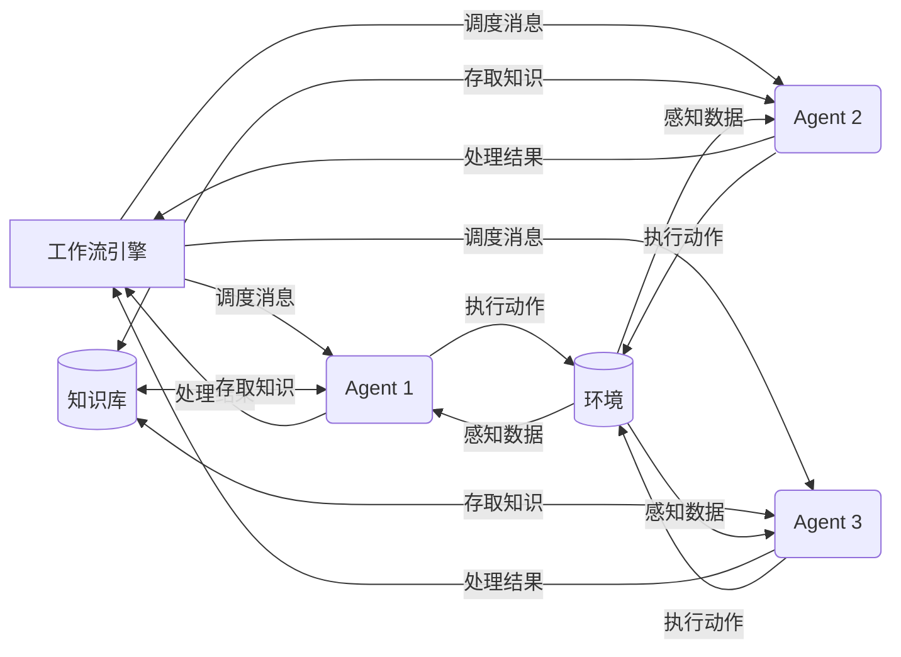

# AI人工智能代理工作流 AI Agent WorkFlow：在行业研究中的应用

## 1.背景介绍
### 1.1 AI人工智能的发展历程
人工智能(Artificial Intelligence,AI)是计算机科学的一个重要分支,它致力于研究如何让计算机模拟甚至超越人类的智能。AI的概念最早由约翰·麦卡锡(John McCarthy)在1956年的达特茅斯会议上提出。此后,AI经历了几次起起伏伏的发展历程。

20世纪50-70年代被称为AI的黄金时期,这一时期涌现出许多里程碑式的成果,如证明机器定理、跳棋程序等。但到了80年代,由于当时计算机硬件和算法的局限,AI陷入了低谷期。

进入21世纪,随着大数据、云计算、深度学习等技术的突破,AI迎来了新的春天。如今,AI已广泛应用于图像识别、语音交互、自然语言处理、智能决策等领域,深刻影响和改变着人类社会。

### 1.2 AI在行业研究中的重要性
当前,全球各行各业都在积极拥抱AI技术,以提升效率、优化流程、创新业务模式。将AI应用于行业研究,可以帮助研究人员更高效、更全面地分析海量数据,发现新的规律和洞见,做出更加科学、精准的预测和决策。

一些传统的行业研究方法,如文献综述、实地调研、问卷访谈等,往往耗时耗力,且容易受主观因素影响。而AI可以7×24小时不知疲倦地工作,快速处理海量非结构化数据如文本、图片、视频等,挖掘出人工难以察觉的关联和趋势。

此外,AI还能与行业专家的经验智慧深度融合,实现人机协同,取长补短。专家提出假设和思路,AI负责验证和优化,双方在不断的迭代中共同进化,创造出更多突破性的研究成果。

### 1.3 AI Agent的兴起
近年来,AI领域兴起了一种新的范式——AI Agent。它借鉴了经济学中"代理人"的概念,指一个可以自主感知环境、做出决策、执行任务的智能体。

与传统的AI系统相比,Agent具有更强的自主性、适应性和连续学习能力。它可以根据环境的反馈不断调整策略,对复杂多变的现实世界做出实时响应。同时,多个Agent还可以在协同中产生涌现智能,完成单个Agent难以胜任的任务。

目前,AI Agent已在智能客服、自动驾驶、对话生成、金融投资等场景崭露头角。引入Agent,有望为行业研究带来新的突破,提升研究的广度、深度和效率。而工作流(Workflow)作为一种成熟的流程管理技术,则可以很好地组织和调度Agent,使其发挥最大效能。

## 2.核心概念与联系
### 2.1 AI Agent的定义与特征
AI Agent是一种能够感知环境并作出行动以实现特定目标的计算机程序或机器人。它具有以下主要特征:

1. 自主性(Autonomy):Agent可以在没有人工直接干预的情况下独立运行,根据自身的感知、知识和推理做出决策。 

2. 社会性(Social Ability):Agent可以与环境中的其他Agent或人类进行通信和交互,协商、合作或竞争以完成任务。

3. 反应性(Reactivity):Agent能够及时感知环境的变化,并根据当前状态采取相应的行动。

4. 主动性(Pro-activeness):Agent不仅被动地响应环境,还会主动地追求自己的目标,采取前瞻性的行为。

5. 适应性(Adaptivity):Agent可以通过学习来适应动态变化的环境,调整自己的行为以提高性能。

6. 连续性(Continuity):Agent是一个持续运行的进程,它有自己的生命周期,并随时间推移不断积累知识和经验。

总之,Agent是一个具有一定智能的"个体",它能代表人类在复杂环境中自主地开展活动。当前的Agent研究涉及人工智能、多智能体系统、机器学习、博弈论等多个领域。

### 2.2 工作流的定义与特征
工作流(Workflow)是对工作流程及其各操作步骤之间业务规则的抽象、概括描述。它具有以下主要特征:

1. 明确的结构:工作流由一系列相互关联、按照一定逻辑次序组织起来的活动和任务组成,清晰描述了整个流程的结构。

2. 多角色协同:工作流通常涉及多个参与者,他们扮演不同的角色,并行或串行地开展协同工作。

3. 数据驱动:每个工作流实例都有相关联的数据,这些数据在流程中流转,并触发和控制流程的走向。 

4. 事件驱动:工作流实例在运行过程中,可以响应内部或外部事件,从而动态调整执行路径。

5. 基于规则:工作流的流转遵循一定的业务规则,这些规则定义了活动的执行条件、次序以及异常处理等。

6. 可视化:工作流通常以图形化的方式呈现,便于理解和监控流程的运行状态。

工作流技术起源于20世纪70年代的办公自动化系统,经过多年发展,已广泛应用于企业业务流程管理、科学工作流等领域。引入工作流,可以提高业务运作的规范性、灵活性和效率。

### 2.3 AI Agent与工作流的关系
AI Agent和工作流是两个来自不同领域的概念,但它们在智能化的业务流程中可以完美结合:

1. Agent作为工作流的执行者:每个工作流活动可以由一个或多个Agent来承担,Agent根据自身能力对活动进行处理和转发。

2. 工作流协调Agent的行为:工作流引擎通过发送消息或事件的方式,触发和调度Agent执行相应的任务,使多个Agent在流程中有序协同。

3. Agent增强工作流的智能性:传统工作流遵循预定义的规则,缺乏灵活性和自适应能力。引入Agent后,工作流可以借助Agent的自主学习和推理能力,动态优化流程、处理异常情况。

4. 工作流支撑Agent的持续运行:Agent需要一个长期稳定的运行环境,工作流引擎可以为Agent提供调度、监控、持久化等运行时支持。

5. 融合形成智能工作流:二者融合后,形成了一种全新的范式——智能工作流(Intelligence Workflow)。在智能工作流中,每个活动由认知型Agent承担,整个流程体现出较高的自动化和智能化水平。

下图展示了AI Agent与工作流融合的系统架构:

在该架构中,工作流引擎负责整个流程的编排和调度,通过发送消息触发每个Agent执行任务。Agent接收到消息后,从知识库获取任务所需的领域知识,对输入数据进行分析和决策,产生输出结果返回给引擎。同时,Agent还可以感知外部环境,在完成推理后执行相应的动作,引起环境的变化。整个系统在工作流控制下运转,多个Agent协同工作,逐步推进流程,完成既定目标。

## 3.核心算法原理与操作步骤
### 3.1 Agent的BDI模型
BDI(Belief-Desire-Intention)是一种经典的Agent内部结构和推理模型。它包含三个核心要素:

1. 信念(Belief):Agent对环境和自身状态的认知,是推理和决策的基础。

2. 愿望(Desire):Agent想要达成的所有目标状态,可能相互之间存在冲突。

3. 意图(Intention):Agent当前决定要采取的目标和行动计划,是愿望的一个无冲突子集。

BDI Agent的工作流程如下:

1. 感知环境,更新信念库。

2. 根据信念和愿望,激活满足条件的目标,生成愿望集合。

3. 对愿望集合进行权衡和调解,选出一个无冲突的意图子集。

4. 根据意图,匹配可行的行动计划,生成意图栈。

5. 执行意图栈中的行动计划,完成目标或进入下一轮循环。

BDI模型提供了一种直观、灵活的Agent编程范式,使开发者能够用心理学术语来描述Agent系统,具有较好的可解释性。但其推理过程相对简单,缺乏学习能力。在实践中,往往需要与其他技术相结合。

### 3.2 基于MCTS的智能工作流决策
蒙特卡洛树搜索(Monte-Carlo Tree Search,MCTS)是一种启发式搜索算法,它通过随机采样来估计决策树中每个节点的期望收益,并指导搜索的拓展方向。将MCTS引入到智能工作流的决策中,可以使Agent根据长期收益来优化决策,提高全局效能。

基于MCTS的智能工作流决策算法如下:

1. 选择:从根节点出发,沿着当前最优路径向下探索,直到叶子节点。

2. 扩展:如果叶子节点不是终止状态,则创建一个或多个子节点。

3. 仿真:从新扩展的节点开始,随机执行工作流,直到达到终止状态,并计算累积回报。

4. 回溯:将仿真结果回溯到根节点,更新路径上每个节点的统计信息。

5. 终止:重复以上步骤,直到满足预设的搜索预算(如时间、次数等)。

6. 决策:根据根节点的统计信息,选择访问次数最多的子节点对应的工作流作为最优决策。

通过迭代搜索,MCTS能够在巨大的决策空间中快速找到近似最优解,并在搜索过程中不断优化决策。每次搜索都会更新节点统计信息,使算法能够在多轮决策中持续学习和进化。

### 3.3 基于Actor-Critic的智能工作流优化
Actor-Critic是一种强化学习算法,它结合了策略梯度和值函数近似两种方法的优点。将Actor-Critic应用于智能工作流,可以使Agent在执行流程的同时持续优化策略,提升长期收益。

基于Actor-Critic的智能工作流优化算法如下:

1. 初始化Actor网络和Critic网络的参数。

2. 重复以下步骤,直到收敛:

   a. 根据Actor网络的策略执行一个工作流实例,记录状态、动作、回报序列。
    
   b. 根据Critic网络估计每个状态的值函数。
   
   c. 计算每个动作的优势函数(Advantage Function),即Q值减去状态值。
   
   d. 根据优势函数计算策略梯度,更新Actor网络参数。
   
   e. 根据均方误差损失函数更新Critic网络参数。

3. 返回优化后的Actor网络作为最优策略。

Actor网络负责生成工作流执行策略,根据当前状态输出每个动作的概率分布。Critic网络负责评估策略的好坏,估计每个状态的长期期望回报。二者相互配合,形成了一个完整的策略优化系统。

Actor-Critic结合了策略梯度稳定性差和值函数难以收敛两个问题的解决方案,能够在复杂的工作流环境中高效优化策略。同时,Actor-Critic也易于引入函数近似,拓展到大规模状态和动作空间。

## 4.数学模型和公式详解
### 4.1 BDI Agent的形式化描述
BDI Agent的推理过程可以用一阶谓词逻辑来形式化描述。设Agent的信念库为B,愿望集合为D,意图集合为I,可得:
$$
B \subseteq F \\
D \subsete