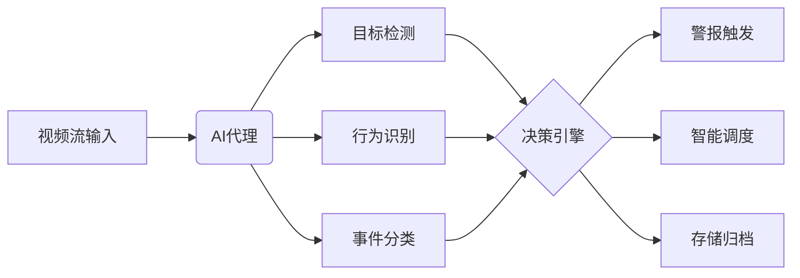
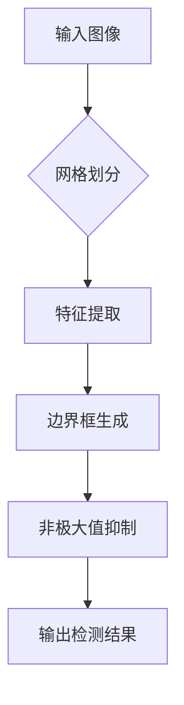
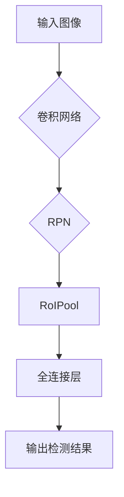
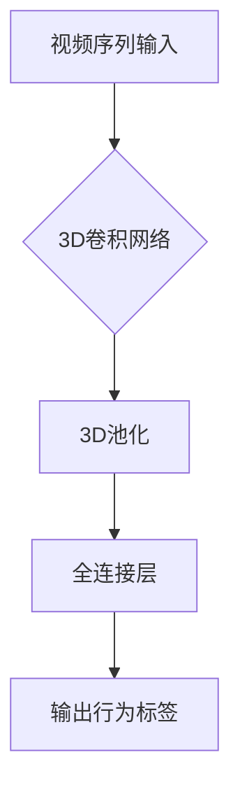
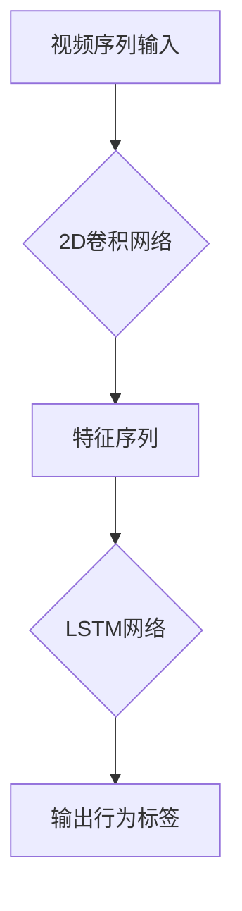
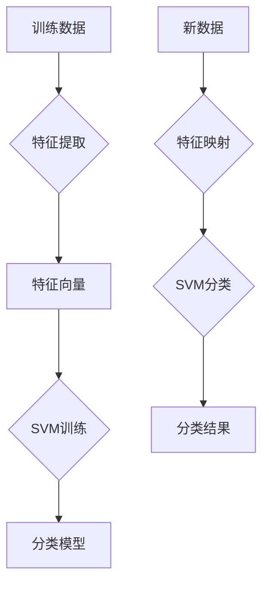
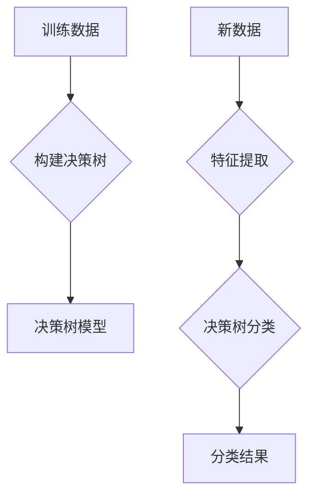

# AI人工智能代理工作流 AI Agent WorkFlow：在视频监控中的应用

## 1.背景介绍

### 1.1 视频监控系统的重要性

在当今社会,视频监控系统无处不在,已经成为确保公共安全、维护社会秩序的重要手段。无论是在交通枢纽、商业中心、政府机构还是居民小区,视频监控系统都发挥着不可或缺的作用。它可以实时监控区域内的活动,记录违法行为的证据,预防犯罪发生,提高应对能力。

### 1.2 视频监控数据的爆炸式增长

随着监控设备的不断升级和覆盖范围的扩大,视频数据呈现出爆炸式增长趋势。据统计,2022年全球视频监控数据量已超过3.3ZB(1ZB=1万亿GB),预计到2025年将达到12ZB。海量的视频数据给存储、传输和分析带来了巨大挑战。

### 1.3 人工审查的局限性

传统的视频监控主要依赖人工审查,存在诸多缺陷:

- 效率低下:人眼无法持续高度集中注意力
- 疲劳影响:长期高强度工作易造成视觉疲劳
- 主观判断:不同人对同一情况的判断可能不同
- 覆盖范围有限:无法实现全天候、全方位的监控

因此,迫切需要更智能、更高效的视频内容分析技术来解决这些问题。

## 2.核心概念与联系

### 2.1 人工智能代理(AI Agent)

人工智能代理指的是具备一定智能,能够感知环境、处理信息、作出决策并与环境交互的软件实体。在视频监控领域,AI代理需要对视频流进行实时分析,识别出感兴趣的目标、行为和事件,并根据预设的规则或策略作出响应。



### 2.2 AI代理工作流

AI代理工作流描述了代理从获取视频数据到最终执行行为的全过程,包括以下关键步骤:

1. 数据采集:获取视频流或图像序列
2. 视频预处理:格式转换、降噪、增强等
3. 目标检测:识别视频中的感兴趣目标
4. 行为识别:分析目标的动作和行为模式  
5. 事件分类:根据规则将行为归类为正常或异常事件
6. 决策执行:对异常事件作出响应(警报、调度等)
7. 数据存储:将结果数据存储备份

### 2.3 典型AI模型

AI代理工作流中常用的核心AI模型有:

- 目标检测: YOLO, Faster R-CNN
- 行为识别: 3D卷积网络, 时序模型(LSTM等)
- 事件分类: 支持向量机(SVM)、决策树等

这些模型需要大量标注数据集进行训练,并根据具体场景进行微调和优化。

## 3.核心算法原理具体操作步骤  

### 3.1 目标检测算法

#### 3.1.1 YOLO(You Only Look Once)

YOLO将目标检测问题转化为回归问题,直接对整个图像进行端到端的预测,算法流程如下:

1. 将输入图像划分为S×S个网格
2. 对每个网格预测B个边界框及其置信度
3. 每个边界框有(x,y,w,h,c)五元组,分别为中心坐标、宽高、置信度
4. 在所有边界框中挑选置信度最高的作为结果



#### 3.1.2 Faster R-CNN

Faster R-CNN在传统R-CNN基础上引入了区域候选网络(RPN),算法流程:

1. 卷积网络提取图像特征
2. RPN生成区域候选框
3. RoIPool对候选框进行归一化
4. 全连接层预测类别及精修边界框



### 3.2 行为识别算法

#### 3.2.1 基于3D卷积的方法

3D卷积能够同时捕捉图像的空间和时间特征,适用于视频数据。典型的网络包括C3D、I3D等。

1. 构建包含3D卷积、3D池化层的网络模型
2. 对视频序列进行3D卷积提取特征
3. 通过全连接层对特征分类获得行为标签



#### 3.2.2 基于LSTM的方法

长短期记忆网络(LSTM)能够有效捕获时序数据中的长期依赖关系,常用于行为识别。

1. 使用2D卷积网络提取视频帧的特征序列
2. 将特征序列输入LSTM网络
3. LSTM输出对应的行为类别



### 3.3 事件分类算法

#### 3.3.1 支持向量机(SVM)

SVM是一种二类分类模型,可用于正常/异常事件分类。

1. 从训练数据中提取特征向量
2. 在特征空间中寻找最大间隔超平面
3. 将新数据映射到特征空间进行分类



#### 3.3.2 决策树算法

决策树通过特征对数据进行递归分类,可用于多类事件分类。

1. 根据信息增益选择最优特征作为决策节点
2. 按特征值将数据划分到子节点
3. 重复上述步骤直至满足停止条件
4. 新数据按树状结构进行分类



## 4.数学模型和公式详细讲解举例说明

### 4.1 目标检测中的锚框(Anchor Box)

锚框是目标检测算法中常用的先验框,通过设置合理的尺寸、长宽比等参数,可以有效提高检测精度。

设图像的尺寸为(W,H),网格大小为S×S,对于第(i,j)个网格,其锚框的中心坐标为:

$$
b_x = \sigma(t_x) + i \\
b_y = \sigma(t_y) + j
$$

其中$t_x,t_y$为网络预测的偏移量,$\sigma$为sigmoid函数。

锚框的宽高由以下公式计算:

$$
b_w = p_we^{t_w} \\
b_h = p_he^{t_h}
$$

其中$p_w,p_h$为预设的先验框宽高,$t_w,t_h$为网络预测值。

### 4.2 行为识别中的时序建模

时序建模是行为识别的关键,需要捕获动作的时间演化规律。LSTM是一种常用的时序模型,其核心公式如下:

$$
\begin{aligned}
f_t &= \sigma(W_f[h_{t-1},x_t]+b_f) \\
i_t &= \sigma(W_i[h_{t-1},x_t]+b_i) \\
\tilde{C}_t &= \tanh(W_C[h_{t-1},x_t]+b_C) \\
C_t &= f_t \odot C_{t-1} + i_t \odot \tilde{C}_t \\
o_t &= \sigma(W_o[h_{t-1},x_t]+b_o) \\
h_t &= o_t \odot \tanh(C_t)
\end{aligned}
$$

其中$f_t,i_t,o_t$分别为遗忘门、输入门、输出门,用于控制信息流动。$C_t$为单元状态,编码了时序信息。

### 4.3 SVM分类器

SVM分类器的目标是在特征空间中寻找一个最大间隔超平面,将不同类别的样本分开。

对于线性可分数据,分类超平面方程为:

$$
w^Tx + b = 0
$$

其中$w$为权重向量,$b$为偏置项。

SVM的优化目标是最大化几何间隔:

$$
\max_{w,b} \frac{1}{\|w\|} \\
s.t. \ y_i(w^Tx_i + b) \geqslant 1, \ i=1,2,...,N
$$

这是一个二次规划问题,可以通过拉格朗日乘子法求解。对于线性不可分情况,可引入核函数将数据映射到高维空间。

## 5.项目实践:代码实例和详细解释说明

以下是一个使用PyTorch实现YOLO目标检测的简单示例:

```python
import torch
import torch.nn as nn

# 定义YOLO网络
class YOLONet(nn.Module):
    def __init__(self, num_classes=20, num_anchors=5):
        super(YOLONet, self).__init__()
        # 一系列卷积层
        ...
        
        # 最后一个卷积层输出通道数
        final_channel = 1024
        
        # 预测层
        self.pred = nn.Conv2d(final_channel, num_anchors*(5+num_classes), 1, 1, 0)
        
    def forward(self, x):
        # 卷积特征提取
        outputs = self.layers(x)
        
        # 预测结果
        pred = self.pred(outputs)
        
        # 解码预测结果
        boxes, scores, classes = self.decode(pred)
        
        return boxes, scores, classes
    
    def decode(self, pred):
        # 解码网络输出,获取边界框、置信度、类别
        ...
        
# 创建模型
net = YOLONet(num_classes=20)

# 加载预训练权重
net.load_state_dict(torch.load('yolo.pth'))

# 进行目标检测
boxes, scores, classes = net(img)
```

上述代码首先定义了YOLO网络结构,包含一系列卷积层和最后的预测层。预测层输出边界框坐标、置信度和类别概率。

`forward`函数对输入图像进行特征提取,并通过`decode`函数解析预测结果,得到最终的检测框、置信度和类别。

在实际使用中,我们可以加载预训练模型权重,然后对输入图像进行前向传播,获取检测结果。

## 6.实际应用场景

AI代理工作流在视频监控领域有着广泛的应用前景:

### 6.1 公共安全

- 人群聚集异常行为检测
- 违规停车、占道经营等违法行为监测
- 监狱看守、戒毒所等特殊场所的监控

### 6.2 智能交通

- 车辆违章检测(超速、压线、违停等)
- 交通拥堵预测及路况分析
- 智能停车场车位引导

### 6.3 智能楼宇

- 人员出入管理和门禁控制
- 消防安全、烟雾检测
- 能源管理(照明、空调等)

### 6.4 工业视觉

- 产品质量检测
- 工艺流程监控
- 机器人视觉导航

### 6.5 零售业

- 客流统计和热区分析
- 陈列品监控,防止移位、遗失
- 顾客行为分析,个性化推荐

## 7.工具和资源推荐

### 7.1 AI框架和库

- PyTorch / TensorFlow: 主流深度学习框