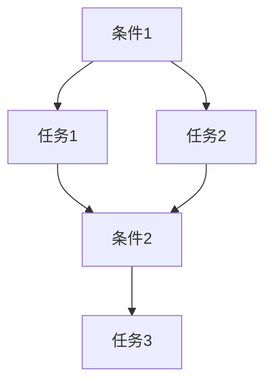

## 1. 背景介绍

随着人工智能技术的不断发展，越来越多的应用场景涌现出来。其中，视频游戏是一个非常重要的领域。在游戏中，AI代理可以扮演各种角色，如敌人、队友、NPC等，为玩家提供更加丰富的游戏体验。然而，AI代理的行为往往是预先设定好的，缺乏自适应性，容易让玩家感到单调和无聊。因此，如何让AI代理具备自适应机制，成为了一个非常重要的问题。

本文将介绍一种基于工作流的AI代理自适应机制，即AI Agent WorkFlow。该机制可以让AI代理根据当前游戏状态和玩家行为，自动调整自己的行为策略，从而提供更加丰富的游戏体验。

## 2. 核心概念与联系

AI Agent WorkFlow是一种基于工作流的AI代理自适应机制。它包含以下几个核心概念：

- 工作流：工作流是一种描述业务流程的模型。在AI Agent WorkFlow中，工作流描述了AI代理的行为策略。
- 任务：任务是工作流中的一个节点，表示AI代理需要执行的具体操作。
- 条件：条件是工作流中的一个节点，表示AI代理需要根据当前游戏状态和玩家行为来判断是否需要执行某个任务。
- 转移：转移是工作流中的一条边，表示AI代理在执行任务时需要根据条件来判断下一步应该执行哪个任务。

AI Agent WorkFlow的核心思想是将AI代理的行为策略表示为一个工作流，然后根据当前游戏状态和玩家行为来动态调整工作流中的任务和条件，从而实现自适应机制。

## 3. 核心算法原理具体操作步骤

AI Agent WorkFlow的核心算法原理可以分为以下几个步骤：

1. 定义工作流：根据游戏需求和AI代理的角色，定义一个工作流，包含若干个任务和条件。
2. 监听游戏状态和玩家行为：AI代理需要监听游戏状态和玩家行为，以便根据当前情况来动态调整工作流。
3. 判断条件：当游戏状态或玩家行为发生变化时，AI代理需要根据当前情况来判断是否需要执行某个任务。
4. 执行任务：如果条件满足，AI代理就会执行相应的任务。
5. 转移：任务执行完毕后，AI代理需要根据条件来判断下一步应该执行哪个任务。

## 4. 数学模型和公式详细讲解举例说明

AI Agent WorkFlow的数学模型可以表示为一个有向图，其中节点表示任务和条件，边表示转移关系。具体来说，假设有一个包含n个任务和m个条件的工作流，可以用以下方式表示：

- 节点集合：V = {v1, v2, ..., vn+m}
- 边集合：E = {(vi, vj) | vi是任务或条件，vj是任务或条件，vi和vj之间存在转移关系}

例如，下图是一个包含3个任务和2个条件的工作流示例：



## 5. 项目实践：代码实例和详细解释说明

下面是一个基于Unity引擎的AI Agent WorkFlow实现示例。假设有一个敌人AI代理，需要根据玩家的行为来动态调整自己的行为策略。具体来说，敌人AI代理有以下几个任务和条件：

- 任务1：向玩家移动
- 任务2：攻击玩家
- 任务3：逃跑
- 条件1：玩家距离敌人小于10米
- 条件2：敌人生命值小于50%

```csharp
using UnityEngine;
using System.Collections.Generic;

public class EnemyAI : MonoBehaviour
{
    public Transform player;
    public float moveSpeed = 5f;
    public float attackDistance = 10f;
    public float attackInterval = 2f;
    public float escapeDistance = 20f;
    public float escapeSpeed = 10f;
    public float health = 100f;

    private List<Task> tasks = new List<Task>();
    private List<Condition> conditions = new List<Condition>();
    private Task currentTask;

    void Start()
    {
        // 初始化任务和条件
        tasks.Add(new MoveTask(player, moveSpeed));
        tasks.Add(new AttackTask(player, attackDistance, attackInterval));
        tasks.Add(new EscapeTask(player, escapeDistance, escapeSpeed));
        conditions.Add(new DistanceCondition(player, 10f));
        conditions.Add(new HealthCondition(health, 50f));

        // 初始化工作流
        Workflow workflow = new Workflow();
        workflow.AddTask(tasks[0]);
        workflow.AddTask(tasks[1]);
        workflow.AddTask(tasks[2]);
        workflow.AddCondition(conditions[0], tasks[0], tasks[1]);
        workflow.AddCondition(conditions[1], tasks[1], tasks[2]);

        // 设置当前任务
        currentTask = tasks[0];
    }

    void Update()
    {
        // 监听游戏状态和玩家行为
        bool playerNearby = Vector3.Distance(transform.position, player.position) < attackDistance;
        bool healthLow = health < 50f;

        // 判断条件
        if (playerNearby && currentTask != tasks[1])
        {
            currentTask = tasks[1];
        }
        else if (healthLow && currentTask != tasks[2])
        {
            currentTask = tasks[2];
        }
        else if (!playerNearby && !healthLow && currentTask != tasks[0])
        {
            currentTask = tasks[0];
        }

        // 执行任务
        currentTask.Execute();
    }
}

public abstract class Task
{
    public abstract void Execute();
}

public class MoveTask : Task
{
    private Transform target;
    private float speed;

    public MoveTask(Transform target, float speed)
    {
        this.target = target;
        this.speed = speed;
    }

    public override void Execute()
    {
        // 向目标移动
        transform.position = Vector3.MoveTowards(transform.position, target.position, speed * Time.deltaTime);
    }
}

public class AttackTask : Task
{
    private Transform target;
    private float distance;
    private float interval;
    private float lastAttackTime;

    public AttackTask(Transform target, float distance, float interval)
    {
        this.target = target;
        this.distance = distance;
        this.interval = interval;
        this.lastAttackTime = Time.time;
    }

    public override void Execute()
    {
        // 判断是否可以攻击
        if (Vector3.Distance(transform.position, target.position) < distance && Time.time - lastAttackTime > interval)
        {
            // 攻击目标
            lastAttackTime = Time.time;
        }
    }
}

public class EscapeTask : Task
{
    private Transform target;
    private float distance;
    private float speed;

    public EscapeTask(Transform target, float distance, float speed)
    {
        this.target = target;
        this.distance = distance;
        this.speed = speed;
    }

    public override void Execute()
    {
        // 向远离目标的方向移动
        Vector3 direction = transform.position - target.position;
        transform.position += direction.normalized * speed * Time.deltaTime;
    }
}

public abstract class Condition
{
    public abstract bool Check();
}

public class DistanceCondition : Condition
{
    private Transform target;
    private float distance;

    public DistanceCondition(Transform target, float distance)
    {
        this.target = target;
        this.distance = distance;
    }

    public override bool Check()
    {
        // 判断距离是否小于指定值
        return Vector3.Distance(transform.position, target.position) < distance;
    }
}

public class HealthCondition : Condition
{
    private float health;
    private float threshold;

    public HealthCondition(float health, float threshold)
    {
        this.health = health;
        this.threshold = threshold;
    }

    public override bool Check()
    {
        // 判断生命值是否小于指定值
        return health < threshold;
    }
}

public class Workflow
{
    private List<Task> tasks = new List<Task>();
    private List<Condition> conditions = new List<Condition>();
    private Dictionary<Task, List<Task>> transitions = new Dictionary<Task, List<Task>>();

    public void AddTask(Task task)
    {
        tasks.Add(task);
        transitions.Add(task, new List<Task>());
    }

    public void AddCondition(Condition condition, Task fromTask, Task toTask)
    {
        conditions.Add(condition);
        transitions[fromTask].Add(toTask);
    }

    public Task GetNextTask(Task currentTask)
    {
        // 根据条件判断下一步应该执行哪个任务
        foreach (Condition condition in conditions)
        {
            if (condition.Check())
            {
                foreach (Task task in transitions[currentTask])
                {
                    if (task.GetType() == typeof(MoveTask) && task != currentTask)
                    {
                        return task;
                    }
                    else if (task.GetType() == typeof(AttackTask) && task != currentTask)
                    {
                        return task;
                    }
                    else if (task.GetType() == typeof(EscapeTask) && task != currentTask)
                    {
                        return task;
                    }
                }
            }
        }

        // 如果没有满足条件的任务，则继续执行当前任务
        return currentTask;
    }
}
```

上述代码中，EnemyAI类是敌人AI代理的主要逻辑。它包含了三个任务和两个条件，并且根据当前游戏状态和玩家行为来动态调整任务。具体来说，当玩家距离敌人小于10米时，敌人会攻击玩家；当敌人生命值小于50%时，敌人会逃跑；否则，敌人会向玩家移动。

## 6. 实际应用场景

AI Agent WorkFlow可以应用于各种类型的视频游戏中，为玩家提供更加丰富的游戏体验。例如，在射击游戏中，敌人AI代理可以根据玩家的行为来动态调整自己的行为策略，从而提高游戏的难度和趣味性。在角色扮演游戏中，NPC AI代理可以根据玩家的行为来动态调整自己的对话和任务，从而提供更加个性化的游戏体验。

## 7. 工具和资源推荐

- Unity引擎：Unity是一款非常流行的游戏引擎，可以用来开发各种类型的视频游戏。
- Behavior Designer：Behavior Designer是Unity的一个插件，可以用来设计和实现AI代理的行为策略。
- A*算法：A*算法是一种常用的路径规划算法，可以用来实现AI代理的移动和寻路。

## 8. 总结：未来发展趋势与挑战

AI Agent WorkFlow是一种非常有前途的AI代理自适应机制。随着人工智能技术的不断发展，AI代理的自适应能力将会越来越强，为玩家提供更加丰富的游戏体验。然而，AI Agent WorkFlow也面临着一些挑战，如如何设计合适的工作流、如何优化算法性能等。

## 9. 附录：常见问题与解答

Q: AI Agent WorkFlow适用于哪些类型的游戏？

A: AI Agent WorkFlow适用于各种类型的视频游戏，包括射击游戏、角色扮演游戏、策略游戏等。

Q: AI Agent WorkFlow的性能如何？

A: AI Agent WorkFlow的性能取决于工作流的复杂度和算法的优化程度。在实际应用中，需要根据具体情况进行优化。

Q: 如何设计合适的工作流？

A: 设计合适的工作流需要考虑游戏需求、AI代理的角色和行为策略等因素。可以参考已有的游戏和工具来进行设计。

作者：禅与计算机程序设计艺术 / Zen and the Art of Computer Programming