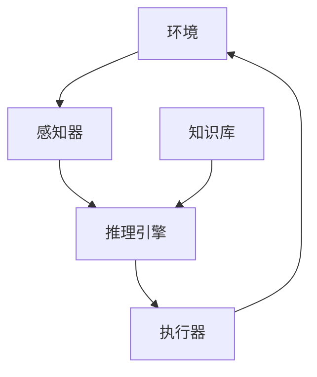
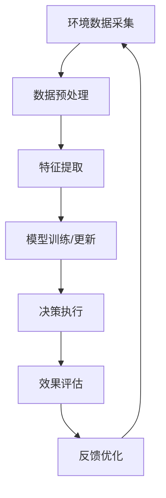

# AI人工智能代理工作流AI Agent WorkFlow：AI代理工作流在智能农业领域的应用

## 1.背景介绍

### 1.1 智能农业的兴起

随着世界人口的不断增长和气候变化的加剧,确保粮食安全和可持续农业发展已成为全球性挑战。传统的农业生产方式已难以满足日益增长的需求,因此智能农业应运而生。智能农业是指将先进的信息技术、物联网技术、大数据分析等现代技术与农业生产相结合,以提高农业生产效率、优化资源利用、降低环境影响。

### 1.2 AI代理在智能农业中的作用  

在智能农业的发展过程中,人工智能(AI)技术扮演着越来越重要的角色。AI代理作为AI技术的一个重要分支,为智能农业带来了全新的发展机遇。AI代理是一种基于特定知识库和规则的智能系统,能够自主地执行特定任务,并根据环境变化做出适当反应。在农业领域,AI代理可以通过感知农场环境数据、分析历史数据、制定最佳策略,从而实现精准种植、智能管理和决策支持等功能。

### 1.3 AI代理工作流概述

AI代理工作流(AI Agent Workflow)是指AI代理系统在执行任务过程中所遵循的一系列有序步骤。一个典型的AI代理工作流通常包括:

1. 感知环境数据
2. 数据预处理
3. 特征提取
4. 模型训练/更新
5. 决策执行
6. 效果评估
7. 反馈优化

该工作流贯穿了AI代理系统的整个生命周期,确保了系统能够高效、准确地完成预期任务。在智能农业领域,AI代理工作流为精准农业决策提供了有力支撑。

## 2.核心概念与联系

为了更好地理解AI代理工作流在智能农业中的应用,我们需要先了解一些核心概念及其内在联系。

### 2.1 AI代理

AI代理是一种能够感知环境、执行行为并实现目标的智能系统。它由以下几个核心组件构成:

- 感知器(Sensors):用于获取环境数据
- 执行器(Actuators):用于在环境中执行行为
- 知识库(Knowledge Base):存储代理所掌握的领域知识
- 推理引擎(Inference Engine):根据知识库和感知数据推理出最佳行为

AI代理的工作过程如下:首先通过感知器获取环境数据,然后结合知识库中的规则进行推理,得出最优决策,最后通过执行器在环境中执行相应的行为。

### 2.2 智能体

在AI领域,AI代理也被称为智能体(Agent)。智能体是一种能够感知环境、保持持续运行并影响环境的自治系统。智能体需要具备以下几个基本特征:

- 自主性(Autonomy):能够独立做出决策并执行行为
- 反应性(Reactivity):能够及时感知环境变化并做出相应反应  
- 主动性(Pro-activeness):不仅被动响应环境,还能够主动地实现目标
- 社会能力(Social Ability):能够与其他智能体协作完成复杂任务

### 2.3 AI代理工作流

AI代理工作流是指AI代理在执行任务时所遵循的一系列有序步骤,贯穿了整个任务生命周期。一个典型的AI代理工作流包括以下几个核心步骤:

1. **感知环境数据**:通过各种传感器获取农场环境数据,如土壤湿度、温度、作物生长状态等
2. **数据预处理**:对获取的原始数据进行清洗、标准化等预处理,为后续分析做准备
3. **特征提取**:从预处理后的数据中提取出对决策有价值的特征,如气象特征、作物生长周期特征等
4. **模型训练/更新**:基于提取的特征,训练或更新AI模型,如决策树、神经网络等
5. **决策执行**:根据模型输出,制定并执行相应的农业决策,如浇水、施肥、病虫防治等
6. **效果评估**:评估决策执行的效果,如产量、质量、成本等
7. **反馈优化**:根据效果评估,对模型、知识库等进行优化,形成闭环

该工作流循环往复,使AI代理系统能够不断学习和优化,从而提高决策的准确性和效率。

## 3.核心算法原理具体操作步骤  

在AI代理工作流的各个环节中,都涉及了多种算法和技术,下面我们将详细介绍其中的核心算法原理和具体操作步骤。

### 3.1 数据预处理

数据预处理是AI代理工作流中的重要一环,其目的是将原始数据转换为适合后续分析的高质量数据。常见的数据预处理技术包括:

1. **缺失值处理**
   - 删除缺失值记录(删除法)
   - 基于已有数据估算缺失值(插值法)
   - 使用特殊值(如-1)标记缺失值(标记法)

2. **异常值处理**
   - 基于统计量(如3σ原则)识别并修正异常值
   - 基于聚类算法(如K-Means)识别并修正异常值

3. **数据标准化**
   - Min-Max标准化
   - Z-Score标准化
   - 小数定标标准化

4. **编码技术**  
   - 对类别型数据进行序号编码或one-hot编码

5. **采样技术**
   - 上/下采样处理数据不平衡问题

这些预处理技术可以有效提高数据质量,为后续的特征提取、模型训练等环节奠定基础。

### 3.2 特征提取

特征提取旨在从原始数据中提取出对任务目标有价值的特征,是AI代理工作流中的关键环节。常见的特征提取技术包括:

1. **统计特征**
   - 计算均值、方差、峰度、偏度等统计量作为特征

2. **时间特征**
   - 构造时间序列、时间窗口等时间相关特征

3. **频域特征**
   - 对时间序列数据进行傅里叶变换,提取频域特征

4. **文本特征**
   - 对文本数据进行TF-IDF、Word2Vec等文本特征提取

5. **图像特征**
   - 应用卷积神经网络等技术提取图像特征

6. **特征选择**
   - 使用Filter(过滤式)、Wrapper(包裹式)或Embedded(嵌入式)等方法选择重要特征

通过有效的特征提取,可以大幅降低数据维度,提高模型的泛化能力。

### 3.3 模型训练/更新

模型训练/更新是AI代理工作流的核心环节,其目的是基于提取的特征,训练或更新AI模型,以获得更准确的决策输出。常用的模型训练/更新算法包括:

1. **监督学习算法**
   - K-近邻(KNN)
   - 决策树(Decision Tree) 
   - 支持向量机(SVM)
   - 逻辑回归(Logistic Regression)

2. **非监督学习算法**
   - K-Means聚类
   - DBSCAN聚类
   - 高斯混合模型(GMM)

3. **深度学习算法**
   - 前馈神经网络(FNN)
   - 卷积神经网络(CNN) 
   - 循环神经网络(RNN)

4. **强化学习算法**
   - Q-Learning
   - Policy Gradient
   - Actor-Critic

5. **在线学习算法**
   - 随机梯度下降(SGD)
   - 自适应增强(AdaBoost)
   - 在线贝叶斯算法

6. **迁移学习算法**
   - 实例迁移
   - 特征表示迁移
   - 模型参数共享

根据任务特点和数据特征,选择合适的算法对模型进行训练或更新,可以显著提升AI代理的决策能力。

### 3.4 决策执行

决策执行是AI代理工作流的落地环节,需要将模型的输出转化为具体的行动方案并加以执行。常见的决策执行技术包括:

1. **规则引擎**
   - 基于知识库中的规则对模型输出进行解释和决策

2. **规划算法**  
   - 使用启发式搜索、线性规划等技术制定行动计划

3. **控制算法**
   - PID控制、模糊控制等,用于精确控制执行器

4. **多智能体系统**
   - 基于协作或竞争的多代理框架进行决策执行  

5. **物联网技术**
   - 利用传感器、执行器等物联网设备执行决策方案

6. **数字孪生技术**
   - 构建虚拟模型进行决策模拟,指导实体系统执行

通过上述技术,AI代理可以高效地将决策方案转化为农场中的具体行动,如自动浇水、施肥、开启温室加热等。

## 4.数学模型和公式详细讲解举例说明

在AI代理工作流的各个环节中,都涉及了大量的数学模型和公式,下面我们将对其中的几个核心模型进行详细讲解。

### 4.1 线性回归

线性回归是监督学习中的一种基础模型,常用于连续值预测任务。其数学表达式为:

$$y = w_0 + w_1x_1 + w_2x_2 + ... + w_nx_n$$

其中$y$为预测值,${x_1, x_2, ..., x_n}$为特征值,${w_0, w_1, ..., w_n}$为模型参数。

通过最小二乘法求解模型参数:

$$\min_{w_0,w_1,...,w_n} \sum_{i=1}^{m}(y_i - (w_0 + w_1x_{i1} + ... + w_nx_{in}))^2$$

其中$m$为样本数量。

线性回归在农业领域可用于预测作物产量、估算肥料用量等。

### 4.2 逻辑回归

逻辑回归是监督学习中的一种分类模型,常用于二分类任务。其数学表达式为:

$$\begin{aligned}
z &= w_0 + w_1x_1 + w_2x_2 + ... + w_nx_n\\
p &= \sigma(z) = \frac{1}{1+e^{-z}}\\
\hat{y} &= \begin{cases}
1 & \text{if } p \geq 0.5\\
0 & \text{if } p < 0.5
\end{cases}
\end{aligned}$$

其中$\sigma$为Sigmoid函数,用于将线性函数$z$的值映射到(0,1)区间,从而得到概率值$p$;$\hat{y}$为最终的二分类预测结果。

通过极大似然估计求解模型参数:

$$\max_{w_0,w_1,...,w_n} \prod_{i=1}^{m}p_i^{y_i}(1-p_i)^{1-y_i}$$

逻辑回归在农业领域可用于预测病虫害发生、判断作物成熟度等。

### 4.3 决策树

决策树是一种监督学习模型,可用于分类和回归任务。其原理是通过不断划分特征空间,将样本数据划分到不同的叶节点,每个叶节点对应一个预测值。

对于分类树,叶节点预测值为类别;对于回归树,叶节点预测值为连续值。

决策树的构建过程可描述为递归函数:

$$
\begin{aligned}
\text{Tree}(D) &=  
\begin{cases}
C_k & \text{if } \text{Pure}(D) \text{ or StopCriterion is met}\\
\underset{d \in D}{optsplit}\text{Split}(D,d) & \text{otherwise}
\end{cases}\\
\text{where } C_k &= \text{MajorityClass}(D) \text{ for classification}\\
C_k &= \frac{1}{N}\sum_{i=1}^{N}y_i \text{ for regression}
\end{aligned}
$$