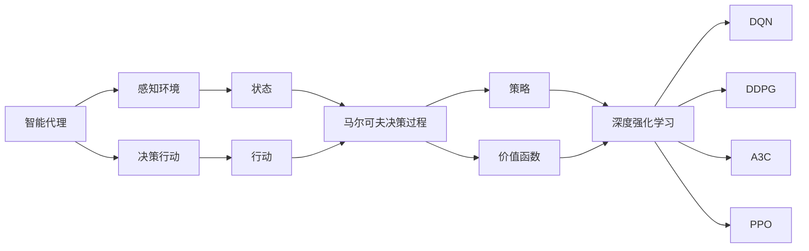

# AI人工智能代理工作流AI Agent WorkFlow：AI代理的深度强化学习策略

## 1. 背景介绍

在当今的人工智能领域,智能代理(Intelligent Agent)正在扮演越来越重要的角色。智能代理是一种能够感知环境,并根据环境做出自主决策和行动的人工智能系统。它们广泛应用于各个领域,如自动驾驶、智能助理、推荐系统、自动化运维等。

智能代理的核心是决策和控制,即如何根据当前的环境状态,选择最优的行动策略,以实现特定的目标。传统的方法主要是基于规则或者搜索的方式,但在面对复杂的现实环境时,这些方法往往难以应对。近年来,随着深度学习和强化学习的发展,使用深度强化学习来训练智能代理,成为了一个新的研究热点。

本文将重点探讨如何使用深度强化学习来构建智能代理的工作流,介绍相关的核心概念、算法原理、数学模型,并给出具体的代码实例和应用场景。通过本文的学习,读者可以对智能代理的深度强化学习策略有一个全面而深入的认识。

## 2. 核心概念与联系

要理解智能代理的深度强化学习策略,首先需要了解几个核心概念:

### 2.1 智能代理(Intelligent Agent)

智能代理是一个可以感知环境并采取行动的自主实体。它具有以下特点:

- 感知能力:能够通过传感器接收环境信息
- 决策能力:能够根据环境信息和自身状态做出决策
- 执行能力:能够通过执行器影响环境

智能代理可以是软件程序(如聊天机器人),也可以是硬件设备(如机器人)。

### 2.2 马尔可夫决策过程(Markov Decision Process, MDP)  

马尔可夫决策过程是智能代理问题的标准数学形式化表示。一个MDP由以下元素组成:

- 状态集合 $\mathcal{S}$:代表智能体所处的所有可能状态
- 行动集合 $\mathcal{A}$:代表智能体在每个状态下可以采取的所有可能行动
- 转移概率 $\mathcal{P}$:$\mathcal{P}(s'|s,a)$代表在状态$s$下采取行动$a$后转移到状态$s'$的概率 
- 奖励函数 $\mathcal{R}$:$\mathcal{R}(s,a)$代表智能体在状态$s$下采取行动$a$后获得的即时奖励

MDP描述了智能代理与环境的交互过程:代理根据当前状态选择一个行动,环境根据当前状态和代理选择的行动给出下一个状态和即时奖励,代理再根据新的状态选择行动,周而复始。

### 2.3 策略(Policy)

策略定义了智能代理的行为,即在每个状态下应该采取什么行动。用数学语言描述,策略是从状态到行动的映射:
$$\pi: \mathcal{S} \to \mathcal{A}$$

确定性策略对每个状态只定义一个行动,而随机性策略对每个状态定义一个行动的概率分布。

### 2.4 价值函数(Value Function)

价值函数定义了每个状态或状态-行动对的长期价值,即从当前状态(和行动)开始,按照给定策略与环境交互所能获得的累积期望奖励。
状态价值函数:
$$V^\pi(s)=\mathbb{E}[\sum_{t=0}^{\infty} \gamma^t R(s_t,\pi(s_t))|s_0=s]$$

状态-行动价值函数(Q函数):
$$Q^\pi(s,a)=\mathbb{E}[\sum_{t=0}^{\infty} \gamma^t R(s_t,a_t)|s_0=s,a_0=a]$$

其中,$\gamma \in [0,1]$为折扣因子,用于控制未来奖励的重要程度。

### 2.5 深度强化学习(Deep Reinforcement Learning, DRL)

深度强化学习将深度学习与强化学习相结合,使用深度神经网络来逼近策略函数或价值函数,从而让智能代理学习到更加复杂和抽象的决策策略。

常见的DRL算法包括:

- DQN(Deep Q-Network):使用深度神经网络逼近Q函数
- DDPG(Deep Deterministic Policy Gradient):使用Actor-Critic框架,Actor网络输出确定性策略,Critic网络逼近Q函数 
- A3C(Asynchronous Advantage Actor-Critic):多个并行的Actor-Critic代理异步训练
- PPO(Proximal Policy Optimization):通过限制策略更新幅度来提高训练稳定性

下图展示了这些核心概念之间的关系:

## 3. 核心算法原理具体操作步骤

本节将详细介绍几种主要的深度强化学习算法的核心原理和具体操作步骤。

### 3.1 DQN(Deep Q-Network)

DQN算法使用深度神经网络来逼近Q函数。其主要思想是:将Q函数表示为一个深度神经网络$Q(s,a;\theta)$,输入为状态$s$和行动$a$,输出为对应的Q值。通过最小化TD误差来训练该神经网络:

$$L(\theta)=\mathbb{E}_{(s,a,r,s')\sim \mathcal{D}}[(r+\gamma \max_{a'}Q(s',a';\theta^-)-Q(s,a;\theta))^2]$$

其中,$\mathcal{D}$为经验回放缓冲区,用于存储智能体与环境交互的轨迹$(s,a,r,s')$;$\theta^-$为目标网络的参数,用于计算TD目标值,每隔一段时间从在线网络复制得到。

DQN算法的具体操作步骤如下:

1. 初始化在线Q网络$Q(s,a;\theta)$和目标Q网络$Q(s,a;\theta^-)$,经验回放缓冲区$\mathcal{D}$ 

2. 对每个episode循环:
   
   1. 初始化初始状态$s_0$
   
   2. 对每个时间步$t$循环:
      
      1. 根据$\epsilon$-贪心策略选择行动$a_t$:以$\epsilon$的概率随机选择行动,否则选择$a_t=\arg\max_a Q(s_t,a;\theta)$
      
      2. 执行行动$a_t$,观察奖励$r_t$和下一状态$s_{t+1}$
      
      3. 将转移样本$(s_t,a_t,r_t,s_{t+1})$存入$\mathcal{D}$
      
      4. 从$\mathcal{D}$中随机采样一个批量的转移样本$(s,a,r,s')$
      
      5. 计算TD目标值$y=r+\gamma \max_{a'}Q(s',a';\theta^-)$
      
      6. 通过最小化损失$L(\theta)=(y-Q(s,a;\theta))^2$来更新在线Q网络
      
      7. 每隔一段时间将在线Q网络的参数复制给目标Q网络:$\theta^-=\theta$
   
   3. 如果满足终止条件(如达到最大步数或终止状态),则结束episode

### 3.2 DDPG(Deep Deterministic Policy Gradient)

DDPG算法使用Actor-Critic框架,Actor网络$\mu(s;\theta^\mu)$输出确定性策略(行动),Critic网络$Q(s,a;\theta^Q)$逼近Q函数。DDPG通过最大化期望Q值来更新Actor网络:

$$\nabla_{\theta^\mu} J \approx \mathbb{E}_{s\sim \mathcal{D}}[\nabla_{\theta^\mu}\mu(s;\theta^\mu)|_{s=s_t}\nabla_a Q(s,a;\theta^Q)|_{s=s_t,a=\mu(s_t;\theta^\mu)}]$$

Critic网络的更新与DQN类似,只是TD目标值变为:

$$y=r+\gamma Q(s',\mu(s';\theta^{\mu-});\theta^{Q-})$$

DDPG算法的具体操作步骤与DQN类似,主要区别在于:

1. 使用Actor网络选择行动,而不是 $\epsilon$-贪心
2. Actor和Critic各自维护一个在线网络和目标网络
3. Actor根据确定性策略梯度更新,Critic根据TD误差更新

### 3.3 A3C(Asynchronous Advantage Actor-Critic)

A3C算法使用多个并行的Actor-Critic代理进行异步训练。每个代理与环境独立交互,并周期性地将梯度更新发送给一个中央的参数服务器进行汇总。

对于每个Actor-Critic代理,Actor网络$\pi(a|s;\theta)$输出状态$s$下采取行动$a$的概率,Critic网络$V(s;\theta_v)$逼近状态价值函数。Actor根据策略梯度更新:

$$\nabla_\theta \log \pi(a_t|s_t;\theta)(R_t-V(s_t;\theta_v))$$

其中,$R_t=\sum_{k=0}^{T-t} \gamma^k r_{t+k}$为蒙特卡洛返回,用于估计Q值。

Critic网络根据TD误差更新:

$$\nabla_{\theta_v} (R_t-V(s_t;\theta_v))^2$$

A3C算法的异步更新框架大大提高了训练效率和稳定性。

### 3.4 PPO(Proximal Policy Optimization)

PPO算法通过限制策略更新幅度来提高训练稳定性。其优化目标为:

$$\mathcal{L}^{CLIP}(\theta)=\hat{\mathbb{E}}_t[\min(r_t(\theta)\hat{A}_t,\text{clip}(r_t(\theta),1-\epsilon,1+\epsilon)\hat{A}_t)]$$

其中,$r_t(\theta)=\frac{\pi_\theta(a_t|s_t)}{\pi_{\theta_{old}}(a_t|s_t)}$为概率比,$\hat{A}_t$为优势函数的估计,$\epsilon$为超参数,用于控制策略更新幅度。

PPO算法的具体操作步骤如下:

1. 初始化策略网络$\pi_\theta$和价值网络$V_\phi$

2. 对每个迭代循环:
   
   1. 使用当前策略与环境交互,收集一批轨迹数据
   
   2. 计算优势函数估计$\hat{A}_t$
   
   3. 通过最大化$\mathcal{L}^{CLIP}(\theta)$来更新策略网络若干epoch
   
   4. 通过最小化值函数误差$\mathcal{L}^{VF}(\phi)=\frac{1}{2}(V_\phi(s_t)-R_t)^2$来更新价值网络若干epoch

相比于传统的策略梯度算法,PPO通过裁剪概率比来避免策略更新过大,从而提高了训练稳定性和样本利用效率。

## 4. 数学模型和公式详细讲解举例说明

本节将详细讲解几个关键的数学模型和公式,并给出具体的例子说明。

### 4.1 马尔可夫决策过程(MDP)

马尔可夫决策过程可以用一个四元组$(\mathcal{S},\mathcal{A},\mathcal{P},\mathcal{R})$来表示:

- 状态空间$\mathcal{S}$:所有可能的状态集合
- 行动空间$\mathcal{A}$:所有可能的行动集合
- 转移概率$\mathcal{P}$:$\mathcal{P}(s'|s,a)$表示在状态$s$下采取行动$a$后转移到状态$s'$的概率
- 奖励函数$\mathcal{R}$:$\mathcal{R}(s,a)$表示在状态$s$下采取行动$a$后获得的即时奖励

举例说明:考虑一个简单的网格世界环境,智能体的目标是从起点走到终点。

- 状态:网格中的每个位置都是一个状态,如(0,0),(0,1)等
- 行动:智能体在每个位置可以选择上下左右四个行动
- 转移概率:执行一个行动后,智能体会确定性地转移到相邻