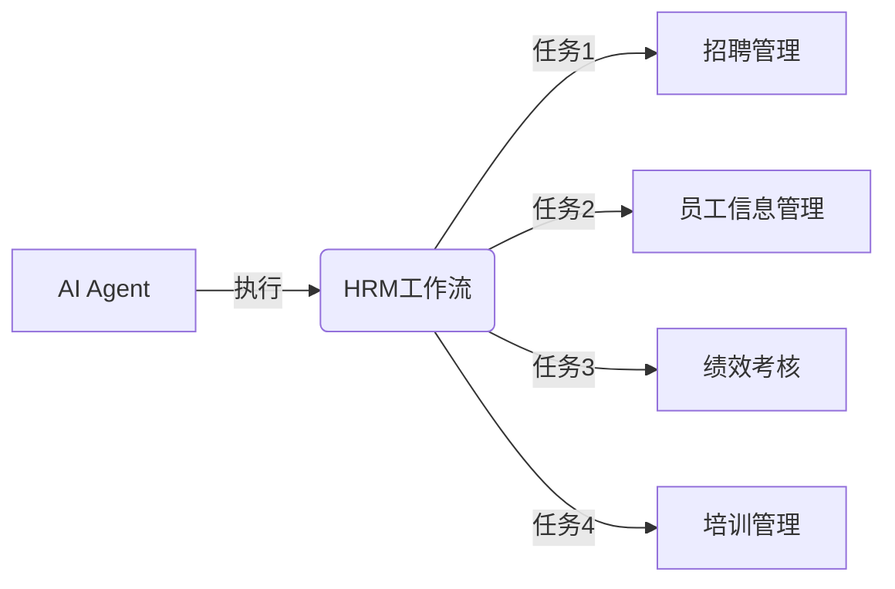
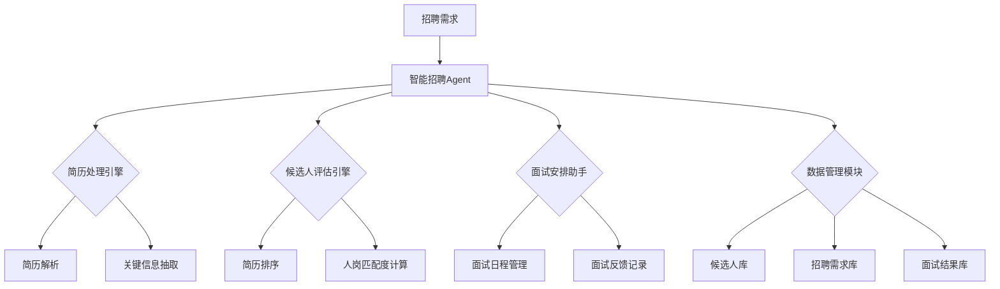

# AI人工智能代理工作流AI Agent WorkFlow：智能代理在人力资源管理系统中的应用

## 1. 背景介绍

人工智能(Artificial Intelligence, AI)技术的快速发展正在深刻影响和改变着各行各业。将AI技术应用到企业的人力资源管理系统中,可以大大提高HR的工作效率,优化人才管理流程。本文将探讨如何利用AI智能代理(Agent)技术构建高效的人力资源管理工作流,实现HR业务流程的自动化和智能化。

### 1.1 人力资源管理面临的挑战

- 招聘效率低,筛选简历耗时耗力
- 员工信息管理复杂,数据分散
- 绩效考核流程繁琐,缺乏客观性
- 培训管理不系统,缺乏个性化

### 1.2 AI智能代理的优势

- 自动化处理海量简历,提高筛选效率
- 智能整合员工信息,优化数据管理
- 客观公正评估绩效,简化考核流程 
- 个性化推荐培训资源,促进员工发展

### 1.3 AI Agent在HR领域的应用现状

- 智能招聘系统:如海康威视、京东等
- 员工画像与人才管理:如微软、IBM等
- 智能绩效考核:如华为、阿里巴巴等
- 个性化培训平台:如LinkedIn Learning等

## 2. 核心概念与联系

要构建AI驱动的人力资源管理工作流,需要理解以下几个核心概念:

### 2.1 AI智能代理(AI Agent)

AI Agent是一种能感知环境,根据设定目标自主行动,完成特定任务的人工智能系统。它具备学习、推理、规划等智能能力,可以代替人执行复杂任务。

### 2.2 工作流(Workflow)

工作流是将某个业务流程中的各项任务按照一定的规则和顺序进行组织,使其自动化进行的过程。工作流管理系统可以定义、执行并监控工作流。

### 2.3 人力资源管理(HRM)

人力资源管理是企业进行人力资源规划、招聘配置、培训开发、绩效管理、薪酬管理等一系列活动,以实现人力资源的合理利用和开发。

### 2.4 各概念之间的联系

AI Agent可以作为人力资源管理工作流的执行主体,通过感知HR数据,根据预设规则自动执行各项任务,从而实现HRM工作流的自动化和智能化。



## 3. 核心算法原理与操作步骤

构建AI Agent驱动的HRM工作流,需要用到以下几类核心算法:

### 3.1 自然语言处理(NLP)算法

- 简历信息抽取:使用命名实体识别、关键词提取等技术,从非结构化简历中提取结构化信息
- 语义分析与匹配:通过词向量、语义相似度计算等方法,分析岗位描述与候选人简历的匹配度

#### 3.1.1 基于规则的NLP处理步骤

1. 简历预处理:去除无用信息,分段落,分句子,分词
2. 定义抽取规则:正则表达式、字典匹配等方法定义抽取目标信息的规则
3. 信息抽取:用规则匹配简历文本,抽取关键信息
4. 后处理:对提取结果进行去重、格式化、数据清洗,得到结构化信息

#### 3.1.2 基于深度学习的NLP处理步骤

1. 构建训练语料:收集大量岗位描述和简历样本,人工标注关键信息 
2. 词向量训练:用Word2Vec等模型训练岗位、技能等领域词向量
3. 搭建神经网络:选择合适的神经网络结构,如CNN、LSTM、BERT等
4. 模型训练:输入岗位描述和简历文本,输出关键信息标签,进行端到端训练
5. 模型应用:用训练好的模型对新简历进行信息抽取和语义匹配

### 3.2 知识图谱(Knowledge Graph)技术

- 构建企业人才知识图谱:定义人才领域本体,设计HR知识的Schema,建立员工、岗位、部门等实体之间的语义关联
- 基于图的数据管理与查询:将分散的HR数据映射到知识图谱中,支持复杂的图语义查询与分析

#### 3.2.1 HR知识图谱构建步骤

1. 定义本体和Schema:分析HR领域需求,定义核心概念(如员工、部门、岗位等)及其属性和关系
2. 数据采集与处理:收集员工信息、组织架构、岗位说明书等结构化、非结构化数据,进行清洗转换
3. 实体抽取与链接:从处理后的数据中识别实体,并与本体概念进行链接映射
4. 图谱存储:选择图数据库(如Neo4j、JanusGraph等)存储构建好的HR知识图谱
5. 语义查询与分析:用Cypher、Gremlin等图查询语言实现灵活的语义查询与分析

### 3.3 机器学习算法 

- 智能简历筛选:训练简历排序模型,基于岗位要求和简历内容特征自动对候选人进行评分排序
- 员工画像与人才盘点:应用聚类、关联分析等算法,自动生成员工画像,挖掘员工专长、发现人才

#### 3.3.1 排序模型训练步骤

1. 特征工程:提取简历文本特征(如关键词、工作经历等)和元数据特征(如学历、年限等),对特征进行选择和转换
2. 样本构建:收集历史简历评估数据,生成正负样本
3. 模型选择:根据排序需求选择合适的机器学习模型,如RankNet、LambdaMART等
4. 模型训练:输入排序特征,拟合样本标签,进行参数学习
5. 模型评估:用NDCG等排序指标评估模型效果,并调优

#### 3.3.2 无监督学习应用步骤

1. 数据预处理:对员工各维度指标数据进行清洗、缺失值处理、归一化等
2. 算法选择:根据数据特点和分析目标,选择合适的聚类算法,如K-Means、DBSCAN等
3. 参数调优:尝试不同的参数组合,如聚类数K值、距离阈值等,对聚类效果进行评估
4. 结果解释:对聚类结果进行可视化展示,分析各类员工的特点,并与业务场景结合解读
5. 应用拓展:在员工画像的基础上,进行人才盘点、组织优化等管理应用

### 3.4 优化算法

- 排班优化:应用整数规划、启发式搜索等算法,在满足员工偏好、技能要求等约束条件下,自动生成最优排班方案
- 组织优化:建立组织架构与人员的数学模型,求解组织优化目标,如人力成本最小化、人岗匹配度最大化等

#### 3.4.1 排班优化求解步骤

1. 定义决策变量:定义员工、日期、班次等维度的排班变量,如 $x_{ijk}$ 表示员工i在日期j值班次k的排班
2. 定义约束条件:根据法律法规、员工偏好、技能要求等,定义排班的硬约束和软约束,如每人每周最多工作5天、每班次需要至少1名熟练工等
3. 定义目标函数:数学化描述排班优化目标,如最小化用工成本、最大化员工满意度等
4. 求解模型:选择合适的优化算法进行求解,如混合整数规划、遗传算法等
5. 结果分析:对求解结果进行可视化展示,分析排班方案的可行性和优化效果,并支持人工调整

#### 3.4.2 组织优化建模步骤

1. 定义优化目标:如最小化组织人力成本,最大化人岗匹配度等
2. 定义决策变量:如 $y_{ij}$ 表示员工i是否分配到岗位j
3. 定义约束条件:如每个员工只能分配一个岗位,每个岗位至少需要一名员工等
4. 定义目标函数:如 $min \sum_i \sum_j c_{ij}y_{ij}$,其中 $c_{ij}$ 为员工i担任岗位j的人力成本
5. 求解模型:应用运筹优化、元启发式算法等进行求解
6. 生成组织方案:根据模型求解结果,生成优化后的组织架构与人员分配方案

## 4. 数学模型与公式详解

### 4.1 排班优化模型

**目标函数**:

$$
\min \sum_i \sum_j \sum_k c_{ijk}x_{ijk}
$$

- $x_{ijk}$:员工i在日期j值班次k的排班,取值为0或1
- $c_{ijk}$:员工i在日期j值班次k的成本

**约束条件**:

1. 每个员工每天只能排一个班次:

$$
\sum_k x_{ijk} \leq 1, \forall i,j
$$

2. 每个班次每天需要固定数量员工:

$$
\sum_i x_{ijk} = R_{jk}, \forall j,k
$$

- $R_{jk}$:在日期j班次k需要的员工数

3. 员工i在日期j排班次k需满足技能要求:

$$
\sum_l y_{ijkl} \geq x_{ijk}, \forall i,j,k
$$

- $y_{ijkl}$:员工i是否具备日期j班次k所需技能l,取值为0或1

4. 其他约束:如员工偏好、法定工时等

### 4.2 组织优化模型 

**目标函数**:

$$
\max \sum_i \sum_j m_{ij}y_{ij} - \sum_i \sum_j c_{ij}y_{ij}
$$

- $y_{ij}$:员工i是否分配到岗位j,取值为0或1
- $m_{ij}$:员工i与岗位j的匹配度
- $c_{ij}$:员工i担任岗位j的人力成本

**约束条件**:

1. 每个员工只能分配一个岗位:

$$
\sum_j y_{ij} \leq 1, \forall i
$$

2. 每个岗位至少分配一名员工:

$$
\sum_i y_{ij} \geq 1, \forall j
$$

3. 员工i的能力需匹配岗位j的要求:

$$
\sum_k x_{ik} \geq \sum_k z_{jk}y_{ij}, \forall i,j
$$

- $x_{ik}$:员工i是否具备能力k,取值为0或1
- $z_{jk}$:岗位j是否需要能力k,取值为0或1

4. 其他约束:如组织架构限制等

## 5. 项目实践:AI Agent系统设计与实现

下面以智能招聘场景为例,介绍AI Agent在HRM工作流中的应用实践。

### 5.1 系统架构设计



### 5.2 简历处理流程

```python
# 简历解析
def parse_resume(resume_file):
  # 读取简历文件,转换为文本格式
  resume_text = pdf_to_text(resume_file)
  # 对简历文本进行预处理,如分段落、分句子、分词
  resume_processed = preprocess(resume_text)
  return resume_processed

# 关键信息抽取 
def extract_info(resume_processed):
  # 定义抽取规则,如正则表达式、字典匹配等
  rules = define_extract_rules()
  # 对简历文本应用抽取规则
  info_extracted = apply_rules(resume