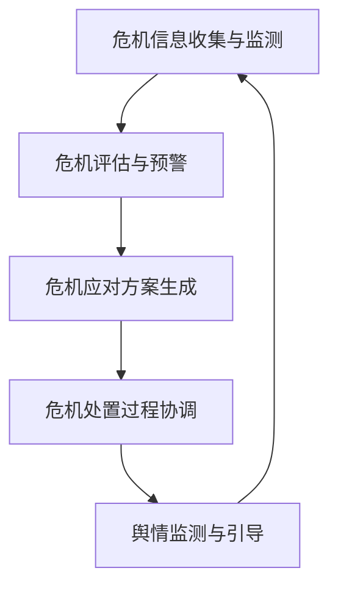

# AI人工智能代理工作流AI Agent WorkFlow：智能代理在公关危机管理系统中的应用

## 1. 背景介绍
### 1.1 公关危机管理的重要性
在当今瞬息万变的商业环境中,企业面临着各种各样的公关危机。这些危机可能源于产品质量问题、管理不善、员工不当行为等多方面因素,如果处理不当,可能会给企业带来巨大的声誉和经济损失。因此,建立一个高效、智能的公关危机管理系统对于企业的长期发展至关重要。

### 1.2 人工智能在公关危机管理中的应用前景
近年来,人工智能技术的飞速发展为公关危机管理提供了新的思路和方法。通过引入智能代理(Intelligent Agent)、机器学习、自然语言处理等AI技术,可以实现对公关危机的早期预警、快速响应和智能决策,大大提高危机管理的效率和效果。

### 1.3 本文的研究目的和意义
本文旨在探讨如何将AI人工智能代理工作流(AI Agent Workflow)应用于公关危机管理系统,构建一个智能、高效、全面的危机管理解决方案。通过系统地阐述智能代理的核心概念、算法原理、数学模型以及在危机管理中的具体应用,为相关领域的研究和实践提供参考和启示。

## 2. 核心概念与联系
### 2.1 智能代理(Intelligent Agent)的定义和特征
智能代理是一种能够感知环境、做出决策并采取行动以实现特定目标的自主实体。它具有以下主要特征:
- 自主性(Autonomy):能够独立地感知环境,并根据自身的知识和目标做出决策和行动。
- 社会性(Social Ability):能够与其他代理或人类进行交互和协作,以完成任务或解决问题。  
- 反应性(Reactivity):能够及时地感知环境的变化,并做出相应的反应和调整。
- 主动性(Proactiveness):能够主动地采取行动,以实现预定的目标或任务。

### 2.2 AI Agent Workflow的概念和组成
AI Agent Workflow是一种基于智能代理的工作流程,它通过多个智能代理的协作和交互,实现复杂任务的自动化和智能化处理。一个典型的AI Agent Workflow包括以下主要组成部分:
- 任务分解(Task Decomposition):将复杂任务分解为多个子任务,并分配给不同的智能代理执行。
- 代理协作(Agent Collaboration):多个智能代理通过通信和协商,协调各自的行动,以完成整个任务。
- 工作流控制(Workflow Control):对整个工作流程进行监控和管理,确保任务的正确执行和异常处理。
- 知识管理(Knowledge Management):对智能代理的知识进行表示、存储和更新,支持代理的推理和决策。

### 2.3 智能代理与公关危机管理的关系
在公关危机管理中,智能代理可以扮演多个重要角色:
- 信息收集与监测:通过对网络舆情、媒体报道等信息的实时监测和分析,及早发现潜在的危机信号。
- 危机评估与预警:根据收集到的信息,评估危机的严重程度和影响范围,并及时向相关人员发出预警。
- 危机应对方案生成:利用知识库和推理能力,自动生成危机应对方案,供决策者参考。
- 危机处置过程协调:协调多个部门和人员的危机处置行动,确保快速、有序、一致的响应。
- 舆情监测与引导:持续监测危机事件的舆情走向,并采取措施引导舆论,维护企业形象。

下图展示了智能代理在公关危机管理系统中的典型工作流程:



## 3. 核心算法原理具体操作步骤
### 3.1 智能代理的BDI模型
BDI(Belief-Desire-Intention)模型是一种广泛应用于智能代理设计的理论模型。它将代理的内部状态分为三个主要部分:
- 信念(Belief):代理对环境状态的认知和理解。
- 欲望(Desire):代理希望达到的目标状态。
- 意图(Intention):代理为实现目标而采取的行动计划。

基于BDI模型,智能代理的决策过程可以分为以下几个步骤:
1. 感知环境,更新信念。
2. 根据当前信念和欲望,生成可能的意图。
3. 从可能的意图中选择一个作为当前意图。
4. 根据当前意图,执行相应的行动。
5. 评估行动结果,更新信念,并重复上述过程。

### 3.2 基于规则的推理
基于规则的推理是智能代理常用的一种决策方法。它通过一组预定义的规则,根据当前的环境状态和代理的知识,推导出应该采取的行动。一个典型的规则可以表示为:

```
IF <condition> THEN <action>
```

其中,`<condition>`表示规则的触发条件,`<action>`表示满足条件时应该执行的行动。

在公关危机管理中,可以定义一组危机应对规则,例如:

```
IF <危机级别=高> AND <舆情走向=负面> THEN <启动应急预案>
IF <危机级别=中> AND <舆情走向=中性> THEN <密切关注动向>
IF <危机级别=低> AND <舆情走向=正面> THEN <定期跟进评估>
```

智能代理可以根据这些规则,结合实时收集的危机信息,快速做出相应的决策和行动。

### 3.3 基于案例的推理
基于案例的推理(Case-Based Reasoning, CBR)是另一种常用的智能代理决策方法。它通过对历史案例的分析和利用,解决新的问题。CBR的基本思想是:对于一个新的问题,找到与之最相似的历史案例,并参考该案例的解决方案,经过适当调整后,应用于新问题的解决。

CBR的主要步骤包括:
1. 检索(Retrieve):根据新问题的特征,从案例库中检索出最相似的历史案例。
2. 复用(Reuse):参考检索到的案例解决方案,对新问题进行求解。
3. 修正(Revise):根据新问题的实际情况,对复用的解决方案进行必要的调整和修正。
4. 保留(Retain):将修正后的解决方案作为一个新的案例,存入案例库,供未来使用。

在公关危机管理中,可以建立一个危机案例库,存储企业历史上遇到的各种危机事件及其处置方案和效果。当面临新的危机时,智能代理可以快速检索出相似案例,并参考其处置经验,制定出更加有针对性和有效的应对策略。

## 4. 数学模型和公式详细讲解举例说明
### 4.1 危机评估模型
为了对潜在的公关危机进行量化评估,可以建立一个危机评估模型。该模型综合考虑危机的多个关键因素,计算出一个危机严重程度的量化指标。

设危机事件为 $C$,其严重程度为 $S(C)$,影响因素包括:
- 危机级别 $L(C)$:表示危机的严重程度,可分为高、中、低三个等级,分别赋值为3、2、1。
- 舆情走向 $T(C)$:表示与危机相关的舆论导向,可分为正面、中性、负面三种情况,分别赋值为1、2、3。
- 传播范围 $R(C)$:表示危机信息的传播范围,可用受众人数来度量,取值范围为[0,1]。
- 持续时间 $D(C)$:表示危机事件的持续时间,以天为单位。

则危机C的严重程度可以表示为:

$$
S(C) = w_1 \times L(C) + w_2 \times T(C) + w_3 \times R(C) + w_4 \times D(C)
$$

其中,$w_1,w_2,w_3,w_4$为各个因素的权重系数,满足:

$$
w_1 + w_2 + w_3 + w_4 = 1
$$

通过合理设置权重系数,可以得到一个综合考虑各因素的危机严重程度评估值。例如,对于一个危机事件C,其相关参数为:
- $L(C)=3$ (高危机级别)
- $T(C)=2$ (中性舆情走向)  
- $R(C)=0.6$ (传播范围为60%)
- $D(C)=5$ (持续时间为5天)

假设权重系数设置为:
- $w_1=0.4$
- $w_2=0.3$
- $w_3=0.2$
- $w_4=0.1$

则该危机事件的严重程度为:

$$
S(C) = 0.4 \times 3 + 0.3 \times 2 + 0.2 \times 0.6 + 0.1 \times 5 = 2.42
$$

根据严重程度的高低,智能代理可以采取相应的危机应对措施。

### 4.2 案例相似度计算
在基于案例的推理中,案例相似度的计算是一个关键问题。它决定了如何从历史案例库中检索出与当前问题最相似的案例。

设当前问题为 $P$,历史案例为 $C$,它们都由 $n$ 个特征属性描述:

$$
P = (p_1,p_2,...,p_n)
$$
$$
C = (c_1,c_2,...,c_n)
$$

其中,$p_i$和$c_i$分别表示问题P和案例C在第i个属性上的取值。

为了计算P和C之间的相似度,可以使用加权欧几里得距离公式:

$$
sim(P,C) = \frac{1}{1+\sqrt{\sum_{i=1}^{n} w_i(p_i-c_i)^2}}
$$

其中,$w_i$表示第i个属性的权重,满足:

$$
\sum_{i=1}^{n} w_i = 1
$$

$sim(P,C)$的取值范围为[0,1],值越大表示问题P和案例C越相似。

例如,假设问题P和案例C都由3个属性描述:
- $p_1=3,p_2=2,p_3=5$
- $c_1=4,c_2=2,c_3=4$

属性权重设置为:
- $w_1=0.5,w_2=0.3,w_3=0.2$

则P和C之间的相似度为:

$$
sim(P,C) = \frac{1}{1+\sqrt{0.5(3-4)^2+0.3(2-2)^2+0.2(5-4)^2}} = 0.85
$$

根据计算出的相似度,智能代理可以从历史案例库中选择最相似的案例,作为解决当前问题的参考。

## 5. 项目实践：代码实例和详细解释说明
下面通过一个简单的Python代码实例,演示如何实现基于规则的智能代理决策。

```python
class CrisisAgent:
    def __init__(self):
        self.rules = [
            ('高', '负面', '启动应急预案'),
            ('中', '中性', '密切关注动向'),
            ('低', '正面', '定期跟进评估')
        ]
        
    def make_decision(self, level, sentiment):
        for rule in self.rules:
            if rule[0] == level and rule[1] == sentiment:
                return rule[2]
        return '继续监测'

# 创建一个智能代理实例
agent = CrisisAgent()

# 模拟输入危机级别和舆情走向
crisis_level = '高'
sentiment_trend = '负面'

# 智能代理做出决策
decision = agent.make_decision(crisis_level, sentiment_trend)

print(f'危机级别: {crisis_level}, 舆情走向: {sentiment_trend}')
print(f'智能代理决策: {decision}')
```

代码解释:
1. 定义了一个`CrisisAgent`类,表示危机管理智能代理。
2. 在`__init__`方法中,定义了一组危机应对规则,每个规则由(危机级别,舆情走向,应对措施)三个元素组成。
3. `make_decision`方法接受危机级别和舆情走向作为输入,根据预定义的规则,返回相应的应对措施。如果没有匹配的