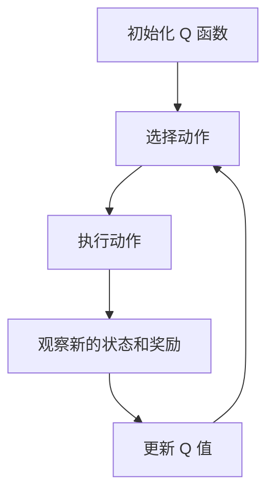

# AI人工智能核心算法原理与代码实例讲解：Q-learning

## 1.背景介绍

在人工智能领域，强化学习（Reinforcement Learning, RL）是一种重要的机器学习方法。它通过与环境的交互来学习策略，以最大化累积奖励。Q-learning 是一种无模型的强化学习算法，因其简单有效而广泛应用于各种领域，如机器人控制、游戏AI、自动驾驶等。

Q-learning 的核心思想是通过学习一个 Q 函数来估计每个状态-动作对的价值，从而指导智能体选择最优动作。本文将深入探讨 Q-learning 的核心概念、算法原理、数学模型，并通过代码实例详细解释其实现过程。

## 2.核心概念与联系

### 2.1 强化学习基本概念

在强化学习中，智能体（Agent）通过与环境（Environment）的交互来学习策略（Policy），以最大化累积奖励（Reward）。这一过程可以用马尔可夫决策过程（Markov Decision Process, MDP）来建模，MDP 由以下五元组组成：

- 状态空间 \( S \)
- 动作空间 \( A \)
- 状态转移概率 \( P(s'|s,a) \)
- 奖励函数 \( R(s,a) \)
- 折扣因子 \( \gamma \)

### 2.2 Q-learning 的基本概念

Q-learning 是一种基于值函数的强化学习方法，其核心是学习一个 Q 函数 \( Q(s,a) \)，表示在状态 \( s \) 下执行动作 \( a \) 的预期累积奖励。Q-learning 的目标是找到最优 Q 函数 \( Q^*(s,a) \)，从而确定最优策略 \( \pi^*(s) \)。

### 2.3 Q-learning 与其他强化学习方法的联系

Q-learning 是一种无模型的强化学习方法，不需要知道环境的状态转移概率和奖励函数。与策略梯度方法不同，Q-learning 直接学习值函数，而不是策略。与 SARSA 等其他值函数方法相比，Q-learning 使用最大化的未来奖励来更新 Q 值，从而具有更强的探索能力。

## 3.核心算法原理具体操作步骤

Q-learning 的核心算法可以分为以下几个步骤：

### 3.1 初始化

初始化 Q 函数 \( Q(s,a) \) 为任意值（通常为零），并设置学习率 \( \alpha \) 和折扣因子 \( \gamma \)。

### 3.2 选择动作

在每个时间步 \( t \)，根据当前状态 \( s_t \) 选择动作 \( a_t \)。常用的策略包括 ε-贪婪策略（ε-greedy），即以概率 \( \epsilon \) 随机选择动作，以概率 \( 1-\epsilon \) 选择当前 Q 值最大的动作。

### 3.3 执行动作

执行动作 \( a_t \)，观察新的状态 \( s_{t+1} \) 和奖励 \( r_t \)。

### 3.4 更新 Q 值

根据以下公式更新 Q 值：

$$
Q(s_t, a_t) \leftarrow Q(s_t, a_t) + \alpha \left[ r_t + \gamma \max_{a'} Q(s_{t+1}, a') - Q(s_t, a_t) \right]
$$

### 3.5 重复

重复步骤 3.2 至 3.4，直到满足终止条件（如达到最大迭代次数或收敛）。

以下是 Q-learning 算法的 Mermaid 流程图：



## 4.数学模型和公式详细讲解举例说明

### 4.1 Q 函数的定义

Q 函数 \( Q(s,a) \) 表示在状态 \( s \) 下执行动作 \( a \) 的预期累积奖励。其数学定义为：

$$
Q(s,a) = \mathbb{E} \left[ \sum_{t=0}^{\infty} \gamma^t r_t \mid s_0 = s, a_0 = a \right]
$$

### 4.2 贝尔曼方程

Q-learning 的核心是贝尔曼方程（Bellman Equation），其递归形式为：

$$
Q(s,a) = \mathbb{E} \left[ r + \gamma \max_{a'} Q(s',a') \mid s, a \right]
$$

### 4.3 Q-learning 更新公式

Q-learning 通过以下更新公式来迭代逼近最优 Q 函数：

$$
Q(s_t, a_t) \leftarrow Q(s_t, a_t) + \alpha \left[ r_t + \gamma \max_{a'} Q(s_{t+1}, a') - Q(s_t, a_t) \right]
$$

### 4.4 举例说明

假设一个简单的迷宫问题，智能体需要从起点到达终点。状态空间 \( S \) 为迷宫中的所有位置，动作空间 \( A \) 为上下左右四个方向。奖励函数 \( R(s,a) \) 在到达终点时为 1，其他情况下为 0。通过 Q-learning，智能体可以学习到最优路径。

## 5.项目实践：代码实例和详细解释说明

### 5.1 环境设置

首先，我们需要设置一个简单的环境。这里我们使用 OpenAI Gym 提供的 FrozenLake 环境。

```python
import gym
import numpy as np

env = gym.make('FrozenLake-v0')
```

### 5.2 Q-learning 算法实现

接下来，我们实现 Q-learning 算法。

```python
# 初始化参数
alpha = 0.1
gamma = 0.99
epsilon = 0.1
num_episodes = 1000

# 初始化 Q 表
Q = np.zeros((env.observation_space.n, env.action_space.n))

# Q-learning 算法
for episode in range(num_episodes):
    state = env.reset()
    done = False
    
    while not done:
        # 选择动作
        if np.random.rand() < epsilon:
            action = env.action_space.sample()
        else:
            action = np.argmax(Q[state])
        
        # 执行动作
        next_state, reward, done, _ = env.step(action)
        
        # 更新 Q 值
        Q[state, action] = Q[state, action] + alpha * (reward + gamma * np.max(Q[next_state]) - Q[state, action])
        
        state = next_state
```

### 5.3 结果分析

训练完成后，我们可以测试智能体的表现。

```python
# 测试智能体
num_tests = 100
successes = 0

for _ in range(num_tests):
    state = env.reset()
    done = False
    
    while not done:
        action = np.argmax(Q[state])
        state, reward, done, _ = env.step(action)
        if done and reward == 1:
            successes += 1

print(f'Success rate: {successes / num_tests}')
```

## 6.实际应用场景

Q-learning 在许多实际应用中表现出色，以下是一些典型的应用场景：

### 6.1 游戏AI

Q-learning 被广泛应用于游戏AI中，如经典的 Atari 游戏、围棋、象棋等。通过学习最优策略，智能体可以在复杂的游戏环境中表现出超人的水平。

### 6.2 机器人控制

在机器人控制中，Q-learning 可以帮助机器人学习如何在复杂环境中导航、避障和完成任务。例如，机器人可以通过 Q-learning 学习如何在仓库中搬运货物。

### 6.3 自动驾驶

在自动驾驶领域，Q-learning 可以用于学习最优驾驶策略，如如何在复杂的交通环境中行驶、变道和停车。通过与环境的不断交互，自动驾驶系统可以不断优化其驾驶策略。

### 6.4 金融交易

在金融交易中，Q-learning 可以用于学习最优交易策略，如何时买入、卖出和持有股票。通过不断学习市场的变化，智能交易系统可以实现更高的收益。

## 7.工具和资源推荐

### 7.1 开发工具

- **Python**：Python 是实现 Q-learning 的首选编程语言，具有丰富的库和工具支持。
- **OpenAI Gym**：OpenAI Gym 提供了丰富的强化学习环境，方便我们进行实验和测试。
- **NumPy**：NumPy 是 Python 的一个强大的科学计算库，适用于矩阵运算和数值计算。

### 7.2 学习资源

- **《强化学习：原理与实践》**：这本书详细介绍了强化学习的基本原理和实践方法，是学习 Q-learning 的重要参考。
- **Coursera 强化学习课程**：Coursera 提供了许多高质量的强化学习课程，适合初学者和进阶学习者。
- **OpenAI 文档**：OpenAI 提供了详细的文档和教程，帮助我们更好地理解和使用其工具。

## 8.总结：未来发展趋势与挑战

### 8.1 未来发展趋势

随着人工智能技术的不断发展，Q-learning 及其变种算法将在更多领域得到应用。以下是一些未来的发展趋势：

- **深度 Q-learning**：结合深度学习和 Q-learning 的深度 Q-learning（DQN）将进一步提升智能体在复杂环境中的表现。
- **多智能体强化学习**：研究多个智能体之间的协作和竞争，将推动 Q-learning 在多智能体系统中的应用。
- **自适应 Q-learning**：开发自适应的 Q-learning 算法，使其能够在动态环境中更快地学习和适应。

### 8.2 挑战

尽管 Q-learning 具有许多优点，但在实际应用中仍面临一些挑战：

- **高维状态空间**：在高维状态空间中，Q-learning 的计算复杂度和存储需求显著增加，需要结合深度学习等方法进行优化。
- **探索与利用的平衡**：如何在探索新策略和利用已有策略之间找到平衡，是 Q-learning 面临的一个重要问题。
- **环境的不确定性**：在动态和不确定的环境中，Q-learning 需要不断调整和优化其策略，以应对环境的变化。

## 9.附录：常见问题与解答

### 9.1 Q-learning 与 SARSA 的区别是什么？

Q-learning 和 SARSA 都是基于值函数的强化学习方法，但它们在更新 Q 值时有所不同。Q-learning 使用最大化的未来奖励来更新 Q 值，而 SARSA 使用实际执行的动作的奖励来更新 Q 值。因此，Q-learning 更具探索性，而 SARSA 更具保守性。

### 9.2 如何选择 Q-learning 的参数？

Q-learning 的参数包括学习率 \( \alpha \)、折扣因子 \( \gamma \) 和探索率 \( \epsilon \)。通常，学习率 \( \alpha \) 取较小值（如 0.1），折扣因子 \( \gamma \) 取接近 1 的值（如 0.99），探索率 \( \epsilon \) 取较小值（如 0.1）。具体参数的选择需要根据具体问题进行调整。

### 9.3 Q-learning 是否适用于连续状态和动作空间？

Q-learning 主要适用于离散状态和动作空间。在连续状态和动作空间中，可以使用近似方法，如深度 Q-learning（DQN）或策略梯度方法。

### 9.4 如何加速 Q-learning 的收敛？

可以通过以下方法加速 Q-learning 的收敛：

- **经验回放**：存储智能体的经验，并在更新 Q 值时随机抽取经验进行训练。
- **目标网络**：使用一个固定的目标网络来计算目标 Q 值，减少更新过程中的波动。
- **优先级经验回放**：根据经验的重要性进行抽样，优先更新重要经验。

### 9.5 Q-learning 是否适用于多智能体系统？

Q-learning 可以扩展到多智能体系统，但需要考虑智能体之间的协作和竞争。可以使用联合 Q-learning 或者独立 Q-learning 等方法来处理多智能体系统中的问题。

---

作者：禅与计算机程序设计艺术 / Zen and the Art of Computer Programming