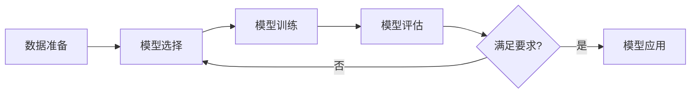

# AI人工智能核心算法原理与代码实例讲解：监督学习

## 1. 背景介绍
### 1.1 人工智能的发展历程
### 1.2 机器学习的兴起 
### 1.3 监督学习在人工智能中的重要地位

## 2. 核心概念与联系
### 2.1 监督学习的定义
监督学习是机器学习的一个分支,其目标是学习一个模型,使模型能够对未知数据做出正确的预测。在监督学习中,训练数据由输入和期望输出组成,也就是每个样本都有正确答案,模型的优化过程就是让模型的预测结果尽可能接近真实答案。

### 2.2 监督学习的分类
#### 2.2.1 回归问题
回归问题是指模型输出的是一个连续值,比如预测房价。常见的回归算法有线性回归、多项式回归、支持向量回归等。

#### 2.2.2 分类问题  
分类问题是指模型输出的是一个离散值,即类别标签,比如判断邮件是否为垃圾邮件。常见的分类算法有逻辑回归、支持向量机、决策树、随机森林、神经网络等。

### 2.3 监督学习与无监督学习、强化学习的区别
- 无监督学习：训练数据没有标签,目标是发现数据的内在结构和规律,如聚类和降维。
- 强化学习：通过智能体与环境的交互,根据反馈的奖励或惩罚来优化模型,如AlphaGo。
- 监督学习：训练数据有明确的标签,目标是学习输入到输出的映射关系。

### 2.4 监督学习的一般流程



## 3. 核心算法原理具体操作步骤
### 3.1 数据预处理
#### 3.1.1 数据清洗
- 处理缺失值：删除或填充(均值、中位数等)
- 处理异常值：删除或替换
- 数据去重

#### 3.1.2 特征工程  
- 特征选择：去除冗余和不相关的特征
- 特征提取：从原始数据中提取有效特征
- 特征编码：将分类变量转为数值

#### 3.1.3 数据集划分
- 训练集：用于训练模型
- 验证集：用于调参和选择模型
- 测试集：用于评估模型的泛化性能

### 3.2 模型训练
#### 3.2.1 线性回归
- 原理：假设输入和输出存在线性关系,求解使损失函数最小的参数
- 损失函数：均方误差(MSE)
- 优化算法：梯度下降法
- 正则化：L1/L2正则化防止过拟合

#### 3.2.2 逻辑回归
- 原理：假设输入和输出满足Sigmoid函数关系,求解使似然函数最大的参数
- 损失函数：交叉熵损失
- 优化算法：梯度下降法 
- 正则化：L1/L2正则化防止过拟合

#### 3.2.3 支持向量机(SVM)
- 原理：寻找最大间隔超平面将不同类别的样本分开
- 损失函数：Hinge Loss
- 核函数：线性核、高斯核(RBF)等
- 优化算法：序列最小优化(SMO)  

#### 3.2.4 决策树
- 原理：通过一系列if-else规则递归地将数据划分到不同的叶子节点
- 划分准则：信息增益、基尼指数
- 剪枝：预剪枝、后剪枝防止过拟合
- 集成学习：Bagging(随机森林)、Boosting(AdaBoost、GBDT)

#### 3.2.5 神经网络(多层感知机)
- 原理：通过多层神经元的连接和非线性变换拟合复杂函数
- 损失函数：均方误差、交叉熵损失
- 激活函数：Sigmoid、Tanh、ReLU等
- 优化算法：随机梯度下降(SGD)及其变种(Momentum、AdaGrad、RMSProp、Adam)
- 正则化：L1/L2正则化、Dropout、早停法

### 3.3 模型评估
#### 3.3.1 回归问题评估指标
- 平均绝对误差(MAE) 
- 均方误差(MSE)
- 均方根误差(RMSE)
- 决定系数(R^2)

#### 3.3.2 分类问题评估指标  
- 准确率(Accuracy)
- 精确率(Precision)
- 召回率(Recall) 
- F1分数
- 混淆矩阵
- ROC曲线和AUC

#### 3.3.3 交叉验证
- 简单交叉验证
- K折交叉验证
- 留一交叉验证

### 3.4 超参数调优
- 网格搜索(Grid Search) 
- 随机搜索(Random Search)
- 贝叶斯优化(Bayesian Optimization)

## 4. 数学模型和公式详细讲解举例说明
### 4.1 线性回归
假设数据集 $D=\{(x_1,y_1),(x_2,y_2),...,(x_N,y_N)\}$,其中 $x_i\in \mathbb{R}^p, y_i\in \mathbb{R}$。线性回归模型假设：

$$y_i = w^Tx_i+b+\epsilon_i$$

其中 $w\in \mathbb{R}^p$ 为权重向量,$b\in \mathbb{R}$ 为偏置项,$\epsilon_i$ 为随机噪声。线性回归的目标是最小化均方误差损失函数：

$$\mathcal{L}(w,b) = \frac{1}{N}\sum_{i=1}^N(y_i-w^Tx_i-b)^2$$

可以求解上式的极小值点得到 $w$ 和 $b$ 的最优解。

### 4.2 逻辑回归
对于二分类问题,逻辑回归模型假设样本的后验概率满足：

$$P(y=1|x) = \frac{1}{1+e^{-(w^Tx+b)}}$$

$$P(y=0|x) = 1-P(y=1|x) = \frac{e^{-(w^Tx+b)}}{1+e^{-(w^Tx+b)}}$$

逻辑回归的目标是最大化似然函数,等价于最小化交叉熵损失：

$$\mathcal{L}(w,b) = -\frac{1}{N}\sum_{i=1}^N[y_i\log(P(y=1|x_i))+(1-y_i)\log(P(y=0|x_i))]$$

### 4.3 支持向量机
支持向量机(SVM)的目标是寻找一个超平面 $w^Tx+b=0$,使得两个类别的样本能够被超平面正确分开,且超平面与最近样本点的距离(即间隔)最大化。SVM的数学模型可以表示为：

$$\min_{w,b} \frac{1}{2}\|w\|^2$$

$$s.t. y_i(w^Tx_i+b) \geq 1, i=1,2,...,N$$

上式可以通过拉格朗日乘子法和对偶技巧求解。引入核函数后,SVM可以处理非线性分类问题。

### 4.4 决策树
决策树通过递归地选择最优划分特征和阈值,将数据集分割成不同的子集,直到子集中的样本属于同一类别或达到预设的停止条件。以分类问题为例,假设当前节点的数据集为 $D$,类别数为 $K$,则按特征 $A$ 的某个值 $a$ 划分的信息增益为：

$$Gain(D,A) = Ent(D) - \sum_{v=1}^V\frac{|D^v|}{|D|}Ent(D^v)$$

其中, $Ent(D)$ 为数据集 $D$ 的信息熵：

$$Ent(D) = -\sum_{k=1}^Kp_k\log p_k$$

$p_k$ 为 $D$ 中属于第 $k$ 类的样本比例。$V$ 为特征 $A$ 的可取值数量, $D^v$ 为 $A=a_v$ 时的子数据集。决策树学习的目标是选择信息增益最大的特征进行划分。

### 4.5 神经网络(多层感知机)
以一个L层的多层感知机为例,假设第 $l$ 层有 $n_l$ 个神经元,第 $l-1$ 层有 $n_{l-1}$ 个神经元,则第 $l$ 层第 $i$ 个神经元的输入为：

$$z_i^{(l)} = \sum_{j=1}^{n_{l-1}}w_{ij}^{(l)}a_j^{(l-1)} + b_i^{(l)}$$

其中 $w_{ij}^{(l)}$ 为第 $l-1$ 层第 $j$ 个神经元到第 $l$ 层第 $i$ 个神经元的连接权重, $b_i^{(l)}$ 为第 $l$ 层第 $i$ 个神经元的偏置项, $a_j^{(l-1)}$ 为第 $l-1$ 层第 $j$ 个神经元的输出。将 $z_i^{(l)}$ 通过激活函数 $\sigma(\cdot)$ 得到第 $l$ 层第 $i$ 个神经元的输出：

$$a_i^{(l)} = \sigma(z_i^{(l)})$$

神经网络的训练通常使用反向传播算法,即先正向传播计算损失函数,再反向传播计算梯度并更新参数。以均方误差损失函数为例：

$$\mathcal{L}(w,b) = \frac{1}{N}\sum_{i=1}^N\|y_i-\hat{y}_i\|^2$$

其中 $\hat{y}_i$ 为神经网络对第 $i$ 个样本的预测输出。

## 5. 项目实践：代码实例和详细解释说明
下面以Python和scikit-learn库为例,给出几个监督学习算法的代码实例。

### 5.1 线性回归
```python
from sklearn.linear_model import LinearRegression
from sklearn.datasets import make_regression
from sklearn.model_selection import train_test_split

# 生成随机回归数据集
X, y = make_regression(n_samples=100, n_features=1, noise=20, random_state=42)

# 划分训练集和测试集 
X_train, X_test, y_train, y_test = train_test_split(X, y, test_size=0.2, random_state=42)

# 创建线性回归模型
lr = LinearRegression()

# 训练模型
lr.fit(X_train, y_train)

# 预测测试集
y_pred = lr.predict(X_test)

# 输出模型参数
print("系数:", lr.coef_)
print("截距:", lr.intercept_)

# 评估模型
from sklearn.metrics import mean_squared_error, r2_score
print("均方误差(MSE):", mean_squared_error(y_test, y_pred))
print("决定系数(R2):", r2_score(y_test, y_pred))
```

以上代码首先生成一个随机的回归数据集,然后划分出训练集和测试集。接着创建一个LinearRegression模型,调用fit方法在训练集上训练模型,再用predict方法在测试集上进行预测。最后输出模型学习到的参数,并用均方误差和决定系数来评估模型在测试集上的表现。

### 5.2 逻辑回归
```python
from sklearn.linear_model import LogisticRegression
from sklearn.datasets import load_iris
from sklearn.model_selection import train_test_split

# 加载鸢尾花数据集
iris = load_iris()
X = iris.data 
y = iris.target

# 划分训练集和测试集
X_train, X_test, y_train, y_test = train_test_split(X, y, test_size=0.2, random_state=42)

# 创建逻辑回归模型
lr = LogisticRegression()

# 训练模型
lr.fit(X_train, y_train)

# 预测测试集
y_pred = lr.predict(X_test)

# 输出模型参数
print("系数:", lr.coef_)
print("截距:", lr.intercept_)

# 评估模型
from sklearn.metrics import accuracy_score, precision_score, recall_score, f1_score
print("准确率:", accuracy_score(y_test, y_pred))
print("精确率:", precision_score(y_test, y_pred, average='macro'))  
print("召回率:", recall_score(y_test, y_pred, average='macro'))
print("F1分数:", f1_score(y_test, y_pred, average='macro'))
```

以上