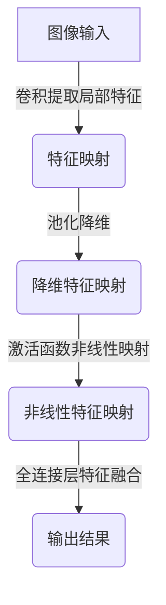
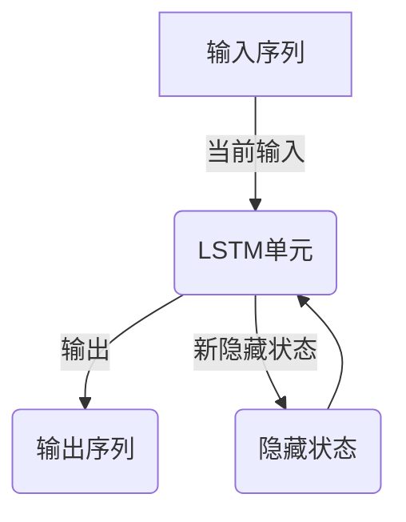
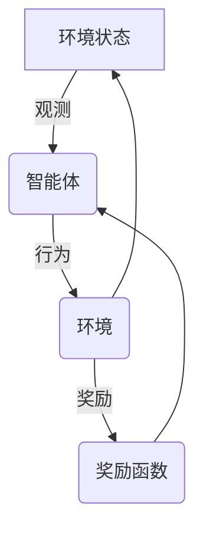

# AI人工智能深度学习算法：在产业机器人中的应用

## 1.背景介绍

### 1.1 人工智能与机器人技术发展概述

人工智能(Artificial Intelligence, AI)是当代科技发展的前沿领域,旨在使计算机系统能够模仿人类的认知功能,如学习、推理、规划、理解自然语言等。随着算力的不断提高和大数据时代的到来,AI技术取得了长足进步,尤其是深度学习(Deep Learning)的兴起,推动了AI在语音识别、图像识别、自然语言处理等领域的广泛应用。

与此同时,机器人技术也在不断发展。工业机器人凭借高精度、高效率、可编程等优势,已广泛应用于制造业。随着AI技术的融入,机器人正在向智能化、自主化方向演进,能够感知环境、学习技能、自主决策,在更多领域发挥作用。

### 1.2 产业机器人的重要性

产业机器人是指在工业生产过程中,用于执行操作、搬运、装配等任务的自动化机器人系统。相比传统工业机器人,智能产业机器人具有更强的灵活性、适应性和智能决策能力,可以应对复杂多变的生产环境,提高生产效率和产品质量。

智能产业机器人的应用前景广阔,涉及制造业、物流、服务业等多个领域。它们可以替代人工执行重复monotonous、危险的工作,降低人力成本,提高生产效率和产品质量,是实现智能制造的关键。因此,将AI深度学习算法应用于产业机器人,赋予其智能化能力,具有重要的现实意义。

## 2.核心概念与联系

### 2.1 深度学习概述

深度学习(Deep Learning)是机器学习(Machine Learning)的一个新的领域,它模仿人脑的机制来解释数据,通过对数据进行表征学习,获取多层次模式,并用于检测、分类等任务。主要算法包括卷积神经网络(CNN)、递归神经网络(RNN)、长短期记忆网络(LSTM)等。

深度学习的核心思想是通过构建神经网络模型,对大量数据进行训练,使模型自动学习数据的特征表示,从而获得强大的数据建模能力。相比传统机器学习算法,深度学习模型具有自动从数据中提取特征的能力,不需要人工设计特征,因此在处理高维度数据时表现出色。

### 2.2 机器人感知与控制

机器人系统通常包括三个核心部分:感知、决策与规划、控制与执行。

1. **感知**:通过各种传感器(视觉、激光、力矩等)获取环境信息,如物体位置、形状、运动状态等。
2. **决策与规划**:根据感知信息和任务目标,决策机器人的行为策略,规划运动轨迹。
3. **控制与执行**:根据规划的轨迹,控制机器人的关节运动,实现期望的动作。

其中,感知是机器人获取环境信息的基础,决策与规划是机器人"大脑",控制与执行是机器人的"肌肉"。将深度学习算法应用于机器人感知和决策规划环节,可以赋予机器人更强的智能化能力。

### 2.3 深度学习在产业机器人中的应用

深度学习算法在产业机器人中的应用主要集中在以下几个方面:

1. **视觉感知**:利用CNN等算法对图像/视频数据进行处理,实现目标检测、识别、跟踪等,为机器人提供视觉信息。
2. **运动规划**:基于深度强化学习等算法,机器人可以自主学习最优的运动策略,实现精准操作。
3. **故障诊断**:通过对历史数据建模,实现机器人故障的智能诊断和预测维护。
4. **人机交互**:利用自然语言处理等技术,实现人机语音/文本交互,提升人机协作体验。

总的来说,深度学习赋予了机器人更强的感知、决策、控制能力,推动了产业机器人向智能化、自主化方向发展。

## 3.核心算法原理具体操作步骤 

### 3.1 卷积神经网络(CNN)

卷积神经网络是深度学习中应用最广泛的一种算法,尤其在计算机视觉领域表现出色。CNN由卷积层、池化层和全连接层等构成,能够自动从图像数据中提取局部特征和高层语义特征,用于目标检测、图像分类等任务。

CNN的工作原理可以概括为以下几个步骤:

1. **卷积(Convolution)**: 通过滑动卷积核(小矩阵)在图像上进行卷积运算,提取局部特征,得到特征映射(Feature Map)。
2. **池化(Pooling)**: 对特征映射进行下采样,减小数据量,保留主要特征,实现一定的平移不变性。
3. **激活函数(Activation)**: 通过非线性激活函数(如ReLU),增加网络的表达能力。
4. **全连接层(Fully Connected)**: 将前面提取的特征进行组合,输出最终的分类/回归结果。

在训练过程中,CNN通过反向传播算法和梯度下降法,不断调整卷积核参数和权重,使网络对训练数据的预测结果逐步逼近真实值,从而学习到图像的特征表示。

CNN在工业视觉中有广泛应用,如缺陷检测、产品分拣、装配导航等,能够显著提高视觉感知的精度和鲁棒性。

### 3.2 递归神经网络(RNN)

递归神经网络是一种对序列数据(如语音、文本等)建模的有力工具。与前馈神经网络不同,RNN在隐藏层之间增加了循环连接,使得网络具有"记忆"能力,可以很好地处理序列数据。

RNN的工作原理可概括为:在每个时间步,RNN根据当前输入和前一时间步的隐藏状态,计算当前时间步的隐藏状态和输出,并将隐藏状态传递到下一时间步,从而捕获序列数据的长期依赖关系。

然而,传统RNN存在梯度消失/爆炸问题,难以学习长期依赖关系。为解决这一问题,提出了长短期记忆网络(LSTM)和门控循环单元(GRU)等改进版本。

LSTM的核心思想是通过门控机制,控制信息的流动,从而缓解梯度消失问题。LSTM每个时间步包含遗忘门、输入门和输出门三个门控单元,分别控制遗忘上一步状态、更新当前状态和输出当前状态。

RNN/LSTM广泛应用于自然语言处理、语音识别、机器翻译等领域。在机器人系统中,可用于语音指令识别、动作序列预测等。

### 3.3 深度强化学习

强化学习(Reinforcement Learning)是机器学习的一个重要分支,其思想是通过探索与利用的策略,从环境中获取反馈信号,不断优化决策策略,以期获得最大的长期回报。

深度强化学习是将深度神经网络应用于强化学习框架中,用于估计状态价值函数或者直接生成策略,能够处理高维观测数据,在复杂环境中表现出色。

深度Q网络(Deep Q-Network, DQN)是深度强化学习的一种典型算法。它使用一个深度神经网络来估计状态-行为对的Q值(期望回报),并通过Q-Learning算法不断更新网络参数,逐步收敛到最优策略。

除DQN外,还有策略梯度算法(如TRPO、PPO等)直接生成策略,A3C算法并行化训练等。此外,一些新兴算法如多智能体强化学习、元强化学习等,也有望在未来的机器人系统中发挥重要作用。

在机器人系统中,深度强化学习可以应用于机械臂控制、导航路径规划、人机交互等领域,通过试错与奖惩机制,机器人可以自主学习最优的决策策略,实现精准操作。

## 4.数学模型和公式详细讲解举例说明

### 4.1 卷积神经网络数学模型

卷积神经网络的核心运算是卷积操作,用于从图像中提取局部特征。二维卷积的数学表达式为:

$$
(I * K)(i,j) = \sum_{m}\sum_{n}I(i+m,j+n)K(m,n)
$$

其中,$I$表示输入图像,$K$表示卷积核(滤波器),$m,n$是卷积核的索引。卷积操作将卷积核在图像上滑动,对每个位置进行点乘累加,得到输出特征映射。

池化层通常在卷积层之后,对特征映射进行下采样,降低数据量。常见的池化方法有最大池化和平均池化。最大池化的数学表达式为:

$$
(f \bigoplus_{(i,j)\in R} g)(x,y) = \max_{(i,j)\in R} g(x+i,y+j)
$$

其中,$f$是输入特征映射,$g$是输出特征映射,$R$是池化区域。最大池化取池化区域内的最大值作为输出。

全连接层将前面提取的特征进行组合,对于分类任务,最后一层通常使用Softmax函数输出各类别的概率分布:

$$
P(y=j|x) = \frac{e^{x^Tw_j}}{\sum_{k=1}^K e^{x^Tw_k}}
$$

其中,$x$是输入特征向量,$w_j$是第$j$类的权重向量,$K$是类别数。

通过反向传播算法和优化方法(如梯度下降),CNN可以自动学习卷积核参数和权重,使网络在训练数据上的预测结果逐步逼近真实值。

### 4.2 长短期记忆网络(LSTM)

LSTM是一种特殊的RNN结构,通过门控机制和记忆细胞,很好地解决了梯度消失/爆炸问题,能够学习长期依赖关系。LSTM的数学模型如下:

1. 遗忘门:
   $$
   f_t = \sigma(W_f \cdot [h_{t-1}, x_t] + b_f)
   $$

2. 输入门: 
   $$
   i_t = \sigma(W_i \cdot [h_{t-1}, x_t] + b_i) \\
   \tilde{C}_t = \tanh(W_C \cdot [h_{t-1}, x_t] + b_C)
   $$

3. 更新记忆细胞:
   $$
   C_t = f_t \odot C_{t-1} + i_t \odot \tilde{C}_t
   $$

4. 输出门:
   $$
   o_t = \sigma(W_o \cdot [h_{t-1}, x_t] + b_o) \\
   h_t = o_t \odot \tanh(C_t)
   $$

其中,$f_t,i_t,o_t$分别表示遗忘门、输入门、输出门的激活值向量,$C_t$是记忆细胞的状态向量,$h_t$是隐藏状态向量,$\sigma$是sigmoid激活函数,$\odot$表示元素乘积。

LSTM通过门控单元控制信息的流动,从而解决了传统RNN的梯度问题,能够更好地捕获长期依赖关系,在自然语言处理、语音识别等领域表现出色。

### 4.3 深度Q网络(DQN)

DQN是深度强化学习的一种典型算法,它使用一个深度神经网络来估计状态-行为对的Q值(期望回报)。

在DQN中,我们定义Q函数$