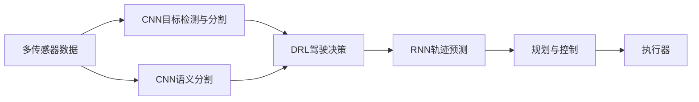

# AI人工智能深度学习算法：在无人驾驶汽车中的应用

## 1. 背景介绍

### 1.1 无人驾驶汽车的发展历程

无人驾驶汽车(Autonomous Vehicle,AV)是近年来人工智能(Artificial Intelligence,AI)技术发展的一个重要方向。从20世纪80年代卡内基梅隆大学的Navlab和ALV项目,到21世纪初DARPA的Grand Challenge和Urban Challenge,再到近年来谷歌Waymo、特斯拉Autopilot等商业化尝试,无人驾驶技术经历了从实验室到公路的发展历程。

### 1.2 深度学习在无人驾驶中的应用

深度学习(Deep Learning,DL)作为人工智能的一个重要分支,在计算机视觉、自然语言处理等领域取得了突破性进展。在无人驾驶领域,深度学习算法被广泛应用于环境感知、路径规划、决策控制等关键模块,极大提升了无人车的智能化水平。一些代表性的应用包括:

- 深度卷积神经网络(CNN)用于交通标志、车道线、行人等目标检测与识别
- 深度强化学习(DRL)用于无人车的端到端驾驶策略学习
- 生成式对抗网络(GAN)用于仿真环境下无人车训练数据的生成
- 图神经网络(GNN)用于高精地图构建与车辆协同

### 1.3 无人驾驶面临的挑战

尽管深度学习为无人驾驶带来了新的突破,但实现全自动驾驶仍面临诸多挑战:

- 复杂多变的交通场景对感知与决策提出了极高要求
- 深度学习模型的可解释性与鲁棒性有待提高
- 缺乏统一的安全性评估标准
- 伦理与法律问题亟待明确

本文将重点探讨深度学习算法在无人驾驶环境感知、决策规划等关键技术中的应用,分析其优势与局限,并对未来发展提出展望。

## 2. 核心概念与联系

### 2.1 无人驾驶系统架构

一个典型的无人驾驶系统通常由感知、定位、决策规划、控制等几大模块组成。其中:

- 感知模块负责汽车周围环境信息的采集与理解,包括摄像头、激光雷达、毫米波雷达等传感器。
- 定位模块负责确定汽车自身的精确位置,常用的方法有GPS/IMU组合导航、激光SLAM等。  
- 决策规划模块根据感知信息、定位信息、电子地图等,规划出一条安全、舒适、高效的行驶路径。
- 控制模块负责执行规划出的路径,精准控制车辆的油门、刹车、转向等。

### 2.2 深度学习基本原理

深度学习是一类模仿人脑结构,通过多层神经网络对数据进行表征学习的机器学习方法。与传统的浅层学习方法相比,深度学习具有更强的特征提取和抽象能力,更适合处理原始、高维、非结构化的数据。

深度学习的核心思想是利用深层神经网络对输入数据进行层层变换,学习出层次化的特征表示。网络通过端到端的监督学习或非监督学习,不断调整每一层的参数,最终学习到数据的内在模式。

常见的深度学习模型包括:

- 前馈神经网络(FNN):最基础的深度学习模型,层与层之间全连接。
- 卷积神经网络(CNN):引入了局部连接、权值共享、池化等操作,善于处理网格化数据如图像。
- 循环神经网络(RNN):引入了时间递归,善于处理序列数据如语音、文本。
- 生成对抗网络(GAN):由生成器和判别器组成,通过二者的博弈学习生成逼真的数据。

### 2.3 深度学习与无人驾驶的结合

深度学习为无人驾驶带来了新的突破口。在感知层面,CNN可以准确检测和分割道路上的车辆、行人、交通标志等目标;在决策层面,DRL可以让无人车学习到端到端的驾驶策略;在规划控制层面,RNN可以预测车辆未来轨迹。此外,GAN、迁移学习等技术也被用于生成训练数据、提升模型泛化能力等。

下图展示了一个典型的无人驾驶系统中深度学习算法的应用:

## 3. 核心算法原理具体操作步骤

本节将详细介绍几种在无人驾驶中应用广泛的深度学习算法,包括目标检测、语义分割、深度强化学习等,阐述其基本原理与具体操作步骤。

### 3.1 CNN用于目标检测

目标检测是无人车感知的关键任务之一,其目标是从图像或点云中定位并识别出感兴趣的目标如车辆、行人、交通标志等。基于CNN的目标检测方法主要分为两类:两阶段检测器和单阶段检测器。

#### 3.1.1 两阶段检测器

两阶段检测器如R-CNN系列,将检测问题分解为两个阶段:

1. 区域生成阶段:通过启发式方法(如选择性搜索)或区域生成网络(RPN),生成若干可能包含目标的候选区域(ROI)。
2. 区域判别阶段:对每个候选区域,使用CNN提取特征,经过分类和回归输出其类别和位置坐标。

以Faster R-CNN为例,其具体步骤如下:

1. 图像经过预训练的CNN骨干网提取特征图。
2. 特征图输入区域生成网络(RPN),生成一系列矩形候选区域。
3. 候选区域映射回原始图像,用RoI Pooling调整其大小。
4. 调整后的区域送入全连接层,通过softmax分类和边框回归输出检测结果。

#### 3.1.2 单阶段检测器

单阶段检测器如YOLO、SSD等,省去了生成候选区域的步骤,直接在CNN特征图上进行分类和回归,因而速度更快。以YOLOv3为例,其步骤如下:

1. 图像划分为S×S个网格,每个网格预测B个边界框。
2. 图像经过CNN骨干网提取特征,在三个尺度上分别预测边界框的位置和类别概率。
3. 使用非极大值抑制(NMS)去除冗余的预测框,得到最终检测结果。

### 3.2 CNN用于语义分割

语义分割是对图像中每个像素点进行分类,标记出其所属的语义类别如道路、车辆、行人等。全卷积网络(FCN)是一种典型的语义分割方法,其将传统CNN中的全连接层换成卷积层,使输出与输入保持相同尺寸。

以U-Net为例,它是一种U型编码器-解码器结构的FCN。编码器逐步降低特征图的空间分辨率并提取高级语义信息;解码器逐步恢复空间细节并与编码器的特征图融合,最终输出与原图大小相同的分割结果。具体步骤如下:

1. 输入图像经过一系列卷积和下采样,提取高层语义特征。
2. 特征图逐步上采样恢复空间分辨率,并与对应编码器层的特征图拼接。
3. 最后一层卷积输出每个像素的类别概率图,经过argmax得到最终分割结果。

### 3.3 深度强化学习用于驾驶决策

深度强化学习(DRL)可用于学习无人车的驾驶策略,即根据当前观测(如图像、速度)选择合适的动作(如油门、刹车)。与监督学习不同,DRL是一种试错式学习,通过智能体与环境的交互,不断调整策略以获得最大累积奖励。

DRL的主要方法有值函数法(如DQN)和策略梯度法(如DDPG)。以DDPG为例,它是一种基于Actor-Critic框架的连续动作空间DRL算法。Actor网络输出确定性策略,Critic网络估计动作-状态值函数。训练过程通过最大化预期累积奖励来优化策略。具体步骤如下:

1. 随机初始化Actor网络μ(s|θμ)和Critic网络Q(s,a|θQ)。
2. 初始化目标网络μ'和Q',并复制参数θμ'←θμ,θQ'←θQ。
3. 初始化经验回放池R。
4. for episode = 1 to M do:
    1. 初始化初始状态s1。
    2. for t = 1 to T do:
        1. 根据当前策略和探索噪声选择动作at=μ(st|θμ)+Nt。
        2. 执行动作at,观测奖励rt和新状态st+1。
        3. 将转移样本(st,at,rt,st+1)存入R。
        4. 从R中随机采样一批转移样本(si,ai,ri,si+1)。
        5. 计算目标yi=ri+γQ'(si+1,μ'(si+1|θμ')|θQ')。
        6. 最小化Critic损失L=1/N∑i(yi−Q(si,ai|θQ))^2。
        7. 最大化Actor目标J=1/N∑iQ(si,μ(si|θμ)|θQ)。
        8. 软更新目标网络参数:θμ'←τθμ+(1−τ)θμ',θQ'←τθQ+(1−τ)θQ'。
    3. end for
5. end for

## 4. 数学模型和公式详细讲解举例说明

本节将详细讲解无人驾驶中几个关键任务常用的数学模型和公式,包括目标检测中的IoU、NMS,语义分割中的Dice Loss,强化学习中的Bellman方程等。

### 4.1 目标检测的IoU与NMS

#### 4.1.1 交并比(IoU)

交并比(Intersection over Union,IoU)是评估目标检测器性能的一个重要指标。给定检测结果的边界框 $B_p$ 和真实目标的边界框 $B_{gt}$,其IoU定义为:

$$
IoU = \frac{B_p \cap B_{gt}}{B_p \cup B_{gt}}
$$

其中 $B_p \cap B_{gt}$ 表示两个边界框的交集面积, $B_p \cup B_{gt}$ 表示并集面积。IoU的取值在0到1之间,越接近1表示检测结果与真值重合度越高。

在训练和评估检测器时,通常将IoU大于某一阈值(如0.5)的检测结果视为正样本,否则为负样本。一些检测器如Mask R-CNN还使用IoU作为RoI Align的依据。

#### 4.1.2 非极大值抑制(NMS) 

非极大值抑制(Non-Maximum Suppression,NMS)是去除冗余检测框的一种常用后处理方法。其基本思想是,对于同一个目标,保留置信度最高的检测框,去除与之重叠度高的其他检测框。

NMS的具体步骤如下:

1. 根据置信度降序排列所有检测框。
2. 选择置信度最高的检测框 $B_i$ 加入最终输出集合。
3. 遍历剩余检测框,计算其与 $B_i$ 的IoU。若IoU大于阈值(如0.5),则将其移除。
4. 重复2-3直到所有检测框都被处理。

以上过程可以用数学公式表示为:

$$
S = \emptyset \\
\textbf{while } B \neq \emptyset \textbf{ do:}\\
\quad i = \arg\max_{j} score(B_j)\\
\quad S = S \cup B_i\\
\quad B = B \setminus B_i\\
\quad \textbf{for } B_k \in B \textbf{ do:}\\
\quad\quad \textbf{if } IoU(B_i, B_k) > \lambda \textbf{ then:}\\
\quad\quad\quad B = B \setminus B_k\\
\textbf{return } S
$$

其中 $B$ 为原始检测框集合,$S$ 为NMS处理后的检测框集合,$\lambda$