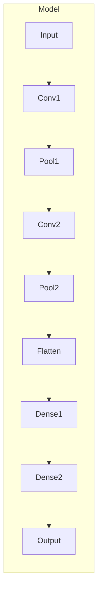

# AI人工智能深度学习算法：在生物信息学中的应用

## 1.背景介绍

生物信息学是一门融合了生物学、计算机科学、数学和统计学等多学科的交叉学科,旨在通过计算机和信息技术手段来解决生物学问题。随着基因组测序技术的快速发展,生物数据呈现出海量、多样性和复杂性等特点,传统的生物信息学分析方法已经难以满足现有需求。近年来,人工智能(AI)尤其是深度学习技术在图像识别、自然语言处理等领域取得了巨大成功,也为生物信息学数据分析提供了新的思路和方法。

## 2.核心概念与联系

### 2.1 深度学习

深度学习是机器学习的一个重要分支,它模仿人脑神经网络的结构和功能,通过构建多层神经网络模型对输入数据进行特征提取和模式识别。与传统的机器学习算法相比,深度学习具有自动学习特征的能力,可以从原始数据中挖掘出更加抽象和复杂的特征模式,从而提高了模型的预测和分类性能。

### 2.2 生物信息学中的应用场景

深度学习在生物信息学领域有着广泛的应用前景,主要包括以下几个方面:

1. **基因组测序数据分析**:通过深度学习模型对基因组测序数据进行分析,可以实现基因组装配、变异检测、结构变异预测等任务。

2. **蛋白质结构预测**:利用深度学习技术预测蛋白质的二级和三级结构,有助于理解蛋白质的功能和作用机制。

3. **药物设计**:深度学习可以用于虚拟筛选潜在的药物分子,加速新药研发过程。

4. **医学图像分析**:应用深度学习技术对医学影像数据(如CT、MRI等)进行分析,实现疾病诊断、病灶检测等任务。

5. **生物序列分析**:深度学习模型可以对DNA、RNA和蛋白质序列进行分析,预测基因功能、识别结构域等。

## 3.核心算法原理具体操作步骤

深度学习在生物信息学中的应用主要基于以下几种核心算法模型:

### 3.1 卷积神经网络(CNN)

卷积神经网络是一种常用的深度学习模型,它具有局部连接、权值共享和空间下采样等特点,适合处理具有一定空间或时间结构的数据,如图像、序列等。在生物信息学中,CNN可以应用于以下任务:

1. **蛋白质二级结构预测**:将蛋白质序列作为一维信号输入CNN模型,预测每个残基的二级结构(α-螺旋、β-折叠等)。

2. **基因组序列分析**:将DNA序列作为一维信号输入CNN模型,预测基因组中的功能区域(如基因、启动子等)。

3. **医学图像分析**:将CT、MRI等医学影像作为二维或三维输入,利用CNN模型进行病灶检测、分割和分类等任务。

CNN模型的训练过程包括以下几个关键步骤:

1. **数据预处理**:对输入数据(如序列、图像等)进行适当的编码和归一化处理。

2. **模型构建**:根据任务需求设计CNN模型的网络结构,包括卷积层、池化层和全连接层等。

3. **模型训练**:选择合适的损失函数和优化算法,利用训练数据对模型进行端到端的训练。

4. **模型评估**:在验证集或测试集上评估模型的性能,并根据需要进行超参数调整和模型微调。

5. **模型部署**:将训练好的模型应用于实际的生物信息学任务中。

### 3.2 循环神经网络(RNN)

循环神经网络是一种适合处理序列数据的深度学习模型,它能够捕捉序列中的长期依赖关系,常用于自然语言处理、时间序列预测等任务。在生物信息学中,RNN可以应用于以下场景:

1. **蛋白质次级结构预测**:将蛋白质序列作为输入,利用RNN模型预测每个残基的结构状态。

2. **基因组序列分析**:将DNA序列作为输入,利用RNN模型识别基因组中的功能区域和结构域。

3. **RNA二级结构预测**:将RNA序列作为输入,利用RNN模型预测RNA分子的二级结构。

RNN模型的训练过程与CNN类似,主要包括以下步骤:

1. **数据预处理**:对序列数据进行适当的编码和归一化处理。

2. **模型构建**:设计RNN模型的网络结构,包括循环层、全连接层等。常用的RNN变体有LSTM、GRU等。

3. **模型训练**:选择合适的损失函数和优化算法,利用训练数据对模型进行端到端的训练。

4. **模型评估**:在验证集或测试集上评估模型的性能,并根据需要进行超参数调整和模型微调。

5. **模型部署**:将训练好的模型应用于实际的生物信息学任务中。

### 3.3 生成对抗网络(GAN)

生成对抗网络是一种无监督的深度学习模型,它由一个生成网络和一个判别网络组成,两个网络相互对抗,最终使生成网络能够生成与真实数据分布一致的样本。在生物信息学中,GAN可以应用于以下场景:

1. **分子结构生成**:利用GAN模型生成新的小分子结构,用于虚拟筛选和药物设计。

2. **蛋白质结构预测**:将已知的蛋白质结构作为训练数据,利用GAN模型生成新的蛋白质三级结构。

3. **基因组数据增强**:通过GAN模型生成合成的基因组数据,扩充训练集,提高其他深度学习模型的性能。

GAN模型的训练过程相对较为复杂,主要包括以下步骤:

1. **数据预处理**:对训练数据进行适当的编码和归一化处理。

2. **模型构建**:设计生成网络和判别网络的网络结构,常用的生成网络包括卷积网络、自回归网络等。

3. **模型训练**:定义生成网络和判别网络的损失函数,通过对抗训练的方式交替优化两个网络的参数。

4. **模型评估**:在验证集或测试集上评估生成样本的质量,并根据需要进行超参数调整和模型微调。

5. **模型部署**:将训练好的GAN模型应用于实际的生物信息学任务中。

## 4.数学模型和公式详细讲解举例说明

深度学习算法的核心是构建多层神经网络模型,通过反向传播算法优化网络参数,实现对输入数据的特征提取和模式识别。下面将详细介绍神经网络模型的数学原理和公式。

### 4.1 神经元模型

神经网络的基本单元是神经元,它接收来自上一层的输入信号,经过加权求和和非线性激活函数的处理,产生输出信号传递给下一层。对于单个神经元,其数学模型可以表示为:

$$
y = f\left(\sum_{i=1}^{n}w_ix_i + b\right)
$$

其中:
- $x_i$表示第$i$个输入;
- $w_i$表示第$i$个输入对应的权重;
- $b$表示神经元的偏置项;
- $f$表示非线性激活函数,常用的激活函数包括Sigmoid、ReLU等。

### 4.2 前向传播

在神经网络中,输入数据经过多层神经元的处理,最终得到输出结果,这个过程称为前向传播。对于一个包含$L$层的神经网络,第$l$层的输出$\boldsymbol{a}^{(l)}$可以表示为:

$$
\boldsymbol{a}^{(l)} = f^{(l)}\left(\boldsymbol{W}^{(l)}\boldsymbol{a}^{(l-1)} + \boldsymbol{b}^{(l)}\right)
$$

其中:
- $\boldsymbol{a}^{(l-1)}$表示第$l-1$层的输出;
- $\boldsymbol{W}^{(l)}$表示第$l$层的权重矩阵;
- $\boldsymbol{b}^{(l)}$表示第$l$层的偏置向量;
- $f^{(l)}$表示第$l$层的激活函数。

### 4.3 反向传播

为了训练神经网络模型,需要通过反向传播算法计算每个权重参数对损失函数的梯度,然后通过优化算法(如梯度下降)更新参数值。对于一个包含$L$层的神经网络,第$l$层权重矩阵$\boldsymbol{W}^{(l)}$对损失函数$J$的梯度可以表示为:

$$
\frac{\partial J}{\partial \boldsymbol{W}^{(l)}} = \frac{\partial J}{\partial \boldsymbol{a}^{(L)}} \frac{\partial \boldsymbol{a}^{(L)}}{\partial \boldsymbol{a}^{(L-1)}} \cdots \frac{\partial \boldsymbol{a}^{(l+1)}}{\partial \boldsymbol{a}^{(l)}} \frac{\partial \boldsymbol{a}^{(l)}}{\partial \boldsymbol{W}^{(l)}}
$$

其中:
- $\frac{\partial J}{\partial \boldsymbol{a}^{(L)}}$表示损失函数对输出层的梯度;
- $\frac{\partial \boldsymbol{a}^{(l+1)}}{\partial \boldsymbol{a}^{(l)}}$表示第$l+1$层输出对第$l$层输出的梯度,可以通过链式法则计算。

通过反向传播算法计算得到每个权重参数的梯度后,就可以使用优化算法(如梯度下降)更新参数值,从而最小化损失函数,提高模型的性能。

### 4.4 实例:卷积神经网络中的卷积运算

卷积神经网络中的卷积运算是一种特殊的线性运算,它可以提取输入数据的局部特征。对于一个二维输入数据$\boldsymbol{X}$和一个二维卷积核$\boldsymbol{K}$,卷积运算可以表示为:

$$
(\boldsymbol{X} * \boldsymbol{K})_{i,j} = \sum_{m}\sum_{n}\boldsymbol{X}_{i+m,j+n}\boldsymbol{K}_{m,n}
$$

其中:
- $\boldsymbol{X}$表示输入数据,如图像;
- $\boldsymbol{K}$表示卷积核,也称为滤波器;
- $i,j$表示输出特征图的坐标;
- $m,n$表示卷积核的坐标。

卷积运算可以提取输入数据的局部特征,如边缘、纹理等,这些特征对于图像识别、序列分析等任务具有重要意义。在神经网络中,卷积核的权重是需要通过反向传播算法进行学习和优化的参数。

## 5.项目实践:代码实例和详细解释说明

为了更好地理解深度学习在生物信息学中的应用,我们将通过一个实际项目案例进行讲解。该项目旨在利用卷积神经网络对蛋白质二级结构进行预测。

### 5.1 数据准备

我们将使用来自CASP竞赛的蛋白质二级结构数据集,该数据集包含了大量蛋白质序列及其对应的二级结构标注。我们需要对数据进行适当的预处理,将蛋白质序列编码为数字向量,并将二级结构标注转换为one-hot编码。

### 5.2 模型构建

我们将构建一个基于卷积神经网络的模型,用于预测蛋白质二级结构。模型的架构如下所示:

该模型包含以下主要组件:

1. **卷积层(Conv)**:用于提取蛋白质序列的局部特征。
2. **池化层(Pool)**:用于降低特征图的维度,减少计算量。
3. **全连接层(Dense)**:用于将提