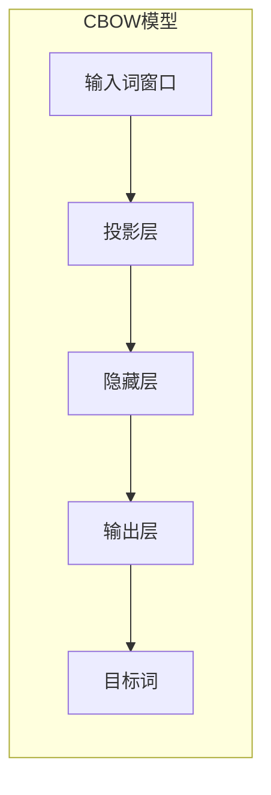
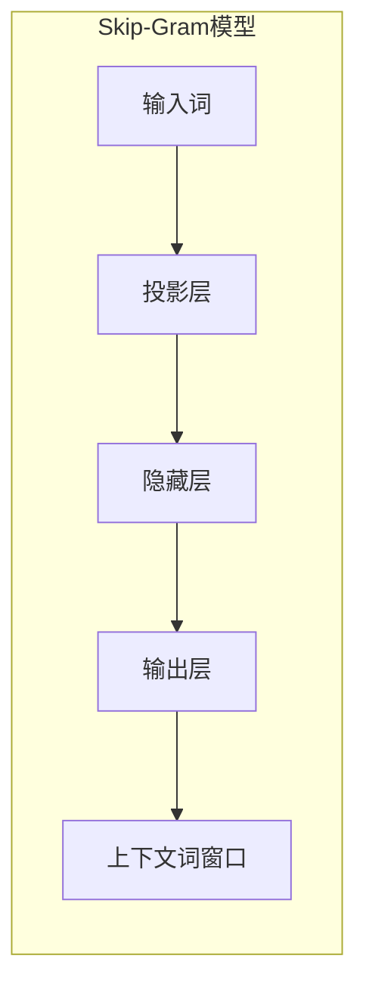
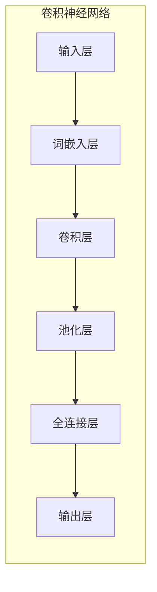
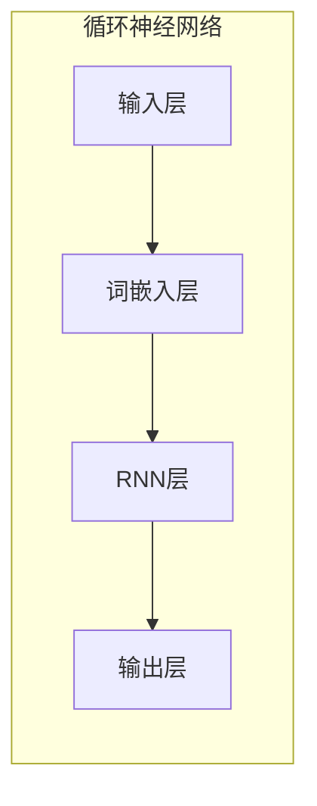

# AI人工智能深度学习算法：在自然语言处理中的运用

## 1. 背景介绍

### 1.1 自然语言处理的重要性

在当今的数字时代,人与机器之间的交互变得越来越频繁。自然语言处理(Natural Language Processing, NLP)作为人工智能的一个重要分支,旨在使计算机能够理解和生成人类语言。它在许多领域发挥着关键作用,例如机器翻译、智能助手、情感分析、文本摘要等。随着数据量的激增和计算能力的提高,深度学习算法在NLP领域取得了突破性进展,推动了自然语言处理技术的飞速发展。

### 1.2 深度学习在NLP中的应用

传统的NLP方法主要依赖于规则和特征工程,需要大量的人工干预。而深度学习算法能够自动从大量数据中学习特征表示,克服了传统方法的局限性。深度学习模型通过构建多层非线性变换,可以捕捉输入数据中的复杂模式和语义信息,从而在各种NLP任务中取得了卓越的性能。

### 1.3 本文概述

本文将全面探讨深度学习算法在自然语言处理中的应用。我们将介绍NLP中常见的任务类型,深入剖析主流的深度学习模型及其原理,并详细阐述它们在不同NLP任务中的实现细节。此外,我们还将分享实际项目中的代码示例,探讨深度学习在NLP领域的发展趋势和挑战,以及相关的工具和资源推荐。

## 2. 核心概念与联系

### 2.1 自然语言处理任务概述

在深入探讨深度学习算法之前,我们先来了解一下自然语言处理中常见的任务类型:

1. **文本分类(Text Classification)**: 将文本数据归类到预定义的类别中,如新闻分类、垃圾邮件检测等。
2. **序列标注(Sequence Labeling)**: 为文本序列中的每个单元(如词语或字符)赋予标签,如命名实体识别、词性标注等。
3. **机器翻译(Machine Translation)**: 将一种自然语言转换为另一种自然语言。
4. **文本生成(Text Generation)**: 根据给定的上下文或提示,生成连贯、流畅的自然语言文本,如对话系统、自动文章写作等。
5. **文本摘要(Text Summarization)**: 自动生成概括原始文本主要内容的简明摘要。
6. **问答系统(Question Answering)**: 根据给定的问题,从文本语料中检索相关信息并生成答案。
7. **情感分析(Sentiment Analysis)**: 识别文本中所蕴含的情感倾向,如正面、负面或中性等。

这些任务广泛应用于各个领域,如信息检索、客户服务、社交媒体分析等。深度学习算法为解决这些任务提供了强大的工具。

### 2.2 深度学习模型概述

深度学习模型通过构建多层非线性变换,能够自动从数据中学习特征表示。在自然语言处理领域,常见的深度学习模型包括:

1. **词向量(Word Embeddings)**: 将词语映射到低维连续向量空间,捕捉词与词之间的语义和语法关系。
2. **卷积神经网络(Convolutional Neural Networks, CNNs)**: 通过卷积和池化操作,自动提取局部特征,广泛应用于文本分类等任务。
3. **循环神经网络(Recurrent Neural Networks, RNNs)**: 能够处理序列数据,捕捉文本中的上下文信息,常用于序列标注、机器翻译等任务。
4. **长短期记忆网络(Long Short-Term Memory, LSTMs)**: 是RNN的一种变体,通过门控机制解决了长期依赖问题。
5. **门控循环单元(Gated Recurrent Units, GRUs)**: 是另一种RNN变体,相比LSTM结构更加简洁。
6. **注意力机制(Attention Mechanism)**: 通过动态地分配不同位置的权重,使模型能够关注输入序列中的关键信息。
7. **transformer**: 完全基于注意力机制的序列到序列模型,在机器翻译、文本生成等任务中表现出色。
8. **BERT(Bidirectional Encoder Representations from Transformers)**: 预训练的transformer模型,在各种NLP任务上取得了state-of-the-art的性能。

这些模型为解决不同的NLP任务提供了强大的建模能力,并在实践中取得了卓越的成绩。

### 2.3 深度学习与NLP任务的联系

深度学习模型在不同的NLP任务中发挥着关键作用:

- **文本分类**: CNN能够有效地提取局部特征,而RNN能够捕捉全局上下文信息,两者的集成模型在文本分类任务中表现出色。
- **序列标注**: RNN及其变体(LSTM、GRU)能够很好地处理序列数据,在序列标注任务中发挥重要作用。
- **机器翻译**: 序列到序列模型(如transformer)通过注意力机制捕捉源语言和目标语言之间的对应关系,在机器翻译任务中取得了突破性进展。
- **文本生成**: 基于transformer的语言模型(如GPT)能够生成连贯、流畅的自然语言文本,广泛应用于对话系统、自动写作等领域。
- **文本摘要**: 通过序列到序列模型和注意力机制,可以自动生成概括原始文本主要内容的摘要。
- **问答系统**: 利用预训练语言模型(如BERT)提取问题和文本之间的关系,从而生成准确的答案。
- **情感分析**: CNN和RNN模型能够有效地捕捉文本中的情感特征,用于情感分析任务。

通过将深度学习模型应用于不同的NLP任务,我们可以充分利用其强大的建模能力,从而取得卓越的性能表现。

## 3. 核心算法原理具体操作步骤

在本节中,我们将详细探讨一些核心的深度学习算法,并阐述它们在自然语言处理任务中的具体实现步骤。

### 3.1 词向量(Word Embeddings)

词向量是将词语映射到低维连续向量空间的技术,它能够捕捉词与词之间的语义和语法关系。常见的词向量模型包括Word2Vec和GloVe等。

1. **Word2Vec**

Word2Vec是一种基于神经网络的高效词向量训练模型,包含两种主要架构:连续词袋模型(CBOW)和Skip-Gram模型。

**CBOW模型**:

CBOW模型的基本思想是根据上下文词来预测目标词。具体步骤如下:

1) 构建输入词窗口,包含目标词周围的上下文词。
2) 将输入词窗口中的词向量相加,得到投影层的输入。
3) 投影层将输入映射到隐藏层。
4) 隐藏层通过softmax函数计算每个词的概率分布。
5) 使用梯度下降算法最小化目标词与预测词之间的交叉熵损失,从而学习词向量。

**Skip-Gram模型**:

Skip-Gram模型的基本思想是根据目标词来预测上下文词。具体步骤如下:

1) 将目标词作为输入,通过投影层映射到隐藏层。
2) 隐藏层通过softmax函数计算上下文词窗口中每个词的概率分布。
3) 使用梯度下降算法最小化上下文词与预测词之间的交叉熵损失,从而学习词向量。

通过上述步骤,我们可以获得能够捕捉语义和语法关系的高质量词向量表示。

2. **GloVe(Global Vectors for Word Representation)**

GloVe是另一种基于全局词共现统计信息的词向量训练模型。它的核心思想是利用词与词之间的共现矩阵,通过最小化一个加权最小二乘损失函数来学习词向量。具体步骤如下:

1) 构建词与词之间的共现矩阵,统计每对词在语料库中的共现次数。
2) 初始化词向量和共现偏置项。
3) 定义加权最小二乘损失函数,其中权重是共现次数的函数。
4) 使用梯度下降算法最小化损失函数,从而学习词向量和共现偏置项。

GloVe能够捕捉词与词之间的全局统计信息,并产生高质量的词向量表示。

通过上述步骤,我们可以获得能够捕捉语义和语法关系的高质量词向量表示,为后续的自然语言处理任务奠定基础。

### 3.2 卷积神经网络(Convolutional Neural Networks, CNNs)

卷积神经网络能够自动提取局部特征,在文本分类等NLP任务中发挥重要作用。我们将介绍如何将CNN应用于文本分类任务。

1) **输入层**: 将文本数据表示为一个矩阵,每一行对应一个词向量。
2) **词嵌入层**: 将输入词映射到低维连续向量空间,可以使用预训练的词向量或在训练过程中共同学习。
3) **卷积层**: 在词嵌入矩阵上应用多个卷积核,每个卷积核提取不同的局部特征。卷积操作可以表示为:

$$
c_i = f(\omega \cdot x_{i:i+h-1} + b)
$$

其中 $c_i$ 是特征映射的输出, $f$ 是非线性激活函数(如ReLU), $\omega$ 是卷积核的权重向量, $b$ 是偏置项, $x_{i:i+h-1}$ 是窗口大小为 $h$ 的词向量序列。

4) **池化层**: 对卷积层的输出进行下采样,捕捉最显著的局部特征。常用的池化操作包括最大池化和平均池化。
5) **全连接层**: 将池化层的输出展平,并通过一个或多个全连接层进行高级特征组合。
6) **输出层**: 根据任务类型(如二分类或多分类),使用softmax或sigmoid函数输出预测概率。

在训练过程中,我们使用反向传播算法和优化器(如Adam或SGD)来更新模型参数,最小化分类损失函数(如交叉熵损失)。通过上述步骤,CNN能够自动从文本数据中提取有区分性的局部特征,并将其用于文本分类任务。

### 3.3 循环神经网络(Recurrent Neural Networks, RNNs)

循环神经网络能够处理序列数据,捕捉文本中的上下文信息,在序列标注、机器翻译等任务中发挥关键作用。我们将介绍如何将RNN应用于序列标注任务。

1) **输入层**: 将文本序列表示为一系列词向量。
2) **词嵌入层**: 将输入词映射到低维连续向量空间,可以使用预训练的词向量或在训练过程中共同学习。
3) **RNN层**: 对词嵌入序列进行递归处理,捕捉上下文信息。RNN的核心计算步骤如下:

$$
h_t = f(W_{hh}h_{t-1} + W_{xh}x_t + b_h)
$$
$$
y_t = g(W_{hy}h_t + b_y)
$$

其中 $h_t$ 是时刻 $t$ 的隐藏状态, $x_t$ 是时刻 $t$ 的输入词向量, $W$ 是权重矩阵, $b$ 是偏置项