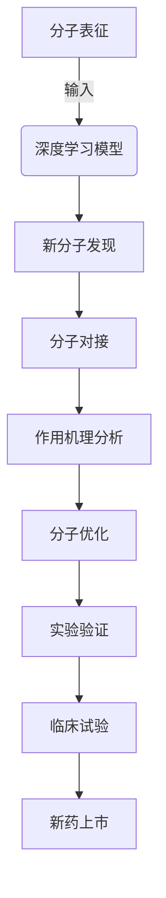

# AI人工智能深度学习算法：在药物研发中的应用

## 1.背景介绍

### 1.1 药物研发的重要性和挑战

药物研发是一个关乎人类健康和福祉的重要领域。随着人口老龄化和新兴疾病的不断出现,对新药物的需求与日俱增。然而,传统的药物研发过程耗时耗力,成本高昂,成功率低下。据统计,从发现一种新的候选药物到最终获批上市,平均需要耗费10多年时间和10亿美元的巨额投资,而大多数候选药物最终都以失败告终。

这种低效率和高风险的情况,主要源于以下几个方面的挑战:

1. **分子空间巨大**:可能的小分子化合物数量高达10^60种,远远超出了实验筛选的能力范围。
2. **生物过程复杂**:药物与生物体内的各种蛋白质、细胞、组织等相互作用,涉及复杂的生物化学过程。
3. **数据缺乏**:由于实验成本高昂,可获得的实验数据有限,难以全面理解药物的作用机制。
4. **评估周期漫长**:从发现新分子到评估其在人体内的药效和毒性,需要经历多年的临床试验过程。

### 1.2 人工智能在药物研发中的作用

传统的药物研发过程严重依赖于化学家和生物学家的经验和直觉,缺乏系统性和高效性。而人工智能(AI)技术,尤其是深度学习算法,为解决上述挑战提供了新的契机。

深度学习算法能够从海量数据中自动提取特征并建模,捕捉复杂的非线性关系,从而加速新分子的发现、优化和评估过程。AI技术在药物研发中可以发挥以下作用:

1. **虚拟筛选**:通过构建计算机模型,预测和评估大量化合物与生物靶标的相互作用,高效地从海量化合物库中发现有前景的候选药物。
2. **分子设计**:利用深度学习算法生成具有期望性质的新分子结构,加速新分子的发现过程。
3. **作用机理分析**:通过分析大数据,深入理解药物与生物体内各种蛋白质、细胞等的复杂相互作用机制。
4. **临床试验优化**:利用机器学习模型预测患者的治疗反应,优化临床试验设计,提高成功率。

总的来说,AI技术有望显著提高药物研发的效率和成功率,降低成本,加快新药上市步伐,造福更多患者。

## 2.核心概念与联系

在应用AI深度学习算法于药物研发领域之前,我们需要理解几个核心概念及其相互关联。

### 2.1 深度学习

深度学习(Deep Learning)是机器学习的一个子领域,其灵感来源于人脑的神经网络结构。深度学习模型通过构建由多层神经元组成的人工神经网络,对输入数据进行表征学习和模式识别。

常见的深度学习模型包括:

- **卷积神经网络**(CNN): 擅长处理图像、视频等高维度数据,在计算机视觉领域表现出色。
- **循环神经网络**(RNN): 适用于处理序列数据,如自然语言、语音、基因等。
- **生成对抗网络**(GAN): 可用于生成新的数据样本,如图像、音频、分子结构等。

这些模型通过反复的训练过程,不断调整神经网络中的参数权重,使得模型能够从大量数据中自主学习特征,捕捉复杂的非线性映射关系。

### 2.2 分子表征

在应用深度学习于药物研发之前,首先需要将分子结构转化为机器可识别的数值表征形式。常用的分子表征方法包括:

1. **SMILES**表示: 将分子结构编码为一维字符串,可直接输入神经网络模型。
2. **图卷积网络**表征: 将分子视为无向图,利用图卷积神经网络捕捉分子拓扑结构特征。
3. **3D坐标表征**: 使用分子的三维坐标作为输入,结合3D卷积神经网络捕捉空间结构信息。

不同的表征方法各有优缺点,需要根据具体任务进行选择和设计。

### 2.3 生物靶标

药物发挥作用的关键是与生物体内的特定蛋白质靶标结合。常见的生物靶标包括:

- **激酶**:参与细胞内多种重要信号转导通路,与肿瘤、炎症等疾病密切相关。
- **离子通道**:调控细胞内离子流动,影响神经、心血管等系统功能。
- **G蛋白偶联受体**:介导细胞对神经递质、激素等信号分子的反应。
- **核受体**:调控基因表达,与代谢紊乱、炎症等疾病有关。

深入理解生物靶标的三维结构和作用机理,对于设计出高效、高选择性的新药物至关重要。

### 2.4 分子对接

分子对接(Molecular Docking)是指预测小分子与生物大分子靶标结合时的优先构象和亲和力。它是虚拟筛选和结构化药物设计的关键步骤。

常用的分子对接算法包括:

- 基于形状互补的算法:如DOCK、ZDOCK等。
- 基于能量的算法:如AutoDock、GOLD等,利用分子力学能量函数评估结合能。
- 基于知识的算法:从已知的蛋白-配体复合物中提取结合模式,应用于新的对接问题。

随着深度学习算法的发展,人们开始尝试使用神经网络模型直接预测分子对接姿态和亲和力,以提高精确度和效率。

### 2.5 核心概念的联系

上述核心概念相互关联,构成了应用深度学习于药物研发的整体技术框架:

1. 首先使用合适的分子表征方法,将化合物分子结构转换为机器可识别的数值形式。
2. 利用深度学习模型(如CNN、RNN、GAN等)从大量分子数据中学习特征,发现新的具有期望性质的候选分子结构。
3. 对发现的候选分子利用分子对接算法,预测其与靶标蛋白的结合亲和力和作用方式。
4. 结合其他计算模拟和实验数据,深入分析药物与生物体内各种蛋白质、细胞等的相互作用机制。
5. 基于上述分析结果,优化候选分子结构,提高其活性、选择性和药代动力学性质。
6. 将有前景的优化分子进行实验验证,并设计临床试验方案,最终开发出安全有效的新药物。

总的来说,深度学习算法与分子建模、生物信息学等传统方法相结合,为加速新药研发提供了强大的工具和途径。

## 3.核心算法原理具体操作步骤

在上一节中,我们介绍了应用深度学习于药物研发的核心概念及其联系。接下来,我们将详细阐述其中几种核心算法的原理和具体操作步骤。

### 3.1 分子生成算法

#### 3.1.1 SMILES-RNN算法

SMILES-RNN算法利用循环神经网络(RNN)从SMILES字符串中学习分子结构的统计规律,并生成新的合法SMILES序列,从而实现分子结构的生成。其具体操作步骤如下:

1. **数据预处理**:将大量已知分子的SMILES字符串作为训练数据集,进行字符级别的编码(one-hot或嵌入编码)。
2. **模型构建**:构建一个多层的RNN模型,例如LSTM或GRU,将SMILES字符串逐个输入到RNN单元中。
3. **模型训练**:使用序列学习的方法(如教师强制或注意力机制)训练RNN模型,使其学习到SMILES字符串的概率分布规律。
4. **分子生成**:对于新的SMILES字符串,RNN模型将逐个预测下一个最可能的字符,直到生成完整的合法SMILES序列。
5. **结构校验**:使用分子结构校验工具(如RDKit)检查生成的SMILES是否对应于合法的分子结构。
6. **优化迭代**:根据需要,可以对RNN模型的结构、超参数等进行优化,提高生成分子的质量和多样性。

SMILES-RNN算法的优点是原理简单、易于实现,但缺点是生成的分子可能存在无效或冗余的结构片段。

#### 3.1.2 GraphINVENT算法

GraphINVENT算法是一种基于图神经网络(GNN)的分子生成算法,它直接在分子图结构上进行生成,避免了SMILES表示的局限性。算法步骤如下:

1. **数据预处理**:将大量已知分子结构转换为无向分子图的邻接矩阵表示,作为训练数据集。
2. **模型构建**:构建一个图注意力网络模型,包括节点级别的图注意力层和图级别的池化层。
3. **模型训练**:使用监督学习的方式,训练模型从给定的分子图中学习节点和边的表征。
4. **分子生成**:从空图开始,模型逐步添加新的节点和边,生长出完整的分子图结构。
5. **结构优化**:利用强化学习等方法,根据期望的分子性质对生成的分子图进行优化。
6. **结构校验**:使用分子结构校验工具检查生成的分子图是否合法,满足所需的化学规则。

相比SMILES-RNN,GraphINVENT算法生成的分子结构更加规范和高效,但模型训练和优化过程更加复杂。

### 3.2 分子-蛋白对接算法

分子对接是虚拟筛选和结构化药物设计的关键步骤,传统的对接算法主要基于分子力学能量函数和形状互补原理。近年来,深度学习技术也开始应用于分子对接问题。

#### 3.2.1 基于3D卷积的对接算法

这类算法利用3D卷积神经网络(3D CNN)直接从分子的三维坐标数据中学习特征,预测配体与受体蛋白的结合亲和力。具体步骤如下:

1. **数据预处理**:收集大量已知的蛋白-配体复合物的三维坐标数据,作为训练和测试数据集。
2. **特征提取**:使用3D CNN模型从配体和受体的三维坐标数据中自动提取相关的空间和化学特征。
3. **模型融合**:将配体和受体的特征张量拼接,输入到全连接层中融合处理。
4. **亲和力回归**:将融合后的特征输入到回归层,输出配体与受体的结合亲和力值。
5. **模型训练**:使用配对数据训练模型,使预测值与实际亲和力值之间的均方误差最小化。
6. **模型评估**:在独立的测试集上评估模型的泛化能力和预测精度。
7. **虚拟筛选**:对于新的小分子配体,利用训练好的模型快速预测其与靶标蛋白的结合亲和力,筛选出有前景的候选分子。

这类算法的优点是无需人工提取特征,可以自动学习三维空间和化学信息。但缺点是对训练数据的质量和数量有较高要求。

#### 3.2.2 基于图神经网络的对接算法

另一种思路是将配体和受体分别表示为分子图,利用图神经网络(GNN)学习图结构特征,预测配体-受体的相互作用。算法步骤如下:

1. **数据预处理**:将配体和受体的三维结构转换为无向分子图的邻接矩阵表示。
2. **图编码**:使用图卷积神经网络(GCN)或图注意力网络(GAT)对配体和受体