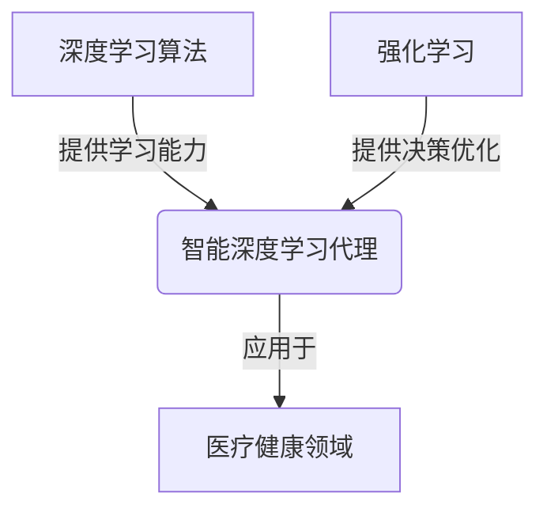
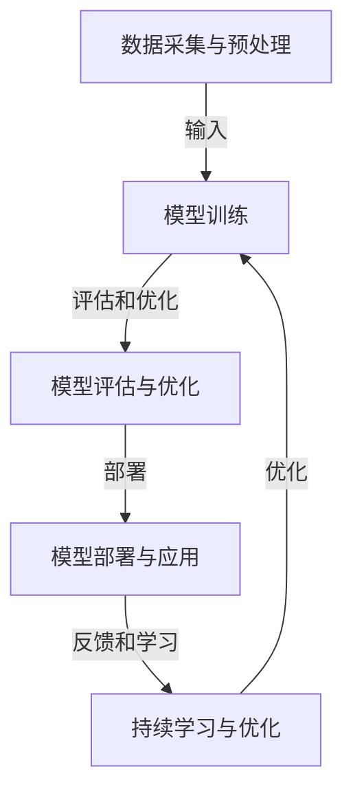

# AI人工智能深度学习算法：智能深度学习代理在健康医疗领域的应用策略

## 1.背景介绍

### 1.1 人工智能与医疗健康的融合

人工智能(AI)技术在近年来得到了前所未有的发展,尤其是深度学习算法的突破性进展,为各行业带来了革命性的变革。在医疗健康领域,AI技术的应用正在改变着传统的诊疗模式,提高了医疗服务的质量和效率。

### 1.2 智能深度学习代理的概念

智能深度学习代理(Intelligent Deep Learning Agent)是一种基于深度学习算法的人工智能系统,能够自主地感知环境、学习知识、做出决策并采取行动。这种代理通过持续学习和优化,可以在特定领域内表现出类似于人类专家的智能行为。

### 1.3 在医疗健康领域的应用前景

智能深度学习代理在医疗健康领域具有广阔的应用前景,包括疾病诊断、治疗方案制定、药物研发、医疗影像分析等多个领域。它们可以提高诊断的准确性,优化治疗方案,加快新药研发进程,从而提高医疗服务的质量和效率。

## 2.核心概念与联系

### 2.1 深度学习算法

深度学习算法是人工智能领域的一个重要分支,它模仿人脑神经网络的工作原理,通过对大量数据的学习,自动提取特征并进行模式识别和决策。常见的深度学习算法包括卷积神经网络(CNN)、递归神经网络(RNN)、长短期记忆网络(LSTM)等。

### 2.2 强化学习

强化学习(Reinforcement Learning)是机器学习的一个重要分支,它通过与环境的交互,不断试错并获得反馈,从而学习到最优策略。在医疗健康领域,强化学习可以应用于治疗方案的优化、药物剂量调整等场景。

### 2.3 智能代理

智能代理(Intelligent Agent)是一种能够感知环境、学习知识、做出决策并采取行动的自主系统。智能深度学习代理是在传统智能代理的基础上,引入了深度学习算法,从而具备了更强大的学习和决策能力。

### 2.4 核心概念的联系

智能深度学习代理是将深度学习算法、强化学习等技术融合到智能代理系统中,形成一种新型的人工智能系统。它们能够通过持续学习和优化,在特定领域内表现出类似于人类专家的智能行为,从而为医疗健康领域带来革命性的变革。



## 3.核心算法原理具体操作步骤

智能深度学习代理在医疗健康领域的应用,通常涉及以下几个核心步骤:

### 3.1 数据采集与预处理

首先需要收集相关的医疗数据,包括病历、影像、实验室检查结果等。这些数据需要进行清洗、标注和预处理,以满足深度学习算法的输入要求。

### 3.2 模型训练

根据具体的应用场景,选择合适的深度学习算法,如卷积神经网络用于医疗影像分析,循环神经网络用于电子病历分析等。将预处理后的数据输入到深度学习模型中进行训练,使模型能够学习到相关的特征和模式。

### 3.3 模型评估与优化

在训练过程中,需要持续评估模型的性能,通过调整超参数、改进网络结构等方式,不断优化模型的性能。同时,也可以引入强化学习等技术,进一步优化模型的决策策略。

### 3.4 模型部署与应用

经过充分的训练和优化后,将智能深度学习代理模型部署到实际的医疗环境中,用于疾病诊断、治疗方案制定、影像分析等应用场景。

### 3.5 持续学习与优化

在实际应用过程中,智能深度学习代理会不断接收新的数据和反馈,通过持续学习和优化,不断提高自身的性能和决策能力。



## 4.数学模型和公式详细讲解举例说明

在智能深度学习代理中,数学模型和公式扮演着重要的角色,为算法提供理论基础和计算框架。下面将详细讲解一些常见的数学模型和公式。

### 4.1 神经网络模型

神经网络是深度学习算法的核心模型,它模仿生物神经元的工作原理,通过连接多个神经元形成网络结构。一个典型的神经网络可以表示为:

$$
y = f\left(\sum_{i=1}^{n}w_ix_i + b\right)
$$

其中,$x_i$表示输入,$w_i$表示权重,$b$表示偏置项,$f$表示激活函数。通过训练,神经网络可以学习到合适的权重和偏置,从而实现特征提取和模式识别。

### 4.2 卷积神经网络

卷积神经网络(CNN)是一种常用于图像处理的深度学习模型,它通过卷积操作和池化操作来提取图像的特征。一个典型的卷积层可以表示为:

$$
x_j^l = f\left(\sum_{i\in M_j}x_i^{l-1} * k_{ij}^l + b_j^l\right)
$$

其中,$x_i^{l-1}$表示上一层的输入,$k_{ij}^l$表示卷积核,$b_j^l$表示偏置项,$f$表示激活函数,$M_j$表示输入特征图的选择区域。通过多层卷积和池化操作,CNN可以有效地提取图像的局部特征和全局特征。

### 4.3 循环神经网络

循环神经网络(RNN)是一种常用于序列数据处理的深度学习模型,它能够捕捉序列数据中的时间依赖关系。一个典型的RNN可以表示为:

$$
h_t = f_h(W_{hx}x_t + W_{hh}h_{t-1} + b_h)
$$
$$
y_t = f_y(W_{yh}h_t + b_y)
$$

其中,$x_t$表示时间步$t$的输入,$h_t$表示时间步$t$的隐藏状态,$y_t$表示时间步$t$的输出,$W$表示权重矩阵,$b$表示偏置向量,$f_h$和$f_y$表示激活函数。通过引入循环结构,RNN可以有效地处理序列数据,如自然语言处理、时序预测等。

### 4.4 强化学习算法

强化学习算法是智能深度学习代理中常用的决策优化算法,它通过与环境的交互,不断试错并获得反馈,从而学习到最优策略。一种常见的强化学习算法是Q-Learning,其核心公式为:

$$
Q(s_t, a_t) \leftarrow Q(s_t, a_t) + \alpha\left[r_t + \gamma\max_aQ(s_{t+1}, a) - Q(s_t, a_t)\right]
$$

其中,$s_t$表示时间步$t$的状态,$a_t$表示时间步$t$的动作,$r_t$表示时间步$t$的即时奖励,$\alpha$表示学习率,$\gamma$表示折扣因子。通过不断更新Q值函数,强化学习算法可以找到最优的决策策略。

这些数学模型和公式为智能深度学习代理提供了理论基础和计算框架,在实际应用中会根据具体场景进行调整和优化。

## 5.项目实践:代码实例和详细解释说明

为了更好地理解智能深度学习代理在医疗健康领域的应用,我们将通过一个具体的代码实例来进行说明。这个实例是一个基于卷积神经网络的医疗影像分析系统,用于检测和分类肺部CT扫描图像中的肺结节。

### 5.1 数据准备

首先,我们需要准备一个包含肺部CT扫描图像的数据集。这个数据集应该包含已经标注好的肺结节位置和类型信息。我们将数据集划分为训练集、验证集和测试集。

```python
import os
import numpy as np
from PIL import Image
from sklearn.model_selection import train_test_split

# 加载数据集
data_dir = 'lung_ct_dataset'
images = []
labels = []

for label in os.listdir(data_dir):
    label_dir = os.path.join(data_dir, label)
    for image_file in os.listdir(label_dir):
        image_path = os.path.join(label_dir, image_file)
        image = Image.open(image_path)
        image = image.resize((64, 64))
        image = np.array(image) / 255.0
        images.append(image)
        labels.append(label)

images = np.array(images)
labels = np.array(labels)

# 划分数据集
X_train, X_test, y_train, y_test = train_test_split(images, labels, test_size=0.2, random_state=42)
X_train, X_val, y_train, y_val = train_test_split(X_train, y_train, test_size=0.2, random_state=42)
```

### 5.2 建立卷积神经网络模型

接下来,我们将使用Keras库构建一个卷积神经网络模型,用于对肺部CT扫描图像进行分类。

```python
from keras.models import Sequential
from keras.layers import Conv2D, MaxPooling2D, Flatten, Dense, Dropout

# 构建模型
model = Sequential()
model.add(Conv2D(32, (3, 3), activation='relu', input_shape=(64, 64, 3)))
model.add(MaxPooling2D((2, 2)))
model.add(Conv2D(64, (3, 3), activation='relu'))
model.add(MaxPooling2D((2, 2)))
model.add(Conv2D(128, (3, 3), activation='relu'))
model.add(MaxPooling2D((2, 2)))
model.add(Flatten())
model.add(Dense(128, activation='relu'))
model.add(Dropout(0.5))
model.add(Dense(64, activation='relu'))
model.add(Dropout(0.5))
model.add(Dense(2, activation='softmax'))

# 编译模型
model.compile(optimizer='adam', loss='sparse_categorical_crossentropy', metrics=['accuracy'])
```

### 5.3 训练和评估模型

现在,我们可以使用准备好的数据集来训练和评估卷积神经网络模型。

```python
# 训练模型
epochs = 50
batch_size = 32

model.fit(X_train, y_train,
          batch_size=batch_size,
          epochs=epochs,
          validation_data=(X_val, y_val))

# 评估模型
test_loss, test_acc = model.evaluate(X_test, y_test)
print(f'Test accuracy: {test_acc:.4f}')
```

在训练过程中,模型会不断优化权重和偏置,以最小化损失函数。通过在验证集上评估模型的性能,我们可以监控模型是否过拟合,并在必要时进行调整和优化。

### 5.4 模型部署和应用

经过充分的训练和评估后,我们可以将这个卷积神经网络模型部署到实际的医疗环境中,用于对新的肺部CT扫描图像进行分析和诊断。

```python
# 加载新的图像
new_image = Image.open('new_ct_scan.png')
new_image = new_image.resize((64, 64))
new_image = np.array(new_image) / 255.0
new_image = np.expand_dims(new_image, axis=0)

# 使用模型进行预测
prediction = model.predict(new_image)
if np.argmax(prediction) == 0:
    print('该图像中没有发现肺结节')
else:
    print('该图像中存在肺结节')
```

在实际应用中,我们还可以将这个模型与其他智能深度学习代理模块集成,如自然语言处理模块、决策优化模块等,从而构建一个更加完整和智能化的医疗辅助系统。

通过这个代码实例,我们可以看到智能深度学习代理在医疗影像分析领域的具体应用。同样的原理也可以扩展到其他医疗健康领域,如疾病诊断、治疗方