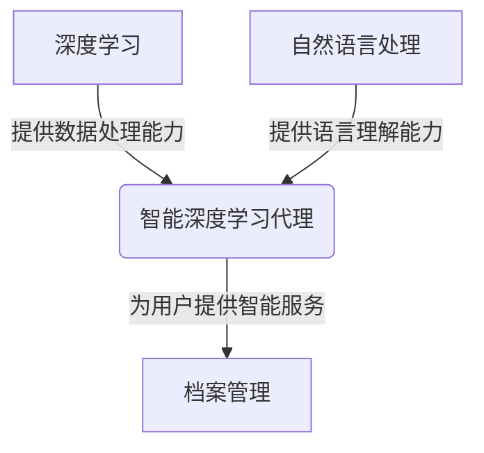

# AI人工智能深度学习算法：智能深度学习代理在档案管理中的应用

## 1.背景介绍

### 1.1 档案管理的重要性

在当今信息时代,数据和信息的管理变得前所未有的重要。无论是政府机构、企业还是个人,都需要妥善保存和管理大量的文件、记录和其他形式的数据。有效的档案管理不仅有助于保护重要信息免受丢失或损坏,还可以提高工作效率,降低运营成本,并确保符合法律法规要求。

### 1.2 传统档案管理的挑战

然而,传统的档案管理方式面临着诸多挑战:

- **大量文档**:随着时间的推移,组织机构积累了大量的文件和记录,手动管理和检索变得越来越困难。
- **多种格式**:档案可能存在于纸质、电子或多媒体等多种格式,增加了管理的复杂性。
- **元数据缺失**:缺乏有效的元数据标准化,导致难以准确描述和检索档案。
- **访问控制**:需要有效的访问控制机制来保护敏感信息,同时确保授权用户可以访问所需的档案。
- **长期保存**:确保档案在长期保存期间的可读性和完整性是一个巨大的挑战。

### 1.3 人工智能在档案管理中的应用

为了应对这些挑战,人工智能(AI)技术在档案管理领域得到了广泛应用。通过利用机器学习、自然语言处理、计算机视觉等技术,智能系统可以自动化和优化档案管理的各个方面,从而提高效率、降低成本,并确保信息的安全性和可访问性。

## 2.核心概念与联系

### 2.1 深度学习

深度学习是机器学习的一个子领域,它利用深层神经网络模型来学习数据的特征表示,并执行各种任务,如分类、回归、聚类等。与传统的机器学习算法相比,深度学习模型可以自动从原始数据中提取高级特征,而不需要人工设计特征提取器。

在档案管理领域,深度学习可以应用于以下任务:

- **文本分类**:自动将档案文件按主题、类型或其他标准进行分类。
- **信息提取**:从非结构化文本中提取关键信息,如人名、地点、日期等。
- **文本摘要**:自动生成文档的摘要,方便快速浏览和理解内容。
- **图像识别**:识别和分类档案中的图像、照片等多媒体内容。

### 2.2 自然语言处理(NLP)

自然语言处理(NLP)是一个研究计算机理解和生成人类语言的领域。它涉及多种技术,如语音识别、机器翻译、文本挖掘等。在档案管理中,NLP可以用于以下任务:

- **文本预处理**:对文本进行分词、词性标注、命名实体识别等预处理,为后续任务做准备。
- **语义理解**:深入理解文本的语义含义,捕捉上下文信息和隐含意义。
- **知识图谱构建**:从大量文本中自动构建知识图谱,表示实体之间的关系。
- **问答系统**:基于档案内容,构建智能问答系统,回答用户的查询。

### 2.3 智能代理

智能代理是一种自主的软件实体,能够感知环境、处理信息、做出决策并采取行动。在档案管理中,智能代理可以作为用户与系统之间的中介,提供个性化的服务和协助。

智能代理可以执行以下任务:

- **信息检索**:根据用户的需求,从海量档案中智能检索相关信息。
- **任务自动化**:自动执行一些常规的档案管理任务,如分类、索引、备份等。
- **决策支持**:基于档案数据和规则,为用户提供决策建议。
- **协作管理**:协调多个用户对档案的访问和编辑,确保信息的一致性和安全性。

### 2.4 核心概念关系

上述三个核心概念密切相关,共同构建了智能深度学习代理在档案管理中的应用。深度学习提供了强大的数据处理和模式识别能力;NLP赋予系统理解和处理自然语言的能力;而智能代理则将这些技术集成,为用户提供个性化的智能服务。

下图展示了这三个概念之间的关系:



## 3.核心算法原理具体操作步骤

### 3.1 文本分类算法

文本分类是将给定的文本文档分配到预定义的类别或主题中,是档案管理中一项基础且重要的任务。常用的文本分类算法包括朴素贝叶斯、支持向量机(SVM)、逻辑回归等。以下是基于深度学习的文本分类算法的一般步骤:

1. **文本预处理**:对原始文本进行分词、去停用词、词干提取等预处理,将文本转换为词袋或n-gram等特征表示。

2. **词嵌入**:使用Word2Vec、GloVe等模型将词转换为dense向量表示,作为神经网络的输入。

3. **模型构建**:构建深度神经网络模型,常用的有卷积神经网络(CNN)、循环神经网络(RNN)、注意力机制等。

4. **模型训练**:使用标注好的文本数据集对模型进行训练,通过反向传播算法不断调整模型参数,使其能够很好地区分不同类别的文本。

5. **模型评估**:在测试集上评估模型的分类性能,常用指标包括准确率、精确率、召回率、F1值等。

6. **模型调优**:根据评估结果,通过调整超参数、增加训练数据、特征工程等方式来提高模型性能。

7. **模型部署**:将训练好的模型集成到档案管理系统中,用于自动对新文档进行分类。

下面是一个使用Keras构建文本分类CNN模型的简单示例:

```python
from keras.models import Sequential
from keras.layers import Dense, Dropout, Activation
from keras.layers import Embedding
from keras.layers import Conv1D, GlobalMaxPooling1D

# 嵌入层
model = Sequential()
model.add(Embedding(max_words, embedding_dim, input_length=max_len))

# 卷积层和池化层
model.add(Conv1D(filters, kernel_size, padding='valid', activation='relu', strides=1))
model.add(GlobalMaxPooling1D())

# 全连接层
model.add(Dense(256))
model.add(Dropout(0.2))
model.add(Activation('relu'))

# 输出层
model.add(Dense(num_classes))
model.add(Activation('softmax'))

# 编译模型
model.compile(loss='categorical_crossentropy', optimizer='adam', metrics=['accuracy'])

# 训练模型
model.fit(X_train, y_train, batch_size=128, epochs=10, validation_data=(X_val, y_val))
```

### 3.2 信息提取算法

信息提取旨在从非结构化文本中自动提取出结构化的信息,如命名实体、事件、关系等。这对于从大量档案文件中提取关键信息非常有用。常见的信息提取算法包括基于规则的方法、统计机器学习方法和深度学习方法。以下是基于深度学习的信息提取算法的一般步骤:

1. **语料标注**:首先需要标注一个包含所需信息类型的语料库,作为训练数据集。

2. **词嵌入**:将文本转换为词嵌入向量表示,作为神经网络的输入。

3. **编码器**:使用BiLSTM、Transformer等模型对输入序列进行编码,获取上下文语义信息。

4. **解码器**:根据编码器的输出,使用CRF、Pointer Network等解码器模型预测所需的标签序列。

5. **模型训练**:使用标注好的语料库对模型进行训练,通过反向传播算法调整参数。

6. **模型评估**:在测试集上评估模型的信息提取性能,常用指标包括精确率、召回率、F1值等。

7. **模型调优**:根据评估结果,通过调整超参数、数据增强、迁移学习等方式提高模型性能。

8. **模型部署**:将训练好的模型集成到档案管理系统中,用于自动从文档中提取关键信息。

以下是一个使用Bi-LSTM+CRF进行命名实体识别的PyTorch示例:

```python
import torch
import torch.nn as nn
import torch.optim as optim

class BiLSTM_CRF(nn.Module):
    def __init__(self, vocab_size, tag_to_ix, embedding_dim, hidden_dim):
        super(BiLSTM_CRF, self).__init__()
        self.embedding_dim = embedding_dim
        self.hidden_dim = hidden_dim
        self.vocab_size = vocab_size
        self.tag_to_ix = tag_to_ix
        self.tagset_size = len(tag_to_ix)

        self.word_embeds = nn.Embedding(vocab_size, embedding_dim)
        self.lstm = nn.LSTM(embedding_dim, hidden_dim // 2,
                            num_layers=1, bidirectional=True)

        self.hidden2tag = nn.Linear(hidden_dim, self.tagset_size)
        self.crf = CRF(self.tagset_size)

    def forward(self, sentence, tags):
        # 获取 LSTM 最后一层的输出
        embeds = self.word_embeds(sentence)
        lstm_out, _ = self.lstm(embeds)
        lstm_feats = self.hidden2tag(lstm_out)

        # 计算 CRF 损失
        crf_loss = self.crf.neg_log_likelihood(lstm_feats, tags)
        return crf_loss

    def predict(self, sentence):
        # 获取 LSTM 最后一层的输出
        embeds = self.word_embeds(sentence)
        lstm_out, _ = self.lstm(embeds)
        lstm_feats = self.hidden2tag(lstm_out)

        # 解码路径
        return self.crf.decode(lstm_feats)
```

### 3.3 文本摘要算法

自动文本摘要是指从原始文本中提取出简洁的摘要,以概括文本的主要内容。在档案管理中,文本摘要可以帮助用户快速浏览和理解大量文档的核心内容。常见的文本摘要算法包括基于提取的方法和基于生成的方法。以下是基于序列到序列(Seq2Seq)模型的文本摘要算法步骤:

1. **语料准备**:收集包含文档及其对应摘要的语料库,作为训练数据集。

2. **文本预处理**:对原始文本进行分词、词性标注等预处理,将文本转换为词序列表示。

3. **词嵌入**:使用预训练的词嵌入模型(如Word2Vec、BERT等)将词转换为向量表示。

4. **编码器**:使用RNN(如LSTM或GRU)或Transformer等模型对输入文档进行编码,获取其语义表示。

5. **解码器**:使用另一个RNN或Transformer作为解码器,根据编码器的输出生成摘要文本。

6. **注意力机制**:引入注意力机制,使解码器能够关注输入序列中与当前生成词相关的部分。

7. **模型训练**:使用带有文档和摘要对的语料库对Seq2Seq模型进行训练,通过反向传播算法调整参数。

8. **模型评估**:在测试集上评估生成摘要的质量,常用指标包括ROUGE分数、BLEU分数等。

9. **模型调优**:根据评估结果,通过调整超参数、数据增强、模型结构改进等方式提高摘要质量。

10. **模型部署**:将训练好的模型集成到档案管理系统中,用于自动生成文档摘要。

以下是一个使用PyTorch实现的Seq2Seq文本摘要模型示例:

```python
import torch
import torch.nn as nn
import torch.nn.functional as F

class Seq2Seq(nn.Module):
    def __init__(self, encoder, decoder, device):
        super().__init__()
        self.encoder = encoder
        self.decoder = decoder
        self.device = device

    def forward(self, source, target, teacher_force_ratio=0.5):
        batch_size = source.shape[1]
        target_len = target.shape[0]
        target_vocab_size = self.decoder.vocab_size

        outputs = torch.zeros(target_len, batch_size, target_vocab_size).to(self.device)

        encoder