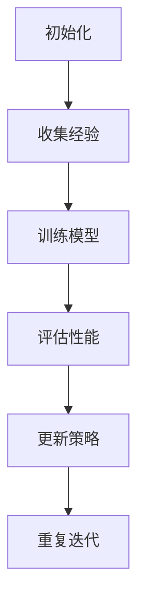

                 

作者：禅与计算机程序设计艺术

Artificial Intelligence，是人类赋予机器的一种能力，使其能够在没有明确编程的情况下从经验中学习和适应。而深度学习则是AI的一个分支，它通过模仿人脑神经网络的工作方式，实现对复杂模式的识别和分析。本文旨在探讨智能深度学习代理如何高效地执行任务处理流程，并将其应用到实际场景中。为了使讨论更加具体且具有指导性，我们将结合实际案例来阐述这一过程的关键环节。

## 2. 核心概念与联系
深度学习的核心在于其多层次的神经网络结构。每一层都负责提取不同层次的特征表示，从原始输入中逐步抽象出更为复杂的概念。这种逐层递进的特征提取机制使得深度学习系统能够自动发现数据内部的关联和规律。

### 关键概念:
1. **神经元**: 模拟生物大脑中的细胞，接收输入信号，经过加权求和后传递至下一层。
2. **激活函数**: 用于非线性变换，增强网络的学习能力，使得模型能够逼近任意连续函数。
3. **反向传播**: 优化权重的过程，根据损失函数的梯度调整参数，以最小化预测结果与真实值之间的差异。
4. **卷积层**: 特别适用于图像处理，利用滑动窗口扫描输入数据，通过权重矩阵检测特定模式。
5. **池化层**: 减少空间维度，降低计算量的同时保持重要特征不变。

这些概念相互交织，在深度学习模型构建过程中发挥着关键作用。

## 3. 核心算法原理与具体操作步骤
以深度强化学习为例，智能代理通过与环境互动，学习最优行为策略。以下是一般流程:



### 步骤详解:
1. **初始化**：设定初始状态，如随机策略或预设规则。
2. **收集经验**：代理采取行动，观察结果，并记录为经验数据集。
3. **训练模型**：使用强化学习算法（如Q-learning, SARSA, DQN）更新模型参数，目标是最优策略。
4. **评估性能**：基于当前模型，代理尝试新策略，并评价其效果。
5. **更新策略**：根据评估结果调整策略，以提高预期收益。
6. **重复迭代**：循环执行以上步骤直至达到停止条件或收敛于满意策略。

## 4. 数学模型和公式详细讲解举例说明
在深度学习中，多层感知机(Layered Perceptron)是一个典型的例子。其目标函数常采用交叉熵损失函数(Cross Entropy Loss)，表述如下:

$$
L = - \sum_{i=1}^{n} y_i \log(p_i)
$$

其中，$y_i$ 是真实的类别标签（0 或 1），$p_i$ 是模型预测的概率。该损失函数量化了预测概率分布与实际标签之间的不匹配程度，指导模型通过梯度下降法不断优化参数。

## 5. 项目实践：代码实例和详细解释说明
下面是一个简单的神经网络构建示例，使用Python的Keras库进行深度学习模型训练：

```python
from keras.models import Sequential
from keras.layers import Dense

model = Sequential()
model.add(Dense(32, input_dim=100, activation='relu')) # 第一个隐藏层
model.add(Dense(1, activation='sigmoid')) # 输出层

model.compile(loss='binary_crossentropy', optimizer='adam', metrics=['accuracy'])

# 假设X_train, Y_train已经准备好
model.fit(X_train, Y_train, epochs=100, batch_size=32)

# 预测新数据点
predictions = model.predict(X_test)
```

这段代码展示了创建一个多层感知机的基本步骤：定义模型架构、编译模型、训练模型以及对测试集进行预测。

## 6. 实际应用场景
深度学习已广泛应用于各类领域，包括但不限于自然语言处理、计算机视觉、自动驾驶等。例如，在图像分类任务中，深度学习模型可以准确识别并区分不同种类的物体。

## 7. 工具和资源推荐
- TensorFlow 和 Keras：提供丰富的API和强大的功能支持。
- PyTorch：灵活性高，适合快速原型开发和实验。
- OpenCV：专注于计算机视觉领域的开源库，集成多种图像处理和机器学习方法。

## 8. 总结：未来发展趋势与挑战
随着硬件加速技术的进步和大规模数据集的可用，深度学习将继续快速发展。未来的发展趋势可能包括更高效的算法设计、跨模态融合的应用探索、可解释性和公平性的提升，以及伦理问题的研究。同时，应对数据隐私保护、模型泛化能力不足等问题也是研究者面临的重要挑战。

## 9. 附录：常见问题与解答
常见的问题包括模型过拟合、欠拟合、选择合适的超参数等。解决这些问题通常需要数据增广、正则化技术、调整学习率等方法。此外，对于初学者来说，理解基础数学概念（如微积分、概率论）、熟悉编程环境（Python、R等）以及掌握基本的数据预处理技巧是入门的关键。

通过本文的探讨，我们深入了解了深度学习代理如何高效地执行任务处理流程，并将其应用到实际场景中。从理论到实践，从核心概念到具体案例，旨在为读者提供全面深入的技术洞察。未来，随着技术的不断创新和发展，深度学习将在更多领域展现出更大的潜力和价值。

