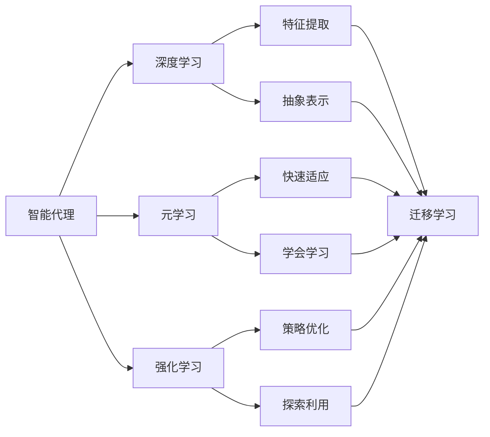

# AI人工智能深度学习算法：智能深度学习代理的动态调整与情境智能

## 1. 背景介绍
### 1.1 人工智能的发展历程
人工智能(Artificial Intelligence, AI)作为计算机科学的一个分支,其研究目标是开发能够模拟人类智能的计算机系统。自1956年达特茅斯会议首次提出"人工智能"的概念以来,AI经历了从早期的符号主义、专家系统,到机器学习、深度学习,再到如今的认知智能、类脑智能等多个发展阶段。

### 1.2 深度学习的兴起
近年来,以深度学习(Deep Learning, DL)为代表的人工智能技术取得了突破性进展。DL通过构建包含多个隐藏层的人工神经网络,并利用大规模数据对网络进行训练,使得计算机系统能够自动学习数据中蕴含的高层特征和抽象表示,从而大大提升了包括计算机视觉、语音识别、自然语言处理等领域的性能表现。

### 1.3 智能代理面临的挑战
尽管DL在多个领域取得了瞩目成就,但目前的DL系统在灵活性、适应性、泛化能力等方面仍存在局限。传统的DL模型大多是针对特定任务和场景而设计,缺乏根据环境变化动态调整的能力。此外,DL系统难以利用先验知识,对小样本学习、增量学习、迁移学习等能力有限。因此,如何构建具备自主学习、持续进化、知识迁移等能力的智能DL代理,实现情境智能,是当前AI研究亟待解决的关键问题。

## 2. 核心概念与联系
### 2.1 智能代理 
智能代理(Intelligent Agent)是指能够感知环境并采取行动以实现特定目标的自主实体。一个典型的智能代理通常包含感知、推理、决策、执行等模块。

### 2.2 深度学习
深度学习是一类基于人工神经网络的机器学习方法。DL模型利用多层次的特征提取和抽象,从大规模数据中自动学习数据的内在模式和表示。

### 2.3 元学习
元学习(Meta-Learning)也称学习去学习(Learning to Learn),其目标是训练一个能够快速适应新任务的学习器。元学习器不是直接学习任务本身,而是学习如何学习,从而提升学习的效率和泛化能力。

### 2.4 强化学习
强化学习(Reinforcement Learning, RL)是一种试错式学习范式。RL智能体通过与环境的交互,根据环境反馈的奖励信号不断优化自身策略,最终学会执行特定任务。

### 2.5 迁移学习
迁移学习(Transfer Learning)是指利用已学习的知识来辅助新任务的学习。通过在不同但相关的任务间进行知识迁移,可以减少新任务所需的数据量和训练时间。

### 2.6 概念之间的关系
下图展示了上述核心概念之间的关系:



智能代理利用深度学习、元学习、强化学习等技术,通过特征提取、抽象表示、策略优化、探索利用等机制,实现快速适应、学会学习的能力,并利用迁移学习在不同任务间共享知识,从而提升智能代理的泛化和学习效率。

## 3. 核心算法原理与操作步骤
### 3.1 基于梯度的元学习(MAML)
MAML(Model-Agnostic Meta-Learning)是一种广泛使用的元学习算法。其核心思想是学习一个对新任务具有良好初始化效果的模型参数。MAML的主要步骤如下:

1. 随机初始化一个神经网络模型的参数$\theta$
2. 从任务分布中采样一批任务$\{\mathcal{T}_i\}$
3. 对每个任务$\mathcal{T}_i$:
   a. 用$\theta$初始化模型,在任务的训练集上计算损失$\mathcal{L}_{\mathcal{T}_i}$
   b. 执行一次或多次梯度下降,得到任务专属参数$\theta_i'=\theta-\alpha\nabla_{\theta}\mathcal{L}_{\mathcal{T}_i}(\theta)$
   c. 在任务的测试集上用更新后的$\theta_i'$计算损失$\mathcal{L}_{\mathcal{T}_i}(\theta_i')$
4. 更新元模型参数:$\theta\leftarrow\theta-\beta\nabla_{\theta}\sum_{\mathcal{T}_i}\mathcal{L}_{\mathcal{T}_i}(\theta_i')$
5. 重复步骤2-4,直到$\theta$收敛

其中$\alpha$和$\beta$分别是任务内和任务间的学习率。通过优化元模型参数$\theta$,使其能在新任务上经过少量梯度步就取得较好性能,从而实现快速适应。

### 3.2 soft actor-critic(SAC)
SAC是一种基于最大熵的off-policy强化学习算法。相比标准RL算法,SAC通过引入熵正则化项,在最大化期望回报的同时,也最大化策略的熵,使得智能体能学习到更加稳定和鲁棒的策略。SAC的主要步骤如下:

1. 随机初始化策略网络$\pi_{\phi}$、Q值网络$Q_{\theta_1}$和$Q_{\theta_2}$
2. 初始化经验回放池$\mathcal{D}$
3. for each episode:
   a. 根据策略$\pi_{\phi}$与环境交互,收集轨迹数据$\{(s_t,a_t,r_t,s_{t+1})\}$
   b. 将轨迹数据存入经验回放池$\mathcal{D}$
   c. 从$\mathcal{D}$中采样一批转移数据$\{(s,a,r,s')\}$
   d. 计算Q值目标:
      $y=r+\gamma(\min_{i=1,2}Q_{\theta_i}(s',\tilde{a}')-\alpha\log\pi_{\phi}(\tilde{a}'|s'))$,
      其中$\tilde{a}'\sim\pi_{\phi}(\cdot|s')$
   e. 优化Q值网络:
      $\theta_i\leftarrow\arg\min_{\theta_i}\frac{1}{|B|}\sum_{(s,a,r,s')\in B}(Q_{\theta_i}(s,a)-y)^2$
   f. 优化策略网络:
      $\phi\leftarrow\arg\max_{\phi}\frac{1}{|B|}\sum_{s\in B}(\min_{i=1,2}Q_{\theta_i}(s,\tilde{a})-\alpha\log\pi_{\phi}(\tilde{a}|s))$,
      其中$\tilde{a}\sim\pi_{\phi}(\cdot|s)$
   g. 根据目标更新率$\tau$对目标Q网络进行软更新:
      $\theta_i'\leftarrow\tau\theta_i+(1-\tau)\theta_i',\quad i=1,2$
      
其中$\alpha$是控制探索-利用的温度参数。SAC通过优化策略和Q值函数,使得智能体能学习到最大化长期回报和策略熵的策略,在提升采样效率的同时保持探索。

## 4. 数学模型与公式详解
### 4.1 策略梯度定理
策略梯度定理给出了期望回报$J(\theta)$对策略参数$\theta$的梯度:

$$
\nabla_{\theta}J(\theta)=\mathbb{E}_{\tau\sim p_{\theta}(\tau)}\left[\sum_{t=0}^{T}\nabla_{\theta}\log\pi_{\theta}(a_t|s_t)Q^{\pi}(s_t,a_t)\right]
$$

其中$\tau$表示轨迹$(s_0,a_0,s_1,a_1,\dots)$,$p_{\theta}(\tau)$是轨迹的概率分布,$Q^{\pi}(s_t,a_t)$是在状态$s_t$下采取动作$a_t$的动作值函数。该定理说明,策略梯度正比于动作概率对数的梯度和动作值函数的乘积在轨迹上的期望。直观地,它意味着应该提高导致高回报的动作的概率,降低导致低回报的动作的概率。

### 4.2 最大熵强化学习
最大熵RL在标准RL目标的基础上引入策略熵正则化项:

$$
J(\theta)=\sum_{t=0}^{T}\mathbb{E}_{(s_t,a_t)\sim\rho_{\pi}}\left[r(s_t,a_t)+\alpha\mathcal{H}(\pi(\cdot|s_t))\right]
$$

其中$\rho_{\pi}$是状态-动作边缘分布,$\mathcal{H}(\pi(\cdot|s_t))$是在状态$s_t$下策略$\pi$的熵。通过最大化目标$J(\theta)$,智能体不仅追求最大化累积回报,也倾向于学习具有更大熵的策略。熵项鼓励策略在每个状态下尽可能随机,增加探索,使得算法更稳定、更鲁棒。

### 4.3 变分推断
变分推断是一种用于近似复杂概率分布的技术。其基本思想是引入一个参数化的变分分布$q_{\phi}(z)$来近似真实的后验分布$p(z|x)$。通过最小化变分分布和真实后验之间的KL散度,得到后验分布的最优近似:

$$
\phi^*=\arg\min_{\phi}\mathrm{KL}(q_{\phi}(z)||p(z|x))
$$

在实践中,常最小化变分下界(ELBO)的负值:

$$
\mathcal{L}(\phi)=\mathbb{E}_{q_{\phi}(z)}[\log q_{\phi}(z)-\log p(x,z)]
$$

最小化ELBO等价于最小化KL散度。变分推断为复杂模型的推断提供了一种原则性和高效的框架,在深度生成模型、元学习等领域有广泛应用。

## 5. 项目实践：代码实例与详解
下面以PyTorch为例,给出MAML算法的简要实现:

```python
import torch
import torch.nn as nn
import torch.optim as optim

class MAML(nn.Module):
    def __init__(self, model, inner_lr, outer_lr, inner_steps):
        super(MAML, self).__init__()
        self.model = model
        self.inner_lr = inner_lr
        self.outer_lr = outer_lr
        self.inner_steps = inner_steps
        
    def forward(self, support_data, query_data):
        # 元训练阶段
        fast_weights = list(self.model.parameters())
        for _ in range(self.inner_steps):
            support_loss = self.model.forward(support_data)
            grads = torch.autograd.grad(support_loss, fast_weights, create_graph=True)
            fast_weights = [w - self.inner_lr * g for w, g in zip(fast_weights, grads)]
        
        # 元测试阶段
        query_loss = self.model.forward(query_data, params=fast_weights)
        return query_loss
    
    def outer_update(self, support_data, query_data):
        query_loss = self.forward(support_data, query_data)
        self.model.zero_grad()
        query_loss.backward()
        outer_optimizer = optim.Adam(self.model.parameters(), lr=self.outer_lr)
        outer_optimizer.step()

# 使用示例
model = MyModel()  # 定义任务模型
maml = MAML(model, inner_lr=0.01, outer_lr=0.001, inner_steps=5)

for epoch in range(num_epochs):
    for support_data, query_data in dataloader:
        maml.outer_update(support_data, query_data)
```

以上代码展示了MAML的核心实现逻辑:
1. 定义一个MAML元模型,包装任务模型,指定内外循环学习率和内循环步数
2. 元训练阶段,在支持集上对模型进行多步梯度下降,得到任务专属参数
3. 元测试阶段,用任务专属参数在查询集上计算损失
4. 外循环中,对查询集损失进行梯度反传,更新元模型参数

通过这种内外循环优化,MAML学习到一个对新任务具有良好初始化效果的模型参数。在新任务上,只需几步梯度下降