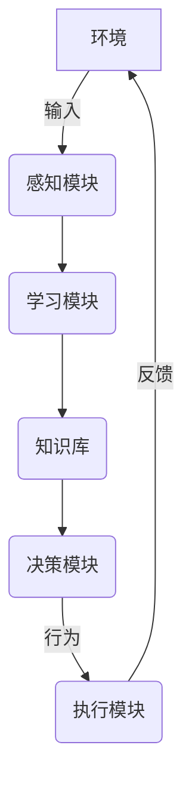

# AI人工智能深度学习算法：智能深度学习代理的构建基础

## 1.背景介绍

### 1.1 人工智能的兴起

人工智能(Artificial Intelligence, AI)是当代科技发展的重要领域,近年来受到了前所未有的关注和投入。随着计算能力的不断提升、大数据时代的到来以及机器学习算法的突破性进展,人工智能技术得以广泛应用于各个领域,正在深刻改变着人类的生产和生活方式。

### 1.2 深度学习的崛起

深度学习(Deep Learning)作为机器学习的一个新的研究热点,是人工智能领域的核心驱动力量。它模仿人脑的神经网络结构和信息传递规则,通过对大量数据的训练,自动学习数据特征表示,并用于分析和预测。相比传统的机器学习算法,深度学习在计算机视觉、自然语言处理、语音识别等领域展现出了卓越的性能表现。

### 1.3 智能代理的需求

随着人工智能和深度学习技术的不断发展,构建智能代理(Intelligent Agent)成为了一个重要目标。智能代理指能够感知环境、学习知识、制定计划、做出决策并执行行为的自主系统。它们可广泛应用于机器人控制、游戏AI、智能助理、自动驾驶等领域,极大提高了系统的智能化水平。

## 2.核心概念与联系  

### 2.1 深度学习模型

深度学习模型是构建智能代理的核心,主要包括以下几种:

#### 2.1.1 人工神经网络(Artificial Neural Network)

人工神经网络是深度学习最基础的模型,它模拟生物神经网络的结构和工作原理。通过对大量训练数据的学习,神经网络可以自动提取数据特征,并对新数据进行分类或预测。

#### 2.1.2 卷积神经网络(Convolutional Neural Network, CNN)

CNN是应用于图像和视频领域的一种高效的深度神经网络结构,它能够自动学习图像的层次模式,在计算机视觉任务中表现出色。

#### 2.1.3 循环神经网络(Recurrent Neural Network, RNN)

RNN擅长处理序列数据,如文本、语音等。它通过内部循环机制对序列进行建模,可用于自然语言处理、语音识别等任务。

#### 2.1.4 生成对抗网络(Generative Adversarial Network, GAN)

GAN由生成网络和判别网络组成,两者相互对抗以产生逼真的数据分布,在图像生成、语音合成等领域有广泛应用。

#### 2.1.5 强化学习(Reinforcement Learning)

强化学习是一种基于环境交互的学习方式,智能代理通过试错不断优化策略,以获得最大的累积奖励。这种方法在机器人控制、游戏AI等领域有重要应用。

### 2.2 深度学习框架

为了方便构建和应用深度学习模型,研究人员开发了多种深度学习框架,主要包括:

- TensorFlow: Google开源的符号数学计算框架,支持多种深度学习模型。
- PyTorch: Facebook开源的基于Python的深度学习框架,具有动态计算图和良好的可扩展性。
- Keras: 高度模块化的神经网络库,可在TensorFlow或Theano之上运行。
- MXNet: 支持多种编程语言的高效分布式深度学习框架。
- Caffe: 加州大学伯克利分校开发的深度学习框架,专注于视觉领域。

### 2.3 智能代理架构

智能代理的架构通常由以下几个核心模块组成:

1. **感知模块**: 接收来自环境的各种输入数据,如图像、语音、文本等。
2. **学习模块**: 使用深度学习模型对输入数据进行特征提取和模式识别。
3. **决策模块**: 根据学习到的知识,制定行为策略并做出决策。
4. **执行模块**: 将决策转化为具体的行为,并反馈给环境。
5. **知识库**: 存储代理学习到的知识,为决策提供支持。

智能代理的架构可根据具体应用场景进行优化和定制,以满足不同的功能需求。

## 3.核心算法原理具体操作步骤

构建智能深度学习代理涉及多种算法和模型,下面将介绍其中几种核心算法的原理和操作步骤。

### 3.1 人工神经网络

人工神经网络是深度学习的基础模型,其工作原理模拟生物神经元的信息传递过程。一个典型的人工神经网络由输入层、隐藏层和输出层组成,每层由多个神经元节点构成。

#### 3.1.1 前向传播

在前向传播过程中,输入数据经过加权求和和激活函数的处理,层层传递到输出层,产生最终的输出结果。数学表达式如下:

$$
y = f\left(\sum_{i=1}^{n}w_ix_i + b\right)
$$

其中:
- $x_i$是输入数据
- $w_i$是对应的权重参数
- $b$是偏置参数
- $f$是激活函数,如Sigmoid、ReLU等

#### 3.1.2 反向传播

为了使神经网络能够学习,需要通过反向传播算法对权重参数进行调整。反向传播的核心思想是:计算输出结果与期望目标之间的误差,并沿着神经网络的反方向,递归地计算每个节点误差对权重的梯度,根据梯度下降法更新权重参数。

具体操作步骤如下:

1. 前向传播计算输出
2. 计算输出层节点的误差
3. 反向计算隐藏层节点的误差
4. 计算每个权重的梯度
5. 使用优化算法(如梯度下降)更新权重

通过多次迭代,神经网络可以不断减小误差,逐步拟合训练数据的特征。

### 3.2 卷积神经网络

卷积神经网络(CNN)是一种专门用于处理图像数据的深度神经网络,它的核心思想是通过卷积操作自动提取图像的局部特征。

#### 3.2.1 卷积层

卷积层是CNN的核心组成部分,它由多个卷积核(滤波器)组成。每个卷积核在输入图像上滑动,计算局部区域的加权和,生成一个特征映射(Feature Map)。数学表达式如下:

$$
F(i,j) = \sum_{m}\sum_{n}I(i+m,j+n)K(m,n)
$$

其中:
- $I$是输入图像
- $K$是卷积核
- $F$是输出的特征映射

通过多个卷积核和多层卷积操作,CNN可以逐步提取图像的低级、中级和高级语义特征。

#### 3.2.2 池化层

池化层用于降低特征映射的分辨率,减少计算量和防止过拟合。常用的池化操作有最大池化(Max Pooling)和平均池化(Average Pooling)。

#### 3.2.3 全连接层

CNN的最后几层通常是全连接层,它将前面卷积层和池化层提取的高级特征映射为一个向量,并输入到分类器或回归器中,得到最终的输出结果。

### 3.3 循环神经网络

循环神经网络(RNN)擅长处理序列数据,如文本、语音等。它的核心思想是在网络中引入循环连接,使得当前时刻的输出不仅取决于当前输入,还取决于前一时刻的隐藏状态。

#### 3.3.1 RNN基本结构

一个基本的RNN单元可以表示为:

$$
h_t = f_W(x_t, h_{t-1})
$$

其中:
- $x_t$是当前时刻的输入
- $h_{t-1}$是前一时刻的隐藏状态
- $f_W$是循环函数,包含可训练的权重参数$W$

通过不断迭代,RNN可以捕捉序列数据中的长期依赖关系。

#### 3.3.2 长短期记忆网络(LSTM)

传统RNN存在梯度消失或爆炸的问题,难以学习长期依赖关系。长短期记忆网络(LSTM)通过引入门控机制,可以更好地捕捉长期依赖关系。

LSTM的核心思想是在每个时刻,通过遗忘门、输入门和输出门控制信息的流动,从而决定保留和丢弃哪些信息。这使得LSTM能够有效地建模长期依赖关系,在自然语言处理、语音识别等领域表现出色。

### 3.4 生成对抗网络

生成对抗网络(GAN)是一种无监督学习算法,它由生成器(Generator)和判别器(Discriminator)两个神经网络组成,两者相互对抗以产生逼真的数据分布。

#### 3.4.1 生成器

生成器的目标是从随机噪声中生成逼真的数据样本,以欺骗判别器。它通过上采样和卷积操作逐步生成高分辨率的输出。

#### 3.4.2 判别器

判别器的目标是区分生成器生成的样本和真实数据样本。它通过对输入数据进行卷积和下采样操作,最终输出一个标量,表示输入数据是真实的还是生成的。

#### 3.4.3 对抗训练

生成器和判别器通过对抗训练相互促进,不断提高生成样本的质量。具体过程如下:

1. 生成器从噪声中生成样本
2. 判别器判断样本是真是假
3. 根据判别器的反馈,更新生成器和判别器的参数
4. 重复上述步骤,直至收敛

通过对抗训练,生成器最终可以生成逼真的数据分布,在图像生成、语音合成等领域有广泛应用。

### 3.5 强化学习

强化学习是一种基于环境交互的学习方式,智能代理通过不断试错和累积经验,优化自身的决策策略,以获得最大的累积奖励。

#### 3.5.1 强化学习基本概念

强化学习系统通常由以下几个要素组成:

- 环境(Environment):代理所处的外部世界
- 状态(State):环境的当前状态
- 动作(Action):代理可执行的操作
- 奖励(Reward):代理执行动作后从环境获得的反馈
- 策略(Policy):代理根据状态选择动作的策略

#### 3.5.2 Q-Learning算法

Q-Learning是强化学习中一种基于价值函数的算法,它通过不断更新状态-动作对的Q值,逐步优化策略。

Q值表示在某个状态执行某个动作后,可获得的期望累积奖励。更新公式如下:

$$
Q(s_t, a_t) \leftarrow Q(s_t, a_t) + \alpha\left[r_t + \gamma\max_aQ(s_{t+1}, a) - Q(s_t, a_t)\right]
$$

其中:
- $\alpha$是学习率
- $\gamma$是折现因子
- $r_t$是立即奖励
- $\max_aQ(s_{t+1}, a)$是下一状态的最大Q值

通过不断探索和利用,代理可以逐步优化Q值,找到最优策略。

#### 3.5.3 深度强化学习

传统的强化学习算法存在状态空间灾难和维数灾难等问题。深度强化学习将深度神经网络引入强化学习,用于估计Q值函数或直接生成策略,从而能够处理高维、连续的状态和动作空间,在复杂环境中表现出色。

## 4.数学模型和公式详细讲解举例说明

深度学习算法中涉及大量的数学模型和公式,下面将对几个核心公式进行详细讲解和举例说明。

### 4.1 梯度下降

梯度下降是深度学习中最常用的优化算法,用于更新神经网络的权重参数,最小化损失函数。梯度下降的基本思想是沿着梯度的反方向更新参数,使损失函数值不断减小。

$$
\theta_{t+1} = \theta_t - \eta \nabla_\theta