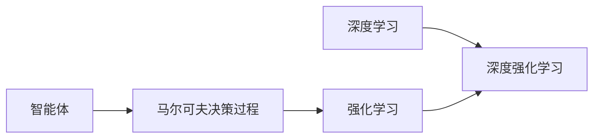
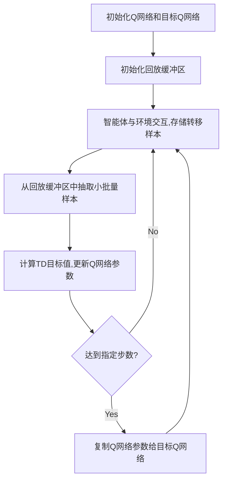
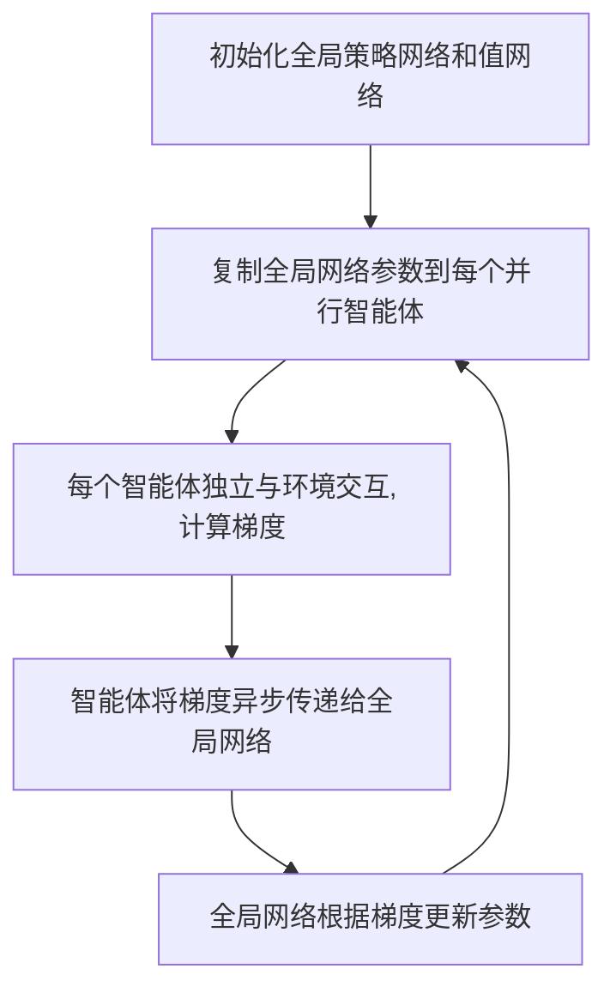
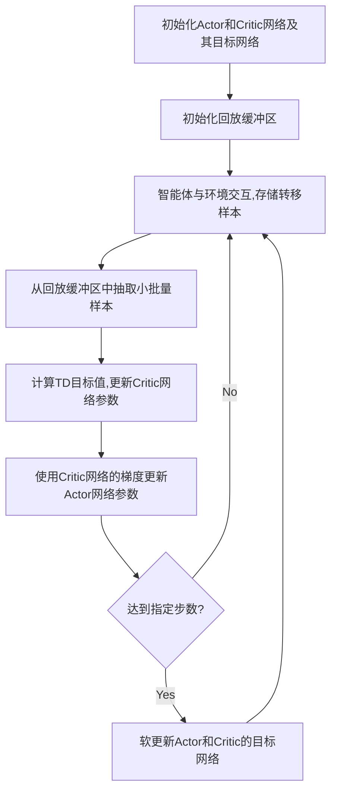

# AI人工智能深度学习算法：智能深度学习代理的深度学习技术

## 1. 背景介绍

人工智能(Artificial Intelligence, AI)是计算机科学的一个重要分支,它致力于研究如何让计算机模拟甚至超越人类的智能。深度学习(Deep Learning, DL)作为人工智能的一个重要分支,近年来取得了令人瞩目的成就,在计算机视觉、语音识别、自然语言处理等领域不断刷新着最高性能记录。

深度学习的本质是通过构建具有多层结构的人工神经网络,并利用大量数据对网络进行训练,使其能够自动学习数据背后的复杂模式和规律。随着计算能力的增强、训练数据的积累以及算法的不断创新,深度学习正在向更加智能化的方向发展。

智能深度学习代理(Intelligent Deep Learning Agents)是深度学习在智能体领域的重要应用。传统的AI系统通常是基于规则或知识的,很难应对复杂多变的现实环境。而智能深度学习代理能够通过端到端的学习,直接从原始数据中习得应对环境的策略,表现出较强的自适应能力和鲁棒性。

本文将围绕智能深度学习代理的核心技术展开深入探讨,介绍相关的基本概念、经典算法、数学原理以及代码实践,并分析其在实际应用中的场景和挑战。通过本文的学习,读者可以对智能深度学习代理技术建立系统性的认知,为进一步研究和应用奠定基础。

## 2. 核心概念与联系

要理解智能深度学习代理,首先需要明确以下几个核心概念:

### 2.1 智能体(Agent)

智能体是人工智能领域的一个重要概念,它指代能够感知环境并采取行动的自主实体。智能体通过传感器接收环境状态,根据一定的决策机制选择行为,并通过执行器对环境施加影响,从而实现与环境的交互。

### 2.2 马尔可夫决策过程(Markov Decision Process, MDP)  

马尔可夫决策过程是对智能体与环境交互过程的数学刻画。一个MDP由状态空间、行为空间、状态转移概率和奖励函数构成。智能体的目标是寻找一个最优策略,使得在MDP中获得的累积奖励最大化。

### 2.3 深度学习(Deep Learning)

深度学习是机器学习的一个分支,它模仿人脑的信息处理机制,利用多层神经网络对数据进行表征学习。深度学习能够自动提取数据中的高层特征,在感知类任务上取得了突破性进展。

### 2.4 强化学习(Reinforcement Learning, RL)

强化学习是机器学习的三大范式之一,专注于智能体如何通过与环境的交互来学习最优行为策略。RL的核心思想是通过试错来最大化累积奖励,并不断优化行为策略以适应环境。

### 2.5 深度强化学习(Deep Reinforcement Learning, DRL)

深度强化学习是深度学习和强化学习的结合,即用深度神经网络来逼近RL中的策略函数或值函数。DRL突破了传统RL方法在状态空间较大时的瓶颈,使得RL在更加复杂的决策任务上得以应用。

这些概念之间的关系可以用下图表示:

智能深度学习代理正是深度强化学习在智能体领域的具体应用。它利用DRL技术,使得智能体能够直接从高维观测数据中学习策略,无需人工提取特征,从而具备更强的感知和决策能力。

## 3. 核心算法原理具体操作步骤

智能深度学习代理的核心是深度强化学习算法。本节将重点介绍几种经典的DRL算法,并阐述其原理和操作步骤。

### 3.1 DQN(Deep Q-Network)

DQN是将深度学习引入强化学习的开山之作。它利用深度神经网络来逼近Q函数,即状态-行为值函数。DQN的主要思想包括:

1. 经验回放(Experience Replay):将智能体与环境交互得到的转移样本(st,at,rt,st+1)存入回放缓冲区,并从中随机抽取小批量样本进行训练,打破了样本之间的相关性。

2. 目标网络(Target Network):每隔一定步数将当前Q网络的参数复制给目标Q网络,用于计算TD目标值,提高训练稳定性。

3. 贪心策略(Epsilon-Greedy Policy):在选择动作时,以概率ε随机选择,以概率1-ε选择Q值最大的动作,平衡了探索和利用。

DQN的训练流程如下:

### 3.2 A3C(Asynchronous Advantage Actor-Critic)

A3C是一种基于Actor-Critic框架的异步DRL算法。它利用多个并行的智能体同时与环境交互,并异步地更新全局的策略网络和值网络。A3C的主要思想包括:

1. 策略网络(Actor):输出动作的概率分布,用于生成智能体的行为策略。

2. 值网络(Critic):输出状态的值函数,用于评估策略的优劣。 

3. 优势函数(Advantage Function):度量某个动作相对于平均水平的优劣,用于更新策略网络。

4. 并行智能体(Parallel Agents):多个智能体独立与环境交互,并将梯度更新异步地传递给全局网络。

A3C的训练流程如下:

### 3.3 DDPG(Deep Deterministic Policy Gradient)

DDPG是一种适用于连续动作空间的DRL算法。它结合了DQN和Actor-Critic的思想,使用确定性策略来选择动作。DDPG的主要思想包括:

1. Actor网络:输出确定性的动作值,用于生成智能体的行为策略。

2. Critic网络:输出状态-动作值函数Q(s,a),用于评估Actor网络生成的动作。

3. 目标网络:与DQN类似,用于计算TD目标值,提高训练稳定性。

4. 探索噪声(Exploration Noise):在Actor网络生成的动作上添加随机噪声,增加策略的探索性。

DDPG的训练流程如下:

以上介绍的DQN、A3C和DDPG都是智能深度学习代理领域的经典算法,分别针对离散动作空间、并行训练和连续动作空间等不同场景。这些算法为后续的算法改进奠定了基础,推动了DRL技术的不断发展。

## 4. 数学模型和公式详细讲解举例说明

本节将对智能深度学习代理中涉及的关键数学模型和公式进行详细讲解,并给出具体的例子加以说明。

### 4.1 马尔可夫决策过程(MDP)

MDP是智能体与环境交互的数学模型,可以形式化地定义为一个五元组$(S,A,P,R,\gamma)$:

- 状态空间$S$:智能体所处环境的所有可能状态的集合。
- 行为空间$A$:智能体在每个状态下可以采取的所有可能行为的集合。
- 状态转移概率$P(s'|s,a)$:在状态$s$下采取行为$a$后转移到状态$s'$的概率。
- 奖励函数$R(s,a)$:在状态$s$下采取行为$a$后获得的即时奖励值。
- 折扣因子$\gamma \in [0,1]$:用于衡量未来奖励的重要程度,$\gamma$越大,智能体越重视长期利益。

举例来说,考虑一个简单的网格世界环境,智能体的目标是从起点走到终点。其MDP可以定义为:

- 状态空间$S$:网格中所有可能的位置坐标。
- 行为空间$A$:上、下、左、右四个移动方向。
- 状态转移概率$P(s'|s,a)$:在当前位置$s$下采取移动行为$a$后到达下一位置$s'$的概率,通常为确定性转移。
- 奖励函数$R(s,a)$:在非终点位置下的即时奖励为-1,在终点位置下的即时奖励为0,鼓励智能体尽快到达目标。
- 折扣因子$\gamma$:可以根据任务设定,通常取值为0.9或0.99。

MDP为理解智能体的决策过程提供了一个通用的框架,智能体的目标就是寻找一个最优策略$\pi^*$来最大化期望累积奖励:

$$\pi^* = \arg\max_{\pi} \mathbb{E}_{\pi}[\sum_{t=0}^{\infty} \gamma^t R(s_t,a_t)]$$

其中,$\pi(a|s)$表示在状态$s$下选择行为$a$的概率。

### 4.2 贝尔曼方程(Bellman Equation)

贝尔曼方程是MDP中的重要方程,它描述了状态值函数和动作值函数之间的递归关系。

对于状态值函数$V^{\pi}(s)$,贝尔曼方程可以写作:

$$V^{\pi}(s) = \sum_{a} \pi(a|s) \sum_{s',r} P(s',r|s,a) [r + \gamma V^{\pi}(s')]$$

其中,$P(s',r|s,a)$表示在状态$s$下采取行为$a$后转移到状态$s'$并获得奖励$r$的联合概率。

对于动作值函数$Q^{\pi}(s,a)$,贝尔曼方程可以写作:

$$Q^{\pi}(s,a) = \sum_{s',r} P(s',r|s,a) [r + \gamma \sum_{a'} \pi(a'|s') Q^{\pi}(s',a')]$$

贝尔曼方程揭示了值函数的递归性质,即一个状态(或状态-行为对)的值取决于后续状态(或状态-行为对)的值。这为值函数的迭代计算提供了理论基础。

在实践中,我们通常使用贝尔曼最优方程来计算最优值函数:

$$V^*(s) = \max_{a} \sum_{s',r} P(s',r|s,a) [r + \gamma V^*(s')]$$

$$Q^*(s,a) = \sum_{s',r} P(s',r|s,a) [r + \gamma \max_{a'} Q^*(s',a')]$$

贝尔曼最优方程描述了最优值函数所满足的条件,即在每个状态下选择使得Q值最大的行为。求解贝尔曼最优方程就可以得到最优策略。

举例来说,对于前述的网格世界环境,我们可以使用价值迭代(Value Iteration)算法求解其最优值函数。价值迭代的更新公式为:

$$V_{k+1}(s) = \max_{a} \sum_{s'} P(s'|s,a) [R(s,a) + \gamma V_k(s')]$$

其中,$V_k(s)$表示第$k$次迭代