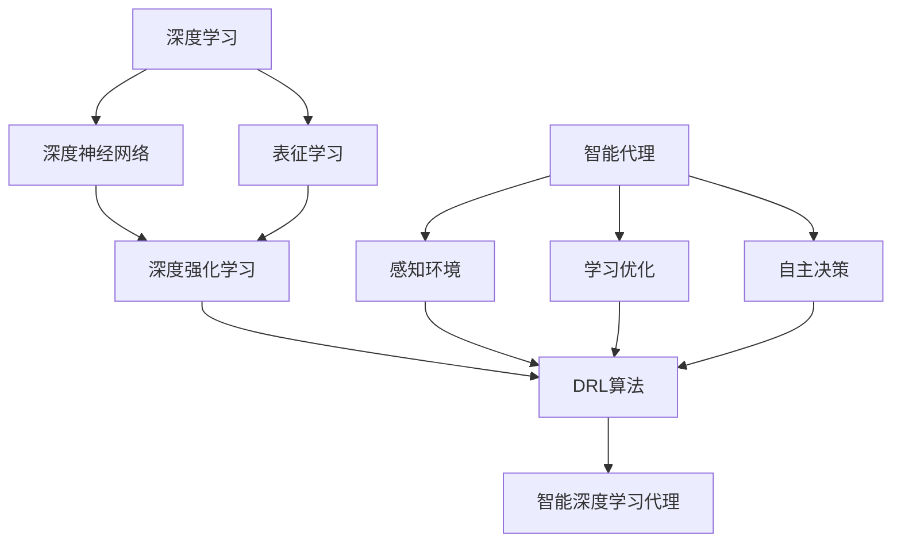

# AI人工智能深度学习算法：智能深度学习代理的深度学习技术

## 1. 背景介绍

### 1.1 人工智能的发展历程

人工智能(Artificial Intelligence, AI)作为计算机科学的一个分支,其研究目标是开发能够模拟人类智能的计算机系统。自1956年达特茅斯会议首次提出"人工智能"的概念以来,AI经历了从早期的符号主义、专家系统,到机器学习、深度学习的发展历程。

### 1.2 深度学习的崛起

近年来,以深度学习(Deep Learning, DL)为代表的人工智能技术取得了突破性进展。DL通过构建多层神经网络,利用大量数据训练网络参数,使得计算机系统能够自动学习数据中蕴含的高层特征表示,在图像识别、语音识别、自然语言处理等领域达到甚至超越人类的性能水平。

### 1.3 智能代理的兴起

随着DL的发展,构建具有自主学习、推理和决策能力的智能代理(Intelligent Agent)成为AI领域的研究热点。智能代理能够感知环境状态,根据目标自主采取行动,通过与环境的交互来学习和进化,不断提升自身的智能水平。将DL技术与智能代理结合,有望实现更加智能化、自主化的人工智能系统。

## 2. 核心概念与联系

### 2.1 深度学习

深度学习是一类机器学习算法,其特点是利用多层神经网络对数据进行表征学习。DL网络通过逐层提取特征,将原始高维数据转化为更加抽象和高层的特征表示,从而建立起输入数据到输出决策的复杂映射关系。

### 2.2 智能代理 

智能代理是一个能够感知环境并采取行动的自主实体。它具有感知、推理、学习、决策等智能属性,能够根据环境状态和目标任务自主地选择行为。智能代理的目标是通过与环境的交互,不断学习和优化自身策略,以完成特定任务。

### 2.3 深度强化学习

深度强化学习(Deep Reinforcement Learning, DRL)是将深度学习与强化学习相结合的一类算法。传统强化学习中,智能体根据环境状态选择动作,通过获得环境反馈的奖励来学习最优策略。DRL利用DL网络作为值函数或策略函数的近似,使得智能体能够直接从原始的高维状态中学习策略,极大地提升了 RL 的表征和决策能力。

### 2.4 概念之间的关系

下图展示了深度学习、智能代理和深度强化学习三者之间的关系:

DL 为智能代理的感知、表征、决策提供了强大的学习框架,使得智能体能够从复杂环境中自主学习;而 RL 则为智能代理的目标导向学习提供理论基础,使得智能体能够通过奖励反馈不断优化行为策略。DRL 将二者结合,构建起了智能深度学习代理的核心算法框架。

## 3. 核心算法原理具体操作步骤

本节介绍几种典型的DRL算法及其核心原理和操作步骤。

### 3.1 DQN

DQN(Deep Q-Network)是将深度学习与Q学习相结合的经典DRL算法。其核心思想是利用深度神经网络来逼近最优Q函数,即状态-动作值函数。

DQN的主要操作步骤如下:

1. 初始化 Q 网络参数 $\theta$,目标网络参数 $\theta^-$
2. 初始化经验回放池 D
3. for episode = 1 to M do
    1. 初始化环境状态 s
    2. for t = 1 to T do 
        1. 根据 $\epsilon$-greedy 策略选择动作 a
        2. 执行动作 a,观测奖励 r,下一状态 s'
        3. 将转移样本 (s,a,r,s') 存储到 D
        4. 从 D 中随机采样一批转移样本 (s_i,a_i,r_i,s'_i)  
        5. 计算目标值:
            - 若 s'_i 为终止状态,y_i = r_i
            - 否则,y_i = r_i + \gamma \max_{a'}Q(s'_i,a';\theta^-)
        6. 最小化损失: $L(\theta)=\mathbb{E}[(y_i-Q(s_i,a_i;\theta))^2]$ 
        7. 每 C 步同步目标网络参数: $\theta^-=\theta$
        8. s = s'
4. end for

其中,$\epsilon$-greedy 策略是指以 $\epsilon$ 的概率随机选择动作,以 $1-\epsilon$ 的概率选择Q值最大的动作。这样可以在探索和利用之间权衡。同时,DQN引入了经验回放和目标网络两个技巧,分别用于提高样本利用效率和稳定训练过程。

### 3.2 DDPG

DDPG(Deep Deterministic Policy Gradient)是一种适用于连续动作空间的DRL算法。它结合了DQN和演员-评论家(Actor-Critic)架构,同时学习一个确定性策略(Actor)和一个Q函数(Critic)。

DDPG的主要操作步骤如下:

1. 随机初始化 Actor 网络 $\mu(s|\theta^\mu)$ 和 Critic 网络 $Q(s,a|\theta^Q)$ 的参数
2. 初始化目标网络参数: $\theta^{\mu'}\leftarrow\theta^\mu$, $\theta^{Q'}\leftarrow\theta^Q$  
3. 初始化经验回放池 R
4. for episode = 1 to M do
    1. 初始化环境状态 s
    2. for t = 1 to T do
        1. 根据 Actor 网络输出的动作 $a=\mu(s|\theta^\mu)+\mathcal{N}_t$ 
        2. 执行动作 a,观测奖励 r,下一状态 s'
        3. 将转移样本 (s,a,r,s') 存储到 R 
        4. 从 R 中采样一批转移样本 (s_i,a_i,r_i,s'_i)
        5. 利用 Critic 目标网络计算 y_i:
            - 若 s'_i 为终止状态,y_i = r_i  
            - 否则,y_i = r_i + \gamma Q'(s'_i,\mu'(s'_i|\theta^{\mu'})|\theta^{Q'})
        6. 更新 Critic 网络,最小化损失: $L=\frac{1}{N}\sum_i(y_i-Q(s_i,a_i|\theta^Q))^2$
        7. 更新 Actor 网络,基于采样梯度:
           $$\nabla_{\theta^\mu}J \approx \frac{1}{N}\sum_i\nabla_aQ(s,a|\theta^Q)|_{s=s_i,a=\mu(s_i)}\nabla_{\theta^\mu}\mu(s|\theta^\mu)|_{s_i}$$
        8. 软更新目标网络参数: 
           - $\theta^{Q'}\leftarrow\tau\theta^Q+(1-\tau)\theta^{Q'}$
           - $\theta^{\mu'}\leftarrow\tau\theta^\mu+(1-\tau)\theta^{\mu'}$
        9. s = s'
5. end for

其中,Actor网络 $\mu(s|\theta^\mu)$ 用于根据状态生成连续动作,Critic网络 $Q(s,a|\theta^Q)$ 用于评估状态-动作对的价值。在训练过程中,Actor 根据 Critic 的梯度信息来更新策略参数,使得生成的动作能够获得更高的Q值评估。同时,DDPG也采用了类似DQN的经验回放和软更新技巧。

### 3.3 A3C

A3C(Asynchronous Advantage Actor-Critic)是一种基于并行的DRL算法。它利用多个并行的Actor-Learner,每个Learner与环境独立交互,异步地更新全局策略和值函数网络。

A3C的核心操作步骤如下:

1. 初始化全局策略网络 $\pi(a|s;\theta)$ 和值函数网络 $V(s;\theta_v)$ 参数
2. 初始化 N 个 Actor-Learner,每个 Learner 的参数与全局网络同步
3. for each Actor-Learner do
    1. 初始化环境状态 s,本地参数 $\theta',\theta'_v$  
    2. 重置梯度: $d\theta=0$, $d\theta_v=0$
    3. 初始化 t_start = t 
    4. for t = 1 to T do
        1. 根据策略网络 $\pi(a|s;\theta')$ 选择动作 a
        2. 执行动作 a,观测奖励 r,下一状态 s'
        3. 计算优势函数估计: $$A=\sum_{i=0}^{k-1}\gamma^ir_{t+i}+\gamma^kV(s_{t+k};\theta'_v)-V(s_t;\theta'_v)$$
        4. 累积策略梯度: $$d\theta\leftarrow d\theta+\nabla_{\theta'}\log\pi(a_t|s_t;\theta')A$$
        5. 累积值函数梯度: $$d\theta_v\leftarrow d\theta_v+\partial(A^2)/\partial\theta'_v$$
        6. s = s'
    5. 异步地将梯度 $d\theta,d\theta_v$ 更新到全局网络,并同步本地参数: $\theta'=\theta,\theta'_v=\theta_v$
4. end for

其中,每个Actor-Learner独立与环境交互,在本地计算梯度,并异步地将梯度更新到全局网络。这种并行架构可以大大加速训练过程,同时通过异步更新避免了算法对于确定性环境的过拟合。

## 4. 数学模型和公式详细讲解举例说明

本节对DRL中的几个关键数学模型进行详细讲解和举例说明。

### 4.1 马尔可夫决策过程(MDP)

MDP是描述智能代理与环境交互的数学框架。一个MDP由状态集合S、动作集合A、转移概率P、奖励函数R和折扣因子$\gamma$组成,通常表示为一个五元组 $\langle S,A,P,R,\gamma \rangle$。

- 状态 $s\in S$ 表示智能体所处的环境状态
- 动作 $a\in A$ 表示智能体可执行的行为决策
- 转移概率 $P(s'|s,a)$ 表示在状态s下执行动作a后转移到状态s'的概率
- 奖励函数 $R(s,a)$ 表示智能体执行动作a后获得的即时奖励
- 折扣因子 $\gamma \in [0,1]$ 表示未来奖励的衰减程度

MDP的目标是寻找一个最优策略 $\pi^*:S\rightarrow A$,使得智能体能够获得最大化的期望累积奖励。

**举例说明**:
考虑一个简单的网格世界环境,智能体的目标是从起点出发尽快到达终点。
- 状态空间 S 为网格中的所有位置,共 N×N 个状态
- 动作空间 A 为{上,下,左,右}四个动作  
- 转移概率 P:
  - 执行动作后,以 0.8 的概率向预期方向移动一格
  - 以 0.1 的概率分别向左右两侧偏移一格
  - 如果撞墙则保持不动
- 奖励函数 R:
  - 到达终点时获得 +10 的奖励
  - 其余状态下获得 -0.1 的负奖励(惩罚项)
- 折扣因子 $\gamma=0.9$

在该MDP中,智能体需要通过不断探索和学习,寻找一条从起点到终点的最优路径,以获得最大累积奖励。

### 4.2 值函数与贝尔曼方程

值函数是刻画一个状态或者状态-动作对的长期价值,常用于值迭代和策略评估算法中。在MDP中有两种值函数:
- 状态值函数 $V^\pi(s)$:策略 $\pi$ 下状态 s 的期望回报
  $$V^\pi(s)=