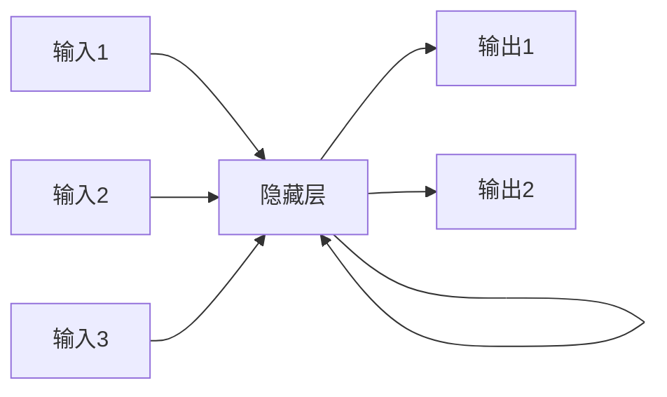
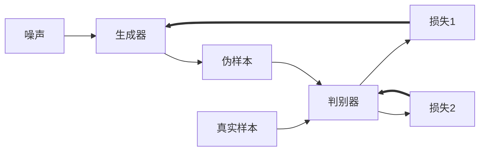

# AI人工智能深度学习算法：构建高效深度学习模型的基础

## 1.背景介绍

### 1.1 人工智能的兴起

人工智能(Artificial Intelligence, AI)是当代科技发展的热点领域,近年来取得了长足的进步。AI旨在使机器能够模仿人类的认知功能,例如学习、推理、感知和决策等。随着大数据、算力和算法的不断发展,AI已经广泛应用于语音识别、图像处理、自然语言处理、决策系统等诸多领域,极大地提高了工作效率,优化了决策过程。

### 1.2 深度学习的重要性

深度学习(Deep Learning)是AI的一个重要分支,它源于对大脑神经网络结构和信息处理模式的模拟。通过构建深层次的神经网络模型,并在海量数据上进行训练,深度学习能够自主学习数据中蕴含的特征模式,从而完成高精度的预测和决策任务。

近年来,深度学习在计算机视觉、自然语言处理、语音识别等领域取得了突破性进展,成为推动AI发展的核心动力。掌握深度学习算法及其应用,对于构建智能系统、提升产品和服务质量至关重要。

### 1.3 高效深度学习模型的需求

随着深度学习模型的复杂度不断增加,如何构建高效的模型成为一个迫切的需求。高效模型不仅能够提高预测精度,还可以降低计算资源消耗,缩短模型训练和部署时间,从而提升整体性能。

构建高效深度学习模型需要对算法原理、数学模型、优化技术等方面有深入的理解,并能够将理论知识灵活应用于实践中。本文将系统地介绍构建高效深度学习模型的基础知识和实践技巧,为读者打开通往AI技术的大门。

## 2.核心概念与联系

### 2.1 神经网络基础

神经网络(Neural Network)是深度学习模型的基础,它模拟了生物神经元之间的信息传递和处理过程。一个典型的神经网络由输入层、隐藏层和输出层组成,每一层由多个神经元构成。

神经元通过权重(Weight)和偏置(Bias)对输入数据进行加权求和,然后经过激活函数(Activation Function)转化为输出。常用的激活函数包括Sigmoid、ReLU、Tanh等。

### 2.2 前馈神经网络与反向传播

前馈神经网络(Feedforward Neural Network)是最基本的神经网络结构,信息只能按照单一方向从输入层流向输出层。通过对网络进行训练,可以学习到输入和输出之间的映射关系。

训练过程中,需要使用反向传播(Backpropagation)算法来更新网络权重,使得输出值与期望值之间的误差最小化。反向传播算法基于链式法则,沿着网络反向传播误差梯度,并使用优化算法(如梯度下降)调整权重。

### 2.3 卷积神经网络

卷积神经网络(Convolutional Neural Network, CNN)是一种专门用于处理网格结构数据(如图像)的神经网络。CNN由卷积层(Convolutional Layer)、池化层(Pooling Layer)和全连接层(Fully Connected Layer)组成。

卷积层通过滑动卷积核(Kernel)在输入数据上进行卷积操作,提取局部特征。池化层则用于降低特征维度,减少计算量。全连接层类似于传统神经网络,用于将提取的特征映射到最终输出。

CNN在图像分类、目标检测、语义分割等计算机视觉任务中表现出色,是深度学习领域的重要突破。

### 2.4 循环神经网络

循环神经网络(Recurrent Neural Network, RNN)是一种专门用于处理序列数据(如文本、语音)的神经网络。与前馈网络不同,RNN在隐藏层之间引入了循环连接,使得网络能够捕捉序列数据中的时序依赖关系。

长短期记忆网络(Long Short-Term Memory, LSTM)和门控循环单元(Gated Recurrent Unit, GRU)是两种常用的RNN变体,它们通过引入门控机制来解决传统RNN存在的梯度消失/爆炸问题,在自然语言处理、语音识别等领域表现出色。

### 2.5 生成对抗网络

生成对抗网络(Generative Adversarial Network, GAN)是一种用于生成式建模的深度学习架构。它由生成器(Generator)和判别器(Discriminator)两个神经网络组成,两者相互对抗地训练,最终使生成器能够生成逼真的数据样本。

GAN在图像生成、语音合成、数据增强等领域有着广泛的应用前景,是深度学习领域的另一个重要突破。

上述核心概念相互关联,共同构建了深度学习的理论基础。掌握这些概念有助于我们更好地理解和应用深度学习算法。

## 3.核心算法原理具体操作步骤

### 3.1 前馈神经网络训练

前馈神经网络的训练过程包括以下步骤:

1. **网络初始化**: 随机初始化网络权重和偏置,通常使用小的随机值。

2. **前向传播**: 输入数据通过网络层层传播,每一层根据权重、偏置和激活函数计算输出。

   $$o_j = \sigma\left(\sum_i w_{ij}x_i + b_j\right)$$

   其中 $o_j$ 为第 $j$ 个神经元的输出, $x_i$ 为第 $i$ 个输入, $w_{ij}$ 为连接权重, $b_j$ 为偏置, $\sigma$ 为激活函数。

3. **计算损失**: 将网络输出与期望输出计算损失函数(如均方误差)。

4. **反向传播**: 根据链式法则计算每个权重的梯度。

   $$\frac{\partial L}{\partial w_{ij}} = \frac{\partial L}{\partial o_j} \cdot \frac{\partial o_j}{\partial w_{ij}}$$

   其中 $L$ 为损失函数。

5. **权重更新**: 使用优化算法(如梯度下降)根据梯度更新权重。

   $$w_{ij} \leftarrow w_{ij} - \eta \frac{\partial L}{\partial w_{ij}}$$

   其中 $\eta$ 为学习率。

6. **重复训练**: 重复上述步骤,直到损失函数收敛或达到最大迭代次数。

通过不断调整权重,网络可以学习到输入和输出之间的映射关系,从而完成预测或分类任务。

### 3.2 卷积神经网络训练

卷积神经网络的训练过程与前馈网络类似,但在卷积层和池化层有一些特殊的操作:

1. **卷积层前向传播**:

   - 将卷积核在输入特征图上滑动,进行元素级乘积和求和操作。
   - 对每个卷积核输出添加偏置,并通过激活函数得到新的特征图。

2. **池化层前向传播**:

   - 在输入特征图上滑动池化窗口,对窗口内元素进行最大值或平均值pooling操作。
   - 生成新的下采样特征图,降低特征维度。

3. **反向传播**:

   - 计算损失函数对卷积层和池化层输出的梯度。
   - 根据链式法则,反向传播梯度到卷积核权重和偏置。
   - 使用优化算法更新卷积核权重和偏置。

通过端到端的训练,CNN可以自动学习到有效的特征表示,提高在图像等结构化数据上的预测性能。

### 3.3 循环神经网络训练

循环神经网络的训练过程需要考虑时序依赖关系:

1. **初始化隐藏状态**: 将初始隐藏状态设置为全0向量。

2. **前向传播**:

   - 在时间步 $t$, 将输入 $x_t$ 和上一时间步隐藏状态 $h_{t-1}$ 传入RNN单元。
   - RNN单元根据权重计算当前隐藏状态 $h_t$ 和输出 $o_t$。

     $$h_t = \sigma(W_{hh}h_{t-1} + W_{xh}x_t + b_h)$$
     $$o_t = \phi(W_{ho}h_t + b_o)$$

     其中 $W$ 为权重矩阵, $b$ 为偏置向量, $\sigma$ 和 $\phi$ 为激活函数。

3. **计算损失**: 将每个时间步的输出与期望输出计算损失函数。

4. **反向传播通过时间(BPTT)**: 根据链式法则沿时间反向传播梯度。

   $$\frac{\partial L}{\partial W_{hh}} = \sum_t \frac{\partial L}{\partial h_t} \cdot \frac{\partial h_t}{\partial W_{hh}}$$

5. **权重更新**: 使用优化算法更新RNN权重。

对于LSTM和GRU等门控RNN变体,需要额外计算门控单元的梯度,并相应地更新权重。

通过BPTT算法,RNN可以捕捉序列数据中的长期依赖关系,在自然语言处理、语音识别等领域发挥重要作用。

### 3.4 生成对抗网络训练

生成对抗网络的训练过程是一个minimax博弈:

1. **初始化生成器和判别器**: 使用随机权重初始化两个网络。

2. **生成器训练**:

   - 从噪声先验分布(如高斯分布)采样噪声向量 $z$。
   - 将噪声 $z$ 输入生成器,生成伪样本 $G(z)$。
   - 将伪样本 $G(z)$ 输入判别器,计算判别器的损失函数 $L_D(G(z))$。
   - 更新生成器权重,使得 $L_D(G(z))$ 最小化,即让判别器尽可能无法区分真伪样本。

3. **判别器训练**:

   - 从真实数据分布采样真实样本 $x$。
   - 将真实样本 $x$ 和伪样本 $G(z)$ 输入判别器。
   - 计算判别器在真实样本和伪样本上的损失函数 $L_D(x)$ 和 $L_D(G(z))$。
   - 更新判别器权重,使得 $L_D(x)$ 最小化且 $L_D(G(z))$ 最大化,即让判别器能够尽可能区分真伪样本。

4. **重复训练**: 交替训练生成器和判别器,直到收敛。

通过这种对抗训练过程,生成器和判别器相互提升,最终使得生成器能够生成逼真的样本数据。

以上是三种核心深度学习算法的训练原理和具体操作步骤。掌握这些原理有助于我们更好地理解和应用深度学习模型。

## 4.数学模型和公式详细讲解举例说明

### 4.1 损失函数

损失函数(Loss Function)用于衡量模型输出与期望输出之间的差异,是深度学习模型训练的关键。常用的损失函数包括:

1. **均方误差(Mean Squared Error, MSE)**: 主要用于回归任务。

   $$\text{MSE}(y, \hat{y}) = \frac{1}{n}\sum_{i=1}^n (y_i - \hat{y}_i)^2$$

   其