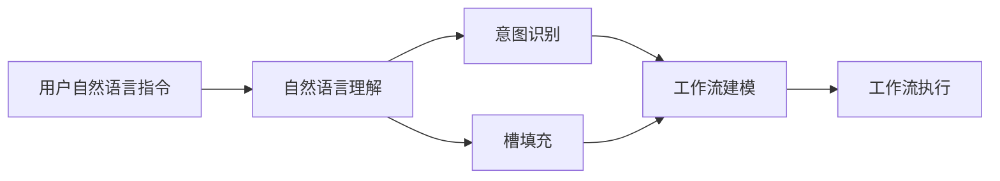

# AI人工智能深度学习算法：自然语言处理在工作流代理中的运用

## 1.背景介绍
### 1.1 人工智能与自然语言处理
人工智能(Artificial Intelligence, AI)是计算机科学的一个分支,旨在创造能够执行通常需要人类智能的任务的智能机器。自然语言处理(Natural Language Processing, NLP)是人工智能的一个重要分支,专注于使计算机能够理解、生成和处理人类语言。NLP涉及语言学、计算机科学和人工智能等多个学科领域的交叉融合。

### 1.2 深度学习在NLP中的应用 
近年来,深度学习(Deep Learning, DL)技术的兴起为NLP领域带来了革命性的突破。DL通过构建多层神经网络,可以自动学习和提取输入数据中的复杂特征,极大地提升了NLP任务的性能。典型的DL模型如循环神经网络(RNN)、长短期记忆网络(LSTM)、注意力机制(Attention)等,在机器翻译、情感分析、命名实体识别等NLP任务中取得了显著成果。

### 1.3 工作流代理中的NLP应用
工作流(Workflow)是一系列有序的任务,用于实现特定的业务目标。工作流代理(Workflow Agent)是一种智能化的工作流管理系统,可以根据用户输入的自然语言指令,自动生成和执行相应的工作流。在这个过程中,NLP技术扮演着至关重要的角色,它使得工作流代理能够准确理解用户意图,并将其转化为可执行的工作流任务。

## 2.核心概念与联系
### 2.1 自然语言理解
自然语言理解(Natural Language Understanding, NLU)是NLP的一个核心任务,旨在让计算机理解自然语言的语义和含义。NLU涉及词法分析、句法分析、语义分析、语篇分析等多个层面。在工作流代理中,NLU负责将用户输入的自然语言指令转化为结构化的表示,为后续的工作流生成提供基础。

### 2.2 意图识别与槽填充
意图识别(Intent Recognition)和槽填充(Slot Filling)是NLU的两个关键任务。意图识别旨在判断用户输入的意图类别,如"创建工作流"、"修改工作流"等;槽填充则是从用户输入中提取关键信息,填充到预定义的槽位中,如"工作流名称"、"执行时间"等。这两个任务的结合,使得工作流代理能够准确理解用户需求。

### 2.3 工作流建模与执行
工作流建模(Workflow Modeling)是根据用户意图和提取的关键信息,自动生成工作流的过程。工作流执行(Workflow Execution)则是根据生成的工作流模型,调度和执行相应的任务。这两个过程共同构成了工作流代理的核心功能。

### 2.4 核心概念之间的联系
下图展示了工作流代理中NLP相关核心概念之间的联系:



用户输入自然语言指令后,首先经过NLU模块进行理解。NLU模块主要执行意图识别和槽填充任务,分别判断用户意图类别和提取关键信息。然后,根据识别出的意图和槽位信息,自动生成工作流模型。最后,工作流执行模块根据生成的模型,调度和执行具体任务。

## 3.核心算法原理具体操作步骤
### 3.1 基于深度学习的意图识别
意图识别可以看作一个文本分类问题。给定用户输入的自然语言指令,判断其所属的意图类别。传统的意图识别方法主要基于模板匹配、词典匹配等规则,但难以应对复杂多变的语言表达。基于深度学习的方法可以自动学习输入文本的语义特征,具有更强的泛化能力。下面是一个基于CNN的意图识别算法步骤:

1. 将输入文本转化为词向量表示,可以使用预训练的词向量如Word2Vec、GloVe等。
2. 使用CNN对词向量序列进行卷积操作,提取局部特征。
3. 使用最大池化操作对卷积结果进行汇聚,得到固定长度的特征向量。
4. 将特征向量输入到全连接层中,并使用Softmax函数进行多分类预测。
5. 使用交叉熵损失函数和反向传播算法对模型进行训练优化。

### 3.2 基于BiLSTM-CRF的槽填充
槽填充可以看作一个序列标注问题。给定输入文本序列,为每个词分配一个预定义的槽位标签(如B-name、I-name、O等),从而提取出关键信息。传统的槽填充方法主要基于条件随机场(CRF)等概率图模型,但难以有效利用词汇的上下文信息。基于BiLSTM-CRF的方法可以同时考虑过去和未来的上下文,并利用CRF学习标签之间的转移规律。下面是BiLSTM-CRF槽填充算法的步骤:

1. 将输入文本转化为词向量表示。
2. 使用双向LSTM对词向量序列进行编码,得到每个词的上下文表示。
3. 将BiLSTM的输出作为CRF的发射分数,同时学习CRF的转移分数矩阵。
4. 使用Viterbi算法在CRF中进行解码,得到最优的标签序列。
5. 根据预测的标签序列,提取出相应的槽位信息。
6. 使用负对数似然损失函数和反向传播算法对模型进行训练优化。

### 3.3 基于规则的工作流生成
在得到意图类别和槽位信息后,需要根据预定义的规则自动生成工作流。这里的规则可以是一些if-then形式的逻辑语句,例如:
```
if intent == "创建工作流":
    if "名称" in slots and "执行时间" in slots:
        workflow = create_workflow(name=slots["名称"], time=slots["执行时间"])
    else:
        ask_user_for_missing_slots()
elif intent == "修改工作流":
    if "名称" in slots:
        workflow = modify_workflow(name=slots["名称"])
        update_workflow_with_slots(workflow, slots)
    else:
        ask_user_for_workflow_name()
```

通过这种方式,可以根据不同的意图和槽位组合,生成相应的工作流实例。当然,这里只是一个简单示例,实际的工作流生成规则可能更加复杂,需要考虑更多的约束条件和业务逻辑。

## 4.数学模型和公式详细讲解举例说明
### 4.1 CNN卷积神经网络
CNN是一种常用于图像识别和自然语言处理的深度学习模型。对于文本分类任务,CNN可以自动提取输入文本的局部特征。其核心思想是通过卷积核对输入序列进行滑动窗口操作,得到一组特征图谱。假设输入文本经过词向量映射后得到矩阵 $X \in \mathbb{R}^{n \times d}$,其中 $n$ 为文本长度, $d$ 为词向量维度。卷积操作可以表示为:

$$c_i = f(W \cdot X_{i:i+h-1} + b)$$

其中 $W \in \mathbb{R}^{h \times d}$ 为卷积核参数矩阵, $h$ 为卷积窗口大小, $b$ 为偏置项, $f$ 为激活函数(如ReLU)。卷积结果 $c \in \mathbb{R}^{n-h+1}$ 为一个特征图谱。通过设置多个不同的卷积核,可以提取多个特征图谱。然后,对每个特征图谱应用最大池化操作:

$$\hat{c} = \max(c)$$

池化结果 $\hat{c}$ 为一个固定长度的特征向量,可以用于后续的分类任务。

### 4.2 BiLSTM双向长短期记忆网络
LSTM是一种用于处理序列数据的循环神经网络。相比普通的RNN,LSTM引入了门控机制,可以缓解梯度消失问题,捕捉长距离依赖关系。BiLSTM则是同时使用两个方向的LSTM,综合考虑过去和未来的上下文信息。假设输入序列为 $x=(x_1,\dots,x_n)$,BiLSTM的计算过程为:

$$\overrightarrow{h}_t = \text{LSTM}(x_t, \overrightarrow{h}_{t-1})$$

$$\overleftarrow{h}_t = \text{LSTM}(x_t, \overleftarrow{h}_{t+1})$$

$$h_t = [\overrightarrow{h}_t; \overleftarrow{h}_t]$$

其中 $\overrightarrow{h}_t$ 和 $\overleftarrow{h}_t$ 分别为前向和后向LSTM在 $t$ 时刻的隐藏状态, $h_t$ 为两个方向隐藏状态的拼接,可以作为 $t$ 时刻的上下文表示,用于序列标注等任务。

### 4.3 CRF条件随机场
CRF是一种常用于序列标注的概率图模型。它可以考虑标签之间的转移规律,学习标签序列的整体最优解。在BiLSTM-CRF模型中,BiLSTM的输出 $h=(h_1,\dots,h_n)$ 作为CRF的发射分数,CRF的转移分数矩阵 $A$ 则需要学习。假设标签集合为 $\mathcal{T}$,标签序列为 $y=(y_1,\dots,y_n)$,则CRF的分数函数为:

$$s(h,y) = \sum_{i=1}^n A_{y_i,y_{i+1}} + \sum_{i=1}^n h_i[y_i]$$

其中 $A_{y_i,y_{i+1}}$ 为标签 $y_i$ 到 $y_{i+1}$ 的转移分数, $h_i[y_i]$ 为 $h_i$ 中对应标签 $y_i$ 的发射分数。CRF的预测过程是寻找分数最高的标签序列:

$$y^* = \arg\max_{y \in \mathcal{T}^n} s(h,y)$$

这可以通过Viterbi算法高效求解。CRF的训练过程是最大化正确标签序列的条件概率:

$$p(y|h) = \frac{\exp(s(h,y))}{\sum_{y' \in \mathcal{T}^n} \exp(s(h,y'))}$$

通过极大似然估计和反向传播算法,可以学习CRF的转移分数矩阵 $A$ 和BiLSTM的参数。

## 5.项目实践：代码实例和详细解释说明

以下是一个基于PyTorch实现的BiLSTM-CRF槽填充模型的示例代码:

```python
import torch
import torch.nn as nn

class BiLSTM_CRF(nn.Module):
    def __init__(self, vocab_size, tag_to_ix, embedding_dim, hidden_dim):
        super(BiLSTM_CRF, self).__init__()
        self.embedding_dim = embedding_dim
        self.hidden_dim = hidden_dim
        self.vocab_size = vocab_size
        self.tag_to_ix = tag_to_ix
        self.tagset_size = len(tag_to_ix)
        
        self.word_embeds = nn.Embedding(vocab_size, embedding_dim)
        self.lstm = nn.LSTM(embedding_dim, hidden_dim // 2, num_layers=1, bidirectional=True)
        self.hidden2tag = nn.Linear(hidden_dim, self.tagset_size)
        self.transitions = nn.Parameter(torch.randn(self.tagset_size, self.tagset_size))
        
    def forward(self, sentence):
        embeds = self.word_embeds(sentence)
        lstm_out, _ = self.lstm(embeds.view(len(sentence), 1, -1))
        lstm_out = lstm_out.view(len(sentence), self.hidden_dim)
        lstm_feats = self.hidden2tag(lstm_out)
        return lstm_feats
    
    def forward_alpha(self, feats):
        init_alphas = torch.full((1, self.tagset_size), -10000.)
        init_alphas[0][self.tag_to_ix[START_TAG]] = 0.
        forward_var = init_alphas
        for feat in feats:
            alphas_t = []
            for next_tag in range(self.tagset_size):
                emit_score = feat[next_tag].view(1, -1).expand(1, self.tagset_size)
                trans_score = self.