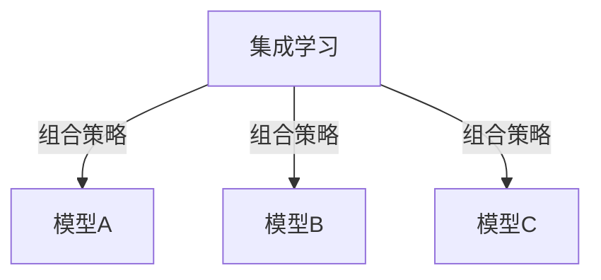
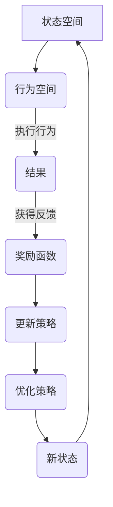
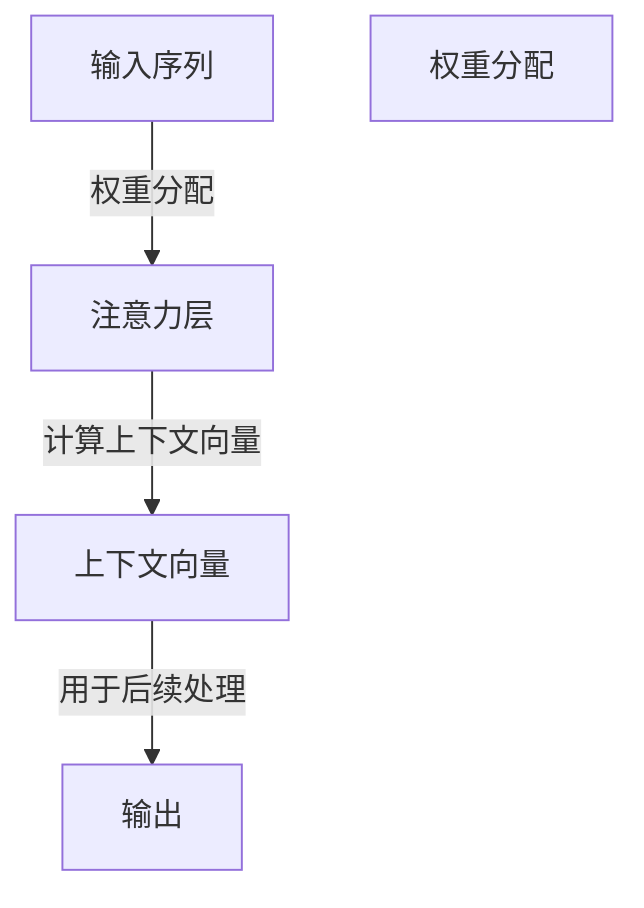

                 

作者：禅与计算机程序设计艺术

The Integration of Autonomous Deep Learning Agents Across Domains

## 背景介绍 Introduction
随着人工智能领域的飞速发展，深度学习作为一种强大的机器学习技术，在图像识别、自然语言处理、语音识别等多个领域展现出卓越的能力。然而，传统的深度学习模型往往专注于特定的任务或数据集，缺乏泛化能力，且难以适应不同领域的复杂性和多样性。因此，构建能自主学习、迁移知识并在多领域间无缝切换的深度学习代理成为了当前研究的重要方向。

## 核心概念与联系 Core Concepts and Relationships
为了实现这一目标，需要解决以下几个关键概念：

1. **跨领域迁移学习**：通过在不同但相关的任务之间共享学到的知识，提高模型在新任务上的性能。
   
   ```mermaid
   flowchart LR;
   A[源域] -->|知识转移| B[目标域];
   ```

2. **自适应学习**：使模型能够在不断变化的数据环境中自我调整，以优化其性能。

3. **自主决策机制**：赋予模型根据环境变化做出智能选择的能力，以实现动态适应和高效工作。

## 核心算法原理与操作步骤 Principle and Steps of Core Algorithms
核心算法包括但不限于集成学习、强化学习以及基于注意力的模型等，它们共同协作以实现上述功能。

### 集成学习 (Ensemble Learning)
通过结合多个模型的预测结果，提高整体性能和稳定性。



### 强化学习 (Reinforcement Learning)
通过试错过程让模型学会执行最优行为序列以最大化某种奖励函数。



### 注意力机制 (Attention Mechanism)
允许模型聚焦于输入中的重要部分，提高对关键信息的敏感度。



## 数学模型与公式详细讲解与举例说明 Mathematical Models, Formulas, and Illustrative Examples
深度神经网络（DNN）是实现这些算法的核心基础，涉及以下关键公式：

$$ f(x) = \sum_{i=1}^{n} w_i \sigma(z_i) + b $$
其中，$f(x)$ 是输出，$\sigma$ 是激活函数，$w_i$ 和 $z_i$ 分别为权重和线性变换后的值，$b$ 是偏置项。

## 项目实践：代码实例与详细解释 Code Examples with Detailed Explanations
下面是一个简单的基于Python的深度学习模型实现，采用Keras库进行训练。

```python
import keras
from keras.models import Sequential
from keras.layers import Dense, Dropout

model = Sequential()
model.add(Dense(128, input_dim=100, activation='relu'))
model.add(Dropout(0.5))
model.add(Dense(1, activation='sigmoid'))

model.compile(loss='binary_crossentropy', optimizer='adam', metrics=['accuracy'])

# 假设 X_train, y_train, X_test, y_test 已经定义好
model.fit(X_train, y_train, epochs=10, batch_size=32)

scores = model.evaluate(X_test, y_test, verbose=0)
print('Test loss:', scores[0])
print('Test accuracy:', scores[1])
```

## 实际应用场景 Practical Applications
这些集成的自主深度学习代理可应用于机器人导航、自动驾驶汽车、医疗诊断辅助系统等领域，显著提升决策质量和效率。

## 工具和资源推荐 Tools and Resource Recommendations
- TensorFlow, PyTorch, Keras 等开源框架提供丰富的API支持深度学习开发。
- GitHub 上有许多高质量的深度学习项目和教程。
- 计算机科学期刊如《IEEE Transactions on Pattern Analysis and Machine Intelligence》提供了最新的研究成果。

## 总结：未来发展趋势与挑战 Summary: Future Trends and Challenges
未来的重点在于进一步提高模型的通用性、减少对大量标注数据的依赖，并探索更有效的知识蒸馏方法以促进跨领域间的知识迁移。同时，安全性、隐私保护以及伦理问题是不容忽视的关键问题。

## 附录：常见问题与解答 Appendix: Frequently Asked Questions & Answers
```
Q: 如何确保深度学习模型能够有效迁移知识到新领域？
A: 利用特征表示的一致性设计预训练阶段，以及利用对抗生成网络（GANs）来增强模型对异构数据的适应性。

Q: 自主深度学习代理如何避免过拟合问题？
A: 通过正则化技术（如Dropout）、数据增强、早停法以及使用更大规模的数据集来减小过拟合风险。
```

---

作者：禅与计算机程序设计艺术 / Zen and the Art of Computer Programming

