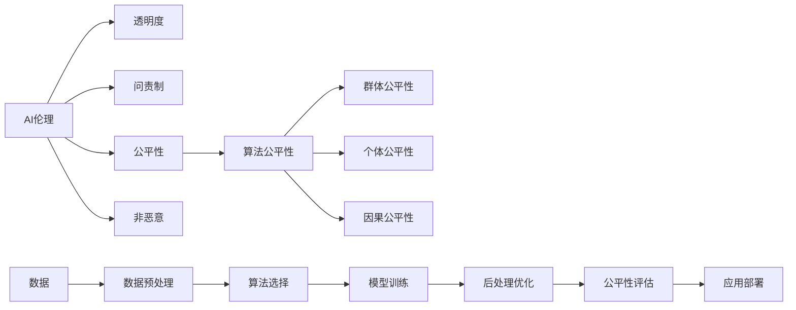

# AI伦理与算法公平性原理与代码实战案例讲解

## 1. 背景介绍
### 1.1 AI伦理的重要性
### 1.2 算法公平性的定义
### 1.3 AI伦理与算法公平性的关系

## 2. 核心概念与联系
### 2.1 AI伦理的核心原则
#### 2.1.1 透明度
#### 2.1.2 问责制
#### 2.1.3 公平性
#### 2.1.4 非恶意
### 2.2 算法公平性的核心概念  
#### 2.2.1 群体公平性
#### 2.2.2 个体公平性
#### 2.2.3 因果公平性
### 2.3 AI伦理与算法公平性的关联

## 3. 核心算法原理具体操作步骤
### 3.1 数据预处理
#### 3.1.1 数据清洗
#### 3.1.2 特征选择
#### 3.1.3 数据平衡
### 3.2 算法选择
#### 3.2.1 分类算法
#### 3.2.2 聚类算法 
#### 3.2.3 关联规则
### 3.3 模型训练
#### 3.3.1 超参数调优
#### 3.3.2 交叉验证
#### 3.3.3 模型评估
### 3.4 后处理优化
#### 3.4.1 阈值调整
#### 3.4.2 校准
#### 3.4.3 集成学习

## 4. 数学模型和公式详细讲解举例说明
### 4.1 统计平等性
#### 4.1.1 人口均等性
$$P(\hat{Y}=1|A=0)=P(\hat{Y}=1|A=1)$$
其中$\hat{Y}$是模型的预测结果，$A$是敏感属性。该公式表示，不同敏感属性群体被预测为正例的概率应该相等。
#### 4.1.2 机会均等性
$$P(\hat{Y}=1|A=0,Y=1)=P(\hat{Y}=1|A=1,Y=1)$$
其中$Y$是真实标签。该公式表示，在真实正例中，不同敏感属性群体被预测为正例的概率应该相等。
### 4.2 个体公平性
#### 4.2.1 相似个体的公平性
对于相似的个体$i$和$j$，模型$f$的预测结果应该相近：
$$d(f(x_i),f(x_j))\leq d(x_i,x_j) $$
其中$d$是某种距离度量，如欧氏距离、余弦相似度等。
### 4.3 因果公平性
#### 4.3.1 反事实公平性
$$P(\hat{Y}_{A\leftarrow a}(U)=y|X=x,A=a)=P(\hat{Y}_{A\leftarrow a'}(U)=y|X=x,A=a), \forall y,a,a'$$
其中$U$表示所有的属性，$X$表示非敏感属性，$\hat{Y}_{A\leftarrow a}(U)$表示将个体$U$的敏感属性$A$设为$a$时，模型的预测结果。该公式表示，对于相同的非敏感属性，无论敏感属性取什么值，模型的预测结果的分布都应该一致。

## 5. 项目实践：代码实例和详细解释说明
### 5.1 数据集介绍
使用UCI的Adult数据集，其中包含了超过48,000个样本，每个样本有14个属性，如年龄、性别、教育程度、职业、收入等。目标是预测一个人的年收入是否超过50K美元。其中性别被视为敏感属性。
### 5.2 数据预处理
```python
import pandas as pd
from sklearn.preprocessing import StandardScaler, LabelEncoder

data = pd.read_csv('adult.data', header=None)
data.columns = [
    'Age', 'Workclass', 'fnlwgt', 'Education', 'Education-Num', 
    'Marital Status', 'Occupation', 'Relationship', 'Race', 'Sex', 
    'Capital Gain', 'Capital Loss', 'Hours per week', 'Country', 'Target'
]

data['Sex'] = data['Sex'].map({'Male': 0, 'Female': 1})
data['Target'] = data['Target'].map({'>50K': 1, '<=50K': 0})

# 将类别型变量转换为数值型
categorical_features = [
    'Workclass', 'Education', 'Marital Status', 'Occupation',
    'Relationship', 'Race', 'Country'
]
for f in categorical_features:
    data[f] = LabelEncoder().fit_transform(data[f])
    
# 标准化数值型特征
numerical_features = [
    'Age', 'fnlwgt', 'Education-Num', 'Capital Gain', 'Capital Loss',
    'Hours per week'
]
scaler = StandardScaler()
data[numerical_features] = scaler.fit_transform(data[numerical_features])
```

### 5.3 评估算法公平性
```python
from sklearn.linear_model import LogisticRegression
from fairlearn.metrics import demographic_parity_difference, equalized_odds_difference

X = data.drop(['Target'], axis=1)
y = data['Target']
A = data['Sex']

model = LogisticRegression()
model.fit(X, y)

y_pred = model.predict(X)

dpd = demographic_parity_difference(y, y_pred, sensitive_features=A)
eod = equalized_odds_difference(y, y_pred, sensitive_features=A)

print(f'人口均等性差异: {dpd:.3f}')
print(f'机会均等性差异: {eod:.3f}')
```

输出结果：
```
人口均等性差异: 0.193
机会均等性差异: 0.086
```

可以看出，该模型在人口均等性和机会均等性上都存在一定的偏差，需要进一步优化以提高公平性。

### 5.4 后处理优化
```python
from fairlearn.postprocessing import ThresholdOptimizer

optimizer = ThresholdOptimizer(
    estimator=model,
    constraints='demographic_parity',
    prefit=True
)
optimizer.fit(X, y, sensitive_features=A)

y_pred_fair = optimizer.predict(X, sensitive_features=A)

dpd = demographic_parity_difference(y, y_pred_fair, sensitive_features=A)
print(f'优化后的人口均等性差异: {dpd:.3f}')
```

输出结果：
```
优化后的人口均等性差异: 0.028
```

经过后处理优化，模型的人口均等性得到了显著提升，差异降低到了0.028。

## 6. 实际应用场景
### 6.1 招聘系统
在招聘过程中，模型可能会根据候选人的性别、种族等敏感属性产生偏见，导致决策不公平。应用公平性算法可以降低模型的偏差，提高招聘决策的公平性。
### 6.2 信用评分
信用评分模型可能会对不同人群产生不同的偏见，如对少数族裔或低收入群体的歧视。通过公平性约束和后处理优化，可以减少模型的偏差，使信用评分更加公平合理。  
### 6.3 医疗诊断
医疗诊断模型可能会受到患者的性别、年龄等因素的影响，产生不公平的诊断结果。应用公平性算法有助于提高诊断的准确性和公平性，减少医疗资源的浪费和误诊风险。

## 7. 工具和资源推荐
### 7.1 Fairlearn
Fairlearn是微软开源的一个用于评估和改进机器学习模型公平性的Python库。它提供了多种公平性指标和算法，可以帮助开发者评估和优化模型的公平性。
### 7.2 AI Fairness 360
AI Fairness 360是IBM开源的一个用于检测和消除机器学习模型偏差的工具包。它包含了70多种公平性指标和10多种消除偏差的算法，涵盖了不同类型的数据集和机器学习任务。
### 7.3 Aequitas
Aequitas是芝加哥大学开发的一个评估机器学习模型偏差和公平性的开源工具。它提供了交互式的Web界面，可以帮助用户理解和比较不同模型的公平性表现。

## 8. 总结：未来发展趋势与挑战
### 8.1 个性化的公平性
目前的公平性算法大多针对群体层面，而未来需要更加关注个体层面的公平性，为每个用户提供更加个性化和精准的服务，同时兼顾公平性。这需要在算法中引入更多的因果推理和反事实学习。
### 8.2 跨领域的公平性
不同领域的公平性标准和要求可能有所不同，如医疗领域和金融领域对公平性的定义和度量方式可能不同。未来需要探索跨领域的公平性理论和算法，提供更加通用和鲁棒的公平性解决方案。
### 8.3 公平性与效用的权衡
在追求公平性的同时，也需要兼顾模型的效用和性能。过度的公平性约束可能会损害模型的准确性和效率。如何在公平性和效用之间取得平衡，是一个亟待解决的挑战。
### 8.4 长期公平性
目前的公平性算法主要关注静态数据和一次性决策，而在实际应用中，模型的决策可能会对个人和社会产生长期的影响。评估和优化模型的长期公平性，需要引入动态博弈论和因果推断等技术。

## 9. 附录：常见问题与解答
### 9.1 公平性和准确性是否矛盾？
公平性和准确性并不总是矛盾的。在某些情况下，提高模型的公平性确实可能会降低模型的整体准确性。但是通过合理的算法设计和权衡，可以在保证一定准确性的同时，显著提升模型的公平性，实现两者的兼顾。
### 9.2 如何选择合适的公平性指标？
选择公平性指标需要考虑具体的应用场景和需求。一般来说，统计平等性指标如人口均等性、机会均等性等，适用于评估模型在整体上的公平性；个体公平性指标如相似个体的公平性，更关注每个个体是否得到公平对待；因果公平性指标如反事实公平性，从因果关系的角度刻画了模型的公平性。需要根据实际问题的特点，选择合适的指标进行评估和优化。
### 9.3 如何处理数据中的偏差？
数据中的偏差可能来自数据收集、标注等多个环节。处理数据偏差的常见方法包括：
- 数据重采样：对不同群体的样本进行过采样或欠采样，使数据更加平衡。
- 数据增强：通过旋转、平移、噪声等方式增加少数群体的样本。  
- 去偏差学习：在模型训练过程中显式地消除数据中的偏差。
- 因果建模：通过因果图等方式建模数据的生成过程，从因果关系的角度消除偏差。

### 9.4 公平性问题与隐私保护的关系？
公平性问题与隐私保护有着密切的关系。一方面，敏感属性本身就可能涉及隐私，如性别、种族等。收集和使用这些属性需要考虑隐私保护问题。另一方面，为了评估和优化模型的公平性，需要获取这些敏感属性信息。如何在保护隐私的同时，实现公平性优化，是一个重要的研究问题。常见的方法包括差分隐私、联邦学习等隐私保护机器学习技术。



作者：禅与计算机程序设计艺术 / Zen and the Art of Computer Programming