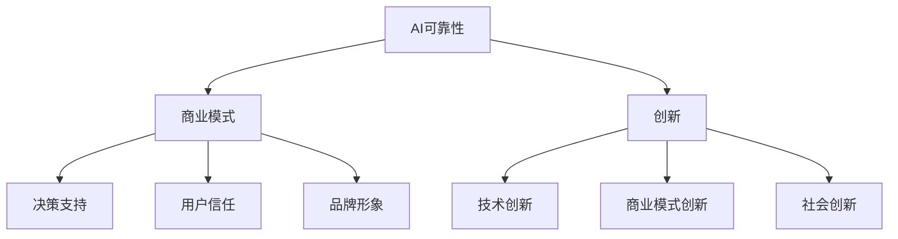

# AI可靠性：商业模式与创新

## 1. 背景介绍
### 1.1 AI可靠性的重要性
### 1.2 AI可靠性面临的挑战
### 1.3 AI可靠性对商业模式和创新的影响

## 2. 核心概念与联系
### 2.1 AI可靠性的定义
#### 2.1.1 AI系统的可信赖性
#### 2.1.2 AI系统的安全性
#### 2.1.3 AI系统的公平性
### 2.2 AI可靠性与商业模式的关系
#### 2.2.1 AI可靠性对商业决策的影响
#### 2.2.2 AI可靠性对用户信任的影响
#### 2.2.3 AI可靠性对品牌形象的影响
### 2.3 AI可靠性与创新的关系
#### 2.3.1 AI可靠性驱动技术创新
#### 2.3.2 AI可靠性促进商业模式创新
#### 2.3.3 AI可靠性推动社会创新

## 3. 核心算法原理具体操作步骤
### 3.1 可解释性算法
#### 3.1.1 LIME算法
#### 3.1.2 SHAP算法
#### 3.1.3 DeepLIFT算法
### 3.2 公平性算法
#### 3.2.1 预处理技术
#### 3.2.2 训练中干预
#### 3.2.3 后处理技术
### 3.3 安全性算法
#### 3.3.1 对抗训练
#### 3.3.2 差分隐私
#### 3.3.3 同态加密

## 4. 数学模型和公式详细讲解举例说明
### 4.1 偏差与方差权衡
#### 4.1.1 偏差的定义与计算
#### 4.1.2 方差的定义与计算 
#### 4.1.3 权衡偏差与方差的策略
### 4.2 ROC曲线与AUC
#### 4.2.1 ROC曲线的定义与绘制
#### 4.2.2 AUC的定义与计算
#### 4.2.3 ROC曲线和AUC在模型评估中的应用
### 4.3 信息论与互信息
#### 4.3.1 信息熵的定义与计算
#### 4.3.2 互信息的定义与计算
#### 4.3.3 互信息在特征选择中的应用

## 5. 项目实践：代码实例和详细解释说明
### 5.1 使用SHAP解释模型预测结果
#### 5.1.1 加载预训练模型
#### 5.1.2 计算SHAP值
#### 5.1.3 可视化SHAP值
### 5.2 使用对抗训练提高模型鲁棒性
#### 5.2.1 生成对抗样本
#### 5.2.2 对抗训练
#### 5.2.3 评估模型鲁棒性
### 5.3 使用差分隐私保护数据隐私
#### 5.3.1 添加差分隐私噪声
#### 5.3.2 训练差分隐私模型
#### 5.3.3 评估隐私保护效果

## 6. 实际应用场景
### 6.1 金融领域
#### 6.1.1 信用评分
#### 6.1.2 反欺诈
#### 6.1.3 风险管理
### 6.2 医疗领域
#### 6.2.1 疾病诊断
#### 6.2.2 药物发现
#### 6.2.3 个性化治疗
### 6.3 自动驾驶领域 
#### 6.3.1 场景感知
#### 6.3.2 路径规划
#### 6.3.3 决策控制

## 7. 工具和资源推荐
### 7.1 开源框架
#### 7.1.1 TensorFlow
#### 7.1.2 PyTorch
#### 7.1.3 Scikit-learn
### 7.2 数据集
#### 7.2.1 ImageNet
#### 7.2.2 COCO
#### 7.2.3 CIFAR-10/100
### 7.3 学习资源
#### 7.3.1 在线课程
#### 7.3.2 书籍推荐
#### 7.3.3 学术论文

## 8. 总结：未来发展趋势与挑战
### 8.1 AI可靠性标准化
### 8.2 人机协同与人工智能治理
### 8.3 AI可靠性测试与验证

## 9. 附录：常见问题与解答
### 9.1 如何权衡AI系统的性能和可靠性？
### 9.2 如何评估AI系统的公平性？ 
### 9.3 如何应对AI系统的安全挑战？

人工智能技术的快速发展为各行各业带来了巨大的变革机遇，但与此同时，AI系统的可靠性问题也日益凸显。AI可靠性涉及AI系统的可信赖性、安全性和公平性等多个维度，直接影响到AI技术的商业应用和创新发展。

从商业模式的角度来看，AI可靠性对企业的决策支持、用户信任和品牌形象有着重要影响。一方面，可靠的AI系统能够为企业提供更加准确、稳定的决策支持，提高运营效率和业绩表现；另一方面，AI系统的可靠性也关系到用户对企业和产品的信任度，进而影响企业的品牌形象和市场竞争力。

从创新的角度来看，AI可靠性是驱动技术创新、商业模式创新和社会创新的重要因素。通过研究和解决AI可靠性问题，可以推动AI算法、系统架构、应用场景等方面的技术创新；基于可靠的AI系统，企业可以探索数据驱动、智能化的新型商业模式；同时，AI可靠性也有助于促进教育、医疗、交通等社会领域的变革创新。

为了实现AI系统的可靠性，需要从算法、数据、系统等多个层面入手。在算法层面，可解释性、公平性和安全性是三大关键挑战。可解释性算法如LIME、SHAP等，致力于揭示AI模型的决策逻辑，提高模型透明度；公平性算法通过预处理、训练干预、后处理等技术消除数据和模型中的偏见；安全性算法如对抗训练、差分隐私等，则用于增强AI系统抵御恶意攻击的能力。

在实践中，AI可靠性已经在金融、医疗、自动驾驶等领域得到广泛应用。通过可靠的AI系统，金融机构可以更加精准地进行信用评分、反欺诈、风险管理等业务；医疗机构可以辅助疾病诊断、药物发现、个性化治疗等临床决策；自动驾驶系统可以更加安全、高效地感知环境、规划路径、控制车辆。

展望未来，AI可靠性将向标准化、人机协同、测试验证等方向发展。建立AI可靠性评估标准，有助于规范AI系统的设计开发流程；人机协同与人工智能治理，强调人类价值观和伦理规范对AI系统的引导和约束；而AI可靠性测试与验证，则是保障AI系统性能和稳定性的重要手段。

总之，AI可靠性已经成为人工智能商业化和产业化的关键因素。唯有不断提升AI系统的可信赖性、安全性和公平性，并将其与商业创新和社会需求深度结合，AI技术才能真正释放出变革生产生活方式的巨大潜力，推动人类社会的可持续发展。

作者：禅与计算机程序设计艺术 / Zen and the Art of Computer Programming