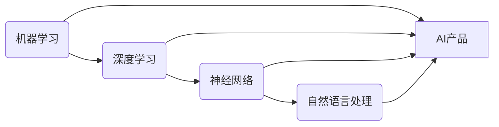
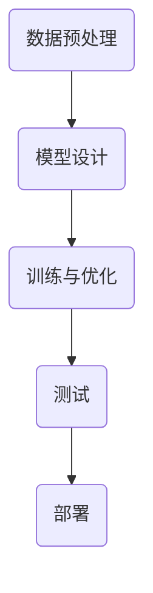

# AI商业模式与产品设计原理与代码实战案例讲解

## 1. 背景介绍
随着人工智能技术的飞速发展，AI已经渗透到商业模式和产品设计的各个层面。企业和开发者如何在这个快速变化的领域中找到立足点，设计出既能满足市场需求又具有技术创新的产品，是一个值得深入探讨的问题。

## 2. 核心概念与联系
在AI产品设计中，核心概念包括机器学习、深度学习、神经网络、自然语言处理等。这些技术之间的联系构成了AI产品的基础框架。



## 3. 核心算法原理具体操作步骤
以深度学习为例，核心算法原理的操作步骤包括数据预处理、模型设计、训练与优化、测试和部署。



## 4. 数学模型和公式详细讲解举例说明
深度学习的数学模型基于神经网络，其中一个关键的公式是激活函数。例如，ReLU激活函数定义为：

$$ f(x) = max(0, x) $$

举例来说，当我们设计一个用于图像识别的卷积神经网络时，会用到卷积层、池化层和全连接层等结构，每一层都会涉及到特定的数学运算。

## 5. 项目实践：代码实例和详细解释说明
以TensorFlow和Keras为例，下面是一个简单的卷积神经网络模型代码实例：

```python
import tensorflow as tf
from tensorflow.keras import layers, models

# 构建模型
model = models.Sequential()
model.add(layers.Conv2D(32, (3, 3), activation='relu', input_shape=(28, 28, 1)))
model.add(layers.MaxPooling2D((2, 2)))
model.add(layers.Conv2D(64, (3, 3), activation='relu'))
model.add(layers.MaxPooling2D((2, 2)))
model.add(layers.Conv2D(64, (3, 3), activation='relu'))

# 添加全连接层
model.add(layers.Flatten())
model.add(layers.Dense(64, activation='relu'))
model.add(layers.Dense(10, activation='softmax'))

# 编译和训练模型
model.compile(optimizer='adam',
              loss='sparse_categorical_crossentropy',
              metrics=['accuracy'])
```

这段代码展示了如何使用Keras构建一个简单的卷积神经网络，并进行编译和准备训练。

## 6. 实际应用场景
AI技术在医疗、金融、教育、交通等多个领域都有广泛的应用。例如，在医疗领域，AI可以帮助诊断疾病，在金融领域，AI可以用于风险评估和欺诈检测。

## 7. 工具和资源推荐
对于AI产品设计和开发，推荐的工具和资源包括TensorFlow、PyTorch、Scikit-learn等开源库，以及Coursera、Kaggle等在线学习平台。

## 8. 总结：未来发展趋势与挑战
AI技术的未来发展趋势包括自动化、个性化和智能化。挑战则包括数据隐私、算法偏见和技术门槛等。

## 9. 附录：常见问题与解答
Q1: 如何选择合适的AI技术栈？
A1: 根据项目需求和团队技能选择。

Q2: 如何评估AI项目的商业潜力？
A2: 通过市场调研和用户反馈进行评估。

作者：禅与计算机程序设计艺术 / Zen and the Art of Computer Programming