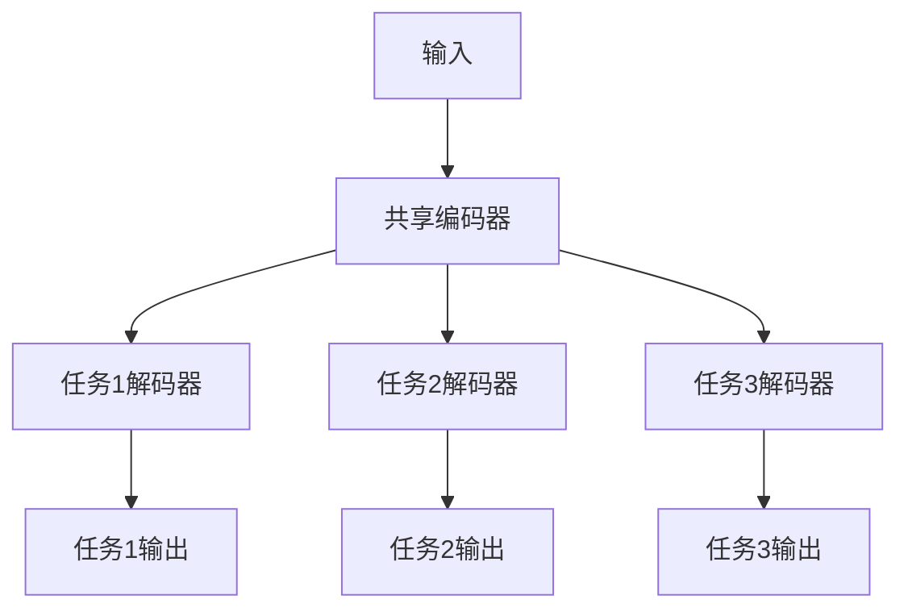

# AI大模型中的多任务学习：一石多鸟

## 1. 背景介绍

### 1.1 人工智能的发展历程

人工智能(AI)的发展经历了几个重要阶段。早期的人工智能系统主要集中在特定领域,如国际象棋、数学推理等,这些系统被称为"狭义人工智能"。随着算力和数据的不断增长,机器学习(ML)技术开始崛起,尤其是深度学习(DL)的兴起,使得人工智能在计算机视觉、自然语言处理等领域取得了突破性进展。

### 1.2 大模型的兴起

近年来,随着算力和数据量的持续增长,以及算法和硬件的进步,训练大规模神经网络模型成为可能。这些大模型(如GPT-3、PaLM等)具有数十亿甚至上万亿参数,能够在多个任务上表现出惊人的能力。然而,这些大模型通常是在单个任务上进行训练,无法充分利用不同任务之间的相关性和知识迁移。

### 1.3 多任务学习的必要性

在现实世界中,人类能够从不同的经验中学习,并将所学知识应用于新的任务。类似地,训练一个在多个任务上表现良好的人工智能模型,不仅能提高模型的泛化能力,还能减少重复学习的成本。因此,多任务学习(Multi-Task Learning, MTL)应运而生,旨在让模型能够同时学习多个相关任务,提高整体性能和效率。

## 2. 核心概念与联系

### 2.1 多任务学习的定义

多任务学习是一种机器学习范式,它通过利用不同但相关任务之间的知识共享,提高模型在这些任务上的整体性能。具体来说,多任务学习旨在训练一个单一模型,使其能够在多个不同但相关的任务上表现良好,而不是为每个任务分别训练一个专门的模型。

### 2.2 多任务学习与迁移学习的关系

多任务学习与迁移学习(Transfer Learning)有着密切的联系。迁移学习是指利用在一个领域(源域)学习到的知识,来帮助另一个领域(目标域)的学习。而多任务学习可以看作是一种特殊的迁移学习,其中源域和目标域是多个相关但不同的任务。

### 2.3 多任务学习的优势

相比于为每个任务分别训练一个专门的模型,多任务学习具有以下优势:

1. **提高泛化能力**: 通过共享不同任务之间的知识,模型能够学习到更加通用和鲁棒的表示,从而提高在新任务上的泛化能力。
2. **减少重复学习**: 多任务学习允许模型在相关任务之间共享参数和表示,避免了重复学习相似知识的浪费。
3. **数据高效利用**: 当某些任务的训练数据较少时,多任务学习可以利用其他任务的数据,提高数据利用效率。
4. **提高计算效率**: 相比于训练多个专门模型,多任务学习只需训练一个模型,从而提高了计算效率。

### 2.4 多任务学习的挑战

尽管多任务学习具有诸多优势,但它也面临一些挑战:

1. **任务冲突**: 不同任务之间可能存在冲突,导致模型在某些任务上的性能下降。
2. **任务权重平衡**: 如何为不同任务分配合适的权重,以确保模型在所有任务上都有良好表现。
3. **任务关联度**: 如何衡量和利用不同任务之间的关联度,以提高知识共享的效率。
4. **模型容量**: 当任务数量较多时,模型需要足够大的容量来容纳所有任务的知识。

## 3. 核心算法原理具体操作步骤

### 3.1 硬参数共享

硬参数共享是多任务学习中最基本和直接的方法。它将不同任务共享模型的部分或全部参数,如下图所示:



硬参数共享的优点是简单高效,但它也存在一些局限性:

1. 任务之间的相关性较低时,共享参数可能会限制模型的表现。
2. 不同任务可能需要不同的模型容量,共享参数无法满足这一需求。

### 3.2 软参数共享

为了解决硬参数共享的局限性,软参数共享方法被提出。它允许每个任务拥有自己的私有参数,同时引入一种正则化机制,使不同任务的参数保持相似性。常见的软参数共享方法包括:

1. **张量因子分解**: 将每个任务的参数矩阵分解为两个低秩矩阵的乘积,其中一个矩阵是共享的,另一个是任务特定的。
2. **距离约束**: 在损失函数中添加一项,惩罚不同任务参数之间的距离(如L2距离)过大。

软参数共享的优点是灵活性更高,但它也增加了模型的复杂性和计算开销。

### 3.3 基于注意力的知识共享

除了参数共享,基于注意力机制的知识共享方法也被广泛应用于多任务学习。这种方法通常包括以下步骤:

1. 为每个任务训练一个独立的编码器,获取任务特定的表示。
2. 使用注意力机制,将不同任务的表示融合到一个共享空间中。
3. 从共享空间中解码,得到每个任务的输出。

基于注意力的知识共享方法能够动态地调整不同任务之间的相关性,并且具有较好的解释性。但它也增加了模型的计算复杂度。

### 3.4 元学习方法

元学习(Meta-Learning)是一种基于少量数据快速学习新任务的范式。它通过在一系列相关任务上进行训练,学习一种通用的学习策略,从而能够快速适应新的任务。

在多任务学习中,元学习方法被用于提高模型在新任务上的适应能力。常见的元学习方法包括:

1. **模型无关的元学习(MAML)**: 通过对模型参数进行微调,使其能够快速适应新任务。
2. **基于梯度的元学习**: 直接学习一种梯度更新策略,用于快速适应新任务。

元学习方法能够提高模型在新任务上的泛化能力,但它也增加了训练的复杂度和计算开销。

## 4. 数学模型和公式详细讲解举例说明

在多任务学习中,常见的数学模型和公式包括:

### 4.1 硬参数共享的损失函数

在硬参数共享中,我们需要在多个任务上同时优化模型参数。假设有 $N$ 个任务,第 $i$ 个任务的损失函数为 $\mathcal{L}_i(\theta)$,其中 $\theta$ 是共享的模型参数。则总的损失函数可以表示为:

$$\mathcal{L}(\theta) = \sum_{i=1}^{N} \lambda_i \mathcal{L}_i(\theta)$$

其中 $\lambda_i$ 是第 $i$ 个任务的权重系数,用于平衡不同任务的重要性。在训练过程中,我们需要最小化总的损失函数 $\mathcal{L}(\theta)$,从而使模型在所有任务上都表现良好。

### 4.2 软参数共享的正则化项

在软参数共享中,我们需要在损失函数中添加一项正则化项,以鼓励不同任务的参数保持相似性。假设第 $i$ 个任务的参数为 $\theta_i$,共享的参数为 $\theta_0$,则正则化项可以表示为:

$$\Omega(\theta_0, \theta_1, \ldots, \theta_N) = \sum_{i=1}^{N} \lambda_i \left\lVert \theta_i - \theta_0 \right\rVert_2^2$$

其中 $\lambda_i$ 是第 $i$ 个任务的权重系数,用于控制参数相似性的程度。在训练过程中,我们需要最小化总的损失函数,即任务损失与正则化项的加权和。

### 4.3 基于注意力的知识共享

在基于注意力的知识共享方法中,我们需要计算不同任务表示之间的注意力权重,以融合它们到一个共享空间中。假设有 $N$ 个任务,第 $i$ 个任务的表示为 $h_i$,共享空间的表示为 $h_s$,则注意力权重 $\alpha_i$ 可以计算如下:

$$\alpha_i = \frac{\exp(f(h_i, h_s))}{\sum_{j=1}^{N} \exp(f(h_j, h_s))}$$

其中 $f(\cdot, \cdot)$ 是一个注意力评分函数,用于衡量任务表示与共享表示之间的相关性。共享表示 $h_s$ 可以通过加权求和的方式获得:

$$h_s = \sum_{i=1}^{N} \alpha_i h_i$$

在训练过程中,我们需要最小化共享表示 $h_s$ 与每个任务输出之间的损失函数。

### 4.4 元学习中的梯度更新策略

在基于梯度的元学习方法中,我们需要学习一种梯度更新策略,以快速适应新任务。假设初始模型参数为 $\theta_0$,在第 $i$ 个任务上进行一次梯度更新后,新的参数为:

$$\theta_i = \theta_0 - \alpha \nabla_{\theta_0} \mathcal{L}_i(\theta_0)$$

其中 $\alpha$ 是学习率,$\mathcal{L}_i(\theta_0)$ 是第 $i$ 个任务的损失函数。我们可以进一步对 $\theta_i$ 进行多次梯度更新,得到最终的参数 $\theta_i^*$。

在元学习中,我们需要学习一种通用的梯度更新策略 $\phi$,使得对于任意新任务 $j$,经过 $K$ 次梯度更新后,模型在该任务上的损失函数 $\mathcal{L}_j(\theta_j^*)$ 最小化,即:

$$\min_{\phi} \sum_{j} \mathcal{L}_j(\theta_j^*)$$

其中 $\theta_j^* = \phi(\theta_0, \nabla_{\theta_0} \mathcal{L}_j(\theta_0), \ldots, \nabla_{\theta_{j}^{K-1}} \mathcal{L}_j(\theta_{j}^{K-1}))$ 是经过 $K$ 次梯度更新后的参数。通过优化上述目标函数,我们可以获得一种通用的梯度更新策略,从而快速适应新任务。

## 5. 项目实践：代码实例和详细解释说明

在这一部分,我们将通过一个基于PyTorch的代码示例,演示如何实现多任务学习中的硬参数共享方法。我们将使用两个简单的回归任务进行说明。

### 5.1 数据准备

首先,我们需要准备两个回归任务的数据集。为了简单起见,我们将使用PyTorch内置的`make_regression`函数生成合成数据。

```python
import torch
from torch.utils.data import TensorDataset, DataLoader

# 生成第一个回归任务的数据
X1, y1 = torch.randn(1000, 10), torch.randn(1000)
dataset1 = TensorDataset(X1, y1)

# 生成第二个回归任务的数据
X2, y2 = torch.randn(1000, 10), torch.randn(1000)
dataset2 = TensorDataset(X2, y2)

# 创建数据加载器
batch_size = 32
loader1 = DataLoader(dataset1, batch_size=batch_size, shuffle=True)
loader2 = DataLoader(dataset2, batch_size=batch_size, shuffle=True)
```

### 5.2 定义模型

接下来,我们定义一个共享编码器和两个任务特定的解码器,实现硬参数共享。

```python
import torch.nn as nn

# 共享编码器
class SharedEncoder(nn.Module):
    def __init__(self, input_size, hidden_size):
        super(SharedEncoder, self).__init__()
        self.fc1 = nn.Linear(input_size, hidden_size)
        self