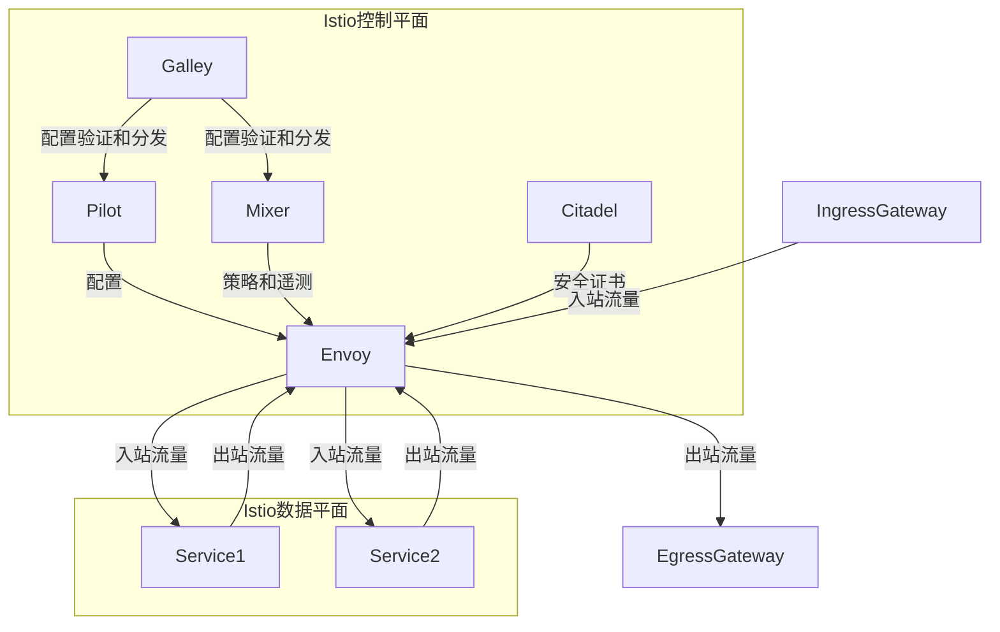

以下是标题为《AI系统Istio原理与代码实战案例讲解》的技术博客文章正文内容：

# AI系统Istio原理与代码实战案例讲解

## 1.背景介绍

### 1.1 微服务架构的兴起

随着云原生技术的不断发展,微服务架构已经成为构建现代分布式系统的主导方式。与传统的单体应用相比,微服务架构将整个系统拆分为多个小的、独立的服务,每个服务都可以独立部署、扩展和维护。这种架构模式带来了诸多优势,如提高系统的可伸缩性、灵活性和可维护性等。然而,微服务架构也引入了一些新的挑战,例如服务发现、负载均衡、流量管理、安全性、可观测性等。

### 1.2 服务网格的概念

为了解决上述挑战,服务网格(Service Mesh)应运而生。服务网格是一种专门为微服务架构设计的基础设施层,它通过提供一系列的网络功能来简化微服务之间的通信,如服务发现、负载均衡、流量管理、安全性、可观测性等。服务网格将这些基础设施功能从应用程序代码中解耦,使开发人员可以专注于业务逻辑的开发,同时也提高了系统的可维护性和可观测性。

### 1.3 Istio 简介

Istio 是一个开源的服务网格平台,由 Google、IBM 和 Lyft 等公司共同开发和维护。它旨在提供一种统一的方式来管理和保护微服务之间的通信,同时还提供了丰富的功能,如流量控制、安全性、可观测性等。Istio 可以与各种编程语言和框架无缝集成,并支持多种部署环境,如 Kubernetes、虚拟机、裸机等。

## 2.核心概念与联系

### 2.1 Istio 架构概览

Istio 的架构主要由以下几个核心组件组成:

1. **Envoy Proxy**:Istio 使用 Envoy 作为智能代理,负责管理所有入站和出站流量。每个服务实例都会部署一个 Envoy 代理,作为服务的 sidecar。

2. **Pilot**:Pilot 负责管理 Envoy 代理实例,并将流量管理规则转换为 Envoy 可以理解的配置。

3. **Mixer**:Mixer 负责收集和处理遥测数据,并执行策略和配额控制。

4. **Citadel**:Citadel 负责管理身份和安全证书,用于服务间的相互认证。

5. **Galley**:Galley 负责验证和分发 Istio 配置。

6. **Ingress/Egress Gateways**:作为 Istio 服务网格的入口和出口,用于管理进出网格的流量。

这些组件协同工作,为微服务提供了一个统一的控制平面和数据平面,简化了服务网格的管理和控制。

### 2.2 流量管理

Istio 提供了强大的流量管理功能,可以根据各种条件(如服务版本、HTTP头、权重等)动态控制流量的路由。这些功能包括:

- **服务发现**:自动发现和维护服务实例的端点信息。
- **负载均衡**:支持多种负载均衡算法,如轮询、最小请求等。
- **流量镜像**:将部分流量镜像到另一个服务版本,用于测试和分析。
- **故障注入**:故意引入延迟或错误,用于测试服务的弹性。
- **流量分割**:根据各种条件将流量分割到不同的服务版本。
- **超时重试**:为服务调用设置超时和重试策略。

这些功能可以通过 Istio 的流量管理 API 进行配置,无需修改应用程序代码。

### 2.3 安全性

Istio 提供了端到端的安全解决方案,包括:

- **相互认证**:基于服务身份的相互认证,防止未经授权的访问。
- **授权和鉴权**:基于角色的访问控制(RBAC)和自定义授权策略。
- **加密**:自动加密服务间的通信,防止数据被窃取或篡改。

这些安全功能可以在不修改应用程序代码的情况下启用,提高了系统的安全性和合规性。

### 2.4 可观测性

Istio 提供了丰富的可观测性功能,包括:

- **指标监控**:收集和导出服务的指标数据,如延迟、吞吐量、错误率等。
- **分布式追踪**:通过 Zipkin 或 Jaeger 等工具,跟踪分布式请求的整个生命周期。
- **日志记录**:集中收集和管理服务的日志数据。
- **可视化**:通过 Kiali 等工具,可视化服务网格的拓扑结构和流量情况。

这些功能可以帮助开发人员和运维人员深入了解系统的运行状况,快速发现和诊断问题。

## 3.核心算法原理具体操作步骤

### 3.1 Envoy 代理

Envoy 代理是 Istio 的核心组件之一,它作为 sidecar 部署在每个服务实例旁边,负责管理入站和出站流量。Envoy 的工作原理如下:

1. **服务发现**:Envoy 通过服务发现机制(如 Kubernetes API、DNS 等)获取服务端点信息。

2. **路由**:根据配置的路由规则,Envoy 将请求转发到合适的服务实例。

3. **负载均衡**:Envoy 使用不同的负载均衡算法(如轮询、最小请求等)将请求分发到多个服务实例。

4. **健康检查**:Envoy 定期检查服务实例的健康状态,将不健康的实例从负载均衡池中移除。

5. **重试**:如果服务调用失败,Envoy 可以根据配置的重试策略自动重试。

6. **断路器**:当服务出现高错误率时,Envoy 会自动触发断路器,防止级联故障。

7. **流量镜像**:Envoy 可以将部分流量镜像到另一个服务版本,用于测试和分析。

8. **故障注入**:Envoy 可以根据配置故意引入延迟或错误,用于测试服务的弹性。

9. **指标收集**:Envoy 收集服务的指标数据,如延迟、吞吐量、错误率等,并导出给监控系统。

10. **分布式追踪**:Envoy 支持分布式追踪,可以跟踪请求在整个服务网格中的完整生命周期。

11. **安全性**:Envoy 支持相互认证、授权和加密,确保服务间通信的安全性。

Envoy 的这些功能使得服务网格的管理和控制变得更加简单和高效。

### 3.2 Pilot

Pilot 是 Istio 控制平面的核心组件之一,负责管理 Envoy 代理实例,并将流量管理规则转换为 Envoy 可以理解的配置。Pilot 的工作原理如下:

1. **服务发现**:Pilot 通过平台的服务发现机制(如 Kubernetes API、Consul 等)获取服务端点信息。

2. **配置转换**:Pilot 将用户定义的流量管理规则(如路由规则、策略等)转换为 Envoy 可以理解的配置格式。

3. **配置分发**:Pilot 将转换后的配置分发给相应的 Envoy 代理实例。

4. **配置更新**:当服务端点或流量管理规则发生变化时,Pilot 会自动更新相应的 Envoy 配置。

5. **集群管理**:Pilot 管理 Envoy 代理实例所属的集群,并根据集群状态进行负载均衡和故障转移。

6. **认证和授权**:Pilot 与 Citadel 组件协作,为 Envoy 代理实例提供认证和授权功能。

Pilot 作为控制平面的核心,负责将用户定义的流量管理规则转换为实际的配置,并分发给 Envoy 代理实例执行。它确保了服务网格中的流量管理策略能够正确地应用和执行。

### 3.3 Mixer

Mixer 是 Istio 控制平面的另一个核心组件,负责收集和处理遥测数据,并执行策略和配额控制。Mixer 的工作原理如下:

1. **遥测数据收集**:Envoy 代理将服务的指标数据和日志数据发送给 Mixer。

2. **策略评估**:Mixer 根据预定义的策略评估每个请求,决定是否允许该请求通过。

3. **配额控制**:Mixer 根据配置的配额规则,控制每个服务或客户端的资源使用情况。

4. **数据处理**:Mixer 可以将收集的遥测数据发送给不同的后端系统,如监控系统、日志系统等。

5. **插件扩展**:Mixer 支持通过插件扩展其功能,如集成第三方策略引擎、日志处理器等。

6. **适配器**:Mixer 使用适配器与后端系统进行集成,支持多种后端系统,如 Prometheus、Fluentd、OPA 等。

Mixer 作为控制平面的重要组成部分,负责收集和处理服务网格中的遥测数据,并执行策略和配额控制。它确保了服务网格中的安全性和合规性,同时也提供了丰富的可观测性功能。

## 4.数学模型和公式详细讲解举例说明

在 Istio 中,有一些核心算法和数学模型用于实现流量管理、负载均衡和故障注入等功能。下面我们将详细讲解其中的几个重要算法和模型。

### 4.1 一致性哈希负载均衡算法

一致性哈希(Consistent Hashing)是一种常用的负载均衡算法,它可以在服务实例数量发生变化时,将尽可能少的现有连接重新映射到其他服务实例。这种算法特别适用于分布式系统中的负载均衡场景。

一致性哈希算法的工作原理如下:

1. 将服务实例和客户端请求映射到同一个哈希环上。
2. 对于每个客户端请求,计算其哈希值,并在哈希环上顺时针查找最近的服务实例。
3. 当服务实例数量发生变化时,只需重新映射受影响的客户端请求,而不需要重新映射所有请求。

数学模型:

假设有 $n$ 个服务实例 $\{s_1, s_2, \dots, s_n\}$,每个服务实例都有一个对应的哈希值 $h(s_i)$。对于一个客户端请求 $r$,其哈希值为 $h(r)$。我们需要找到距离 $h(r)$ 最近的服务实例哈希值,即:

$$\min_{1 \leq i \leq n} \{ d(h(r), h(s_i)) \}$$

其中 $d(x, y)$ 表示哈希环上 $x$ 和 $y$ 之间的距离。

当服务实例数量发生变化时,只需要重新计算受影响的客户端请求的映射关系,而不需要重新计算所有请求。这种算法可以有效减少服务实例变化带来的连接重新分配开销。

### 4.2 指数衰减负载均衡算法

指数衰减负载均衡算法(Exponential Decay Load Balancing)是一种动态负载均衡算法,它根据服务实例的响应时间动态调整权重,从而实现更加智能的负载均衡。

算法的工作原理如下:

1. 初始化每个服务实例的权重为 1。
2. 对于每个请求,根据服务实例的权重进行加权随机选择。
3. 记录每个请求的响应时间 $t$。
4. 根据响应时间