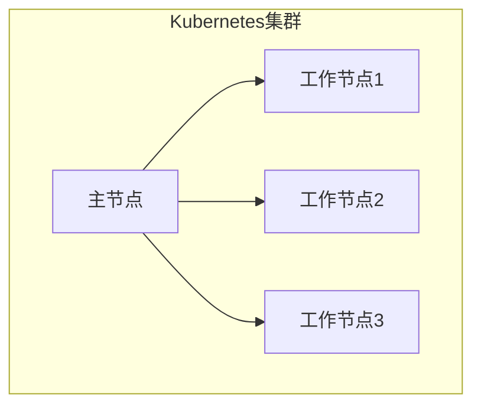
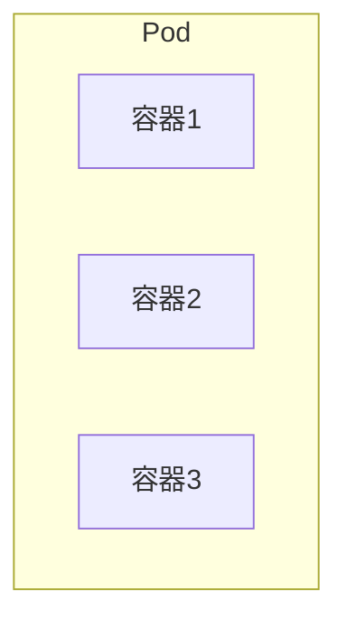
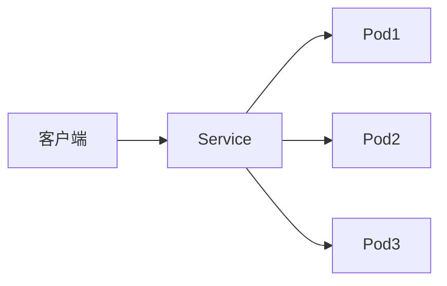
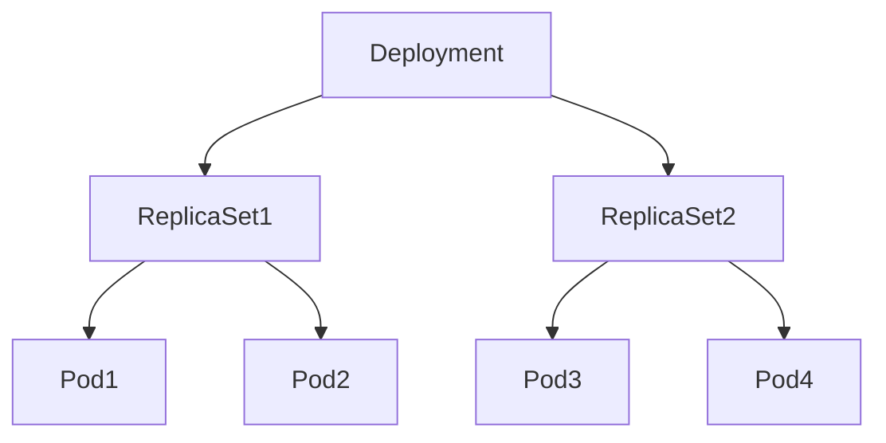
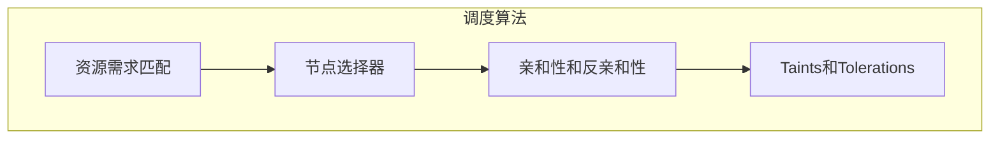
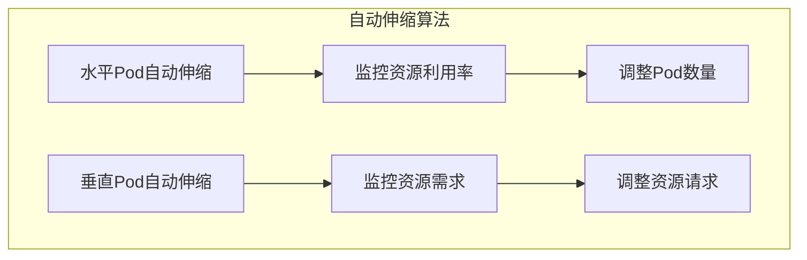
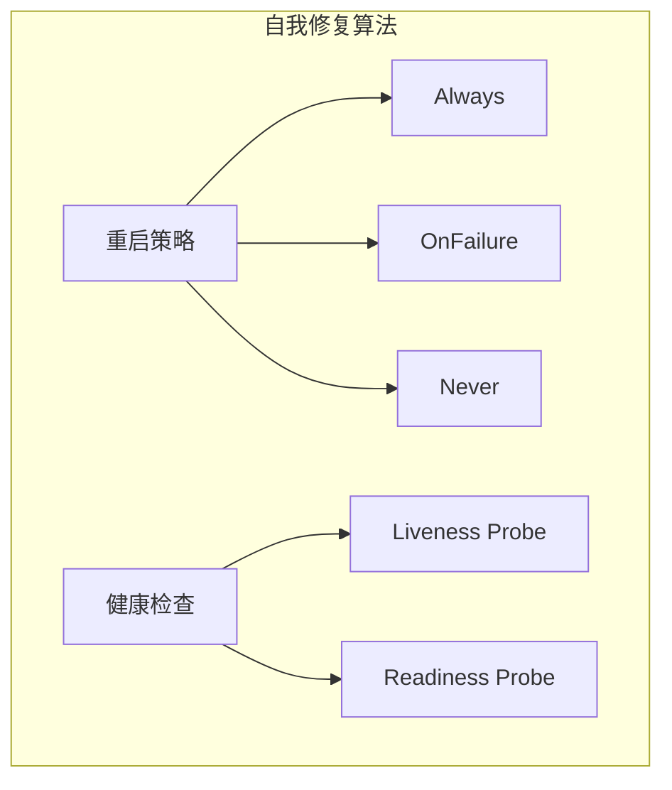

# AI系统Kubernetes原理与代码实战案例讲解

## 1.背景介绍

在当今快速发展的数字时代,人工智能(AI)系统已经广泛应用于各个领域,包括金融、医疗、制造业等。随着AI系统的复杂性和规模不断增加,有效管理和部署这些系统变得至关重要。Kubernetes作为一个开源的容器编排平台,为AI系统的部署、扩展和管理提供了强大的解决方案。

Kubernetes最初是由Google公司设计和开发的,用于自动化应用程序的部署、扩展和管理。它可以跨多个主机集群自动部署和管理容器化应用程序,提供了高可用性、可扩展性和灵活性。在AI系统中,Kubernetes可以帮助简化复杂的基础设施管理,使开发人员能够专注于AI模型和应用程序的开发。

## 2.核心概念与联系

在探讨Kubernetes在AI系统中的应用之前,让我们先了解一些核心概念:

### 2.1 容器(Container)

容器是一种轻量级、可移植的虚拟化技术,可以将应用程序及其依赖项打包在一个独立的环境中。容器比传统的虚拟机更加高效和灵活,因为它们共享主机操作系统的内核,而不需要为每个应用程序提供完整的操作系统。

### 2.2 Kubernetes集群(Cluster)

Kubernetes集群由一组节点(Node)组成,包括一个或多个主节点(Master Node)和多个工作节点(Worker Node)。主节点负责管理整个集群,而工作节点则用于运行容器化的应用程序。

### 2.3 Pod

Pod是Kubernetes中最小的可部署单元,它由一个或多个容器组成,共享相同的网络命名空间和存储卷。在AI系统中,每个Pod可以包含一个或多个AI模型容器以及相关的辅助容器(如数据预处理、日志记录等)。

### 2.4 服务(Service)

服务是一种抽象层,它定义了一组Pod的逻辑集合和访问策略。服务通过提供稳定的IP地址和DNS名称,使得Pod可以被其他Pod或外部客户端访问。在AI系统中,服务可以用于暴露AI模型的API端点,以便其他应用程序或客户端可以访问它们。

### 2.5 部署(Deployment)

部署是一种声明式的方式来管理Pod和ReplicaSet。它提供了更高级别的抽象,使得可以轻松地管理Pod的创建、更新和扩展。在AI系统中,部署可以用于管理AI模型的生命周期,例如滚动更新、扩展或回滚。

这些核心概念为Kubernetes在AI系统中的应用奠定了基础。通过将AI模型和相关组件容器化,并利用Kubernetes的编排和管理功能,我们可以更高效地部署、扩展和管理AI系统。

## 3.核心算法原理具体操作步骤

Kubernetes的核心算法原理主要包括调度(Scheduling)、自动伸缩(Auto-Scaling)和自我修复(Self-Healing)等方面。让我们逐一探讨这些算法原理及其在AI系统中的应用。

### 3.1 调度算法

调度算法负责将Pod分配到合适的工作节点上运行。Kubernetes使用多种调度策略来实现高效的资源利用和负载均衡。以下是一些常见的调度算法:

#### 3.1.1 资源需求匹配

Kubernetes会根据Pod的资源需求(如CPU、内存等)和节点的可用资源进行匹配。如果某个节点有足够的资源来满足Pod的需求,则该Pod将被调度到该节点上运行。

#### 3.1.2 节点选择器(Node Selector)

开发人员可以为节点添加标签(Label),并为Pod指定节点选择器,以确保Pod只能运行在具有特定标签的节点上。这在AI系统中很有用,例如可以将GPU密集型的AI模型Pod调度到具有GPU资源的节点上。

#### 3.1.3 亲和性和反亲和性(Affinity and Anti-Affinity)

亲和性规则可以确保Pod被调度到满足特定条件的节点上,而反亲和性规则则可以防止Pod被调度到某些节点上。在AI系统中,这可以用于实现高可用性和故障隔离,例如将相同AI模型的多个副本Pod分散到不同的节点上运行。

#### 3.1.4 Taints和Tolerations

Taints(污点)是应用于节点上的标记,它可以防止Pod被调度到该节点上。Tolerations(容忍)则是应用于Pod上的标记,允许Pod被调度到具有相应Taints的节点上。这在AI系统中可以用于专用节点的分配,例如将某些节点专门用于运行GPU密集型的AI模型Pod。

### 3.2 自动伸缩算法

自动伸缩算法可以根据系统负载和资源利用率动态地调整Pod的数量,以确保AI系统的高性能和资源利用率。Kubernetes提供了两种自动伸缩机制:

#### 3.2.1 水平Pod自动伸缩(Horizontal Pod Autoscaler, HPA)

HPA会监控Pod的CPU和内存利用率,当资源利用率超过预设阈值时,它会自动增加或减少Pod的数量。这在AI系统中非常有用,可以根据模型推理请求的数量动态调整AI模型Pod的数量。

#### 3.2.2 垂直Pod自动伸缩(Vertical Pod Autoscaler, VPA)

VPA会根据Pod的资源需求动态调整Pod的CPU和内存请求,以更好地利用节点资源。在AI系统中,VPA可以优化AI模型Pod的资源分配,避免资源浪费或资源不足。

### 3.3 自我修复算法

Kubernetes的自我修复算法可以在Pod出现故障或异常时自动重启或重新调度Pod,以确保AI系统的高可用性和稳定性。

#### 3.3.1 重启策略(Restart Policy)

Kubernetes为每个Pod定义了重启策略,当Pod出现故障时,Kubernetes会根据重启策略决定是否重启Pod。常见的重启策略包括Always(总是重启)、OnFailure(仅在失败时重启)和Never(从不重启)。

#### 3.3.2 健康检查(Liveness and Readiness Probes)

Kubernetes提供了两种健康检查机制:

- Liveness Probe: 用于检测Pod是否仍在运行。如果Liveness Probe失败,Kubernetes会重启该Pod。
- Readiness Probe: 用于检测Pod是否已准备好接收流量。如果Readiness Probe失败,Kubernetes会将该Pod从服务中移除,直到它准备就绪。

在AI系统中,可以使用这些健康检查机制来监控AI模型的状态,并在出现问题时自动重启或重新调度Pod。

通过利用Kubernetes的调度、自动伸缩和自我修复算法,AI系统可以实现高效的资源利用、自动扩展和高可用性,从而提高整体系统的性能和稳定性。

## 4.数学模型和公式详细讲解举例说明

在AI系统中,数学模型和公式扮演着重要的角色,用于描述和优化各种算法和过程。以下是一些常见的数学模型和公式,以及它们在AI系统中的应用。

### 4.1 线性回归模型

线性回归是一种广泛应用的监督学习算法,用于预测连续值的目标变量。它的数学模型可以表示为:

$$y = \theta_0 + \theta_1x_1 + \theta_2x_2 + \cdots + \theta_nx_n$$

其中:
- $y$是预测的目标变量
- $x_1, x_2, \cdots, x_n$是特征变量
- $\theta_0, \theta_1, \cdots, \theta_n$是模型参数

在AI系统中,线性回归可以用于各种预测任务,例如销售预测、能源需求预测等。

### 4.2 逻辑回归模型

逻辑回归是一种用于分类任务的监督学习算法,它可以预测一个实例属于某个类别的概率。逻辑回归模型的数学表达式如下:

$$P(y=1|x) = \sigma(\theta^Tx) = \frac{1}{1 + e^{-\theta^Tx}}$$

其中:
- $P(y=1|x)$是实例$x$属于正类的概率
- $\sigma(z)$是sigmoid函数,将输入值映射到(0, 1)范围内
- $\theta$是模型参数向量
- $x$是特征向量

在AI系统中,逻辑回归可以用于各种二分类任务,如垃圾邮件检测、欺诈检测等。

### 4.3 K-Means聚类算法

K-Means是一种常用的无监督学习算法,用于将数据集划分为K个聚类。它的目标是最小化每个数据点到其所属聚类中心的距离平方和,即:

$$J = \sum_{i=1}^{m}\sum_{k=1}^{K}r^{(i)}_k\left\|x^{(i)} - \mu_k\right\|^2$$

其中:
- $m$是数据集中实例的数量
- $K$是聚类的数量
- $r^{(i)}_k$是一个指示变量,如果实例$x^{(i)}$属于第$k$个聚类,则$r^{(i)}_k=1$,否则为0
- $\mu_k$是第$k$个聚类的中心点

在AI系统中,K-Means聚类可以用于客户细分、图像分割等任务。

### 4.4 主成分分析(PCA)

主成分分析(PCA)是一种常用的降维技术,它通过线性变换将高维数据投影到低维空间,同时尽可能保留数据的方差。PCA的数学表达式如下:

$$X' = X \times W$$

其中:
- $X$是原始数据矩阵
- $W$是由主成分向量构成的矩阵
- $X'$是降维后的数据矩阵

在AI系统中,PCA可以用于降低模型的复杂性、提高计算效率,以及去除数据中的噪声和冗余信息。

通过将这些数学模型和公式应用于AI系统,我们可以更好地理解和优化各种算法和过程,从而提高系统的性能和准确性。

## 5.项目实践:代码实例和详细解释说明

为了更好地理解Kubernetes在AI系统中的应用,让我们通过一个实际的代码示例来探讨如何在Kubernetes上部署和管理一个AI模型服务。

在这个示例中,我们将使用TensorFlow Serving作为AI模型服务,并在Kubernetes集群上部署和扩展它。TensorFlow Serving是一个高性能的服务系统,用于在生产环境中部署机器学习模型。

### 5.1 准备工作

首先,我们需要准备以下内容:

1. 一个Kubernetes集群,可以是本地的Minikube或云提供商的托管Kubernetes服务。
2. TensorFlow Serving Docker镜像,可以从Docker Hub或自行构建。
3. 一个预先训练好的机器学习模型,例如图像分类模型。

### 5.2 创建Kubernetes资源对象

接下来,我们需