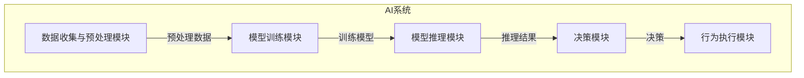
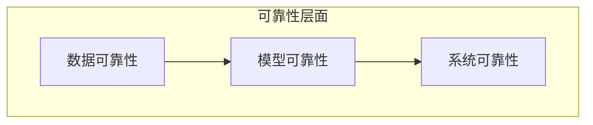

# AI系统可靠性原理与代码实战案例讲解

## 1.背景介绍

在当今时代,人工智能(AI)系统无处不在,从智能助手到自动驾驶汽车,再到医疗诊断和金融决策等领域。随着AI系统在各个领域的广泛应用,确保这些系统的可靠性变得至关重要。可靠性是指系统能够按照预期执行操作并产生正确结果的能力。对于AI系统而言,可靠性不仅关乎系统本身的正确性,更关乎人类用户的安全和利益。

不可靠的AI系统可能会导致严重的后果,例如自动驾驶汽车发生失控、医疗诊断系统给出错误建议等。因此,提高AI系统的可靠性是当前AI领域的一个重要课题。本文将探讨AI系统可靠性的核心原理,介绍相关算法和数学模型,并通过实际案例讲解如何在代码层面实现可靠的AI系统。

## 2.核心概念与联系

在讨论AI系统可靠性之前,我们需要了解一些核心概念及其相互关系。

### 2.1 AI系统组成

一个典型的AI系统通常由以下几个主要组成部分构成:

1. **数据收集与预处理模块**: 负责从各种来源收集原始数据,并对这些数据进行清洗、标注和特征提取等预处理操作。
2. **模型训练模块**: 使用预处理后的数据训练机器学习模型,例如神经网络、决策树等。
3. **模型推理模块**: 将训练好的模型应用于新的输入数据,得到相应的输出或预测结果。
4. **决策模块**: 根据模型推理的结果,结合其他信息(如规则、约束等),做出最终决策。
5. **行为执行模块**: 将决策转化为实际行为,例如控制机器人运动、发送通知等。



### 2.2 可靠性的三个层面

AI系统的可靠性可以分为三个层面:

1. **数据可靠性**: 确保输入数据的质量和完整性,避免数据噪声、偏差等问题。
2. **模型可靠性**: 保证模型的泛化能力和稳健性,使其能够正确处理各种输入,并抵御对抗性攻击。
3. **系统可靠性**: 整个AI系统的端到端可靠性,包括各个模块的正确交互、容错能力和安全保护等。



这三个层面相互影响、密切关联。高质量的数据是训练出可靠模型的基础,而可靠的模型又是构建可靠系统的关键。同时,系统级的可靠性设计也会反过来提高数据和模型的可靠性。

## 3.核心算法原理具体操作步骤

提高AI系统可靠性的核心算法原理主要包括以下几个方面:

### 3.1 数据清洗与增强

高质量的训练数据是构建可靠AI模型的基础。常见的数据清洗技术包括:

1. **缺失值处理**: 使用插值、平均值或机器学习模型等方法估计并填充缺失数据。
2. **异常值检测**: 通过统计方法(如箱线图、Z-分数等)或基于模型的方法(如隔离森林)检测并处理异常值。
3. **去重与规范化**: 去除重复数据,将数据转换为标准格式。
4. **特征选择**: 使用Filter、Wrapper或Embedded方法选择对模型性能有贡献的特征。

数据增强技术则通过对现有数据进行变换(如旋转、平移、噪声加入等)来扩充训练集,提高模型的泛化能力。

### 3.2 模型正则化与集成

机器学习模型往往存在过拟合的风险,即模型在训练数据上表现良好,但在新的数据上泛化能力较差。常见的正则化技术包括:

1. **L1/L2正则化**: 在损失函数中加入模型参数的L1或L2范数惩罚项,防止模型过度复杂。
2. **Dropout**: 在训练过程中随机丢弃部分神经元,减少神经网络中的冗余。
3. **Early Stopping**: 在验证集上的性能不再提升时提前停止训练,避免过拟合。

另一种提高模型泛化能力的方法是集成学习,即将多个弱学习器(如决策树)组合成一个强学习器,常见技术包括Bagging、Boosting和Stacking等。

### 3.3 对抗训练

对抗性攻击是指通过对输入数据进行精心设计的微小扰动,使AI模型产生错误的预测结果。对抗训练旨在提高模型对这种攻击的鲁棒性,主要步骤如下:

1. **生成对抗样本**: 使用FGSM、PGD等方法,在原始样本附近寻找对模型最具攻击性的扰动。
2. **将对抗样本加入训练集**: 将生成的对抗样本与原始样本一同用于模型训练。
3. **迭代训练**: 重复上述过程,直到模型在对抗样本上的性能不再提升。

### 3.4 联邦学习

联邦学习是一种分布式机器学习范式,允许多个参与方在不共享原始数据的情况下协同训练模型。这有助于保护数据隐私,同时提高模型的泛化能力。联邦学习的基本流程如下:

1. **初始化**: 服务器向每个参与方发送初始模型参数。
2. **本地训练**: 每个参与方使用自己的数据在本地训练模型,得到新的模型参数。
3. **模型聚合**: 服务器从参与方收集模型参数更新,并对它们进行加权平均,得到新的全局模型参数。
4. **迭代训练**: 重复上述过程,直到模型收敛或达到预期性能。

### 3.5 模块化设计与监控

在系统层面,模块化设计和持续监控是提高可靠性的关键:

1. **模块化设计**: 将整个AI系统分解为相对独立的模块,每个模块只负责特定的功能,并通过标准接口相互通信。这种设计有利于隔离故障、提高可维护性。
2. **监控与反馈**: 在每个模块中嵌入监控机制,持续收集关键指标(如时延、错误率等),并通过反馈机制及时发现和修复异常。
3. **容错与恢复**: 设计容错机制,使系统能够在部分模块发生故障时继续运行;同时提供故障恢复能力,将系统恢复到正常状态。
4. **安全防护**: 采用加密、访问控制等安全措施,防止未经授权的访问和操作,保护系统及数据安全。

## 4.数学模型和公式详细讲解举例说明

提高AI系统可靠性涉及多种数学模型和算法,下面将详细讲解其中的几个核心模型。

### 4.1 异常检测

异常检测旨在从数据中发现"异常"或"离群"样本,这对于发现数据质量问题和潜在攻击至关重要。常见的异常检测模型包括:

1. **基于统计的模型**:

假设数据服从某种分布(如高斯分布),将偏离该分布的样本视为异常。常用的度量包括马氏距离(Mahalanobis Distance)和Z-分数:

$$
MD(x) = \sqrt{(x-\mu)^T\Sigma^{-1}(x-\mu)}
$$

其中$x$为样本向量,$\mu$为均值向量,$\Sigma$为协方差矩阵。当$MD(x)$超过一定阈值时,将$x$标记为异常。

2. **基于密度的模型**:

假设异常样本位于数据的稀疏区域,可以使用核密度估计、局部异常因子(LOF)等方法检测密度较低的区域。

3. **基于模型的方法**:

训练一个模型(如自编码器、隔离森林等)来拟合正常数据,将无法被模型很好拟合的样本视为异常。

### 4.2 对抗样本生成

对抗样本生成是对抗训练的关键步骤。常用的生成方法包括:

1. **快速梯度符号法(FGSM)**: 

$$
x_{adv} = x + \epsilon \cdot sign(\nabla_x J(x,y))
$$

其中$x$为原始样本,$y$为标签,$J$为模型损失函数,$\epsilon$为扰动强度。FGSM通过在损失函数梯度的方向上添加扰动来生成对抗样本。

2. **投射梯度下降(PGD)**: 

PGD是FGSM的多步迭代版本,可以生成更强的对抗样本:

$$
x_{adv}^{0} = x \\
x_{adv}^{t+1} = \Pi_{x+\epsilon}(x_{adv}^{t} + \alpha \cdot sign(\nabla_x J(x_{adv}^{t},y)))
$$

其中$\Pi$为投影操作,将扰动限制在$\epsilon$范围内;$\alpha$为步长。

3. **语义对抗样本**:

除了对图像等连续数据添加扰动,也可以通过微调输入文本(如替换同义词)来生成对自然语言处理模型有攻击性的样本。

### 4.3 联邦学习

联邦学习的核心是在不共享原始数据的情况下,通过模型参数的交互式更新来训练出一个全局模型。常用的联邦学习算法包括FedAvg和FedProx。

以FedAvg为例,在第$t$轮迭代中,服务器会向每个参与方$k$发送当前的全局模型参数$w_t$,参与方使用本地数据对模型进行$E$轮训练,得到新的模型参数$w_k^{t+1}$,然后将模型参数的更新$\Delta w_k^t = w_k^{t+1} - w_t$上传给服务器。服务器对所有参与方的更新进行加权平均,得到新的全局模型参数:

$$
w_{t+1} = w_t + \sum_{k=1}^{K} \frac{n_k}{n} \Delta w_k^t
$$

其中$n_k$为参与方$k$的样本数,$n$为总样本数。通过多轮迭代,可以得到一个在所有参与方数据上表现良好的全局模型。

## 5.项目实践:代码实例和详细解释说明

为了更好地理解AI系统可靠性的实现,我们将通过一个图像分类的实践案例,演示如何使用Python和相关库(如PyTorch、Scikit-learn等)提高模型和系统的可靠性。

### 5.1 数据预处理

我们使用CIFAR-10数据集进行实验,该数据集包含10个类别的32x32彩色图像。首先,我们对数据进行预处理:

```python
import torch
from torchvision import datasets, transforms

# 定义数据增强和归一化变换
data_augmentation = transforms.Compose([
    transforms.RandomHorizontalFlip(),
    transforms.RandomCrop(32, padding=4),
    transforms.ToTensor(),
    transforms.Normalize((0.4914, 0.4822, 0.4465), (0.2023, 0.1994, 0.2010))
])

# 加载训练集和测试集
train_dataset = datasets.CIFAR10('data', train=True, download=True, transform=data_augmentation)
test_dataset = datasets.CIFAR10('data', train=False, download=True, transform=data_augmentation)
```

我们使用了随机水平翻转和随机裁剪的数据增强技术,并对图像像素值进行了归一化。

### 5.2 模型定义与训练

接下来,我们定义一个简单的卷积神经网络模型,并使用L2正则化和Dropout进行正则化:

```python
import torch.nn as nn

class ConvNet(nn.Module):
    def __init__(self):
        super().__init__()
        self.conv1 = nn.Conv2d(3, 32, 3, padding=1)
        self.conv2 = nn.Conv2d(32, 64, 3, padding=1)
        