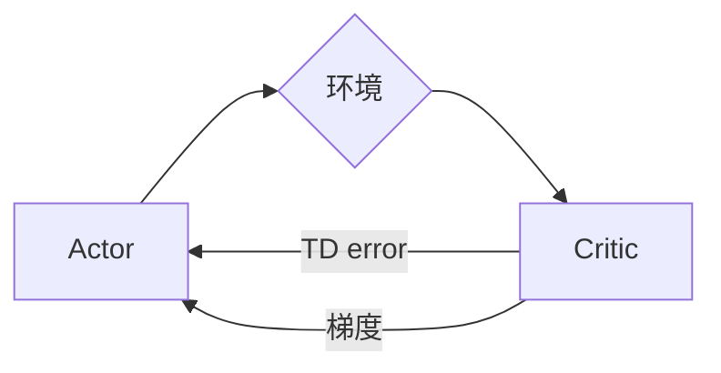
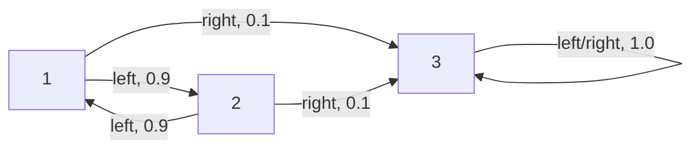

# Actor-Critic算法

## 1. 背景介绍
### 1.1 强化学习概述
#### 1.1.1 强化学习的定义与特点
强化学习(Reinforcement Learning, RL)是机器学习的一个重要分支,它主要研究如何使智能体(Agent)通过与环境的交互来学习最优策略,以获得最大的累积奖励。与监督学习和非监督学习不同,强化学习不需要事先准备好训练数据,而是通过探索和利用的方式来学习。

#### 1.1.2 马尔可夫决策过程
强化学习问题通常被建模为马尔可夫决策过程(Markov Decision Process, MDP)。一个MDP由状态集合S、动作集合A、状态转移概率P、奖励函数R和折扣因子γ组成。Agent与环境交互的过程可以看作在MDP中进行状态转移并获得奖励的过程。

#### 1.1.3 策略与价值函数
强化学习的目标是学习一个最优策略π,使得在该策略下智能体能获得最大的期望累积奖励。与策略相关的是状态价值函数V(s)和动作价值函数Q(s,a),分别表示从状态s开始执行策略π能获得的期望回报,以及在状态s下执行动作a后继续执行策略π能获得的期望回报。

### 1.2 基于值函数的方法
#### 1.2.1 值迭代与策略迭代
传统的强化学习方法主要有值迭代(Value Iteration)和策略迭代(Policy Iteration)。值迭代通过不断更新状态价值函数来收敛到最优值函数,然后基于最优值函数得到最优策略。策略迭代则交替地进行策略评估和策略提升,直到找到最优策略。

#### 1.2.2 时序差分学习
值迭代和策略迭代的一个问题是需要知道MDP的状态转移概率和奖励函数。时序差分学习(Temporal Difference Learning)克服了这一限制,它结合了动态规划和蒙特卡洛方法的优点,通过Bootstrap的方式基于当前值函数的估计来更新值函数。代表算法有Sarsa和Q-learning。

### 1.3 基于策略梯度的方法
值函数方法难以直接处理连续动作空间的问题。基于策略梯度(Policy Gradient)的方法则直接对策略函数进行参数化,并通过梯度上升的方式来更新策略参数,使策略朝着累积奖励增大的方向改进。常见的算法有REINFORCE和Actor-Critic。

## 2. 核心概念与联系
### 2.1 Actor-Critic框架
Actor-Critic算法是一种结合了值函数和策略梯度的强化学习算法。它由两部分组成:Actor和Critic。Actor负责学习一个参数化的策略函数,根据当前状态选择动作;Critic负责学习一个值函数,评估Actor所选动作的好坏。

### 2.2 策略函数与值函数
在Actor-Critic算法中,策略函数π(a|s)表示在状态s下选择动作a的概率。它通常用一个参数化的函数(如神经网络)来表示,记为π(a|s;θ),其中θ为策略函数的参数。

值函数可以是状态值函数V(s)或动作值函数Q(s,a),分别表示状态s的期望回报和在状态s下执行动作a的期望回报。值函数也用一个参数化的函数(如神经网络)来表示,记为V(s;w)或Q(s,a;w),其中w为值函数的参数。

### 2.3 时序差分误差
时序差分误差(Temporal Difference Error)是Actor-Critic算法中的一个核心概念。它表示当前值函数的估计与实际回报之间的差异。对于状态值函数,TD误差定义为:

$$\delta_t = r_t + \gamma V(s_{t+1};w) - V(s_t;w)$$

其中$r_t$是t时刻获得的奖励,$\gamma$是折扣因子。TD误差反映了值函数估计的准确性,可以用来指导值函数参数w的更新。

### 2.4 策略梯度定理
策略梯度定理给出了期望回报关于策略参数θ的梯度:

$$\nabla_\theta J(\theta) = E_{\pi_\theta}[\nabla_\theta \log \pi_\theta(a|s) Q^{\pi_\theta}(s,a)]$$

其中$J(\theta)$是在策略$\pi_\theta$下的期望回报,$Q^{\pi_\theta}(s,a)$是在策略$\pi_\theta$下的动作值函数。这个梯度告诉我们如何调整策略参数,使得好的动作被赋予更高的概率,从而提升期望回报。

## 3. 核心算法原理具体操作步骤
### 3.1 算法流程
Actor-Critic算法的主要流程如下:

1. 初始化Actor的策略函数参数θ和Critic的值函数参数w
2. 对每个episode循环:
   1. 初始化初始状态s
   2. 对每个时间步t循环:
      1. 根据当前策略π(a|s;θ)选择动作a
      2. 执行动作a,观察奖励r和下一状态s'
      3. 计算TD误差:$\delta_t = r_t + \gamma V(s';w) - V(s;w)$
      4. 更新值函数参数w:$w \leftarrow w + \alpha_w \delta_t \nabla_w V(s;w)$
      5. 更新策略函数参数θ:$\theta \leftarrow \theta + \alpha_\theta \delta_t \nabla_\theta \log \pi(a|s;\theta)$
      6. 更新状态:$s \leftarrow s'$
   3. 直到s为终止状态

其中$\alpha_w$和$\alpha_\theta$分别是值函数和策略函数的学习率。

### 3.2 Critic更新值函数
Critic使用TD误差来更新值函数参数w。TD误差表示当前值函数估计与实际回报之间的差异,可以看作是值函数估计的误差。Critic通过最小化TD误差来改进值函数估计:

$$\Delta w = \alpha_w \delta_t \nabla_w V(s;w)$$

其中$\alpha_w$是学习率,$\nabla_w V(s;w)$是值函数关于参数w的梯度。这个更新规则本质上是在执行梯度下降,使得值函数估计逼近实际回报。

### 3.3 Actor更新策略函数
Actor使用Critic估计的值函数来更新策略函数参数θ。根据策略梯度定理,参数θ的更新方向应该使得好的动作被赋予更高的概率。在Actor-Critic算法中,我们用TD误差来替代策略梯度定理中的动作值函数:

$$\Delta \theta = \alpha_\theta \delta_t \nabla_\theta \log \pi(a|s;\theta)$$

其中$\alpha_\theta$是学习率,$\nabla_\theta \log \pi(a|s;\theta)$是对数策略函数关于参数θ的梯度。这个更新规则意味着,如果TD误差为正,即实际回报高于估计值,那么我们应该增大当前动作的概率;反之,如果TD误差为负,则应该减小当前动作的概率。

## 4. 数学模型和公式详细讲解举例说明
### 4.1 马尔可夫决策过程
马尔可夫决策过程(MDP)是一个五元组$(S,A,P,R,\gamma)$:
- 状态空间S:Agent可能处于的所有状态的集合。
- 动作空间A:Agent可能采取的所有动作的集合。
- 状态转移概率P:$P(s'|s,a)$表示在状态s下执行动作a后转移到状态s'的概率。
- 奖励函数R:$R(s,a)$表示在状态s下执行动作a后获得的即时奖励。
- 折扣因子γ:$\gamma \in [0,1]$,表示未来奖励的折扣程度。

MDP描述了Agent与环境交互的动力学模型。在每个时间步t,Agent根据当前状态$s_t$选择一个动作$a_t$,环境根据状态转移概率$P(s_{t+1}|s_t,a_t)$转移到下一状态$s_{t+1}$,并给予Agent一个奖励$r_t=R(s_t,a_t)$。Agent的目标是最大化累积奖励:

$$G_t = \sum_{k=0}^{\infty} \gamma^k r_{t+k}$$

### 4.2 值函数
值函数表示状态或状态-动作对的长期价值。状态值函数$V^\pi(s)$表示从状态s开始执行策略π能获得的期望回报:

$$V^\pi(s) = E_\pi[G_t|s_t=s] = E_\pi[\sum_{k=0}^{\infty} \gamma^k r_{t+k}|s_t=s]$$

动作值函数$Q^\pi(s,a)$表示在状态s下执行动作a,然后继续执行策略π能获得的期望回报:

$$Q^\pi(s,a) = E_\pi[G_t|s_t=s,a_t=a] = E_\pi[\sum_{k=0}^{\infty} \gamma^k r_{t+k}|s_t=s,a_t=a]$$

值函数满足贝尔曼方程(Bellman Equation):

$$V^\pi(s) = \sum_a \pi(a|s) \sum_{s'} P(s'|s,a) [R(s,a) + \gamma V^\pi(s')]$$

$$Q^\pi(s,a) = \sum_{s'} P(s'|s,a) [R(s,a) + \gamma \sum_{a'} \pi(a'|s') Q^\pi(s',a')]$$

### 4.3 策略梯度
策略梯度方法直接对策略函数$\pi_\theta(a|s)$进行参数化,其中θ是策略函数的参数。目标是最大化期望回报:

$$J(\theta) = E_{\pi_\theta}[G_t] = \sum_s d^{\pi_\theta}(s) \sum_a \pi_\theta(a|s) Q^{\pi_\theta}(s,a)$$

其中$d^{\pi_\theta}(s)$是在策略$\pi_\theta$下状态s的稳态分布。根据策略梯度定理,期望回报关于参数θ的梯度为:

$$\nabla_\theta J(\theta) = \sum_s d^{\pi_\theta}(s) \sum_a \nabla_\theta \pi_\theta(a|s) Q^{\pi_\theta}(s,a)$$

$$= E_{\pi_\theta}[\nabla_\theta \log \pi_\theta(a|s) Q^{\pi_\theta}(s,a)]$$

这个梯度告诉我们如何调整策略参数,使得好的动作被赋予更高的概率,从而提升期望回报。

### 4.4 Actor-Critic算法示例
考虑一个简单的MDP,状态空间为{1,2,3},动作空间为{left, right}。状态转移概率和奖励函数如下:

在状态3下执行任意动作都会获得1.0的奖励,其他状态下执行动作奖励为0。

我们使用Actor-Critic算法来学习这个MDP的最优策略。策略函数和值函数都用线性函数来参数化:

$$\pi(a|s;\theta) = \frac{e^{\theta_a^T s}}{\sum_{a'} e^{\theta_{a'}^T s}}$$

$$V(s;w) = w^T s$$

其中θ和w分别是策略函数和值函数的参数向量。

在每个时间步t,根据当前策略$\pi(a|s;\theta)$选择动作a,然后观察奖励r和下一状态s'。接着计算TD误差:

$$\delta_t = r_t + \gamma V(s';w) - V(s;w)$$

然后更新值函数参数w和策略函数参数θ:

$$w \leftarrow w + \alpha_w \delta_t s$$

$$\theta_a \leftarrow \theta_a + \alpha_\theta \delta_t (1 - \pi(a|s;\theta)) s$$

$$\theta_{a'} \leftarrow \theta_{a'} - \alpha_\theta \delta_t \pi(a'|s;\theta) s, \forall a' \neq a$$

其中$\alpha_w$和$\alpha_\theta$分别是值函数和策略函数的学习率。

经过足够多次数的迭代,