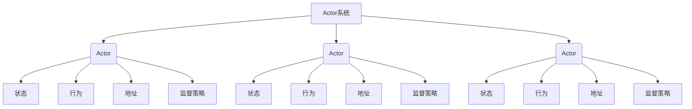
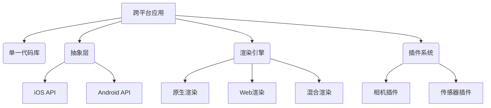
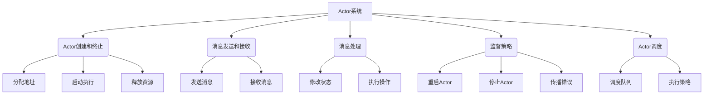
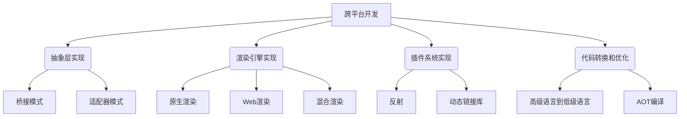

# ActorModel与跨平台移动应用开发的结合与优化

## 1.背景介绍

### 1.1 移动应用程序的发展

随着智能手机和平板电脑的普及,移动应用程序已经成为人们日常生活中不可或缺的一部分。移动应用程序为用户提供了无与伦比的便利性,让他们可以在任何时间和地点访问各种服务和信息。然而,开发高质量的移动应用程序并非一蹴而就,需要解决诸多挑战。

### 1.2 跨平台开发的需求

由于移动设备操作系统的多样性,开发者通常需要为每个平台(如 iOS 和 Android)单独开发应用程序。这种方法不仅耗费大量资源,而且难以维护代码库。为了解决这个问题,跨平台开发应运而生,它允许开发者使用单一代码库为多个平台构建应用程序。

### 1.3 Actor模型的优势

Actor模型是一种用于编写并发和分布式系统的编程范式。它将系统建模为许多独立的actor,每个actor都有自己的状态和行为。Actor之间通过异步消息传递进行通信,从而实现松耦合和高度并发。Actor模型在处理高并发和分布式场景时表现出色,因此非常适合开发移动应用程序。

### 1.4 结合Actor模型和跨平台开发

将Actor模型与跨平台开发相结合,可以带来诸多优势。首先,Actor模型的松耦合特性使得代码更加模块化,从而提高了可维护性和可重用性。其次,Actor模型的异步消息传递机制可以有效利用移动设备的硬件资源,提高应用程序的响应能力和用户体验。最后,Actor模型的分布式特性为开发离线功能和实时同步提供了基础。

## 2.核心概念与联系

### 2.1 Actor模型的核心概念

#### 2.1.1 Actor

Actor是Actor模型中的基本构建块。每个Actor都是一个独立的实体,拥有自己的状态和行为。Actor之间通过发送消息进行通信,而不是直接调用彼此的方法。

#### 2.1.2 消息

消息是Actor之间通信的载体。消息可以携带数据,也可以是一个简单的信号。Actor通过处理接收到的消息来更新自身状态或执行相应的操作。

#### 2.1.3 地址

每个Actor都有一个唯一的地址,用于标识和定位。发送者通过Actor的地址将消息发送给它。

#### 2.1.4 监督策略

监督策略定义了如何处理Actor内部发生的错误。Actor可以选择重启子Actor、停止子Actor或将错误传播给监督者Actor。

### 2.2 跨平台开发的核心概念

#### 2.2.1 单一代码库

跨平台开发的核心理念是使用单一代码库为多个平台构建应用程序。这不仅节省了开发时间和资源,而且有利于代码的维护和管理。

#### 2.2.2 抽象层

为了实现跨平台,需要在不同平台之间构建一个抽象层。这个抽象层封装了各个平台的特定API,为开发者提供了统一的接口。

#### 2.2.3 渲染引擎

渲染引擎负责将应用程序的UI元素渲染到不同平台的原生视图上。不同的跨平台框架采用了不同的渲染策略,如原生渲染、Web渲染或混合渲染。

#### 2.2.4 插件系统

插件系统允许开发者访问设备的原生功能,如相机、传感器等。插件通常是用原生代码编写的,并通过抽象层与应用程序的其他部分集成。

### 2.3 Actor模型与跨平台开发的联系

Actor模型和跨平台开发虽然来自不同领域,但它们之间存在一些关键的联系点:

1. **模块化和可重用性**: Actor模型的松耦合特性使得代码更加模块化,从而提高了可重用性。跨平台开发的单一代码库理念也体现了代码重用的思想。

2. **异步编程模型**: Actor模型的异步消息传递机制与移动应用程序的异步编程模型非常契合,有助于提高应用程序的响应能力和用户体验。

3. **并发和分布式**: Actor模型天生支持并发和分布式,这为开发离线功能和实时同步等移动应用程序场景提供了基础。

4. **错误处理**: Actor模型的监督策略为移动应用程序提供了一种优雅的错误处理机制,可以有效避免应用程序崩溃。

5. **可扩展性**: 无论是Actor模型还是跨平台开发,都强调可扩展性。Actor模型可以通过添加新的Actor来扩展系统功能,而跨平台开发则可以通过插件系统来扩展设备功能。

通过将Actor模型与跨平台开发相结合,可以充分利用两者的优势,构建高质量、高性能的移动应用程序。

## 3.核心算法原理具体操作步骤

### 3.1 Actor模型的核心算法原理

Actor模型的核心算法原理可以概括为以下几个方面:

#### 3.1.1 Actor创建和终止

Actor的创建和终止过程由Actor系统管理。创建Actor时,系统会为其分配一个唯一的地址,并启动Actor的执行。终止Actor时,系统会释放其占用的资源。

#### 3.1.2 消息发送和接收

Actor之间通过异步发送消息进行通信。发送者将消息发送到目标Actor的邮箱(mailbox)中,目标Actor会按照消息的到达顺序依次处理它们。

#### 3.1.3 消息处理

Actor通过实现一个或多个消息处理函数来响应不同类型的消息。消息处理函数可以修改Actor的内部状态或执行其他操作。

#### 3.1.4 监督策略

监督策略定义了如何处理Actor内部发生的错误。常见的策略包括重启Actor、停止Actor或将错误传播给监督者Actor。

#### 3.1.5 Actor系统调度

Actor系统负责调度和执行Actor。它维护一个调度队列,按照一定的策略(如先入先出或优先级)从队列中取出Actor并执行它们。

### 3.2 跨平台开发的核心算法原理

跨平台开发的核心算法原理主要体现在以下几个方面:

#### 3.2.1 抽象层实现

抽象层的实现通常采用桥接模式或适配器模式。它将不同平台的API封装在一个统一的接口之下,屏蔽了平台差异。

#### 3.2.2 渲染引擎实现

渲染引擎负责将应用程序的UI元素渲染到不同平台的原生视图上。常见的实现方式包括:

- **原生渲染**: 直接调用平台的原生UI组件进行渲染。
- **Web渲染**: 使用Web技术(如HTML、CSS和JavaScript)渲染UI,然后将其嵌入到原生视图中。
- **混合渲染**: 结合原生渲染和Web渲染,根据情况选择合适的渲染方式。

#### 3.2.3 插件系统实现

插件系统通常采用反射或动态链接库的方式实现。它提供了一种扩展机制,允许开发者访问设备的原生功能,如相机、传感器等。

#### 3.2.4 代码转换和优化

为了提高性能,跨平台开发框架通常会对代码进行转换和优化。例如,将高级语言代码转换为低级语言代码,或者进行ahead-of-time(AOT)编译。

## 4.数学模型和公式详细讲解举例说明

在Actor模型和跨平台开发中,数学模型和公式主要用于性能分析和优化。下面将介绍一些常见的数学模型和公式。

### 4.1 Actor模型中的数学模型

#### 4.1.1 消息队列模型

消息队列模型用于描述Actor的消息处理过程。假设Actor的消息处理速率为 $\mu$,消息到达率为 $\lambda$,则消息队列的长度 $L$ 可以表示为:

$$L = \frac{\rho}{1-\rho}$$

其中 $\rho = \frac{\lambda}{\mu}$ 表示系统的利用率。当 $\rho < 1$ 时,队列长度有界;当 $\rho \geq 1$ 时,队列长度无界,系统会发生饱和。

#### 4.1.2 Actor系统调度模型

Actor系统调度模型用于分析系统的吞吐量和延迟。假设有 $N$ 个Actor,每个Actor的服务时间服从指数分布,平均服务时间为 $1/\mu$,则系统的吞吐量 $X$ 可以表示为:

$$X = \frac{N\mu}{1+N\rho}$$

其中 $\rho = \frac{\lambda}{N\mu}$ 表示每个Actor的利用率。当 $\rho \rightarrow 1$ 时,吞吐量 $X \rightarrow \frac{N}{2}$,系统达到饱和状态。

### 4.2 跨平台开发中的数学模型

#### 4.2.1 代码复用率模型

代码复用率模型用于评估跨平台开发的效率。假设应用程序共有 $N$ 行代码,其中 $M$ 行代码可以在不同平台之间共享,则代码复用率 $R$ 可以表示为:

$$R = \frac{M}{N}$$

代码复用率越高,开发效率越高。

#### 4.2.2 启动时间模型

启动时间模型用于优化应用程序的启动速度。假设应用程序的启动时间由三部分组成:代码加载时间 $T_l$、初始化时间 $T_i$ 和渲染时间 $T_r$,则总启动时间 $T$ 可以表示为:

$$T = T_l + T_i + T_r$$

通过优化这三个部分,可以缩短应用程序的启动时间。

#### 4.2.3 内存占用模型

内存占用模型用于分析应用程序的内存使用情况。假设应用程序的内存占用由代码占用 $M_c$、数据占用 $M_d$ 和运行时占用 $M_r$ 三部分组成,则总内存占用 $M$ 可以表示为:

$$M = M_c + M_d + M_r$$

通过优化这三个部分,可以减少应用程序的内存占用。

上述数学模型和公式为优化Actor模型和跨平台