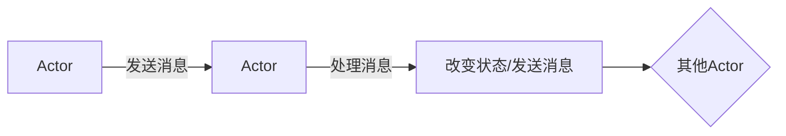
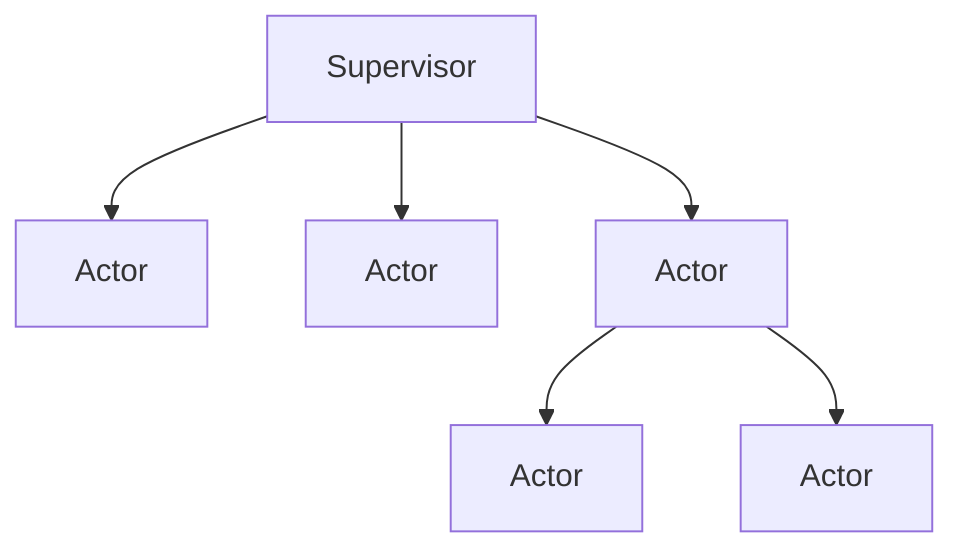
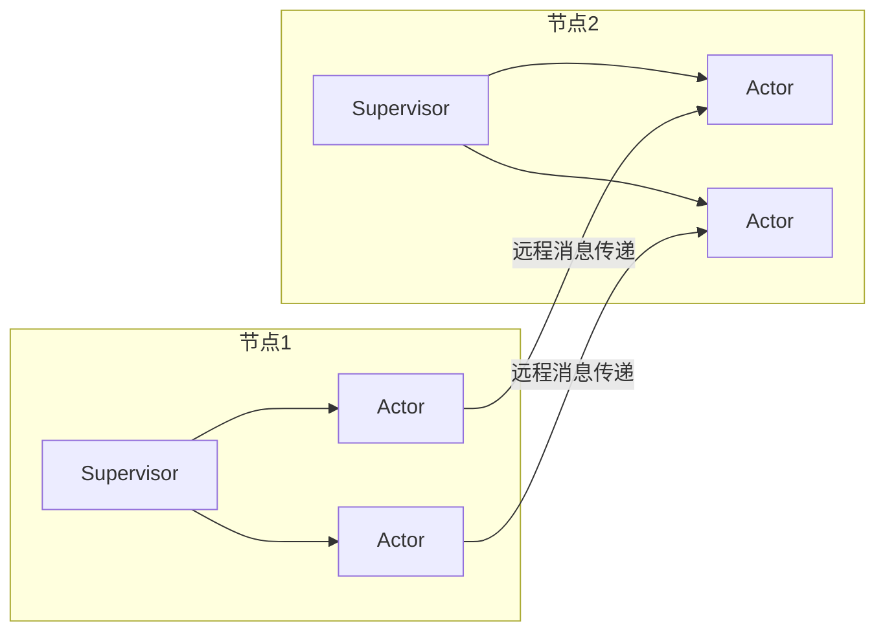

# ActorModel的数据共享与协作机制

## 1.背景介绍

在现代分布式系统中,Actor模型作为一种基于消息传递的并发模型,越来越受到关注和广泛应用。它提供了一种简单且高效的方式来构建可扩展、容错和响应式的应用程序。Actor模型的核心思想是将系统划分为多个独立的、轻量级的Actor,每个Actor都拥有自己的状态和行为,并通过发送和接收消息来相互协作。

Actor模型的主要优点在于它天生支持并发性,可以很好地利用多核CPU和分布式系统的计算能力。同时,Actor之间通过异步消息传递进行通信,避免了传统共享内存并发模型中的竞争条件和死锁等问题。此外,Actor模型还具有很好的故障隔离性,一个Actor出现故障不会影响整个系统的运行。

在分布式系统中,数据共享和协作是一个非常重要的问题。传统的共享内存模型在分布式环境下存在一些固有的缺陷,如一致性问题、可伸缩性差等。而Actor模型通过消息传递的方式,提供了一种新颖且高效的数据共享和协作机制,这也是Actor模型在分布式系统中被广泛采用的一个重要原因。

## 2.核心概念与联系

### 2.1 Actor

Actor是Actor模型中的基本计算单元,它可以被看作是一个独立的、并发的对象,具有以下几个核心特征:

- **状态(State)**: 每个Actor都有自己的状态,该状态只能由Actor自身访问和修改,对其他Actor是不可见的。
- **行为(Behavior)**: Actor根据接收到的消息执行相应的行为,这种行为可能会改变Actor的内部状态或向其他Actor发送消息。
- **邮箱(Mailbox)**: 每个Actor都有一个与之关联的邮箱,用于存储发送给该Actor的消息。Actor按照消息到达的顺序依次处理邮箱中的消息。
- **地址(Address)**: 每个Actor都有一个唯一的地址,其他Actor可以通过该地址向它发送消息。

Actor之间通过异步消息传递进行通信,而不是直接调用彼此的方法。这种通信模式避免了共享内存并发模型中的竞争条件和死锁等问题,同时也提高了系统的容错性和可伸缩性。



### 2.2 Supervisor

Supervisor是Actor模型中的另一个重要概念,它用于管理Actor的生命周期和错误处理。每个Actor都由一个Supervisor进行监督,当Actor出现故障时,Supervisor可以决定是重启、停止还是将错误传播给上层Supervisor。

Supervisor通常采用层次结构的方式组织Actor,形成一个树状结构。这种结构使得错误可以被有效地隔离,避免一个Actor的故障影响整个系统。同时,Supervisor还可以实现一些高级功能,如负载均衡、资源管理等。



### 2.3 Actor系统

一个完整的Actor系统通常由多个Actor和Supervisor组成,它们通过消息传递协作完成各种任务。Actor系统可以运行在单机环境或分布式环境中,具有很好的可扩展性和容错性。

在分布式环境中,Actor可以跨多个节点部署,通过远程消息传递实现协作。这种分布式Actor系统可以充分利用多个节点的计算资源,提高系统的整体性能和可用性。



## 3.核心算法原理具体操作步骤

Actor模型的核心算法原理可以概括为以下几个步骤:

1. **创建Actor**

   首先,需要创建一个或多个Actor,每个Actor都有自己的状态和行为。创建Actor时,可以指定它的初始状态和行为。

2. **发送消息**

   Actor之间通过发送消息进行通信。发送消息时,需要指定目标Actor的地址。消息被发送到目标Actor的邮箱中,等待被处理。

3. **处理消息**

   Actor按照消息到达的顺序依次从邮箱中取出消息进行处理。处理消息时,Actor可能会改变自身的状态或向其他Actor发送新的消息。

4. **错误处理**

   如果Actor在处理消息时出现错误,它所属的Supervisor会根据预定义的策略决定是重启、停止还是将错误传播给上层Supervisor。

5. **终止Actor**

   当Actor完成了它的任务或出现不可恢复的错误时,它可以被终止。终止Actor时,需要确保它不再接收新的消息,并释放所占用的资源。

这个过程在Actor系统中不断重复,直到完成所有任务或系统被终止。Actor模型的核心算法原理体现了简单性、并发性和容错性等特点,使其在分布式系统中具有广泛的应用前景。

## 4.数学模型和公式详细讲解举例说明

在Actor模型中,可以使用一些数学模型和公式来描述和分析Actor系统的行为和性能。下面是一些常见的数学模型和公式:

### 4.1 Actor系统的状态转移模型

Actor系统的状态转移可以用一个四元组 $(S, M, T, F)$ 来表示,其中:

- $S$ 是Actor系统的状态集合
- $M$ 是消息集合
- $T: S \times M \rightarrow S$ 是状态转移函数,表示在当前状态 $s \in S$ 接收到消息 $m \in M$ 时,Actor系统转移到新的状态 $T(s, m)$
- $F: S \rightarrow \mathcal{P}(M)$ 是输出函数,表示在状态 $s \in S$ 时,Actor系统可能发送的消息集合

这个模型描述了Actor系统在接收消息后如何转移到新的状态,以及在每个状态下可能发送的消息集合。

### 4.2 Actor系统的可达性分析

在Actor系统中,我们可以使用可达性分析来研究系统的行为和性质。定义Actor系统的可达性关系 $\rightsquigarrow$ 如下:

$$
s \xrightarrow{m} s' \Leftrightarrow s' = T(s, m)
$$

其中 $s, s' \in S, m \in M$。可达性关系 $\rightsquigarrow$ 是 $\xrightarrow{m}$ 的反身、传递闭包,即:

$$
s \rightsquigarrow s' \Leftrightarrow \exists m_1, m_2, \ldots, m_n \in M, s_1, s_2, \ldots, s_n \in S: \\
s \xrightarrow{m_1} s_1 \xrightarrow{m_2} s_2 \ldots \xrightarrow{m_n} s_n = s'
$$

通过可达性分析,我们可以研究Actor系统的一些重要性质,如死锁、活锁、可终止性等。

### 4.3 Actor系统的性能模型

在分析Actor系统的性能时,我们可以使用一些队列理论模型,如 $M/M/c$ 队列模型。假设Actor系统中有 $c$ 个Actor,消息到达服从参数为 $\lambda$ 的泊松过程,Actor处理消息的时间服从参数为 $\mu$ 的指数分布,则该系统的平均响应时间 $W$ 可以表示为:

$$
W = \frac{P_0}{c\mu(1-\rho)} + \frac{1}{\mu}
$$

其中 $\rho = \lambda / (c\mu)$ 是系统的利用率, $P_0$ 是所有Actor都空闲的稳态概率,可以通过以下公式计算:

$$
P_0 = \left[ \sum_{n=0}^{c-1} \frac{(c\rho)^n}{n!} + \frac{(c\rho)^c}{c!(1-\rho)} \right]^{-1}
$$

通过这些数学模型和公式,我们可以更好地理解和分析Actor系统的行为和性能,为系统的设计和优化提供理论支持。

## 5.项目实践:代码实例和详细解释说明

为了更好地理解Actor模型的数据共享和协作机制,我们可以通过一个具体的项目实践来加深理解。下面是一个使用Akka框架(一个流行的Actor模型实现)实现的简单计数器示例,它展示了Actor之间如何通过消息传递进行协作。

### 5.1 项目结构

```
counter-example
├── build.sbt
├── project
│   ├── build.properties
│   └── plugins.sbt
└── src
    └── main
        ├── resources
        │   └── log4j.properties
        └── scala
            └── com
                └── example
                    ├── CounterActor.scala
                    ├── CounterMain.scala
                    └── IncrementActor.scala
```

### 5.2 CounterActor.scala

`CounterActor`是一个简单的Actor,它维护一个计数器的状态,并响应`Increment`和`GetValue`消息。

```scala
import akka.actor.{Actor, ActorLogging, Props}

object CounterActor {
  case object Increment
  case object GetValue

  def props(): Props = Props(new CounterActor())
}

class CounterActor extends Actor with ActorLogging {
  import CounterActor._

  var count = 0

  override def receive: Receive = {
    case Increment =>
      count += 1
      log.info(s"Counter incremented, new value: $count")

    case GetValue =>
      sender() ! count

    case _ =>
      log.warning("Unhandled message: {}", _)
  }
}
```

### 5.3 IncrementActor.scala

`IncrementActor`是另一个Actor,它周期性地向`CounterActor`发送`Increment`消息,以增加计数器的值。

```scala
import akka.actor.{Actor, ActorLogging, ActorRef, Cancellable, Props}

import scala.concurrent.duration._

object IncrementActor {
  def props(counterActor: ActorRef, interval: FiniteDuration): Props =
    Props(new IncrementActor(counterActor, interval))
}

class IncrementActor(counterActor: ActorRef, interval: FiniteDuration) extends Actor with ActorLogging {
  import CounterActor._

  var incrementTask: Cancellable = _

  override def preStart(): Unit = {
    log.info("IncrementActor started")
    incrementTask = context.system.scheduler.scheduleAtFixedRate(0.seconds, interval, counterActor, Increment)
  }

  override def postStop(): Unit = {
    log.info("IncrementActor stopped")
    incrementTask.cancel()
  }

  override def receive: Receive = {
    case _ =>
      log.warning("Unhandled message: {}", _)
  }
}
```

### 5.4 CounterMain.scala

`CounterMain`是主程序入口,它创建`CounterActor`和`IncrementActor`,并启动整个Actor系统。

```scala
import akka.actor.{ActorSystem, Props}
import com.example.CounterActor
import com.example.IncrementActor

import scala.concurrent.duration._

object CounterMain extends App {
  val system = ActorSystem("CounterSystem")

  try {
    val counterActor = system.actorOf(CounterActor.props(), "counter")
    system.actorOf(IncrementActor.props(counterActor, 1.second), "incrementer")

    system.scheduler.scheduleAtFixedRate(0.seconds, 5.seconds, counterActor, CounterActor.GetValue)
  } catch {
    case e: Exception =>
      system.terminate()
      e.printStackTrace()
  }
}
```

### 5.5 运行示例

当运行`CounterMain`时,你将看到以下输出:

```
[INFO] [04/06/2023 15:41:21.123] [CounterSystem-akka.actor.default-dispatcher-2] [akka://CounterSystem/user/incrementer] IncrementActor started
[INFO] [04/06/2023 15:41:21.126] [CounterSystem-akka.actor.default-dispatcher-5] [akka://CounterSystem/user/counter] Counter incremented, new value: 1
[INFO] [04/06/2023 15:41:22.126] [CounterSystem-akka.actor.default-dispatcher-5] [akka://CounterSystem/user/counter] Counter incremented, new value: 2
[INFO] [04/06/2023 15:41:23.126] [CounterSystem-akka.actor.default-dispatcher-5] [akka://CounterSystem/user/counter] Counter incremented, new value: 3
[INFO] [04/06/2023 15:41:24.126] [