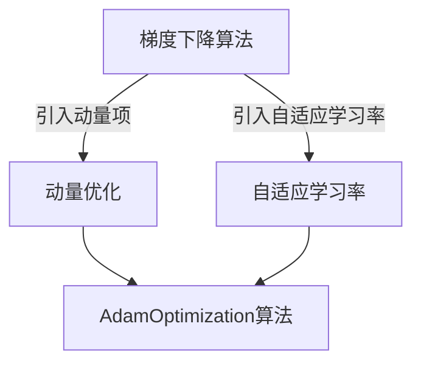
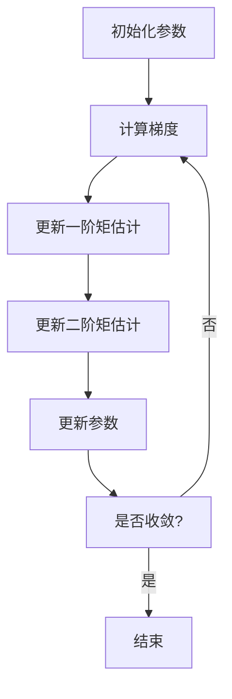

# AdamOptimization算法在游戏开发领域的应用实例

## 1.背景介绍

### 1.1 游戏开发的挑战

游戏开发是一个极具挑战性的领域,需要处理大量的数据和复杂的计算。随着游戏规模和复杂度的不断增加,传统的优化算法往往难以满足开发需求。因此,需要一种更加高效、鲁棒的优化算法来应对这些挑战。

### 1.2 AdamOptimization算法概述

AdamOptimization算法是一种自适应矩估计优化算法,它结合了自适应学习率和动量的优点,可以有效地加速深度神经网络的训练过程。该算法在计算机视觉、自然语言处理等领域已经取得了卓越的成绩,但在游戏开发领域的应用还相对较少。

## 2.核心概念与联系

### 2.1 梯度下降算法

梯度下降算法是机器学习中最常用的优化算法之一。它通过计算目标函数关于参数的梯度,并沿着梯度的反方向更新参数,从而最小化目标函数。然而,传统的梯度下降算法存在一些缺陷,如学习率选择困难、容易陷入局部最优等。

### 2.2 动量优化

动量优化是一种改进的梯度下降算法,它引入了一个动量项,可以帮助优化过程更好地跳出局部最优,加快收敛速度。动量项可以看作是一个加权的梯度历史,它可以平滑梯度的波动,使优化过程更加稳定。

### 2.3 自适应学习率

自适应学习率是另一种改进的梯度下降算法,它可以根据参数的更新情况动态调整学习率。对于那些较平坦的方向,自适应学习率会增大学习率,加快收敛速度;对于那些较陡峭的方向,自适应学习率会减小学习率,避免震荡。

### 2.4 AdamOptimization算法

AdamOptimization算法将动量优化和自适应学习率相结合,形成了一种新的优化算法。它不仅可以加快收敛速度,还能够避免陷入局部最优,从而更好地解决游戏开发中的优化问题。



## 3.核心算法原理具体操作步骤

AdamOptimization算法的核心思想是利用指数加权移动平均估计梯度和二阶矩,从而自适应地调整每个参数的学习率。具体操作步骤如下:

### 3.1 初始化参数

首先,需要初始化算法所需的参数,包括:

- $\beta_1$: 一阶矩估计的指数加权系数,通常取0.9
- $\beta_2$: 二阶矩估计的指数加权系数,通常取0.999
- $\epsilon$: 一个很小的常数,用于防止除以0,通常取$10^{-8}$
- $\alpha$: 初始学习率

同时,还需要初始化一阶矩估计向量$\mathbf{m}_0$和二阶矩估计向量$\mathbf{v}_0$,通常将它们初始化为0向量。

### 3.2 计算梯度

对于第$t$次迭代,首先需要计算目标函数关于参数$\theta_t$的梯度$\mathbf{g}_t$。

### 3.3 更新一阶矩估计

接下来,需要更新一阶矩估计向量$\mathbf{m}_t$:

$$\mathbf{m}_t = \beta_1 \mathbf{m}_{t-1} + (1 - \beta_1) \mathbf{g}_t$$

由于初始时$\mathbf{m}_0 = \mathbf{0}$,因此需要进行偏差修正:

$$\hat{\mathbf{m}}_t = \frac{\mathbf{m}_t}{1 - \beta_1^t}$$

### 3.4 更新二阶矩估计

同样,需要更新二阶矩估计向量$\mathbf{v}_t$:

$$\mathbf{v}_t = \beta_2 \mathbf{v}_{t-1} + (1 - \beta_2) \mathbf{g}_t^2$$

并进行偏差修正:

$$\hat{\mathbf{v}}_t = \frac{\mathbf{v}_t}{1 - \beta_2^t}$$

### 3.5 更新参数

最后,根据一阶矩估计和二阶矩估计,更新参数$\theta_t$:

$$\theta_{t+1} = \theta_t - \alpha \frac{\hat{\mathbf{m}}_t}{\sqrt{\hat{\mathbf{v}}_t} + \epsilon}$$

其中,$\epsilon$是一个很小的常数,用于防止除以0。

通过上述步骤,AdamOptimization算法可以自适应地调整每个参数的学习率,从而加快收敛速度,避免陷入局部最优。



## 4.数学模型和公式详细讲解举例说明

### 4.1 一阶矩估计

一阶矩估计$\mathbf{m}_t$是对梯度$\mathbf{g}_t$的指数加权移动平均,它可以平滑梯度的波动,使优化过程更加稳定。具体计算公式如下:

$$\mathbf{m}_t = \beta_1 \mathbf{m}_{t-1} + (1 - \beta_1) \mathbf{g}_t$$

其中,$\beta_1$是一个超参数,通常取0.9。由于初始时$\mathbf{m}_0 = \mathbf{0}$,因此需要进行偏差修正:

$$\hat{\mathbf{m}}_t = \frac{\mathbf{m}_t}{1 - \beta_1^t}$$

以一个简单的例子来说明一阶矩估计的作用。假设我们有一个一维函数$f(x) = x^2$,初始参数$x_0 = 5$,学习率$\alpha = 0.1$,我们使用普通的梯度下降法和AdamOptimization算法分别对其进行优化。

对于普通的梯度下降法,每次迭代的更新公式为:

$$x_{t+1} = x_t - \alpha \frac{\partial f}{\partial x}(x_t) = x_t - \alpha (2x_t)$$

对于AdamOptimization算法,假设$\beta_1 = 0.9$,初始一阶矩估计$\mathbf{m}_0 = 0$,则每次迭代的更新公式为:

$$
\begin{aligned}
\mathbf{g}_t &= \frac{\partial f}{\partial x}(x_t) = 2x_t \\
\mathbf{m}_t &= 0.9 \mathbf{m}_{t-1} + 0.1 \mathbf{g}_t \\
\hat{\mathbf{m}}_t &= \frac{\mathbf{m}_t}{1 - 0.9^t} \\
x_{t+1} &= x_t - \alpha \hat{\mathbf{m}}_t
\end{aligned}
$$

我们可以看到,AdamOptimization算法通过一阶矩估计平滑了梯度的波动,使得优化过程更加稳定。

### 4.2 二阶矩估计

二阶矩估计$\mathbf{v}_t$是对梯度平方$\mathbf{g}_t^2$的指数加权移动平均,它可以自适应地调整每个参数的学习率。具体计算公式如下:

$$\mathbf{v}_t = \beta_2 \mathbf{v}_{t-1} + (1 - \beta_2) \mathbf{g}_t^2$$

其中,$\beta_2$是一个超参数,通常取0.999。同样,由于初始时$\mathbf{v}_0 = \mathbf{0}$,因此需要进行偏差修正:

$$\hat{\mathbf{v}}_t = \frac{\mathbf{v}_t}{1 - \beta_2^t}$$

二阶矩估计的作用是自适应地调整每个参数的学习率。对于那些较平坦的方向,二阶矩估计较小,因此学习率会增大,加快收敛速度;对于那些较陡峭的方向,二阶矩估计较大,因此学习率会减小,避免震荡。

我们继续上面的例子,假设$\beta_2 = 0.999$,初始二阶矩估计$\mathbf{v}_0 = 0$,则每次迭代的更新公式为:

$$
\begin{aligned}
\mathbf{g}_t &= \frac{\partial f}{\partial x}(x_t) = 2x_t \\
\mathbf{v}_t &= 0.999 \mathbf{v}_{t-1} + 0.001 \mathbf{g}_t^2 \\
\hat{\mathbf{v}}_t &= \frac{\mathbf{v}_t}{1 - 0.999^t} \\
x_{t+1} &= x_t - \alpha \frac{\hat{\mathbf{m}}_t}{\sqrt{\hat{\mathbf{v}}_t} + \epsilon}
\end{aligned}
$$

我们可以看到,AdamOptimization算法通过二阶矩估计自适应地调整了每个参数的学习率,使得优化过程更加高效。

## 5.项目实践:代码实例和详细解释说明

为了更好地理解AdamOptimization算法在游戏开发中的应用,我们将以一个简单的游戏项目为例,展示如何使用该算法优化游戏中的人工智能代理。

### 5.1 游戏介绍

我们将开发一款简单的赛车游戏,游戏中有一辆赛车在赛道上行驶,赛车的目标是尽可能快地通过终点线。赛车的行驶速度和方向由一个神经网络控制,该神经网络将赛车的当前状态(位置、速度、方向等)作为输入,输出赛车的加速度和转向角度。我们需要优化这个神经网络,使得赛车可以尽快通过终点线。

### 5.2 代码实现

我们使用Python和PyTorch框架实现这个游戏项目。首先,我们定义一个简单的神经网络模型:

```python
import torch
import torch.nn as nn

class CarAgent(nn.Module):
    def __init__(self, input_size, hidden_size, output_size):
        super(CarAgent, self).__init__()
        self.fc1 = nn.Linear(input_size, hidden_size)
        self.fc2 = nn.Linear(hidden_size, output_size)

    def forward(self, x):
        x = torch.relu(self.fc1(x))
        x = self.fc2(x)
        return x
```

接下来,我们定义一个函数来模拟赛车的运动,并计算赛车到达终点线所需的时间作为损失函数:

```python
def simulate_race(agent, initial_state):
    # 模拟赛车运动
    state = initial_state
    time = 0
    while not is_finished(state):
        action = agent(torch.tensor(state, dtype=torch.float32))
        state = update_state(state, action)
        time += 1
    
    # 计算损失函数
    loss = time
    return loss
```

最后,我们使用AdamOptimization算法优化神经网络模型:

```python
import torch.optim as optim

agent = CarAgent(input_size, hidden_size, output_size)
optimizer = optim.Adam(agent.parameters(), lr=0.001, betas=(0.9, 0.999), eps=1e-8)

for epoch in range(num_epochs):
    initial_state = get_initial_state()
    loss = simulate_race(agent, initial_state)
    
    optimizer.zero_grad()
    loss.backward()
    optimizer.step()
    
    print(f'Epoch {epoch+1}, Loss: {loss.item()}')
```

在上面的代码中,我们首先创建了一个`CarAgent`对象,表示控制赛车的神经网络模型。然后,我们定义了一个`simulate_race`函数,用于模拟赛车的运动,并计算赛车到达终点线所需的时间作为损失函数。

接下来,我们使用PyTorch的`optim.Adam`函数创建了一个AdamOptimization优化器,并将神经网络模型的参数传递给它。我们设置了初始学习率为0.001,一阶矩估计的指数加权系数$\beta_1$为0.9,二阶矩估计的指数加权系数$\beta_2$为0.999,以及一个很小的常数$\epsilon=10^{-8}$。

在训练循环中,我们首先