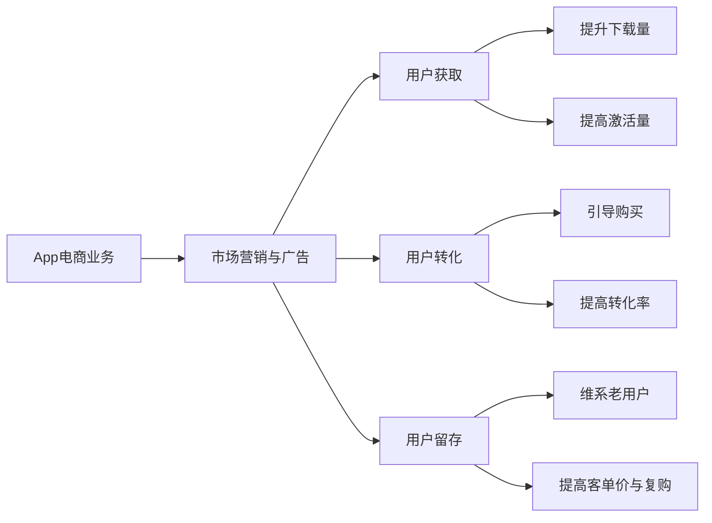

# App电商业务团队的市场营销与广告策略

## 1. 背景介绍
### 1.1 移动互联网时代的电商发展现状
#### 1.1.1 移动电商用户规模持续增长
#### 1.1.2 移动端成为电商主战场
#### 1.1.3 移动电商市场竞争日趋激烈

### 1.2 App电商业务团队面临的机遇与挑战  
#### 1.2.1 移动电商蕴含巨大的市场机会
#### 1.2.2 市场营销与广告投放成为关键
#### 1.2.3 如何制定有效的营销策略是重点

## 2. 核心概念与联系
### 2.1 App电商业务的核心要素
#### 2.1.1 用户获取与转化
#### 2.1.2 用户体验与留存  
#### 2.1.3 销售转化与复购

### 2.2 市场营销与广告在App电商中的作用
#### 2.2.1 提升App下载量与激活量
#### 2.2.2 引导用户完成购买转化
#### 2.2.3 维系老用户,提高客单价与复购率

### 2.3 App电商业务指标体系
#### 2.3.1 用户量级相关指标
#### 2.3.2 用户价值相关指标 
#### 2.3.3 营销效果相关指标



## 3. 核心算法原理具体操作步骤
### 3.1 用户画像与分群
#### 3.1.1 用户属性标签体系构建
#### 3.1.2 RFM模型用户价值度量
#### 3.1.3 基于机器学习的用户聚类

### 3.2 广告定向投放策略
#### 3.2.1 确定关键人群与投放目标
#### 3.2.2 选择合适的广告渠道与形式
#### 3.2.3 广告创意与素材的制作要点

### 3.3 广告投放效果评估与优化
#### 3.3.1 构建广告效果评估指标体系 
#### 3.3.2 归因模型与效果监测
#### 3.3.3 A/B测试与投放策略动态优化

## 4. 数学模型和公式详细讲解举例说明
### 4.1 RFM模型详解
RFM模型通过考察用户的最近购买行为(Recency)、购买频率(Frequency)和消费金额(Monetary)来评估用户价值,其计算公式为:
$$RFM = \alpha \cdot R + \beta \cdot F + \gamma \cdot M$$
其中$\alpha, \beta, \gamma$为三个维度的权重系数。一般根据业务特点来设定,例如:
$$RFM = 0.3 \cdot R + 0.3 \cdot F + 0.4 \cdot M$$

### 4.2 广告归因模型详解
常见的归因模型有最后点击归因、线性归因、时间衰减归因等。以时间衰减归因为例,其公式为:
$$Attribution_i = \frac {e^{-\lambda(T-t_i)}}{\sum_{j=1}^n e^{-\lambda(T-t_j)}} \cdot V$$
其中$i$为用户第$i$次接触广告的时间,$T$为成交时间,$V$为成交金额,$\lambda$为时间衰减系数。

### 4.3 A/B测试原理与实践
A/B测试通过将用户随机分为两组,分别施加不同的处理,通过假设检验来评估两种处理效果的差异是否显著。假设检验公式为:
$$Z = \frac{(\hat{p}_A-\hat{p}_B)-(\pi_A-\pi_B)}{\sqrt{\frac{\hat{p}_A(1-\hat{p}_A)}{n_A}+\frac{\hat{p}_B(1-\hat{p}_B)}{n_B}}}$$
其中$\hat{p}_A,\hat{p}_B$为两组的转化率,$\pi_A,\pi_B$为两组的真实转化率,$n_A,n_B$为两组的样本量。

## 5. 项目实践：代码实例和详细解释说明
### 5.1 用户分群代码实现
```python
from sklearn.cluster import KMeans

# 用户RFM数据
rfm_data = [...] 

# 使用K-Means进行聚类
kmeans = KMeans(n_clusters=4, random_state=0).fit(rfm_data)
labels = kmeans.labels_

# 根据聚类结果进行用户分群
user_groups = {}
for i, label in enumerate(labels):
    if label not in user_groups:
        user_groups[label] = []
    user_groups[label].append(users[i])
```

### 5.2 广告归因代码实现
```python
import numpy as np

def time_decay_attribution(click_times, conv_time, conv_value, decay_rate):
    """
    时间衰减归因模型
    :param click_times: 用户点击广告的时间列表
    :param conv_time: 用户转化的时间
    :param conv_value: 用户转化的价值 
    :param decay_rate: 时间衰减系数
    """
    attribution = []
    decay_weights = np.exp(-decay_rate * (conv_time - click_times))
    sum_weights = decay_weights.sum()
    
    for weight in decay_weights:
        attribution.append(weight / sum_weights * conv_value)
        
    return attribution
```

### 5.3 A/B测试代码实现
```python
from scipy.stats import norm

def abtest(conv_a, total_a, conv_b, total_b):
    """
    A/B测试显著性评估
    :param conv_a: A组转化数
    :param total_a: A组总样本数
    :param conv_b: B组转化数
    :param total_b: B组总样本数
    """
    conv_rate_a = conv_a / total_a
    conv_rate_b = conv_b / total_b
    
    se = np.sqrt(conv_rate_a * (1 - conv_rate_a) / total_a + conv_rate_b * (1 - conv_rate_b) / total_b)
    z_score = (conv_rate_b - conv_rate_a) / se
    
    p_value = (1 - norm.cdf(abs(z_score))) * 2
    
    return p_value
```

## 6. 实际应用场景
### 6.1 节日营销活动的投放策略
#### 6.1.1 根据用户历史消费情况,提前锁定目标人群
#### 6.1.2 结合节日特点,确定营销主题与优惠力度
#### 6.1.3 多渠道组合投放,提升触达率与转化率

### 6.2 新客拉新与老客促活策略
#### 6.2.1 针对新客,重点投放品牌曝光与优惠券发放类广告
#### 6.2.2 针对老客,侧重交叉销售与限时特卖类营销活动
#### 6.2.3 根据用户生命周期阶段,制定差异化的营销策略

### 6.3 优化App商详页转化率的A/B测试
#### 6.3.1 针对商详页的不同模块,制定优化假设
#### 6.3.2 采取分流实验,评估不同方案的转化效果
#### 6.3.3 根据A/B测试结果,优化商详页布局与展示内容

## 7. 工具和资源推荐
### 7.1 用户分群工具
- Python sklearn聚类算法库
- SPSS Statistics 统计分析软件
- SAS Customer Intelligence 360 客户智能平台

### 7.2 广告投放平台
- 巨量引擎(今日头条、抖音等)
- 腾讯广点通
- AdMaster等第三方监测平台

### 7.3 A/B测试工具
- AB Tasty
- Google Optimize
- Optimizely

## 8. 总结：未来发展趋势与挑战
### 8.1 个性化与智能化成为大势所趋
#### 8.1.1 基于大数据和AI的用户洞察日益深入
#### 8.1.2 营销自动化与程序化购买不断发展
#### 8.1.3 智能创意和智能投放将大幅提升营销效率

### 8.2 全域数据打通与一致性体验至关重要
#### 8.2.1 打破数据孤岛,实现全域数据整合与应用
#### 8.2.2 基于数据平台,构建全链路、多渠道的一致性用户体验
#### 8.2.3 App与小程序、公众号、社交媒体的打通与协同

### 8.3 把握新技术新场景,引领行业创新发展
#### 8.3.1 利用5G、AR/VR等新技术,创新营销内容与形式
#### 8.3.2 布局直播、短视频、社交等新兴营销场景
#### 8.3.3 紧跟互联网发展趋势,把握新流量与新增长

## 9. 附录：常见问题与解答
### 9.1 如何评估一个营销渠道的投放效果?
可以通过渠道投放前后的流量、销量、ROI等指标的变化来评估。也可以通过设置追踪参数,监测用户完整的转化路径与贡献。还可以使用归因模型,多维度评估渠道效果。

### 9.2 如何解决不同渠道数据打通与统计的问题?
一是要选择适当的监测平台或代码,尽量实现同源多渠道数据追踪与打通;二是要制定统一的命名与归类规范,确保不同渠道数据口径一致;三是建立数据中台,将各渠道数据进行清洗、处理、整合,形成一致的用户视图。

### 9.3 App电商常用的获客渠道有哪些?
常见的App电商获客渠道包括应用商店自然搜索、应用商店付费广告、移动广告联盟、短视频与直播平台、网盟推广、社交媒体营销、线下扫码等。

作者：禅与计算机程序设计艺术 / Zen and the Art of Computer Programming