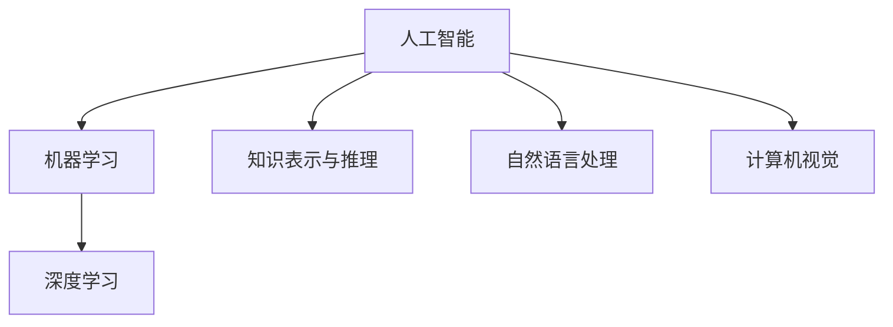

# Artificial Intelligence

## 1. 背景介绍

### 1.1 人工智能的定义与起源
人工智能（Artificial Intelligence，简称AI）是计算机科学的一个分支，旨在研究和开发能够模拟、延伸和扩展人类智能的理论、方法、技术及应用系统。人工智能的概念最早由约翰·麦卡锡在1956年的达特茅斯会议上提出。

### 1.2 人工智能的发展历程
人工智能的发展大致经历了三个阶段：
- 1.2.1 早期阶段（1956-1980）：以符号主义为主导，探索通用智能
- 1.2.2 中期阶段（1980-2000）：以连接主义为主导，兴起专家系统
- 1.2.3 现阶段（2000至今）：以深度学习为代表，实现了多个领域的突破

### 1.3 人工智能的分类
根据实现方式和应用领域，人工智能可分为以下几类：
- 1.3.1 符号主义人工智能
- 1.3.2 连接主义人工智能
- 1.3.3 行为主义人工智能 
- 1.3.4 混合智能

## 2. 核心概念与联系

### 2.1 机器学习
机器学习是人工智能的核心，它使计算机系统能够从数据中自动学习，无需明确编程。常见的机器学习任务包括分类、回归、聚类等。

### 2.2 深度学习
深度学习是机器学习的一个分支，它模仿人脑的神经网络结构，构建多层次的学习模型。深度学习在图像识别、语音识别、自然语言处理等领域取得了巨大成功。

### 2.3 知识表示与推理
知识表示是将现实世界的知识转化为计算机可处理的形式，如本体、语义网等。基于知识表示，人工智能系统可以进行推理、决策等高层次的智能行为。

### 2.4 自然语言处理
自然语言处理使计算机能够理解、生成和处理人类语言。它包括语音识别、文本分类、机器翻译、情感分析等子任务。

### 2.5 计算机视觉
计算机视觉旨在使计算机能够从图像或视频中获取信息，实现物体检测、人脸识别、场景理解等功能，具有广泛的应用前景。

### 核心概念关系图


## 3. 核心算法原理具体操作步骤

### 3.1 监督学习算法
- 3.1.1 数据准备：收集和标注训练数据
- 3.1.2 特征工程：提取和选择有效的特征
- 3.1.3 模型选择：根据任务选择合适的模型，如决策树、支持向量机、神经网络等
- 3.1.4 模型训练：使用训练数据对模型进行训练，优化模型参数
- 3.1.5 模型评估：使用测试数据评估模型性能，进行超参数调优
- 3.1.6 模型部署：将训练好的模型部署到实际应用系统中

### 3.2 无监督学习算法
- 3.2.1 数据准备：收集无标签的数据
- 3.2.2 特征工程：提取和选择有效的特征
- 3.2.3 模型选择：根据任务选择合适的模型，如k-means、主成分分析、自编码器等
- 3.2.4 模型训练：使用无标签数据对模型进行训练，发现数据内在结构和规律
- 3.2.5 模型评估：使用聚类指标或可视化方法评估模型性能
- 3.2.6 模型应用：将训练好的模型应用到实际任务中，如异常检测、推荐系统等

### 3.3 强化学习算法
- 3.3.1 环境建模：定义状态空间、动作空间和奖励函数
- 3.3.2 策略选择：选择合适的策略表示方法，如值函数、策略梯度等
- 3.3.3 探索与利用：平衡探索新策略和利用已有知识，如ε-greedy、UCB等
- 3.3.4 价值评估：估计状态或动作的长期价值，如蒙特卡洛方法、时序差分学习等
- 3.3.5 策略优化：基于价值评估结果优化策略，提高长期累积奖励
- 3.3.6 模型部署：将训练好的策略部署到实际环境中，实现智能决策

## 4. 数学模型和公式详细讲解举例说明

### 4.1 线性回归模型
线性回归模型用于拟合连续型目标变量与输入变量之间的线性关系。给定数据集$\{(x_i,y_i)\}_{i=1}^n$，线性回归模型的目标是学习一个线性函数：

$$\hat{y} = w^Tx + b$$

其中，$w$为权重向量，$b$为偏置项。通过最小化均方误差损失函数来求解最优参数：

$$\min_{w,b} \frac{1}{n} \sum_{i=1}^n (w^Tx_i+b-y_i)^2$$

求解该最优化问题可以使用梯度下降法，迭代更新参数直至收敛。

### 4.2 支持向量机模型
支持向量机（SVM）是一种经典的二分类模型，其目标是在特征空间中找到一个最大间隔超平面，将两类样本分开。对于线性可分的数据集，SVM的优化目标可表示为：

$$\min_{w,b} \frac{1}{2} \|w\|^2 \quad s.t. \quad y_i(w^Tx_i+b) \geq 1, \forall i=1,\ldots,n$$

其中，$y_i \in \{-1,+1\}$为样本的类别标签。通过引入拉格朗日乘子，可以将其转化为对偶问题求解：

$$\max_{\alpha} \sum_{i=1}^n \alpha_i - \frac{1}{2} \sum_{i,j=1}^n \alpha_i \alpha_j y_i y_j x_i^T x_j \quad s.t. \quad \sum_{i=1}^n \alpha_i y_i = 0, \alpha_i \geq 0, \forall i=1,\ldots,n$$

求解出最优的$\alpha$后，可得到超平面参数$w$和$b$，实现对新样本的分类预测。

### 4.3 卷积神经网络模型
卷积神经网络（CNN）是一种广泛用于图像识别的深度学习模型。CNN通过局部连接和权重共享，能够有效地提取图像的空间特征。一个典型的CNN由多个卷积层、池化层和全连接层组成。

卷积层对输入图像进行卷积操作，提取局部特征：

$$h_{i,j}^l = f(\sum_{m=0}^{M-1} \sum_{n=0}^{N-1} w_{m,n}^l x_{i+m,j+n}^{l-1} + b^l)$$

其中，$h_{i,j}^l$为第$l$层第$(i,j)$个位置的输出，$w_{m,n}^l$为卷积核权重，$b^l$为偏置项，$f$为激活函数（如ReLU）。

池化层对卷积层的输出进行下采样，减小特征图尺寸，提高特征的鲁棒性。常见的池化操作包括最大池化和平均池化。

全连接层将卷积和池化后的特征图展平，并通过全连接的方式进行分类预测：

$$y = \text{softmax}(Wx+b)$$

其中，$W$和$b$为全连接层的权重和偏置，softmax函数将输出转化为概率分布。

通过反向传播算法和梯度下降优化，不断更新CNN的参数，最小化分类损失，实现端到端的图像识别。

## 5. 项目实践：代码实例和详细解释说明

下面以Python和TensorFlow框架为例，演示如何实现一个简单的CNN模型，用于手写数字识别任务。

```python
import tensorflow as tf
from tensorflow import keras

# 加载MNIST数据集
(x_train, y_train), (x_test, y_test) = keras.datasets.mnist.load_data()

# 数据预处理
x_train = x_train.reshape((60000, 28, 28, 1)) / 255.0
x_test = x_test.reshape((10000, 28, 28, 1)) / 255.0
y_train = keras.utils.to_categorical(y_train)
y_test = keras.utils.to_categorical(y_test)

# 构建CNN模型
model = keras.Sequential([
    keras.layers.Conv2D(32, (3, 3), activation='relu', input_shape=(28, 28, 1)),
    keras.layers.MaxPooling2D((2, 2)),
    keras.layers.Conv2D(64, (3, 3), activation='relu'),
    keras.layers.MaxPooling2D((2, 2)),
    keras.layers.Conv2D(64, (3, 3), activation='relu'),
    keras.layers.Flatten(),
    keras.layers.Dense(64, activation='relu'),
    keras.layers.Dense(10, activation='softmax')
])

# 编译模型
model.compile(optimizer='adam',
              loss='categorical_crossentropy',
              metrics=['accuracy'])

# 训练模型
model.fit(x_train, y_train, epochs=5, batch_size=64, validation_data=(x_test, y_test))

# 评估模型
test_loss, test_acc = model.evaluate(x_test, y_test)
print('Test accuracy:', test_acc)
```

代码解释：
1. 首先加载MNIST手写数字数据集，并进行预处理，将图像归一化到[0,1]范围，标签转化为one-hot编码。
2. 使用Keras的Sequential API构建CNN模型，包含两个卷积层、两个池化层和两个全连接层。卷积层使用ReLU激活函数，全连接层使用ReLU和softmax激活函数。
3. 编译模型，指定优化器为Adam，损失函数为交叉熵，评估指标为准确率。
4. 训练模型，设置训练轮数为5，批量大小为64，并使用测试集作为验证集。
5. 在测试集上评估模型性能，输出测试准确率。

运行该代码，可以得到一个在MNIST数据集上表现良好的CNN模型，测试准确率可达到99%以上。

## 6. 实际应用场景

人工智能在各个领域都有广泛的应用，下面列举几个典型场景：

### 6.1 智能客服
利用自然语言处理和知识图谱技术，构建智能客服系统，自动回答用户的常见问题，提供个性化的服务推荐，大幅提高客服效率和用户满意度。

### 6.2 医疗影像分析
应用计算机视觉和深度学习算法，对医学影像（如X光、CT、MRI等）进行自动分析和诊断，协助医生进行疾病筛查和预后评估，提高诊断的准确性和效率。

### 6.3 自动驾驶
结合计算机视觉、传感器融合、决策规划等技术，开发自动驾驶系统，实现车辆的自主感知、决策和控制，提高交通安全性和出行效率。

### 6.4 智能推荐
利用机器学习算法对用户行为和偏好进行建模，为用户推荐个性化的内容、商品或服务，提高用户粘性和转化率，广泛应用于电商、媒体、社交等领域。

### 6.5 智能安防
运用人脸识别、行为分析等技术，构建智能安防系统，实现对人员、车辆的自动识别和跟踪，异常行为检测和预警，提高社会安全水平。

## 7. 工具和资源推荐

### 7.1 机器学习平台
- scikit-learn：Python机器学习库，提供了丰富的算法和工具。
- TensorFlow：由Google开发的端到端开源机器学习平台。
- PyTorch：由Facebook开发的深度学习框架，具有动态计算图和易用性的特点。
- Keras：高层神经网络API，可以在TensorFlow、CNTK或Theano上运行。

### 7.2 自然语言处理工具
- NLTK：Python自然语言处理工具包，提供了语料库和常用的NLP算法。
- spaCy：工业级自然语言处理库，具有高性能和易用性。
- Gensim：主题模型工具包，支持Word2Vec、Fast